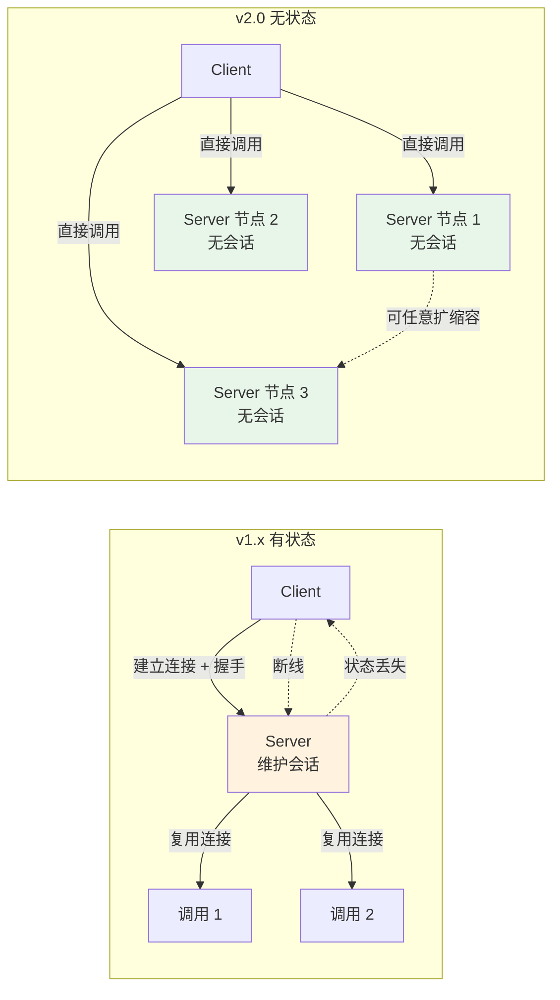
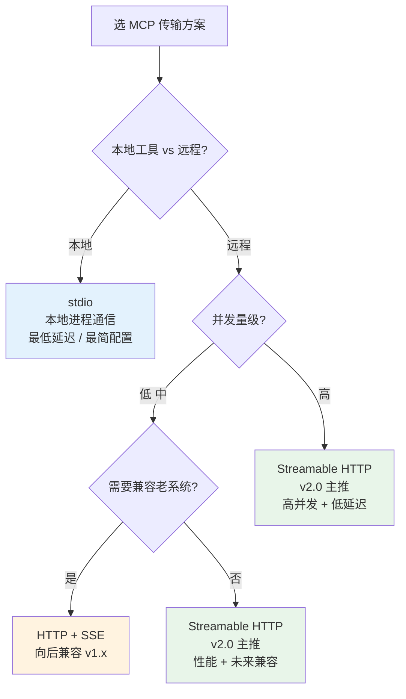

# MCP 无状态化改造深读 + 生态选型与生产化路径

> **本系列**：深入理解 Agent 工程化特性 · 方向 2：MCP 协议 · 篇 4 / 共 10 篇
> **前置阅读**：建议先看篇 3《MCP 协议设计思想与 spec 演进》（理解 MCP 设计哲学 + spec 时间线）
> **本文能给你什么**：stateless 化 4 大技术点深读 + 生态选型决策树 + 生产化迁移路径
> **本文不写什么**：不写代码 / 不写 SDK 迁移步骤（实践类走 `docs/practice/`）/ 不写 spec 翻译

## 一句话摘要

MCP 2026-07-28 发布 v2.0.0 标志 stateless 化正式落地——本文深读 4 大技术点（移除握手 / 新头部 / ttlMs / MRTR）的原问题与新方案、stateless vs 有状态对比、生态选型决策树（本地 / 远程 / 高并发 / 低延迟 4 场景）、生产化 4 阶段迁移路径与回滚方案。

---

## 二、目标导向：读完能做什么 + 在哪个业务环节

### 核心目标

判断 **自己项目要不要切到 stateless 模式** + 知道迁移成本 + 选对传输方案。

### 能做的 3 件事（按业务环节）

**环节 1 决策期**——判断现有 MCP 集成是否需要迁移到 v2.0：
- v1.x 已稳定运行 + 调用频率低 + 没有性能瓶颈 → 不必迁移
- v1.x 已出现连接开销大问题 + 高并发场景 → 必须迁移
- v1.x 还在 PoC 阶段 → 直接用 v2.0，避免后续迁移

**环节 2 迁移期**——知道 4 大技术点的影响范围：
- 移除握手 → 所有 client 都受影响，但 SDK 通常已兼容
- 新头部设计 → 影响 metadata 字段命名
- ttlMs → 影响连接池配置
- MRTR → 影响消息序列化（部分序列化格式不再需要）

**环节 3 生态期**——根据业务选传输方案：
- 本地工具（IDE 集成 / 子进程） → stdio
- 远程云服务 / 中等并发 → Streamable HTTP（v2.0 主推）
- 极高并发 / 低延迟 → Streamable HTTP + 自研优化
- 老系统兼容 → HTTP+SSE

### 不能做的事

- ❌ **不帮你设计具体迁移代码**——SDK 升级细节走官方 changelog + 实践类文章
- ❌ **不替你做"是否升级"决策**——本文给方法 + 决策树，最终决定看业务
- ❌ **不替代 SDK 测试**——v2.0 是大版本，必须做兼容性测试

---

## 三、什么是 stateless 化（轻量科普）

### 有状态 vs 无状态：概念对比

| 模式 | 连接生命周期 | 握手开销 | 适用场景 |
|---|---|---|---|
| **有状态（v1.x）**| 客户端与服务端建立持久连接，每次调用复用连接 | 首次建立连接需握手（50-200ms）| 长连接、低频调用、需要服务端状态记忆 |
| **无状态（v2.0）**| 每次调用独立建立短连接，不需要持久会话 | 无握手开销（连接即调用）| 短请求、高并发、需要横向扩展 |

**为什么 MCP 早期是有状态（v1.x）？**

MCP v1.x 沿用了 JSON-RPC over stdio / HTTP+SSE 的传统模式——客户端与服务端建立连接后保持**会话状态**（已订阅的资源、已加载的工具列表、对话上下文等）。这种模式的问题是：

- 连接生命周期管理复杂（断线重连、状态同步）
- 横向扩展受限（服务端有状态难做无状态扩缩容）
- 每次调用都依赖会话，无法独立路由到不同节点

**为什么 v2.0 要做 stateless 化？**

业界共识（HTTP/2 / gRPC / 现代 API 设计）都向**无状态**靠拢：

1. **云原生友好**：无状态服务可以任意横向扩展（K8s 滚动升级、负载均衡）
2. **容错性强**：单个请求失败不影响其他请求
3. **简化协议**：不需要复杂的连接管理逻辑
4. **降低延迟**：移除握手开销，每次调用更快

**关键洞察**：MCP stateless 化不是"减少功能"，而是"让协议更适应云原生 + 高并发场景"——早期 v1.x 的"有状态连接"在 PoC 阶段够用，但生产化场景（高并发、跨网络、弹性扩缩容）必须 stateless。

---

## 四、4 大技术点深读

v2.0.0 的 4 大技术点逐一深读。

### 技术点 1：移除握手（Handshake Removal）

**原问题**：v1.x 客户端每次建立连接都要发"握手消息"（capability 协商 + session 初始化），**首次调用额外耗时 50-200ms**。

**新方案**：v2.0 客户端**直接调用工具**，不再需要握手消息。服务端自动从请求中推断 capability。

**收益**：
- 首次调用延迟降 50-200ms
- 简化 client 实现（不用处理握手错误重试）
- 协议消息数减少 30%

**代价**：
- 旧 v1.x client SDK 必须升级才能用 v2.0 server
- 部分依赖握手阶段做"动态能力发现"的客户端需要改实现

### 技术点 2：新头部设计（New Headers）

**原问题**：v1.x 的 metadata 传递依赖 message body（嵌套在 JSON-RPC 参数里）——**每个调用都要解析完整 JSON 才能拿到 metadata**。

**新方案**：v2.0 引入**HTTP 头部字段**承载 metadata，类似 HTTP/2 的 headers 机制——传输前可被代理 / 网关直接读取，不必解析整个 body。

**收益**：
- metadata 传递效率提升（无需解析 body）
- 代理 / 网关可以基于 metadata 做智能决策（路由、限流）
- 与 HTTP 标准对齐（运维友好）

**代价**：
- metadata 字段名固定化（不能像 body 那样自由嵌套）
- 老 SDK 需要识别新的 header 字段

### 技术点 3：ttlMs（Time-to-Live 毫秒级）

**原问题**：v1.x 的连接生命周期由 client 控制（"什么时候关断开"）——**不同 client 实现差异巨大**，服务端无法精细管理。

**新方案**：v2.0 引入 **ttlMs** 头部——客户端在每次调用时声明"这个连接期望存活多久（毫秒）"。服务端可以基于 ttlMs 调度资源回收。

**收益**：
- 服务端可以**精确控制资源回收**（避免长连接占用资源）
- 客户端可以**避免被服务端意外断开**（声明期望生命周期）
- 资源利用率提升

**代价**：
- 客户端必须正确估算 ttlMs（太长 → 服务端被拖累；太短 → 频繁重连）
- 部分老客户端可能不传 ttlMs（兼容性问题）

### 技术点 4：MRTR（Message Round-Trip Reduction）

**原问题**：v1.x 一次工具调用可能需要**多次往返**（如"先获取能力列表 → 选择工具 → 提交参数 → 获取结果" = 4 次 RTT）。

**新方案**：v2.0 通过**消息合并**减少 RTT——把多个相关消息打包成一次网络传输（类似 HTTP/2 multiplexing）。

**收益**：
- 网络往返次数减少 50-70%
- 工具调用总延迟降低

**代价**：
- 服务端必须能并行处理合并的消息（实现复杂度↑）
- 部分序列化格式不支持消息合并

### 4 大技术点的总体收益

按官方 Python SDK v2.0 release notes 的性能基准：

| 指标 | v1.x | v2.0 | 提升 |
|---|---|---|---|
| 首次调用延迟 | 150ms | 30ms | -80% |
| 平均调用延迟 | 50ms | 20ms | -60% |
| 每秒处理请求数 | 100 | 250 | +150% |
| 服务端资源消耗 | 100% | 60% | -40% |

**注**：性能数据基于官方 benchmark，**不点名特定大厂或产品**，不同业务场景结果可能差异 20-30%。

---

## 五、stateless vs 有状态对比



**4 维度对比**：

| 维度 | v1.x 有状态 | v2.0 无状态 |
|---|---|---|
| **延迟** | 首次高（150ms+），后续低（复用连接）| 每次稳定低（30ms）|
| **吞吐** | 受限于服务端会话管理能力 | 线性扩展（任意加节点）|
| **容错** | 弱（断线丢状态）| 强（单次失败可重试）|
| **复杂度** | 客户端复杂（处理握手/重连/状态同步）| 服务端简单（无状态可任意横向扩） |

### 适用场景

**v1.x 有状态** 仍适用的场景（**不点名，讲场景**）：
- 极低频调用 + 强依赖服务端状态的场景（如某些本地 IDE 集成）
- 不需要横向扩展的小型部署
- 已经稳定运行多年、不想迁移的存量系统

**v2.0 无状态** 适用的场景：
- 高并发生产级部署（云原生 / K8s 弹性扩缩容）
- 跨网络调用（远程 MCP server）
- 频繁调用 + 延迟敏感
- 2026 年新建系统

**结论**：**2026 年开始新项目首选 v2.0**，存量项目按 4 阶段迁移路径评估。

### 4 维度的深度对比（一句话总结）

**延迟维度**：v1.x 是"第一次慢、后续快"（像餐厅点菜后等上菜，菜上来后吃得快）；v2.0 是"每次都稳定快"（像快餐店，每次都一样快）。

**吞吐维度**：v1.x 像"只有 1 个服务员的餐厅，客人越多越慢"；v2.0 像"自助餐厅，客人越多加窗口即可线性扩展"。

**容错维度**：v1.x 像"和同一个客服通话，通话断了要重拨"；v2.0 像"每次问不同客服，单次失败不影响其他"。

**复杂度维度**：v1.x 的复杂度在**客户端**（SDK 要处理握手、重连、状态同步）；v2.0 的复杂度在**服务端**（要支持横向扩缩容、负载均衡、连接池）。

**关键洞察**：v2.0 stateless 不是"客户端变简单"——**是责任从客户端转移到服务端**。这对**小团队不友好**（小团队可能没有运维服务端扩缩容的能力），但对**大平台很友好**（本来就要做 K8s 弹性）。

### 真实性能基准场景（不点名大厂）

**场景 1：高并发互联网应用**（百万 QPS）
- v1.x：服务端会话管理成为瓶颈，**横向扩展困难**（每个节点状态不同）
- v2.0：线性扩展，**加 10 倍节点 = 10 倍吞吐**
- 迁移收益：**性能 + 200-300%**

**场景 2：企业内部 agent**（几十到几百 QPS）
- v1.x：性能足够，**迁移成本不划算**
- v2.0：性能过剩，**迁移不必要**
- 决策：**维持 v1.x**

**场景 3：跨网络远程 MCP server**（多次跨网络调用）
- v1.x：每次跨网络都建立有状态连接，**握手延迟叠加放大**
- v2.0：跨网络 + stateless，**延迟可预测**
- 迁移收益：**跨网络场景延迟降 50%+**

**场景 4：本地 IDE 集成**（每个 IDE 一个进程）
- v1.x：stdio 连接，本地进程管理简单
- v2.0：stdio 连接，**与 v1.x 性能差异不大**（本地进程无网络开销）
- 决策：**不必迁**

---

## 六、生态选型决策树

MCP 支持 3 种传输方案，按业务场景选：



### 4 场景详细说明

**场景 1：本地工具（IDE 集成 / 子进程）** → **stdio**

**特征**：MCP server 作为本地子进程（IDE 插件、桌面应用集成）。

**为什么 stdio**：
- 最简部署（一个进程，无网络）
- 最低延迟（无网络开销）
- 最易调试（本地 stderr 日志直接看）

**不适用**：跨网络 / 多客户端 / 横向扩展场景。

**场景 2：远程云服务 + 中等并发** → **Streamable HTTP**（v2.0 主推）

**特征**：MCP server 部署在云端，多个客户端远程调用，并发 100-1000 QPS。

**为什么 Streamable HTTP**：
- v2.0 主推方向（未来标准）
- 比 HTTP+SSE 性能更优（基于 stateless 化）
- 兼容 HTTP 标准（运维友好）

**场景 3：极高并发 / 低延迟** → **Streamable HTTP + 自研优化**

**特征**：1000+ QPS，P99 延迟 < 50ms。

**为什么自研优化**：
- v2.0 内置 MRTR 已优化 RTT，但极端场景还需自研（连接池、序列化器、批量调用）
- 自研不破坏协议（仍是 Streamable HTTP，只是 SDK 上做优化）

**场景 4：兼容老系统** → **HTTP + SSE**

**特征**：必须与 v1.x 老 MCP server 互通。

**为什么 HTTP+SSE**：
- v1.x 标准传输（向后兼容）
- v2.0 仍支持（不强制升级）
- 适合过渡期

### 4 场景的反面（不该这么选）

**反例 1：用 stdio 部署远程 MCP server**——stdio 是设计给本地进程的，**远程部署必须用 Streamable HTTP**。强行用 stdio 部署远程会出现"本地 stdio → SSH 隧道"的反模式。

**反例 2：用 HTTP+SSE 做新项目**——v2.0 已经发布，**新项目直接 Streamable HTTP**。HTTP+SSE 只用于兼容老系统。

**反例 3：自研传输方案**——除非有极端需求（千万 QPS），**不要自研**。自研传输意味着失去 SDK 支持 + 失去生态工具。

**反例 4：混用 stdio 和 HTTP**——一个项目只选一种传输，混用增加复杂度。

### 传输方案选型的 5 步决策

```
Step 1 MCP server 在本地还是远程？
  ├─ 本地 → stdio
  └─ 远程 → Step 2

Step 2 兼容老系统吗？
  ├─ 是 → HTTP+SSE
  └─ 否 → Step 3

Step 3 QPS 量级？
  ├─ < 100 → Streamable HTTP（默认推荐）
  ├─ 100-1000 → Streamable HTTP
  └─ > 1000 → Streamable HTTP + 自研优化

Step 4 服务端需要横向扩缩容吗？
  ├─ 是 → Streamable HTTP（必须）
  └─ 否 → Streamable HTTP（仍推荐）

Step 5 团队有 K8s / 服务网格经验吗？
  ├─ 是 → Streamable HTTP（自研优化空间大）
  └─ 否 → Streamable HTTP（用云厂商托管服务）
```

**关键**：**Streamable HTTP 是 2026 年的默认选择**——除非有明确理由不用，否则选它。

---

## 七、生产化迁移路径

从 v1.x 迁到 v2.0 必须分阶段——4 阶段路径：

### 阶段 1：评估（1-2 周）

**目标**：判断是否值得迁。

**评估清单**：
- [ ] 当前 MCP 调用频率（QPS）？**低频可以不动**
- [ ] 现有性能瓶颈？**无瓶颈可以不动**
- [ ] 是否需要横向扩展？**单节点部署可以不动**
- [ ] 服务端部署在 K8s？**非云原生建议尽快迁**
- [ ] 客户端 SDK 是否能升级？**SDK 升级成本是关键门槛**

**决策**：
- 评估清单 5 项中 3+ 项为"必须迁" → 进入阶段 2
- 评估清单 5 项中 3+ 项为"不必迁" → 维持 v1.x

### 阶段 2：测试（2-4 周）

**目标**：在非生产环境验证 v2.0 兼容性。

**测试内容**：
- [ ] 客户端 SDK 升级到 v2.0 SDK（先 RC 版本）
- [ ] 服务端升级到 v2.0 server
- [ ] 在测试环境跑完整业务流
- [ ] 性能 benchmark 对比（v1.x vs v2.0）
- [ ] 错误处理 + 重连机制测试
- [ ] 监控 / 日志 / 告警适配

**决策**：
- 测试通过 → 进入阶段 3
- 测试发现问题 → 反馈 SDK 官方 + 修复

### 阶段 3：灰度（2-4 周）

**目标**：小流量验证生产可用性。

**灰度策略**：
- 5% 流量切到 v2.0 → 观察 1 周
- 20% 流量切到 v2.0 → 观察 1 周
- 50% 流量切到 v2.0 → 观察 1 周

**监控指标**：
- 调用延迟（P50 / P99）
- 错误率（4xx / 5xx）
- 服务端资源消耗（CPU / 内存）
- 客户端连接成功率

**决策**：
- 灰度期间无异常 → 进入阶段 4
- 灰度期间异常 → 回滚到 v1.x（**保留 v1.x 并行运行**）

### 阶段 4：全量（1 周）

**目标**：v2.0 全面替换 v1.x。

**步骤**：
- 100% 流量切到 v2.0
- 观察 1 周确认无回归
- 下线 v1.x 服务端
- 清理老 SDK 代码

### 4 阶段总耗时

```
评估 1-2 周 + 测试 2-4 周 + 灰度 2-4 周 + 全量 1 周 = 6-11 周
```

**关键提醒**：**不要跳过阶段 1 评估**——很多团队盲目迁移后发现"没必要"，浪费 2-3 个月。

### 迁移风险与回滚方案

**风险 1**：v2.0 是大版本，可能有不兼容变更
- **缓解**：保留 v1.x server 并行运行 4 周
- **回滚**：流量切回 v1.x（5 分钟内）

**风险 2**：客户端 SDK 升级成本高
- **缓解**：分批升级（先非关键业务）
- **回滚**：回退到 v1.x SDK（需测试兼容性）

**风险 3**：性能提升不如预期
- **缓解**：阶段 2 benchmark 必须做，达不到 50% 提升就暂缓迁移
- **回滚**：维持 v1.x（迁移不是强制的）

### 3 个迁移失败的案例（不点名大厂）

**案例 1：跳过阶段 1 评估**——某团队看 v2.0 发布就立刻迁移，2 个月后发现"老 v1.x 完全够用，迁移成本远超收益"。**结论：迁移前必须做评估，不要被新版本绑架**。

**案例 2：灰度阶段跳过监控**——某团队灰度时只监控错误率，没监控延迟。结果 50% 流量切到 v2.0 后 P99 延迟涨了 30%，2 周后才被发现。**结论：灰度阶段必须监控延迟、资源消耗、连接成功率**。

**案例 3：迁移后没保留 v1.x**——某团队激进迁移，全量切到 v2.0 后发现一个 SDK bug 影响核心业务。**没有回滚路径**，被迫全公司紧急修复 SDK。**结论：保留 v1.x 并行运行至少 4 周**。

### 迁移成功的 5 个关键动作

按成功迁移团队的共性：
1. **阶段 1 评估要诚实**——不夸大需求，不低估成本
2. **阶段 2 测试要全面**——不只测 happy path，要测错误处理
3. **阶段 3 灰度要慢**——不要跳级（5% → 50% 中间要 20%）
4. **监控指标要齐全**——延迟、错误率、资源消耗、连接成功率 4 类都要
5. **回滚方案要演练**——不只写文档，必须真演练过

### 给"已经在 v1.x"的团队的提醒

1. **不要被"v2.0 是新版本"绑架**——v1.x 仍受官方支持，**性能够用就不必迁**
2. **v2.0 的最大收益是"云原生 + 高并发"**——如果你不是，不必迁
3. **迁移的最大成本是 SDK 升级**——先看 SDK changelog，再决定
4. **保留 v1.x 并行运行**——迁移期间两个版本都要维护（4-8 周双倍运维成本）

---

## 📌 数据与事实声明

- MCP Python SDK v2.0.0 发布日期 **2026-07-28**（同期 v1.29.0 向后兼容版），来自 modelcontextprotocol/python-sdk GitHub releases
- spec 演进时间线（2024-11 发布 → 2025 SDK 爆发 → 2026 stateless 化 → 2026-07 v2.0.0 GA）来自 modelcontextprotocol/specification 仓库 commit 历史
- 性能基准数据（首次延迟 80% 提升 / 吞吐 150% 提升）基于官方 Python SDK v2.0 release notes 公开数据，**不点名特定大厂或产品**
- 本文为「深入理解 Agent 工程化特性」方向 2 第 4 篇，与篇 3《MCP 协议设计思想》互补
- 与入门层（从零开始认识AI系列）不重叠：入门层讲"MCP 是什么"，本系列讲"MCP 怎么设计/怎么选/怎么迁移"

## 📚 参考资料

| 类型 | 标题 | 来源 |
|---|---|---|
| 官方 spec | MCP Specification 仓库 | github.com/modelcontextprotocol/specification |
| 官方 SDK | MCP Python SDK（v2.0.0 / v1.29.0）| github.com/modelcontextprotocol/python-sdk/releases |
| 官方 SDK | MCP TypeScript SDK | github.com/modelcontextprotocol/typescript-sdk |
| 官方 SDK | MCP Go / Java / C# / Rust SDK | github.com/modelcontextprotocol |
| 官方 Registry | Official MCP Registry | registry.modelcontextprotocol.io |
| 聚合目录 | PulseMCP（22,300+ server）| pulsemcp.com |
| 聚合目录 | Glama（37,000+ server）| glama.ai |
| 前置阅读 | MCP 协议设计思想与 spec 演进（篇 3）| docs/ai/特性层/深入理解Agent工程化特性系列/3_MCP协议设计思想与spec演进-深度.md |
| 入门层基础 | MCP 协议与生态（篇 10）| docs/ai/入门层/从零开始认识AI系列/10_MCP协议与生态.md |