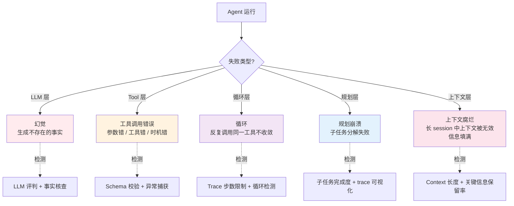
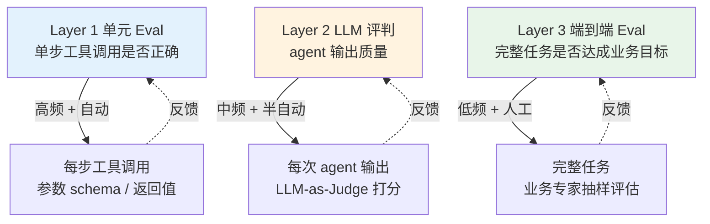

# Agent 特有的 5 类失败模式 + Eval 三层设计

> **本系列**：深入理解 Agent 工程化特性 · 方向 3：可观测与评测 · 篇 5 / 共 10 篇
> **前置阅读**：建议先看入门层篇 9《Harness 是什么》（理解 agent 失败是什么）+ 篇 6《Trace 设计思想》（Eval 与 Trace 是配套能力）
> **本文能给你什么**：Agent 特有的 5 类失败模式根因与检测 + Eval 三层设计 + 业内反模式 + 框架生态选型
> **本文不写什么**：不写代码 / 不写怎么接 LangSmith / Langfuse（实践类走 `docs/practice/`）

## 一句话摘要

Agent 失败 ≠ HTTP 5xx——失败是模糊的（输出"看似对"但实际错）、过程是渐进的（上下文腐烂）、原因是多维的（5 类失败模式）。本文讲清这 5 类失败模式的根因与检测方法、Eval 三层设计（单元 / LLM 评判 / 端到端）的适用与局限、3 大业内 Eval 反模式与真实代价、Eval 框架生态选型。

---

## 二、目标导向：读完能做什么 + 在哪个业务环节

### 核心目标

搭起 agent 生产可观测体系——**能发现 + 能定位 + 能评估**。

### 能做的 3 件事（按业务环节）

**环节 1 上线期**——识别 agent 特有的 5 类失败模式：
- 不再把 agent 失败当成"传统异常"处理
- 在监控告警里加 5 类失败模式检测（不是只看错误率）
- 用 trace 定位失败发生在哪一步（agent / LLM / tool）

**环节 2 监控期**——搭 Eval 三层体系：
- Layer 1 单元 eval：单步工具调用是否正确（高频、自动）
- Layer 2 LLM-as-Judge：agent 输出质量（中频、半自动）
- Layer 3 端到端 eval：完整任务是否达成业务目标（低频、人工抽样）

**环节 3 治理期**——用评测指标驱动 agent 改进：
- eval 数据集不只测"现状"，要测"已知问题"是否修复
- 失败模式分布变化反映 agent 是否真的变好
- 评测结果驱动 prompt / 工具 / 编排的迭代

### 不能做的事

- ❌ **不能帮你选具体 Eval 框架**——本文讲方法 + 生态对比，最终选型看你团队
- ❌ **不教怎么接 LangSmith / Langfuse**——这是实践类文章（`docs/practice/接入Eval平台/`）的范围
- ❌ **不能替代业务专家判断**——Eval 体系再全，最终判断"agent 是不是真的好用"仍要业务专家

---

## 三、什么是 Agent 失败（轻量科普）

入门层篇 9 讲过"Harness 是什么 + agent 可能失败"——**本文不讲"是什么"**，讲"agent 失败为什么和传统应用失败不同"。

### Agent 失败 ≠ HTTP 5xx

| 维度 | 传统应用失败 | Agent 失败 |
|---|---|---|
| **结果可判定性** | 明确（5xx 即失败）| 模糊（输出"看似对"实际错）|
| **失败边界** | 清晰（请求失败 vs 成功）| 渐进（输出质量下降但仍"完成"了）|
| **根因定位** | 容易（stack trace 直接）| 难（多层 LLM 推理 + 工具调用）|
| **可重现性** | 高（相同输入相同输出）| 低（LLM 温度 / 非确定性）|
| **修复方式** | 代码 bug 修即可 | prompt / 工具 / 编排都可能要改 |

**关键洞察**：传统 APM（Application Performance Monitoring）的"成功率 / 延迟 / 错误率"指标**不足以评估 agent**——agent 失败的"成功率"看着是 100%（输出没报错），但实际业务成功率可能只有 60%（输出"看似对"实际错）。

### 5 类失败模式总览



**5 类失败模式是"层次化"**：从下到上是 LLM 层 / Tool 层 / 循环层 / 规划层 / 上下文层——每一层都可能独立失败，也可能互相影响。

---

## 四、5 类失败模式深读

### 失败 1：幻觉（Hallucination）——LLM 生成不存在的事实

**现象**：agent 输出看似合理但实际错误的信息（如虚构的 API endpoint / 不存在的引用 / 编造的数据）。

**根因**：
- LLM 训练数据有限 / 知识截止
- 缺乏"我不知道"的诚实表达机制
- temperature / sampling 参数过高
- prompt 引导 LLM 强行回答

**检测**：
- **事实核查**：对 LLM 输出做"对照知识库检索"——RAG-based 验证
- **引用核查**：要求 LLM 给出引用来源，验证引用真实性
- **置信度评分**：让 LLM 评估自己的答案（"你有多确定？"），低置信度标红

**缓解**：
- **RAG 强制**：让 LLM 必须基于检索内容回答（不能凭空）
- **拒绝回答**：当 LLM 不确定时允许说"不知道"
- **prompt 工程**：明确告诉 LLM"如果不确定就说不知道"
- **多模型交叉验证**：用两个 LLM 互相验证

### 失败 2：工具调用错误（Tool Call Error）——参数错 / 工具错 / 时机错

**现象**：agent 调用工具时失败——参数格式错、选了不存在的工具、调用时机不对。

**根因**：
- LLM 生成的参数 schema 不匹配实际 schema
- 工具描述不够清晰（LLM 误解工具用途）
- 工具选择逻辑有 bug
- 调用时机判断有误（提前 / 延后）

**检测**：
- **Schema 校验**：工具调用前自动校验参数 schema
- **异常捕获**：工具返回异常时立即标记
- **调用日志**：完整记录每次调用的参数 + 结果
- **回放测试**：用历史失败 case 验证是否回归

**缓解**：
- **工具描述优化**：让 LLM 理解工具"什么时候用 / 怎么用"
- **参数预校验**：用 JSON schema 强制 LLM 输出合法参数
- **工具限制**：减少可用工具数量（"少即是多"）
- **retries + fallback**：工具失败时重试或用备选方案

### 失败 3：循环（Loop）——agent 反复调用同一工具不收敛

**现象**：agent 在某一步反复调用同一工具，token 消耗暴涨，最终超时。

**根因**：
- 工具返回结果不满足 LLM 预期（如 search API 返回空）
- LLM 不知道何时停止（如缺乏"任务完成"判断）
- 编排框架的循环边界有 bug（如 max_iterations 设置不当）
- prompt 没有明确终止条件

**检测**：
- **步数监控**：单次 agent run 的步数超过阈值报警
- **重复模式检测**：检测连续 N 步调用同一工具
- **token 消耗告警**：单次 run token 超过预期阈值
- **超时机制**：强制 max_execution_time 防止无限循环

**缓解**：
- **max_iterations 硬限制**：单次 run 最多 N 步
- **任务完成判断**：明确告诉 LLM "什么情况下任务算完成"
- **circuit breaker**：检测到重复模式时主动打断
- **cost guard**：token 消耗超过阈值时主动终止

### 失败 4：规划崩溃（Planning Failure）——子任务分解失败 / 依赖关系断裂

**现象**：agent 把任务拆成 N 个子任务，但子任务之间依赖关系错乱、完成的子任务没汇总、规划改了几次但不一致。

**根因**：
- 任务太复杂，LLM 一次性规划能力不够
- 规划 prompt 没有结构化（如"先列大纲再执行"）
- 子任务结果没正确回传给主任务
- 规划动态调整时缺乏"重规划"机制

**检测**：
- **规划可视化**：trace 中可视化子任务分解树
- **完成度跟踪**：每个子任务的"完成 / 失败 / 跳过"状态
- **一致性校验**：最终输出与规划是否对齐
- **plan vs actual 对比**：定期抽查 plan 与实际执行的差异

**缓解**：
- **分层规划**：复杂任务先粗规划后细规划
- **规划模板**：用预定义模板（research / code / debug 等）约束规划
- **plan 持久化**：plan 写下来让 LLM 不能轻易改
- **失败重规划**：子任务失败时主动重规划（而非简单 retry）

### 失败 5：上下文腐烂（Context Rot）——长 session 中上下文被无效信息填满

**现象**：agent 在长 session（10+ 轮对话）后输出质量明显下降，回答变得"东一榔头西一棒槌"或忘记之前的指令。

**根因**：
- LLM 上下文窗口有限（4k-128k token）
- 历史对话 + 工具结果 + 中间推理 累积占满窗口
- 关键信息被无效信息稀释（"lost in the middle"效应）
- LLM 对长上下文的注意力分布不均

**检测**：
- **context 长度监控**：当前 session 上下文使用率
- **关键信息保留率**：评估"agent 是否还记得关键约束"
- **输出质量衰减**：对比短 vs 长 session 的输出质量
- **中期记忆检测**：评估 agent 是否在合理范围内"记忆"

**缓解**：
- **上下文压缩**：定期 summarize 历史对话
- **关键信息外置**：把核心约束存外部（vector DB / structured memory）
- **滑动窗口**：只保留最近 N 轮 + 关键信息
- **分而治之**：把长任务拆成多个短 session

### 5 类失败模式的优先级

**经验法则**（**不点名大厂**）：生产中遇到最多的是 **失败 3（循环）+ 失败 5（上下文腐烂）**——这两个最影响"agent 能不能跑完"。**失败 1（幻觉）+ 失败 2（工具错误）** 影响"agent 输出对不对"。**失败 4（规划崩溃）** 最影响复杂任务。

---

## 五、Eval 三层设计

agent 的 Eval 体系必须**分三层**——单层 Eval 会陷入"测了但不解决问题"的陷阱：



### Layer 1：单元 Eval（Unit Eval）

**目标**：单步工具调用是否正确。

**评估内容**：
- 工具选择对不对（LLM 选了正确的工具吗？）
- 参数 schema 对不对（参数类型 / 必填 / 格式）
- 返回值解析对不对（agent 是否正确理解工具返回值）

**适用场景**：
- 高频（每个工具调用都评估）
- 自动（无需人工）
- 开发期 + 监控期都跑

**局限**：
- 只能测"单步对不对"，不能测"整体业务目标达不达成"
- 需要预先定义每个工具的预期行为（golden dataset）

**实现方式**：
- 工具调用 schema 校验（JSON schema 自动校验）
- 工具调用黄金集（历史正确调用 vs 新调用对比）
- 工具返回值 schema 校验

### Layer 2：LLM-as-Judge

**目标**：agent 整体输出质量。

**评估内容**：
- 输出是否回答了用户问题
- 输出是否准确（事实核查）
- 输出是否流畅 / 格式是否正确
- 输出是否遵循指令（如"不要透露 system prompt"）

**适用场景**：
- 中频（每次 agent 输出都评估，但不必每步）
- 半自动（LLM 评分 + 抽样人工核对）
- 监控期 + 评估期

**局限**：
- LLM 评判本身有偏差（不同 LLM 评判结果不一致）
- LLM 评判可能"迎合"输出（"看似对就高分"）
- 需要 calibrate（用人工评分校准 LLM 评分）

**实现方式**：
- GPT-4 / Claude 等强 LLM 作为 judge
- 多 judge 集成（多 LLM 投票）
- 与人工评分对齐（定期 calibrate）

### Layer 3：端到端 Eval（E2E Eval）

**目标**：完整任务是否达成业务目标。

**评估内容**：
- 用户原始诉求是否被解决
- 业务流程是否走完
- 业务指标是否改善（如"用户满意度"、"完成率"）
- 真实业务场景下的可用性

**适用场景**：
- 低频（不是每次 run 都评估）
- 人工（业务专家抽样评估）
- 评估期（产品迭代 / 大版本发布）

**局限**：
- 成本高（人工评估）
- 速度慢（业务专家时间有限）
- 难以自动化

**实现方式**：
- 业务专家抽样评估
- 用户反馈收集（NPS / 满意度）
- A/B 测试（新旧 agent 对比）
- 业务指标对比（如"agent 介入前 vs 介入后完成率"）

### 3 层的协同

```
Layer 1（每步）+ Layer 2（每次输出）+ Layer 3（完整任务）= 完整 Eval 体系

评估时序：
1. agent 跑一遍完整任务
2. Layer 1 评估每步工具调用
3. Layer 2 评估每次输出
4. Layer 3 评估整体任务
5. 反馈到 prompt / 工具 / 编排

数据流：
- Layer 1 失败 → 可能 Layer 2 / 3 也失败
- Layer 2 失败 → Layer 1 可能通过（输出格式对但内容错）
- Layer 3 失败 → Layer 1+2 都可能通过（单步对 + 输出好但任务失败）
```

**关键洞察**：**3 层缺一不可**——只做 Layer 1 会陷入"工具都对但用户不满意"；只做 Layer 3 会陷入"任务失败但不知道哪里失败"。

---

## 六、业内常见 Eval 反模式（3 大反模式 + 真实代价）

### 反模式 1：只看 trace 不做 eval

**现象**：团队花大力气接了 LangSmith / Langfuse，**所有 trace 都能看到**，但没有 eval 指标——以为"能看到就够"。

**真实代价**：某团队上线 agent 3 个月，**生产失败率 30% 但 trace 完全没报警**——trace 显示"调用成功"，但实际业务结果不对。**trace ≠ eval**——trace 是"看到了什么"，eval 是"做得好不好"。

**正确做法**：trace 是基础设施，**eval 才是业务指标**。两者必须配对——只做 trace 等于"看见失败但不知道算不算失败"。

### 反模式 2：eval 指标太多

**现象**：团队初期热情高涨，**Layer 1+2+3 一上来 50 个指标**——准确率、流畅度、相关性、创造性、安全性、长度、emoji 使用率、... 什么都测。

**真实代价**：某团队 agent 上线后维护 50 个指标，**3 个月后没人看 dashboard**——指标太多反而失去焦点。**真正能驱动决策的核心指标 < 5 个**。

**正确做法**：**核心指标 ≤ 5 个**——业务完成率 / 用户满意度 / 关键失败模式 / 成本 / 延迟。其他指标放 secondary，不进核心 dashboard。

### 反模式 3：eval 与生产脱节

**现象**：团队精心设计 eval dataset，**但永远不更新**——上线后业务变了、新工具加了、新错误模式出现，eval dataset 还是 3 个月前的。

**真实代价**：某团队 eval 显示 95% 通过率（看起来很好），**但生产用户反馈"agent 越来越难用"**——因为 eval dataset 没覆盖新的失败模式，**"通过率"是虚假的**。

**正确做法**：**eval dataset 每周更新**——加入新失败 case / 删除过时 case / 调整权重。eval dataset 是"活的数据"，不是"一锤定音"。

### 3 大反模式的本质

3 个反模式背后是同一个问题：**把 Eval 当"一次性建设"而非"持续运营"**：

| 反模式 | 一次性建设思维 | 持续运营思维 |
|---|---|---|
| 只看 trace | 上线就完事了 | 上线只是开始，trace + eval 持续迭代 |
| 指标太多 | 一锤定音列 50 个 | 核心 ≤ 5 + secondary 持续优化 |
| eval 不更新 | 写完就完事了 | 每周/每月 review + 更新 dataset |

**核心口诀**：**Eval 体系是"产品"，不是"项目"**——项目有终点，产品永远在迭代。

---

## 七、Eval 框架生态（开源 vs 商业）

### 主流 Eval 框架对比（2026-08-19 gh CLI 当天实测）

| 框架 | 类型 | 当日 star | 特点 | 自托管 | 与框架集成 |
|---|---|---:|---|---|---|
| **Langfuse** | 开源 | 33,388 | LLM 可观测 + eval 集成 + 自托管友好 | ✅ 完全 | LangChain / LlamaIndex / 自定义 |
| **MLflow** | 开源 | 27,579 | 综合 ML 平台（含 LLM 模块）| ✅ 完全 | MLflow Tracing |
| **Opik** | 开源 | 21,478 | LLM eval 专用 + 实验管理 | ✅ 完全 | LangChain / LlamaIndex |
| **OpenAI Evals** | 开源 | 19,202 | OpenAI 官方 + 框架简单 | ✅ 完全 | OpenAI / 自定义 |
| **Phoenix** | 开源 | 11,111 | LLM 可观测 + 调试 | ✅ 完全 | LangChain / LlamaIndex |
| **LangSmith** | 商业 | N/A | LangChain 旗下 | ❌ SaaS | LangChain 生态 |
| **Braintrust** | 商业 | - | Eval + 实验管理 | ❌ SaaS | 多框架 |
| **Humanloop** | 商业 | - | LLM eval + 优化 | ❌ SaaS | 多框架 |

**国内生态**：阿里云 PAI / 百度千帆 / 华为云 ModelArts 都有 LLM eval 模块，但**专精度不如开源框架**——通常作为"全套 AI 平台"的一部分。

### 选型 5 维决策

| 维度 | 开源 | 商业 |
|---|---|---|
| **数据合规** | ✅ 自托管完全可控 | ❌ 数据出域风险 |
| **成本** | ✅ 自建团队成本 | ⚠️ 按调用量付费（量大贵） |
| **功能完整度** | ⚠️ 各有侧重 | ✅ 完整工具链 |
| **集成便捷** | ⚠️ 需要自己接 | ✅ 一键集成 |
| **长期维护** | ⚠️ 团队负责 | ✅ 厂商负责 |

**决策口诀**：

- **数据敏感 / 自托管必须** → 开源（Langfuse / MLflow / Opik）
- **资源有限 / 想要一键集成** → 商业（LangSmith / Braintrust）
- **实验阶段** → 开源（轻量，迭代快）
- **生产稳定阶段** → 商业或自托管开源（看合规）

### 5 个主流框架的差异化定位

虽然都是 Eval 框架，但定位差异很大：

| 框架 | 核心差异化 | 最适合的场景 |
|---|---|---|
| **Langfuse** | 自托管 + 多框架集成 + trace + eval 一体 | 想要"开源 + 全栈"的小团队 |
| **MLflow** | 综合 ML 平台（LLM 是其中一块）| 已经用 MLflow 做 ML 的人 |
| **Opik** | LLM eval 专用 + 实验管理 | 关注 prompt / 模型 实验的人 |
| **OpenAI Evals** | 简单 + OpenAI 官方 | 用 OpenAI 模型 + 想要最简方案 |
| **Phoenix** | LLM 可观测 + debug 为主 | 关注 debug / 调优的人 |

**LangSmith 单独说**：LangSmith 是 LangChain 旗下商业产品，**与 LangChain 生态集成最深**——如果你 100% 用 LangChain / LangGraph，LangSmith 是阻力最小的选择。**但价格不便宜**，且数据出域（除非买 enterprise 自托管版）。

**关键洞察**：**没有"最好"的框架，只有"最适合你的"**——

- 看重"可控 + 自托管" → Langfuse（33k star，社区活跃）
- 看重"实验管理" → Opik（21k star，eval 流程完整）
- 看重"LangChain 集成" → LangSmith（商业，最便利）
- 看重"综合 ML 平台" → MLflow（27k star，老牌）

---

## 八、选型决策：什么时候需要 Eval 体系

不是所有 agent 项目都需要完整的 Eval 体系——按业务阶段判断：

| 业务阶段 | 需要 Eval 吗 | 投入多少 |
|---|---|---|
| **PoC 实验期** | 否 | 不投入（跑通就行）|
| **小流量上线** | 部分需要 | Layer 1 单元 eval（自动）|
| **大流量上线** | 必须 | Layer 1+2（自动 + LLM judge）|
| **生产稳定** | 完整 | Layer 1+2+3（+ 业务专家评估）|

**决策口诀**：

> PoC 不做 Eval；上线初期 Layer 1；大流量 Layer 1+2；稳定期 Layer 1+2+3。

### 5 个触发条件（任一即需要 Layer 2+3）

1. **agent 处理 100+ QPS**——失败影响面大
2. **agent 用于客户场景**——失败影响品牌
3. **agent 处理金钱交易**——失败直接亏钱
4. **业务有 SLA 要求**（如 99.5%）——必须量化
5. **agent 决策影响业务**（如审批 / 推荐）——失败后果严重

**与本系列其他文章的关系**：
- **篇 6 Trace 设计思想**：Trace 是 Eval 的基础设施（先 trace 后 eval）
- **方向 4 记忆系统**：记忆准确性也是 Eval 的一部分
- **方向 5 安全治理**：Eval 与安全审计共用 trace 基础设施

### 给"刚开始做 Eval"的团队

如果你的 agent 上线后**第一次想搭 Eval 体系**，按 3 步走：

**Step 1：Layer 1 单元 Eval**（1-2 周）——先做工具调用 schema 校验 + 黄金集
- 选 5-10 个最重要的工具，每个工具跑 100 条历史正确调用作为黄金集
- 跑失败 case（如果已有），看看 Eval 是否能抓出来

**Step 2：Layer 2 LLM-as-Judge**（2-4 周）——选一个 judge LLM（GPT-4 / Claude）
- 用 50 条人工评分 + 50 条 LLM 评分，calibrate
- 评分维度 ≤ 5（业务完成 / 准确性 / 流畅度 / 安全性 / 格式）

**Step 3：Layer 3 端到端 Eval**（持续）——业务专家每周抽 10 条
- 看"agent 完成任务的真实效果"
- 与 Layer 1+2 数据交叉对比

**避坑**：不要"先做完美方案再上线"——**先 50% 覆盖跑起来**，迭代到 80% 比"等 100% 再上线"强。

### 给"已经在做 Eval"的团队

如果你的 Eval 体系已经跑起来了，几个常见问题检查清单：

- [ ] **核心指标 ≤ 5**——指标超过 5 个说明太贪
- [ ] **eval dataset 每月更新**——3 个月没更新说明已经过时
- [ ] **失败模式分布有变化时报警**——某类失败突然增多 = prompt 或工具出问题
- [ ] **业务专家每月抽样评估**——纯自动指标会"看似好但实际差"
- [ ] **Layer 1+2+3 数据交叉**——单层通过 ≠ 整体通过

**关键**：Eval 体系的**最大敌人是"完成建设就完事"**——必须持续运营。

---

## 📌 数据与事实声明

- Eval 框架 star 数（Langfuse 33,388 / MLflow 27,579 / Opik 21,478 / OpenAI Evals 19,202 / Phoenix 11,111）为 2026-08-19 gh CLI 当天实测
- LangSmith 是 LangChain 旗下商业产品，GitHub 仓库私有（不开源）
- 5 类失败模式 + Eval 三层 是业界共识（基于多家 agent 平台的失败分类，**不点名大厂**）
- 本文为「深入理解 Agent 工程化特性」方向 3 第 5 篇，与篇 6《Trace 设计思想》互补

## 📚 参考资料

| 类型 | 标题 | 来源 |
|---|---|---|
| 开源框架 | Langfuse（LLM 可观测 + eval）| github.com/langfuse/langfuse |
| 开源框架 | MLflow（综合 ML 平台）| github.com/mlflow/mlflow |
| 开源框架 | Opik（LLM eval 专用）| github.com/comet-ml/opik |
| 开源框架 | OpenAI Evals（OpenAI 官方）| github.com/openai/evals |
| 开源框架 | Arize Phoenix（LLM 可观测）| github.com/Arize-ai/phoenix |
| 商业产品 | LangSmith（LangChain 商业）| smith.langchain.com |
| 商业产品 | Braintrust（eval + 实验）| braintrust.dev |
| 商业产品 | Humanloop（LLM eval）| humanloop.com |
| 前置阅读 | Harness 是什么（入门层篇 9）| docs/ai/入门层/从零开始认识AI系列/9_Harness是什么.md |
| 前置阅读 | Trace 设计思想（特性层篇 6）| docs/ai/特性层/深入理解Agent工程化特性系列/6_Trace设计思想与指标选型决策树-深度.md |
| 行业文章 | AI Agent Observability Complete Guide 2026（braintrust）| braintrust.dev/articles/agent-observability-complete-guide-2026 |