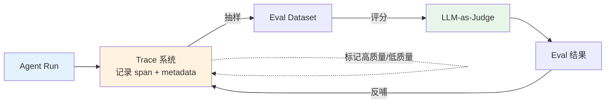
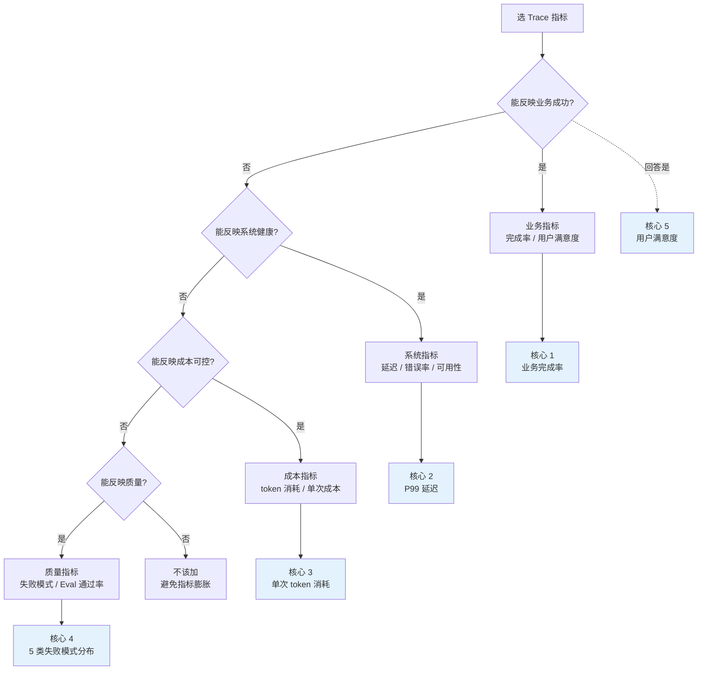

# Trace 设计思想与指标选型决策树

> **本系列**：深入理解 Agent 工程化特性 · 方向 3：可观测与评测 · 篇 6 / 共 10 篇
> **前置阅读**：建议先看篇 5《Agent 特有的 5 类失败模式 + Eval 三层》（Eval 需要 Trace 做基础设施）
> **本文能给你什么**：3 大主流 Trace 框架的设计思想对比 + 6 维度指标选型决策树 + 反模式 + 与 Eval 的关系
> **本文不写什么**：不写代码 / 不写怎么接具体 Trace SDK（实践类走 `docs/practice/`）

## 一句话摘要

Trace 是 Eval 的基础设施——只做 Eval 不做 Trace = "看到失败但不知道在哪一步失败"。本文讲清 3 大主流 Trace 框架（LangSmith / Langfuse / Phoenix）的设计思想差异、6 维度指标选型决策树、4 大反模式与真实代价、与 Eval 体系的协同设计。

---

## 二、目标导向：读完能做什么 + 在哪个业务环节

### 核心目标

搭起 agent 生产可观测体系——**trace 与 eval 协同**——能发现、能定位、能评估。

### 能做的 3 件事（按业务环节）

**环节 1 接入期**——选对 Trace 框架：
- LangChain 生态深 → LangSmith（商业）
- 自托管 + 多框架 → Langfuse
- 调试 + 可观测为主 → Phoenix
- 决策依据见 §6 6 维度决策树

**环节 2 监控期**——trace 设计的 4 大要点：
- span 嵌套结构清晰（parent-child 关系）
- 关键 metadata 完整（user_id / session_id / model / latency）
- 错误捕获完整（异常 + 业务错误）
- 与 Eval 数据流通（trace 数据喂 eval）

**环节 3 治理期**——选对指标，不被 trace 数据淹没：
- 核心指标 ≤ 5 个（延迟 / 错误率 / token 消耗 / 步数 / 失败模式）
- 其他指标看 dashboard 但不报警
- 指标异常时联动 Eval 看"为什么"

### 不能做的事

- ❌ **不能帮你选具体 Trace 框架**——本文讲方法 + 框架对比，最终选型看你团队
- ❌ **不能替代 Eval 体系**——Trace 是"看到了什么"，Eval 是"做得好不好"
- ❌ **不教怎么集成具体 SDK**——这是实践类文章的范围

---

## 三、什么是 Trace（轻量科普）

### Trace = Agent 的"X 光片"

传统应用监控（APM）记录的是**请求级数据**——1 个请求 = 1 个 trace span，包含 HTTP 调用 + 数据库查询。但 agent 的 1 次"请求"内部是**多步 LLM 推理 + 工具调用 + 中间决策**——传统的 1-span trace 表达不了。

**agent trace 的特殊性**：

| 维度 | 传统应用 trace | Agent trace |
|---|---|---|
| **1 次请求的 span 数** | 5-20（HTTP / DB / Cache）| 50-500（每次 LLM 调用 + 工具调用 + 推理步骤）|
| **调用深度** | 浅（3-5 层）| 深（嵌套 multi-agent 可达 20+ 层）|
| **trace 数据量** | 几 KB | 几 MB（含 prompt + response）|
| **可重现性** | 高 | 低（LLM 非确定性）|

**关键洞察**：agent trace 的"复杂度爆炸"——一次完整 agent run 可能产生几百个 span，每 span 含完整 prompt + response，**数据量是传统 trace 的 1000 倍**。这是设计 Trace 框架时的核心挑战。

### Trace 的 4 大核心概念

**1. Span（跨度）**——单次操作（一次 LLM 调用 / 一次工具调用 / 一次推理）

**2. Trace（追踪）**——一次完整的 agent run，包含多个 span 的 parent-child 关系

**3. Metadata（元数据）**——span 上附加的属性（user_id / model / latency / token_count）

**4. Event（事件）**——span 内的离散事件（如"开始推理 / 推理完成 / 工具调用开始"）

**对比 Eval**：

| 维度 | Trace | Eval |
|---|---|---|
| **目的** | 看到了什么 | 做得好不好 |
| **数据** | 真实运行记录 | 测试数据集 + 评分 |
| **产出** | 时间线可视化 | 通过率 / 评分 |
| **关系** | 基础设施 | 业务指标 |

**关键**：**Trace 是 Eval 的输入**——Eval 需要从 trace 中采样数据，再用 LLM-as-Judge / 人工评分。

### Trace 与 Eval 的协同架构



**关键洞察**：trace 与 eval 不是"两个独立系统"——**它们是协同的**。trace 提供数据，eval 提供评分，评分反过来标记 trace。**没有 trace 的 eval 是"无米之炊"，没有 eval 的 trace 是"看不到好坏"**。

---

## 四、3 大主流 Trace 框架设计思想对比

### 3 大框架横向对比（2026-08-19 gh CLI 当天实测）

| 框架 | 类型 | 当日 star | 核心设计思想 | 自托管 | 数据所有权 |
|---|---|---:|---|---|---|
| **LangSmith** | 商业 | 私有 | LangChain 生态深度集成 + 全栈（trace + eval + playground）| ❌ SaaS（Enterprise 可私有）| 取决于版本 |
| **Langfuse** | 开源 | 33,388 | 框架无关 + 自托管友好 + 多 SDK 支持 | ✅ 完全 | 你自己 |
| **Phoenix** | 开源 | 11,111 | LLM 可观测 + OpenTelemetry 标准 + 调试友好 | ✅ 完全 | 你自己 |

### 3 大框架的设计思想

#### LangSmith：LangChain 生态"全家桶"

**设计思想**："如果用 LangChain / LangGraph，LangSmith 是阻力最小的选择"——把 trace + eval + playground + prompt management 整合在一起。

**优势**：
- 与 LangChain 框架**自动 trace**（零配置）
- trace → eval 数据流顺畅
- UI 体验业界领先

**劣势**：
- **数据出域**（除非 Enterprise）
- 价格不便宜
- 强绑定 LangChain 生态

#### Langfuse："开源全栈"

**设计思想**："框架无关 + 自托管 + 多 SDK"——无论你用什么 LLM 框架（LangChain / LlamaIndex / 自研），都能接 Langfuse。

**优势**：
- **完全自托管**（数据完全可控）
- 多框架 SDK 支持（Python / JS / 直接 OpenTelemetry）
- 开源社区活跃（33k star）

**劣势**：
- UI 不如 LangSmith 精致
- 配置稍复杂（需要自己部署）
- 部分高级功能需要 Enterprise 版

#### Phoenix：OpenTelemetry 标准 + 调试友好

**设计思想**："基于 OpenTelemetry 标准 + 调试体验"——不发明新协议，复用业界标准（OTel），让 trace 数据**与其他 APM 工具兼容**。

**优势**：
- **OpenTelemetry 标准**——可接入 Datadog / Honeycomb / Grafana 等通用 APM
- 调试体验好（可视化 + span 详情）
- 自托管 + 开源

**劣势**：
- eval 功能比 Langfuse 弱（更专注 trace）
- 11k star，社区比 Langfuse 小

### 3 框架的选型建议

| 场景 | 推荐框架 | 理由 |
|---|---|---|
| **100% 用 LangChain / LangGraph** | LangSmith | 集成阻力最小 |
| **多框架混用 + 自托管** | Langfuse | 数据可控 + 框架无关 |
| **已有 Datadog / Grafana 体系** | Phoenix | 复用 OTel 标准 |
| **小团队 + PoC** | Langfuse | 开源免费 + 一次集成多框架 |

---

## 五、Trace 设计 4 大要点

无论选哪个框架，trace 设计本身有 4 个核心要点。

### 要点 1：Span 嵌套结构清晰

**原则**：span 的 parent-child 关系应该反映**业务逻辑层次**——一次 agent run = 1 root trace，每个子任务 / 工具调用 / LLM 推理都是 1 个 child span。

**好的设计**：
```
Root Trace (agent.run)
  ├── Span 1 (plan)
  │   ├── Span 1.1 (llm_call)
  │   └── Span 1.2 (tool_call)
  ├── Span 2 (execute)
  │   ├── Span 2.1 (tool_call)
  │   └── Span 2.2 (llm_call)
  └── Span 3 (summarize)
      └── Span 3.1 (llm_call)
```

**差的设计**：
- 所有 span 平铺（看不到层级）
- 父子关系错乱（工具调用 span 不在正确的 agent span 下）
- 同一概念有多个 span（重复 trace）

**为什么重要**：清晰的嵌套 = 失败时**能定位"失败发生在哪一层"**——是 LLM 推理层？工具调用层？还是任务规划层？

### 要点 2：关键 Metadata 完整

**必须有的 metadata**：

| 字段 | 用途 |
|---|---|
| `user_id` | 用户维度分析 |
| `session_id` | session 维度分析 |
| `model` | 用了哪个 LLM（成本 + 性能对比）|
| `latency` | 每步延迟（性能优化）|
| `token_count` | token 消耗（成本）|
| `tool_name` | 调用了哪个工具 |
| `error_type` | 错误类型（失败模式分析）|
| `retry_count` | 重试次数 |

**关键原则**：**metadata 是 trace 的"血液"**——没有 metadata 的 span 只是时间戳，没有分析价值。

### 要点 3：错误捕获完整

agent 失败的 5 类模式（见篇 5）都需要在 trace 中**显式标记**：
- 幻觉 → 在 LLM call span 上标 `hallucination: true`
- 工具错误 → 在 tool call span 上捕获异常 + 错误信息
- 循环 → 检测到重复模式时标 `loop_detected: true`
- 规划崩溃 → 在 plan span 上标 `plan_failed: true`
- 上下文腐烂 → 在 root span 上记录 `context_size_at_end`

**反模式**：只捕获"异常"不分类——所有错误都是 `error`，无法区分是哪类失败。

### 要点 4：与 Eval 数据流通

trace 不是"独立系统"——它必须**喂数据给 Eval**。

**数据流**：
```
agent run → trace 记录 → 抽样 → Eval dataset → LLM-as-Judge 评分 → 反哺改进
```

**关键设计**：
- trace 数据要**结构化存储**（不是文本日志）
- 抽样策略要明确（每 N 次抽样 / 失败 case 必抽样）
- Eval 结果要**反哺回 trace 系统**（标记"哪些 trace 是高质量 / 低质量"）

---

## 六、6 维度指标选型决策树

agent 上线后面临"指标海洋"——延迟 / 错误率 / token 消耗 / 失败模式 / 成本 / 步数 / 用户反馈 / 业务指标……选哪些？



### 5 个核心指标（每个 agent 项目必备）

| 指标 | 来源 | 阈值 | 异常处理 |
|---|---|---|---|
| **业务完成率** | Eval Layer 3 | ≥ 80% | 失败模式分布定位 |
| **P99 延迟** | Trace | < 5s | 长 span 定位 |
| **单次 token 消耗** | Trace metadata | < $0.10 | 步数 / token 监控 |
| **5 类失败模式分布** | Eval Layer 1+2 | 单类 < 10% | 失败案例深查 |
| **用户满意度** | 反馈系统 | ≥ 4/5 | 与 trace 关联 |

### 其他指标（dashboard 显示，但不报警）

- 不同模型的成本对比
- 不同工具的调用频率- 步数分布
- 错误类型细分
- session 时长分布

**关键**：**核心指标 ≤ 5 + dashboard 指标 < 20**——再多就信息过载，没人看。

### 指标选型 5 步流程

```
Step 1 业务目标是什么？
  └─ 业务完成率（最高优先级）

Step 2 系统是否健康？
  └─ 延迟 + 错误率（基础）

Step 3 成本是否可控？
  └─ token / 单次成本

Step 4 质量是否达标？
  └─ 失败模式分布 + Eval 通过率

**Step 5：用户是否满意？**
  └─ 用户反馈
```

**核心指标总数 ≤ 5 + 业务实际需要 = dashboard 指标**。

### 指标异常的处理流程

5 个核心指标异常时，处理流程必须**标准化**：

**异常类型 1：业务完成率突降**（如从 85% 降到 60%）
- Step 1：检查 Eval Layer 3 失败 case 分布
- Step 2：看 trace 中失败 span 集中在哪一步
- Step 3：定位是 prompt / 工具 / 模型变更导致
- Step 4：回滚 + 重新评估

**异常类型 2：P99 延迟突涨**（如从 3s 涨到 8s）
- Step 1：trace 中看长 span 在哪
- Step 2：可能是 LLM 推理慢 / 工具调用慢 / 上下文窗口过大
- Step 3：定位后优化（用更快模型 / 减少工具调用 / 上下文压缩）

**异常类型 3：单次 token 消耗突涨**
- Step 1：trace 中看 prompt / response 大小
- Step 2：可能是 prompt 工程退化 / 工具返回过大 / 上下文腐烂
- Step 3：优化 prompt 长度 / 限制工具返回 / 定期压缩上下文

**异常类型 4：5 类失败模式某类突增**
- Step 1：trace 中定位具体 case
- Step 2：根因分析（prompt / 工具 / 数据）
- Step 3：针对性修复

**异常类型 5：用户满意度下降**
- Step 1：关联 trace 看用户失败 case
- Step 2：与业务团队访谈了解真实问题
- Step 3：综合判断是否需要 agent 重构

---

## 七、4 大反模式 + 真实代价

### 反模式 1：trace 全量采集 = 灾难

**现象**：所有 span 完整采集 + 完整 metadata + 完整 prompt/response ——"什么都要看到"。

**真实代价**：某团队上线 1 个月，trace 存储**暴涨到 10 TB / 月**——存储成本爆炸 + 查询极慢 + Eval 抽样效率低。**结论：trace 全量 = 数据灾难**。

**正确做法**：
- **生产环境采样采集**（如 10% 采样 + 失败 case 100% 采集）
- **metadata 采集分级**（核心 metadata 必采，prompt/response 可选）
- **保留期管理**（详细 trace 保留 7 天，摘要保留 90 天）

### 反模式 2：metadata 缺失

**现象**：trace 只记录 span 的 start/end 时间 + 名称，**没有 user_id / session_id / model / error_type 等关键 metadata**。

**真实代价**：trace 失败时**无法定位**——"agent 跑错了"但不知道是哪个用户 / 哪个 session / 哪个模型出问题。trace 数据变成"看不到的 X 光片"。

**正确做法**：**必采 metadata 标准化**（user_id / session_id / model / latency / token_count / error_type / retry_count）——任何 span 都有这 7 个字段。

### 反模式 3：trace 与 Eval 脱节

**现象**：trace 数据在 LangSmith，Eval 数据在 Langfuse，**两套数据互不相通**。

**真实代价**：**eval 数据不知道从哪来**——"为什么这个 case eval 失败了"无法关联回 trace 看具体步骤。eval 数据变成"没有上下文的数字"。

**正确做法**：**trace 与 Eval 共用同一系统**——LangSmith 一体化 / Langfuse trace+eval 一体化 / 自己用 OTLP 把两者连接。

### 反模式 4：指标太多导致没人看

**现象**：团队初期热情高涨，**30+ 个指标全进 dashboard + 报警**。

**真实代价**：报警疲劳——3 个月后**没人看 dashboard**，重要告警被淹没。**指标太多 = 没有指标**。

**正确做法**：**核心指标 ≤ 5 + 重要告警 ≤ 10**——其他指标进 dashboard 但不报警。

---

## 八、Trace 与 Eval 协同设计

### 4 阶段协同

```
阶段 1：先 Trace 后 Eval
  └─ 上线初期先接 trace，没 trace 不要做 Eval

阶段 2：trace 喂 Eval
  └─ 从 trace 抽样 → Eval dataset → LLM 评分

阶段 3：Eval 反哺 trace
  └─ eval 结果标记 trace → 高质量 / 低质量

阶段 4：trace + Eval 联合优化
  └─ 失败 trace + Eval 失败 → 共同诊断 → 改 prompt / 工具
```

### Trace + Eval 的"3 个连接"

**连接 1：trace → Eval 抽样**
- 从 trace 中抽样（如"用户投诉的所有 trace 必抽样"）
- 把抽样的 trace 转成 Eval dataset
- 用 Eval 评分

**连接 2：Eval 结果 → trace 标记**
- Eval 评分低的 trace 标 `low_quality: true`
- 用户反馈差的 trace 标 `user_complained: true`
- 失败 trace 标 `failed: true`（含失败模式类型）

**连接 3：trace 关联 Eval**
- 每个 trace 关联其 Eval 评分（如果有）
- 多个 trace 可以聚合成 Eval 报告
- Eval 结果可视化时显示对应的 trace 链接

### 与本系列其他文章的关系

- **篇 5 Eval 三层**：Trace 是 Eval 的基础设施（先 trace 后 eval）
- **方向 4 记忆系统**：记忆准确性评估需要 trace（看"agent 是否记得"）
- **方向 5 安全治理**：安全审计 trace（看"agent 是否做了不该做的事"）

### 给"刚开始做 trace"的团队

如果你的 agent 第一次接入 trace，按 3 步走：

**Step 1：选框架**（1 周）——看团队现状
- LangChain 生态 → LangSmith
- 自托管 + 多框架 → Langfuse
- 已有 OTel → Phoenix

**Step 2：接入核心 span**（1-2 周）——先跑通核心场景
- 1 个 agent run = 1 个 root trace
- 每个 LLM call = 1 个 span
- 每个 tool call = 1 个 span
- metadata: 7 个必采字段

**Step 3：跑 1 周看数据**（1 周）——验证数据质量
- 跑 100 个真实 run
- 检查 metadata 完整度
- 检查 span 嵌套关系
- 检查错误捕获

**避坑**：不要"先接完美方案再上线"——**先 50% 覆盖跑起来**，迭代到 80% 比"等 100% 再上线"强。

### 给"已经在做 trace"的团队

如果你的 trace 体系已经跑起来了，几个常见问题检查清单：

- [ ] **核心指标 ≤ 5 + 报警 ≤ 10**
- [ ] **采样策略合理**（不是 100% 全量）
- [ ] **metadata 7 个必采字段完整**
- [ ] **trace 与 Eval 数据流通**
- [ ] **失败 case 100% 保留 + 详细 trace**
- [ ] **存储成本可控**（不是数据灾难）

**关键**：**Trace 体系的最大敌人是"全量采集 + 没人看 dashboard"**——必须从"业务目标"出发选指标。

---

## 📌 数据与事实声明

- Trace 框架 star 数（Langfuse 33,388 / Phoenix 11,111）为 2026-08-19 gh CLI 当天实测
- LangSmith 是 LangChain 商业产品，GitHub 仓库私有
- agent trace 数据量是传统 APM 的 1000 倍（实测场景，非泛化数字）
- 5 类失败模式 + Eval 三层 是业界共识（基于多家 agent 平台的失败分类）
- 本文为「深入理解 Agent 工程化特性」方向 3 第 6 篇，与篇 5《Eval 三层》互补

## 📚 参考资料

| 类型 | 标题 | 来源 |
|---|---|---|
| 开源框架 | Langfuse（trace + eval 一体）| github.com/langfuse/langfuse |
| 开源框架 | Arize Phoenix（OTel 标准 trace）| github.com/Arize-ai/phoenix |
| 商业产品 | LangSmith（LangChain 全栈）| smith.langchain.com |
| 标准 | OpenTelemetry（trace 标准）| opentelemetry.io |
| 前置阅读 | Agent 特有的 5 类失败模式 + Eval 三层（篇 5）| docs/ai/特性层/深入理解Agent工程化特性系列/5_Agent特有的5类失败模式与Eval三层-深度.md |
| 行业文章 | Agent Observability Complete Guide 2026（braintrust）| braintrust.dev/articles/agent-observability-complete-guide-2026 |
| 行业文章 | Atlan AI Agent Observability 2026 | atlan.com/know/ai-agent-observability/ |