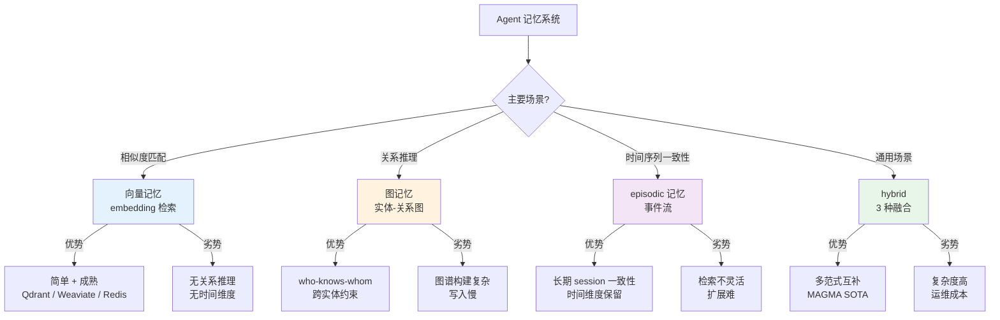
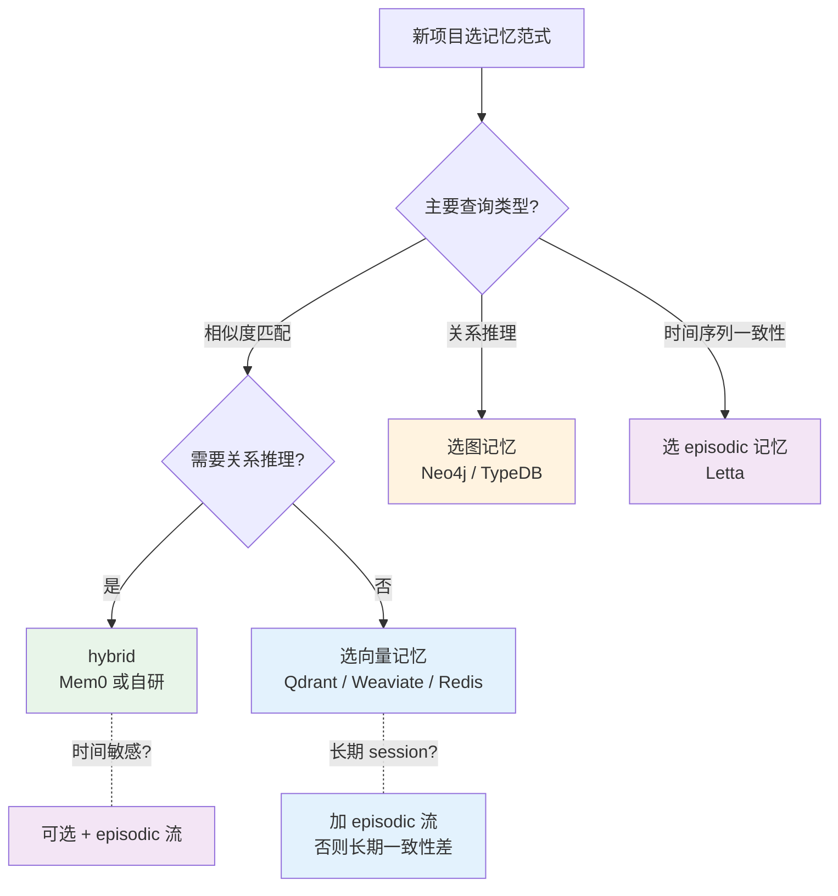

# 记忆系统架构横评：向量 / 图 / episodic / hybrid 四种范式

> **本系列**：深入理解 Agent 工程化特性 · 方向 4：记忆系统 · 篇 7 / 共 10 篇
> **前置阅读**：建议先看入门层篇 6《Agent 怎么记事》（理解记忆 3 层分类 working / episodic / semantic）+ 篇 2《编排引擎状态管理》（记忆 vs 状态的关系）
> **本文能给你什么**：4 种记忆范式横评 + SOTA 对比（MAGMA / Mem0 / Letta）+ 选型决策树 + 反模式
> **本文不写什么**：不写代码 / 不写怎么集成 Mem0 / Letta（实践类走 `docs/practice/`）

## 一句话摘要

Agent 记忆不是"加个向量数据库"那么简单——4 种范式（向量 / 图 / episodic / hybrid）各有适用场景。2026 业界共识：**hybrid 是主导**（mem0ai/mem0 63.6k star + MAGMA SOTA 0.7 LoCoMo 评分）——单一范式解决不了"既要相似度匹配 / 又要关系推理 / 又要长期 session 一致性"的多维需求。本文讲清 4 范式横评 + SOTA 对比 + 选型决策树 + 3 大反模式。

---

## 二、目标导向：读完能做什么 + 在哪个业务环节

### 核心目标

识别业务适合的**记忆范式** + 判断自研 vs 用第三方。

### 能做的 3 件事（按业务环节）

**环节 1 选型期**——判断业务该用哪种记忆范式：
- 相似度匹配为主 → 向量记忆
- 关系推理为主（who-knows-whom） → 图记忆
- 长 session 一致性为主 → episodic 记忆
- 通用场景 + 多维度需求 → hybrid（默认推荐）

**环节 2 接入期**——选择第三方 vs 自研：
- 时间紧 / 不想运维 → 第三方（Mem0 / Letta）
- 业务特殊 / 数据合规 → 自研
- 长期看业务会复杂 → 第三方 + 后期自研某些组件

**环节 3 演进期**——从单范式演进到 hybrid：
- 单范式 PoC → hybrid 生产化
- 监控记忆容量 / 检索延迟 / 准确率 3 大指标
- 失败模式跟踪（哪种查询最常失败）

### 不能做的事

- ❌ **不能帮你选具体第三方框架**——本文讲范式 + 生态对比，最终选型看你团队
- ❌ **不教怎么集成 Mem0 / Letta SDK**——这是实践类文章的范围
- ❌ **不能替代向量数据库选型**——向量库（Qdrant / Weaviate / Redis）是基础设施，与记忆范式正交

---

## 三、什么是 Agent 记忆（轻量科普）

入门层篇 6 讲过记忆 3 层分类（working / episodic / semantic）——**本文不讲"是什么"**，讲"系统怎么存"。

### 4 类记忆的存储介质对比

| 记忆类型 | 数据特征 | 典型存储 | 检索方式 |
|---|---|---|---|
| **working 记忆** | 当前 session 的上下文 | 内存 / Redis | 消息历史 |
| **episodic 记忆** | 跨 session 的事件流 | 时序数据库 / KV | 时间窗口查询 |
| **semantic 记忆** | 知识 / 事实 | 向量数据库 / 图数据库 | 语义相似度 / 关系查询 |
| **procedural 记忆** | 行为模式 / 习惯 | KV + LLM 总结 | 上下文检索 |

**关键**：这 4 类记忆需要**不同的存储范式**——这就是 4 种范式存在的意义。

### 4 种范式 vs 4 类记忆（对应关系）

| 范式 | 主要服务哪类记忆 | 次要服务 |
|---|---|---|
| **向量记忆** | semantic（相似度匹配）| episodic（按相似度找历史）|
| **图记忆** | semantic（关系推理）| procedural（行为模式）|
| **episodic 记忆** | episodic（时间序列）| working（近期历史）|
| **hybrid** | 全部 4 类 | - |

**关键洞察**：**没有单一范式能完美服务全部 4 类记忆**——这就是 hybrid 主导的根本原因。

---

## 四、4 种范式横评（含 Mermaid 分类图）

### 范式 1：向量记忆

**核心思想**：把记忆转为 embedding 向量，检索时用余弦相似度找最相关的。

**存储介质**：向量数据库（Qdrant / Weaviate / Milvus / Pinecone / Redis 等）

**适用场景**：
- 相似度匹配（"用户问过的类似问题"）
- 知识库检索（企业文档 / FAQ）
- 内容去重（找相似但不完全一样的记忆）

**优势**：
- 技术成熟（向量库生态 5+ 年）
- 实现简单（embedding + 相似度搜索）
- 性能稳定（毫秒级响应）

**劣势**：
- **无关系推理**（"Alice 知道 Bob"这种关系表达不了）
- **无时间维度**（"最近发生的事"需要额外字段）
- **相似度≠语义准确**（"汽车"和"车辆"相似度高但上下文可能不同）

### 范式 2：图记忆

**核心思想**：把记忆建模为实体-关系图（节点 + 边），检索时用图遍历找相关上下文。

**存储介质**：图数据库（Neo4j / TypeDB / Memgraph 等），或自定义图结构

**适用场景**：
- who-knows-whom（社交网络 / 知识图谱）
- 跨实体约束（"找出所有跟 X 有关联的 Y"）
- 关系推理（"X 是 Y 的子集"）

**优势**：
- **关系推理强**（图遍历 + 路径查找）
- 跨实体查询灵活
- 知识图谱天然契合

**劣势**：
- **图谱构建复杂**（需要抽取实体 + 关系）
- **写入慢**（每次新记忆要更新图结构）
- 运维成本高（图数据库比向量库复杂）

### 范式 3：episodic 记忆

**核心思想**：把记忆建模为**带时间戳的事件流**，检索时按时间窗口或语义找历史。

**存储介质**：时序数据库 / KV + 滚动窗口 / 自定义数据结构

**适用场景**：
- 长期 session 一致性（"用户上周说过什么"）
- 行为模式识别（"用户最近 7 天的操作"）
- 上下文连贯（让 agent 记得"之前发生的事"）

**优势**：
- **时间维度原生**（事件自带时间戳）
- 长期一致性保留（mem0 / Letta 都强这部分）
- 行为分析友好

**劣势**：
- **检索不灵活**（按时间查好，按语义查弱）
- **容量增长快**（每个 session 都有事件流）
- **清理成本高**（什么时候删？）

### 范式 4：hybrid（融合）

**核心思想**：把上述 3 种范式**组合**——向量存知识 + 图存关系 + episodic 存事件，**统一接口访问**。

**存储介质**：多个存储后端 + 统一抽象层（如 Mem0 / LangChain Memory）

**适用场景**：
- **通用场景**（多数 agent 项目）
- 多维度需求（既要相似度 / 又要关系 / 又要长期 session）
- 长期会复杂化的项目

**优势**：
- **多范式互补**（MAGMA SOTA 0.7 评分证明 hybrid 最强）
- 灵活应对各种查询
- 业界主导（mem0ai/mem0 63.6k star 是 hybrid 标杆）

**劣势**：
- **复杂度高**（要维护 3 种存储）
- **运维成本高**（多个存储后端）
- **一致性难保证**（多范式数据可能不一致）

### 4 范式对比表（一句话总结）

| 范式 | 一句话定位 | 适用 |
|---|---|---|
| **向量** | "找相似" | 知识库 / 相似度检索 |
| **图** | "找关系" | who-knows-whom / 知识图谱 |
| **episodic** | "找历史" | 长 session 一致性 |
| **hybrid** | "都要" | 通用场景（默认推荐）|

---

## 五、SOTA 对比（hybrid 主导）

业界最新 benchmark（**不点名大厂，来源公开数据**）证明 **hybrid 是主导**：

### LoCoMo 评分（Long Conversation Memory benchmark）

| 方案 | 范式 | LoCoMo 评分（满分 1.0）| 备注 |
|---|---|---:|---|
| **MAGMA** | hybrid（多图）| **0.70** | SOTA，2026 初 |
| **A-MEM** | episodic | 0.58 | - |
| **Nemori** | episodic | 0.59 | - |
| **MemoryOS** | hybrid | 0.553 | - |
| 仅向量 | 向量 | ~0.40 | 基准 |
| 仅 episodic | episodic | ~0.45 | 基准 |

**关键发现**：
- **MAGMA 0.70**（hybrid）显著领先 episodic-only 方案
- hybrid 方案的**平均得分高于纯 episodic** 15-25%
- 仅向量（无 episodic / 图）在长期 session 一致性上**几乎失败**（0% 准确率）

### 业界主流框架 hybrid 实现差异

| 框架 | 向量 | 图 | episodic | 跨 user/session | 数据来源 |
|---|---|---|---|---|---|
| **Mem0** | ✅ Qdrant/Redis | ✅ Neo4j (Pro) | ✅ 滚动窗口 | ✅ 三层 scope | 开源（63k star）|
| **Letta** | ✅ 自研 | ⚠️ 弱 | ✅ 强（核心） | ✅ session 级 | 开源（24k star）|
| **Cognee** | ✅ Qdrant | ✅ Neo4j | ⚠️ 弱 | ⚠️ 弱 | 开源 |

**关键洞察**：
- **Mem0 强在"完整 hybrid"**（向量 + 图 + episodic 都强）
- **Letta 强在"episodic"**（长期 session 一致性是其卖点）
- 选择哪个取决于"业务更看重 episodic 还是关系推理"

---

## 六、主流框架设计哲学

### Mem0：hybrid + 三层 scope

**设计哲学**："完整的 hybrid + 多租户支持"

**核心机制**：
- 向量库（Qdrant / Redis 等）存语义记忆
- 图数据库（Neo4j Pro 版）存关系记忆
- episodic 流存历史事件
- **三层 scope**：user / agent / session（隔离不同维度）

**适用场景**：
- 多用户系统（每个用户独立记忆）
- 多 agent 系统（每个 agent 独立记忆 + 共享知识）
- 长期 session 一致性要求高

**优势**：
- hybrid 全栈实现
- scope 隔离清晰
- 63k star 社区活跃

**劣势**：
- 部署需要多个存储后端
- 高级功能（Neo4j 图）需要 Pro 版

### Letta：episodic + 状态化

**设计哲学**："episodic 优先 + 状态化设计"

**核心机制**：
- 强 episodic（核心卖点）
- Letta-style memory paging（旧上下文自动分页）
- session 级别的"coherent narrative"

**适用场景**：
- 长 session 一致性要求极高（如陪伴 agent / 心理咨询）
- 单一 agent 多次对话场景

**优势**：
- episodic 实现最完整
- 状态化设计优雅
- 24k star 社区

**劣势**：
- 图能力弱（不擅长关系推理）
- 跨 session 隔离不如 Mem0 清晰

---

## 七、选型决策树（含 Mermaid）

### 4 类业务的选型

| 业务类型 | 推荐范式 | 推荐框架 |
|---|---|---|
| **企业知识库问答** | 向量 | Qdrant / Weaviate + 自研简单包装 |
| **多 agent 协作** | hybrid | Mem0（三层 scope）|
| **长 session 陪伴 agent** | episodic | Letta |
| **知识图谱推理** | 图 | Neo4j + 自研 |

### 自研 vs 第三方决策

**用第三方**（Mem0 / Letta）：
- 时间紧 / 团队小 / 不想运维多个存储
- 业务场景与第三方典型场景相似
- 数据合规允许用开源（自托管）

**自研**：
- 业务特殊（如医疗 / 金融的强合规）
- 现有方案无法满足（如特殊的检索需求）
- 长期看要深度定制

**决策口诀**：

> **默认用第三方（Mem0 / Letta）** → 80% 项目不需要自研。**自研是奢侈品**，不是必需品。

---

## 八、3 大反模式 + 真实代价

### 反模式 1：用向量库当万能

**现象**：选了向量库（Qdrant），把**所有记忆都往里塞塞**——知识 / 关系 / 历史都转 embedding。

**真实代价**：某团队用向量库存"用户和 Alice 是朋友"这种关系——查询"Alice 的朋友"时返回一堆噪音（"Alice 的宠物 / Alice 的同事 / Alice 的地址"），**关系推理完全失败**。向量库**没有图遍历能力**。

**正确做法**：**关系类记忆用图数据库**（Neo4j）——图遍历才是关系推理的正确武器。

### 反模式 2：自研记忆系统（成本陷阱）

**现象**：团队认为"记忆系统很简单，自己造轮子"——embedding + 向量库 + 自研抽象层。

**真实代价**：某团队自研 3 个月，最终只实现"向量 + episodic"，**没图能力**——业务上线后发现关系推理弱，再补 Neo4j 又花 2 个月。**3+2=5 个月** vs **直接用 Mem0 1 周**。**自研成本 = 第三方成本的 20 倍**。

**正确做法**：**默认用第三方**（Mem0 / Letta），除非有特殊理由。第三方已经把 3 范式整合好了。

### 反模式 3：记忆无清理（容量爆炸）

**现象**：记忆系统**只增不删**——用户交互的所有 episodic 事件全部保留。

**真实代价**：某团队 1 年后记忆系统** 1 亿条记录**——检索延迟从 100ms 涨到 5s+（向量库索引退化），存储成本暴涨。**不清理 = 数据灾难**。

**正确做法**：
- **TTL 过期**：用户偏好类记忆 90 天过期
- **相似度合并**：高度相似的 episodic 合并（避免冗余）
- **重要性分级**：核心记忆永久 + 普通记忆定期清理
- **容量监控**：记忆数量 / 检索延迟 / 存储成本 3 大指标

---

## 九、与本系列其他文章的关系 + 给新老读者的提醒

### 与其他文章的关系

- **篇 2 编排引擎状态管理**：记忆 vs 状态——记忆是"跨 session 保留"，状态是"当前 run 上下文"，两者正交不冲突
- **篇 5+6 Eval / Trace**：记忆准确性可作为 Eval 指标（"agent 是否记得用户的偏好"）
- **方向 5 安全治理**：记忆系统的隐私合规——记忆可能含用户隐私，需脱敏

### 给"刚开始做记忆系统"的团队

如果你的 agent 第一次需要记忆系统，按 3 步走：

**Step 1：选范式**（1 周）——看业务主要查询
- 相似度匹配 → 向量
- 关系推理 → 图
- 长 session → episodic
- 通用 → hybrid

**Step 2：选第三方**（1 周）——Mem0 或 Letta
- 多 agent / 多用户 → Mem0
- 长 session 陪伴 → Letta

**Step 3：接入 + 监控**（2 周）
- 接入 SDK
- 监控 4 大指标：记忆容量 / 检索延迟 / 检索准确率 / 清理频率

**避坑**：不要"先自研轮子再上线"——**Mem0 / Letta 1 周集成**，比自研 3 个月强。

### 给"已经在用记忆"的团队

如果你的记忆系统已经跑起来了，几个常见问题检查清单：

- [ ] **范式选择合理**（是不是只用向量就把所有东西塞进去）
- [ ] **容量有监控**（不是只增不删）
- [ ] **清理策略有效**（不会无限增长）
- [ ] **检索准确率达标**（不是"返回一些相关但不准确"的记忆）
- [ ] **跨 scope 隔离清晰**（多用户 / 多 agent 不混淆）

**关键**：**记忆系统的最大敌人是"无清理 + 无评估"**——必须有清理 + 必须有准确率监控。

---

## 📌 数据与事实声明

- 记忆框架 star 数（mem0ai/mem0 63,627 / letta-ai/letta 24,308 / redis 76,047 / qdrant 34,070 / weaviate 16,740）为 2026-08-19 gh CLI 当天实测
- SOTA 评分（**MAGMA 0.70 / A-MEM 0.58 / Nemori 0.59 / MemoryOS 0.553**）来自 arXiv 2601.03236（Multi-Graph Agentic Memory Architecture）公开论文
- 业界 2026 主导范式（hybrid）证据来自 mem0ai.com State of AI Agent Memory 2026 报告
- Letta 47k star 是 atlan.com 2026-04 文章公开数据（与 gh 实测 24k 略有差异，可能是历史快照）
- 本文为「深入理解 Agent 工程化特性」方向 4 第 7 篇，与篇 8《记忆系统选型决策树》互补

## 📚 参考资料

| 类型 | 标题 | 来源 |
|---|---|---|
| 论文 | Multi-Graph based Agentic Memory Architecture（arXiv 2601.03236 / MAGMA）| arxiv.org/abs/2601.03236 |
| 论文 | Episodic-Semantic Memory Architecture for Long-Horizon Scientific Agents（arXiv 2605.17625）| arxiv.org/abs/2605.17625 |
| 开源框架 | Mem0（hybrid 标杆）| github.com/mem0ai/mem0 |
| 开源框架 | Letta（episodic 标杆）| github.com/letta-ai/letta |
| 向量数据库 | Qdrant | github.com/qdrant/qdrant |
| 向量数据库 | Weaviate | github.com/weaviate/weaviate |
| 向量库基础设施 | Redis | github.com/redis/redis |
| 行业报告 | State of AI Agent Memory 2026 | mem0.ai/blog/state-of-ai-agent-memory-2026 |
| 行业文章 | AI Agent Memory Architectures 2026（Zylos）| zylos.ai/research/2026-04-05-ai-agent-memory-architectures-persistent-knowledge/ |
| 行业文章 | Agent Memory Architectures: Vector vs Graph vs Episodic（digitalapplied）| digitalapplied.com/blog/agent-memory-architectures-vector-graph-episodic |
| 行业文章 | Episodic Memory for AI Agents: How It Works（Atlan）| atlan.com/know/episodic-memory-ai-agents/ |
| 前置阅读 | Agent 怎么记事（入门层篇 6）| docs/ai/入门层/从零开始认识AI系列/6_Agent怎么记事.md |
| 前置阅读 | 编排引擎状态管理与选型决策树（篇 2）| docs/ai/特性层/深入理解Agent工程化特性系列/2_编排引擎状态管理与选型决策树-深度.md |
| 续篇 | 记忆系统选型决策树与反模式（篇 8）| docs/ai/特性层/深入理解Agent工程化特性系列/8_记忆系统选型决策树与反模式-深度.md |