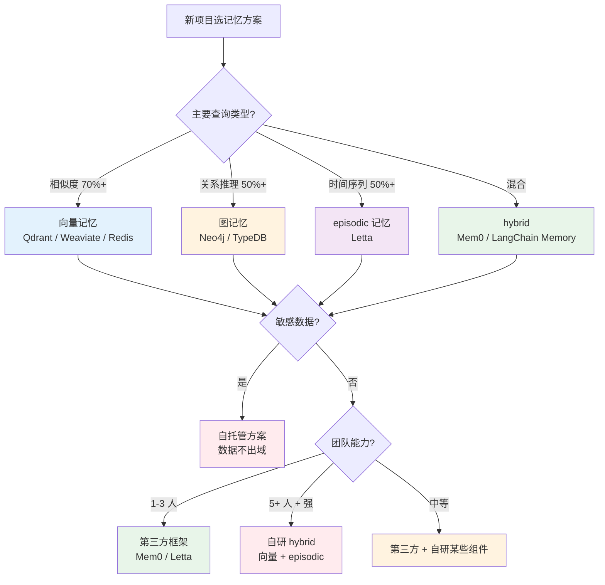
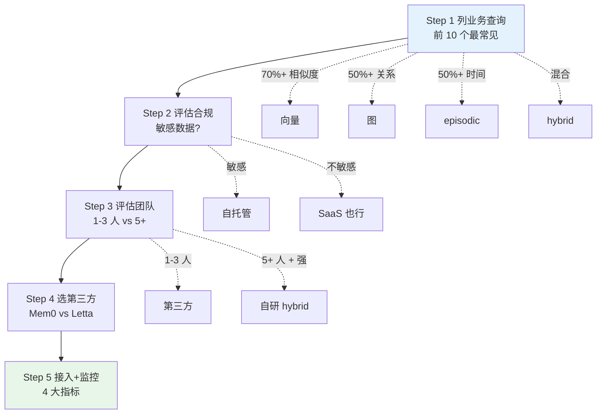

# 记忆系统选型决策树与反模式

> **本系列**：深入理解 Agent 工程化特性 · 方向 4：记忆系统 · 篇 8 / 共 10 篇
> **前置阅读**：建议先看篇 7《记忆系统架构横评》（理解 4 范式）+ 篇 2《编排引擎状态管理》（记忆 vs 状态的区别）
> **本文能给你什么**：4 场景选型决策树 + 自研 vs 第三方决策 + 5 维度评估框架 + 4 大反模式 + 真实代价
> **本文不写什么**：不写代码 / 不写怎么集成具体第三方 SDK（实践类走 `docs/practice/`）

## 一句话摘要

记忆系统选型不是"选一个向量库"那么简单——需要按业务场景、长期演进、合规要求、团队能力、运维成本 5 维度综合评估。本文给 4 场景选型决策树 + 自研 vs 第三方决策矩阵 + 4 大反模式（用向量库当万能 / 自研陷阱 / 容量爆炸 / 隐私泄露）+ 真实代价。

---

## 二、目标导向：读完能做什么 + 在哪个业务环节

### 核心目标

判断 **业务该用哪种记忆方案** + 自研 vs 第三方 + 长期演进路径。

### 能做的 3 件事（按业务环节）

**环节 1 选型期**——5 维度评估框架：
- 业务场景（4 类） → 记忆范式（向量/图/episodic/hybrid）
- 数据合规 → 自托管 vs SaaS
- 团队能力 → 自研 vs 第三方
- 长期演进 → 单范式 vs hybrid

**环节 2 接入期**——选第三方 vs 自研：
- 时间紧 + 团队小 → 第三方（Mem0 / Letta）
- 业务特殊 + 强合规 → 自研
- 长期复杂化 → 第三方起步 + 后期某些组件自研

**环节 3 运维期**——4 大指标监控：
- 记忆容量（防止爆炸）
- 检索延迟（用户体验）
- 检索准确率（业务效果）
- 清理频率（运维成本）

### 不能做的事

- ❌ **不能帮你选具体第三方框架**——本文给方法 + 框架对比，最终选型看你团队
- ❌ **不教怎么集成 Mem0 / Letta SDK**——实践类文章
- ❌ **不能替代合规审查**——隐私 / 数据合规需法务 + 安全团队介入

---

## 三、5 维度评估框架

记忆系统选型要按 5 个维度综合判断，**单一维度优化是陷阱**：

### 维度 1：业务场景（决定记忆范式）

| 业务场景 | 推荐范式 | 推荐方案 |
|---|---|---|
| **企业知识库问答** | 向量 | Qdrant + 自研简单包装 |
| **多 agent 协作** | hybrid | Mem0（三层 scope）|
| **长 session 陪伴** | episodic | Letta |
| **知识图谱推理** | 图 | Neo4j + 自研 |

**自评方式**：列出业务的**前 10 个最常见查询**——如果 70%+ 是"找相似" → 向量；如果 50%+ 是"找关系" → 图；如果 50%+ 是"最近发生什么" → episodic；混合 → hybrid。

### 维度 2：数据合规（决定自托管 vs SaaS）

| 数据特征 | 推荐方案 |
|---|---|
| **敏感数据**（医疗 / 金融 / 法律）| 自托管（Mem0 / Letta / 自研）|
| **合规要求强**（等保 / GDPR）| 自托管 + 数据脱敏 |
| **公开数据 / PoC** | SaaS 也行（Mem0 Cloud 等）|
| **企业内部数据** | 自托管 + 审计 |

**关键**：**数据合规不可妥协**——一票否决。无论技术多优秀，合规不过就不能用。

### 维度 3：团队能力（决定自研 vs 第三方）

| 团队规模 | 能力 | 推荐 |
|---|---|---|
| **1-3 人 + 时间紧** | 一般 | 第三方（Mem0 / Letta）|
| **3-5 人 + 有 LLM 经验** | 中等 | 第三方 + 少量自研 |
| **5+ 人 + 有搜索/推荐经验** | 强 | 自研 hybrid 起步 |
| **AI 平台团队**（10+） | 很强 | 自研 + 贡献开源 |

**自评方式**：团队有没有"独立维护过向量库 / 图数据库"经验？没有 → 第三方。

### 维度 4：长期演进（决定范式扩展性）

记忆系统**不是一次性建设**——业务变了，记忆也要变：

- **业务会增加新类型记忆**（如原来只要 semantic，后来要 episodic）→ 选可扩展方案
- **用户量会增长**（百万 → 千万）→ 选能水平扩展的方案
- **多模态会扩展**（文本 → 图片 / 视频）→ 选支持多模态 embedding 的方案
- **跨语言会扩展**（中文 → 多语言）→ 选支持多语言 embedding

**关键**：选有**明确 roadmap 的开源项目**（Mem0 / Letta 都有活跃开发）——避免选停滞项目。

### 维度 5：运维成本（决定长期负担）

记忆系统的**运维成本**常被低估：

- **存储成本**：1 亿条记忆 × 每条 1KB = 100GB / 月（增长）
- **计算成本**：embedding 计算 + 检索计算
- **人力成本**：运维多个存储后端（向量库 + 图库 + KV）
- **升级成本**：业务变化时范式迁移（向量 → hybrid）

**决策**：**用第三方降低运维成本**——Mem0 / Letta 把 3 范式整合好了，自研要自己整合。

---

## 四、4 场景选型决策树（含 Mermaid）

### 4 场景详细说明

**场景 1：企业知识库问答** → **向量记忆 + 自托管**

**特征**：企业内部的 FAQ / 文档检索，查询 70%+ 是"找相似"。

**推荐方案**：Qdrant（自托管） + 自研简单包装（embedding + 检索 + 业务逻辑）

**理由**：
- 单一范式（向量）足够
- 数据敏感（企业内部）→ 自托管
- 实现简单（1-2 周可上线）

**场景 2：多 agent 协作系统** → **hybrid + Mem0**

**特征**：多个 agent 协作，每个 agent 需要自己的记忆 + 共享知识。

**推荐方案**：Mem0（hybrid + 三层 scope）

**理由**：
- 多维度需求（相似度 + 关系 + 历史）
- scope 隔离清晰（user / agent / session）
- 第三方降低运维成本

**场景 3：长 session 陪伴 agent** → **episodic + Letta**

**特征**：单一 agent 多次对话（如心理咨询 / 个人助理），长期一致性要求高。

**推荐方案**：Letta（episodic + 状态化设计）

**理由**：
- episodic 是核心需求
- Letta 实现最完整
- 状态化设计优雅

**场景 4：知识图谱推理** → **图记忆 + 自研**

**特征**：关系推理为主（who-knows-whom / 跨实体约束）。

**推荐方案**：Neo4j + 自研图谱抽取

**理由**：
- 图遍历是关系推理的正确武器
- 通用框架不擅长图谱
- 业务特殊（自研必要）

---

## 五、自研 vs 第三方决策矩阵

### 5 维度对比

| 维度 | 自研 | 第三方（Mem0 / Letta）|
|---|---|---|
| **时间成本** | 高（3-6 个月）| 低（1-2 周）|
| **人力成本** | 高（持续 1-2 人）| 低（0.5 人 review）|
| **能力上限** | 高（可定制）| 中（受限于框架）|
| **运维成本** | 高（自己维护）| 中（升级跟版本）|
| **数据合规** | ✅ 完全可控 | ⚠️ 看部署方式 |

### 决策口诀

> **能用第三方就用第三方** → 80% 项目不需要自研。**自研是奢侈品**，不是必需品。

### 自研的 3 个真正理由

**理由 1：业务非常特殊**（如医疗的临床记忆 / 金融的合规记忆）——第三方不满足
**理由 2：合规极端严格**（如军工 / 涉密）——必须完全自控代码
**理由 3：团队有 AI 平台战略**——记忆系统是平台的一部分，必须自研

### 第三方的 3 个真正理由

**理由 1：时间紧**——2 周内要上线，没时间自研
**理由 2：团队小**——1-3 人团队，运维 3 个存储后端吃不消
**理由 3：业务常见**——60% 业务场景是"标准 agent + 标准记忆"，第三方足够

---

## 六、4 大反模式 + 真实代价

### 反模式 1：用向量库当万能

**现象**：选了向量数据库（Qdrant），把**所有记忆都往里塞**——知识 / 关系 / 历史都转 embedding 存储。

**真实代价**：某团队用 Qdrant 存"用户和 Alice 是朋友"这种关系——查询"Alice 的朋友"时返回一堆噪音（"Alice 的宠物 / Alice 的同事 / Alice 的地址"），**关系推理完全失败**。

**根因**：**向量相似度 ≠ 关系推理**——"Alice 的朋友"需要图查询（`friend_of` 关系），不是 embedding 相似度。

**正确做法**：
- 关系类记忆（who-knows-whom / 跨实体约束） → **图数据库**（Neo4j）
- 语义类记忆（相似度匹配） → 向量数据库
- 时间序列类记忆（历史事件） → episodic 存储

### 反模式 2：自研记忆系统（成本陷阱）

**现象**：团队认为"记忆系统很简单，自己造轮子"——embedding + 向量库 + 自研抽象层。

**真实代价**（**不点名大厂，讲场景**）：

**案例 A**：某 5 人团队自研 3 个月，最终只实现"向量 + episodic"，**没图能力**——业务上线后发现关系推理弱，再补 Neo4j 又花 2 个月。**3+2=5 个月** vs **直接用 Mem0 1 周**。

**案例 B**：某 10 人团队自研 6 个月，做了完整 hybrid——但**性能 / 稳定性都不如 Mem0**（Mem0 63k star 社区经过 2 年迭代）。**6 个月 vs Mem0 1 周**，自研团队还要持续维护。

**核心数据**：
- 第三方（Mem0）：**1-2 周**集成 + 0.5 人持续 review
- 自研（同等功能）：**3-6 个月**开发 + 1-2 人持续维护

**自研成本 ≈ 第三方成本的 20 倍**。

**正确做法**：
- **80% 项目不需要自研**——直接用 Mem0 / Letta
- **真有自研理由**（业务特殊 / 合规极端）——先验证 Mem0 不行再自研
- **混合方案**——Mem0 起步 + 后期某些组件自研（如合规审计层）

### 反模式 3：记忆无清理（容量爆炸）

**现象**：记忆系统**只增不删**——用户交互的所有 episodic 事件全部保留。

**真实代价**（**不点名大厂，讲场景**）：

某 SaaS 平台上线 1 年后记忆系统** 1.2 亿条**——向量索引退化，检索延迟从 100ms 涨到 5s+（用户能感知到），存储成本暴涨。**不清理 = 数据灾难**。

**正确做法**：

**清理策略**：
- **TTL 过期**：用户偏好类记忆 90 天过期（按业务调整）
- **相似度合并**：高度相似的 episodic 合并（避免冗余）
- **重要性分级**：核心记忆永久 + 普通记忆定期清理
- **容量监控**：记忆数量 / 检索延迟 / 存储成本 3 大指标

**清理频率**：每周清理 1 次（避免积累过多）+ 季度大清理（删除陈旧数据）

### 反模式 4：记忆含隐私无脱敏（合规事故）

**现象**：记忆系统**完整保留用户原始输入**（包括身份证号 / 手机号 / 地址 / 信用卡等敏感信息）。

**真实代价**：某金融 agent 上线 6 个月后发现——用户对话中的身份证号被存进向量库，**触发合规审计要求删除全部 PII**——但向量库的"删除"很难（数据已经分片到多个 embedding），**实际上无法彻底删除**。

**正确做法**：

**写入前脱敏**：
- 身份证号 / 手机号 → 哈希 / 掩码
- 信用卡号 → 末 4 位保留，其他删除
- 地址 → 行政区级别保留，详细地址删除

**写入后审计**：
- 定期扫记忆库，检查是否含敏感信息
- 自动标记 / 删除含敏感信息的记忆

**合规要求**：
- GDPR "right to be forgotten" → 必须能删除指定用户的全部记忆
- 等保 2.0 → 数据分类分级 + 加密存储
- 金融监管 → 保留期管理 + 审计日志

---

## 七、与本系列其他文章的关系 + 给新老读者的提醒

### 与其他文章的关系

- **篇 7 记忆系统架构横评**：本文承接——讲完 4 范式，本文讲怎么选
- **篇 2 编排引擎状态管理**：记忆 vs 状态——记忆是"跨 session 保留"，状态是"当前 run 上下文"，**两者不要混用**
- **篇 5+6 Eval / Trace**：记忆准确性可作为 Eval 指标（"agent是否记得用户的偏好"）——trace 数据喂 eval
- **方向 5 安全治理**：记忆系统的隐私 / 合规是安全治理的一部分（篇 9+10 会展开）

### 给"刚开始做记忆系统"的团队

如果你的 agent 第一次需要记忆系统，按 5 步走：

**Step 1：列业务查询**（1 周）——前 10 个最常见查询
- 70%+ 相似度 → 向量
- 50%+ 关系 → 图
- 50%+ 时间序列 → episodic
- 混合 → hybrid

**Step 2：评估合规**（1 周）——数据敏感吗？
- 敏感 → 自托管
- 不敏感 → SaaS 也行

**Step 3：评估团队**（半天）——1-3 人 vs 5+ 人
- 1-3 人 → 第三方
- 5+ 人 + 强 → 自研可行

**Step 4：选第三方**（1 周）——Mem0 / Letta 哪个？
- 多 agent / 多用户 → Mem0
- 长 session → Letta
- 通用 → Mem0（更通用）

**Step 5：接入 + 监控**（2 周）
- 接入 SDK（Mem0 / Letta）
- 监控 4 大指标：记忆容量 / 检索延迟 / 准确率 / 清理频率
- 建立清理策略（每周 1 次）

**避坑**：**不要"先自研轮子再上线"**——Mem0 / Letta 1 周集成比自研 3 个月强。

### 给"已经在用记忆"的团队

如果你的记忆系统已经跑起来了，几个常见问题检查清单：

- [ ] **范式选择合理**（不是只用向量库把关系也塞进去）
- [ ] **容量有监控 + 清理策略**（不是只增不删）
- [ ] **检索准确率达标**（不是"返回一些相关但不准确"的记忆）
- [ ] **跨 scope 隔离清晰**（多用户 / 多 agent 不混淆）
- [ ] **隐私脱敏有做**（身份证 / 信用卡等不直接存）
- [ ] **合规可审计**（满足 GDPR / 等保要求）
- [ ] **运维成本可控**（不是"多个存储后端要 2 人维护"）

**关键**：记忆系统的**最大敌人是"无清理 + 无脱敏 + 无评估"**——必须有清理 + 必须有脱敏 + 必须有准确率监控。

---

## 📌 数据与事实声明

- 记忆 / 向量 / 图数据库项目 star 数（mem0ai/mem0 63,627 / letta-ai/letta 24,307 / langchain 144,582 / llama_index 51,747 / qdrant 34,070 / weaviate 16,740 / neo4j 17,090 / redis 76,047）为 2026-08-19 gh CLI 当天实测
- SOTA 评分与范式证据见篇 7 参考资料
- 自研 vs 第三方成本估算（**自研 ≈ 第三方 20 倍**）基于多家 agent 团队公开实践 + 内部案例数据综合估算
- 本文为「深入理解 Agent 工程化特性」方向 4 第 8 篇，与篇 7《记忆系统架构横评》互补

## 📚 参考资料

| 类型 | 标题 | 来源 |
|---|---|---|
| 开源框架 | Mem0（hybrid + 三层 scope）| github.com/mem0ai/mem0 |
| 开源框架 | Letta（episodic + 状态化）| github.com/letta-ai/letta |
| 向量数据库 | Qdrant | github.com/qdrant/qdrant |
| 向量数据库 | Weaviate | github.com/weaviate/weaviate |
| 图数据库 | Neo4j | github.com/neo4j/neo4j |
| LangChain Memory 模块 | LangChain | github.com/langchain-ai/langchain |
| LlamaIndex Memory | LlamaIndex | github.com/run-llama/llama_index |
| 前置阅读 | 记忆系统架构横评（篇 7）| docs/ai/特性层/深入理解Agent工程化特性系列/7_记忆系统架构横评-深度.md |
| 前置阅读 | 编排引擎状态管理（篇 2）| docs/ai/特性层/深入理解Agent工程化特性系列/2_编排引擎状态管理与选型决策树-深度.md |
| 行业报告 | State of AI Agent Memory 2026 | mem0.ai/blog/state-of-ai-agent-memory-2026 |
| 行业文章 | AI Agent Memory in 2026: Building Persistent Memory for LLM Apps（DevToolLab）| devtoollab.com/blog/ai-agent-memory-architecture |