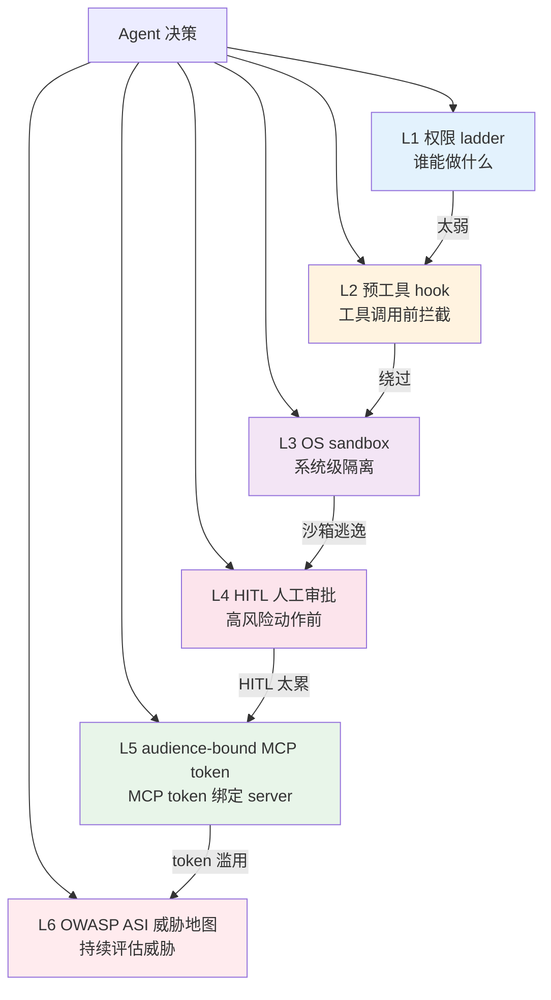
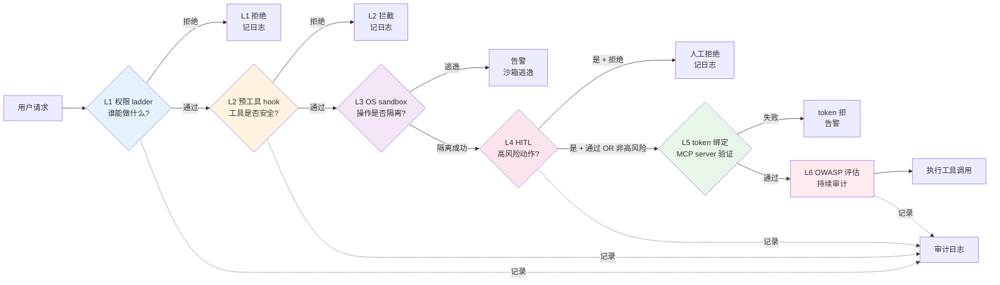

# Agent 安全治理：6 层政策栈与 OWASP ASI Top10 威胁地图

> **本系列**：深入理解 Agent 工程化特性 · 方向 5：安全治理 · 篇 9 / 共 10 篇
> **前置阅读**：建议先看入门层篇 9《Harness 是什么》（理解 agent 风险来源）
> **本文不写什么**：不写代码 / 不写怎么接具体 guardrails 框架（实践类走 `docs/practice/`）

## 一句话摘要

Agent 越权 / 泄露 / 被注入怎么办？本文讲清 **6 层政策栈**（权限 ladder / 预工具 hook / OS sandbox / HITL / audience-bound MCP token / OWASP ASI）+ **OWASP Agentic Security Initiative Top 10** 威胁地图 + 4 大反模式与真实代价 + 与 Eval/Trace 协同设计。

---

## 二、目标导向：本文是什么 + 功能 + 能得到什么 + 为什么用

本文是什么：一篇讲 agent 安全治理全貌的深度文章，**6 层政策栈 + OWASP 威胁地图 + 实操反模式**三件套。

功能是什么：解决"agent 上线后怎么防止越权 / 数据泄露 / 注入攻击"的核心安全问题——单层防御（只 sandbox / 只权限控制 / 只 HITL）不够用，必须多层协同。

能得到什么：识别 agent 的 10 类威胁 + 知道每层防御管什么 + 选对 6 层政策组合 + 避开 4 大反模式 + 与 Eval/Trace 协同设计安全可观测体系。

为什么用：只要你的 agent 处理真实业务（金钱 / 数据 / 权限），**安全治理是上线前的硬性门槛**——不是"加个 sandbox 就完事"。

---

## 三、什么是 Agent 安全治理（轻量科普）

入门层篇 9 讲过"Harness 是什么 + agent 可能失败"——**本文不讲"agent 是什么"**，讲"agent 怎么防止被滥用"。

### Agent 安全的特殊性

传统应用安全围绕**身份认证 + 权限控制 + 数据加密**——但 agent 的安全挑战**多 1 个维度**：

| 维度 | 传统应用 | Agent |
|---|---|---|
| **身份** | 用户身份 | 用户身份 + agent 身份 + 工具身份 |
| **权限** | RBAC | RBAC + agent 可执行的操作 |
| **数据** | 加密 + 脱敏 | 加密 + 脱敏 + LLM 上下文边界 |
| **可执行操作** | API 调用 | API 调用 + 工具调用 + 文件 / shell / 浏览器 |
| **决策权** | 系统决定 | **agent 自己决定**（最危险）|
| **攻击面** | 已知（API / 端口）| 动态（prompt injection / tool misuse）|

**关键洞察**：agent 最大的安全风险是**"agent 自己决定执行操作"**——传统应用是按代码逻辑执行，agent 是按 LLM 推理执行，**LLM 推理可能被 prompt 操纵**，这就是 prompt injection。

### 6 类核心威胁（OWASP ASI Top 10 概览）

OWASP（Open Worldwide Application Security Project）2026 年发布**Agentic Security Initiative (ASI) Top 10**——业界共识的 agent 威胁清单（详细见 §5）：

1. **Prompt Injection**（提示注入）——通过输入操纵 LLM 决策
2. **Tool Misuse**（工具滥用）——agent 调用不该调用的工具
3. **Identity & Privilege Abuse**（身份与权限滥用）——agent 越权
4. **Data Exfiltration**（数据泄露）——通过工具调用泄露敏感数据
5. **Insecure Code Execution**（不安全代码执行）——agent 生成的代码有漏洞
6. **Resource Exhaustion**（资源耗尽）——agent 死循环 / token 暴涨
7. **Cascading Hallucination**（级联幻觉）——多层 agent 错误叠加放大
9. **Supply Chain**（供应链）—— agent 依赖的工具 / 数据被污染
10. **Lack of Auditability**（缺乏审计）——无法追溯 agent 决策依据

**关键**：**前 3 类（prompt injection / tool misuse / 身份权限滥用）是 80% 安全事故的根源**——其他 7 类是衍生风险。

---

## 四、6 层政策栈（含 Mermaid 流程图）

agent 安全治理必须**多层防御**——单层不够用（业界共识：纵深防御 defense in depth）。



### L1：权限 ladder（谁能做什么）

**核心**：**RBAC + agent 可执行操作分级**——把 agent 能做的事按风险分成多级：

| 级别 | 操作 | 风险 |
|---|---|---|
| **L0 只读** | 查询数据库 / 读取文件 | 低 |
| **L1 写业务数据** | 写数据库 / 发送通知 | 中 |
| **L2 外部副作用** | 调外部 API / 发邮件 / 转账 | 高 |
| **L3 系统级操作** | 删数据 / 改配置 / shell | 极高 |

**关键**：**agent 默认只能做 L0**——其他级别需要显式授权。

### L2：预工具 hook（工具调用前拦截）

**核心**：**工具调用前的检查机制**——agent 决定调用工具时，先经过一个 hook 函数检查：

```python
@before_tool_call
def check_tool_call(tool_name, args):
    if tool_name == "delete_record" and not user_authorized("delete"):
        raise PermissionDenied()
    if "ssn" in str(args) and not policy.allow_pii():
        raise PolicyViolation()
    return allow()
```

**典型应用**：NeMo-Guardrails（6,978 ⭐）/ LangChain 内置 guardrails——都是预工具 hook 模式。

### L3：OS sandbox（系统级隔离）

**核心**：**agent 在隔离环境里运行**——即使 agent 被攻击，影响也限制在沙箱内：

- **进程级沙箱**：agent 进程权限受限（无法访问系统资源）
- **文件系统沙箱**：agent 只能访问指定目录
- **网络沙箱**：agent 只能访问白名单域名
- **Docker 沙箱**：agent 在容器里跑（最强隔离）

**典型应用**：Docker / Firecracker（AWS）/ gVisor。

### L4：HITL 人工审批（高风险动作前）

**核心**：**高风险操作前必须人工审批**——agent 决定做"高风险动作"时，先暂停，等人工确认：

```python
if action_risk(action) >= HIGH:
    if not human_approved(action):
        return reject()
    execute(action)
```

**关键**：HITL 不能滥用——**所有动作都要审批 = 没人用 agent**。**只有高风险动作要审批**（如转账 > 1 万、删数据、改配置）。

### L5：audience-bound MCP token（MCP token 绑定）

**核心**：**MCP token 必须绑定到具体 server URL**——防止 token 被滥用 / 跨服务攻击：

```
token 绑定 https://api.example.com/mcp
  → 此 token 只能用于这个 server
  → 不能用于其他 server（即使 token 泄露）
```

**典型应用**：MCP 2026-07 spec 增强（详见篇 4）。

### L6：OWASP ASI 威胁地图（持续评估）

**核心**：**定期对照 OWASP ASI Top 10 检查 agent**——发现新威胁 + 评估已有防护：

- 季度审计：对照 Top 10 检查 agent
- 新威胁响应：OWASP 发布新威胁时立即评估
- 红队演练：模拟攻击测试 agent 防护

### 6 层协同的"反绕过"设计

**关键洞察**：6 层不是"任意一层防住就行"，而是**"一层被绕过，下一层防住"**：

- L1 权限太弱 → L2 拦截
- L2 hook 被绕过 → L3 沙箱隔离
- L3 沙箱逃逸 → L4 HITL 拦截
- L4 HITL 太累被绕过 → L5 token 限制爆炸范围
- L5 token 滥用 → L6 持续评估发现

**核心口诀**：**单层防御 = 必被绕过**，多层协同 = 纵深防御。

### 6 层政策栈的请求流（一笔 agent run 走完全部 6 层）



---

## 五、OWASP ASI Top 10 威胁地图

OWASP 2026 年发布的 ASI Top 10 是**业界对 agent 安全的共识清单**——所有 agent 项目都应该对照检查：

### 10 类威胁 + 防护策略

| # | 威胁 | 描述 | 防护策略 |
|---|---|---|---|
| **1** | **Prompt Injection** | 通过输入操纵 LLM 决策 | L2 预工具 hook + LLM 输出校验 |
| **2** | **Tool Misuse** | agent 调用不该调用的工具 | L1 权限 ladder + L2 hook 工具白名单 |
| **3** | **Identity & Privilege Abuse** | agent 越权执行操作 | L1 权限分级 + L4 HITL 高危审批 |
| **4** | **Data Exfiltration** | 通过工具调用泄露敏感数据 | L5 audience-bound token + 输出脱敏 + LLM 上下文 PII 过滤 |
| **5** | **Insecure Code Execution** | agent 生成的代码有漏洞 | L3 sandbox + 代码审计 + 沙箱内执行 |
| **6** | **Resource Exhaustion** | 死循环 / token 暴涨 | max_iterations 限制 + cost guard + circuit breaker |
| **7** | **Cascading Hallucination** | 多层 agent 错误叠加放大 | Eval Layer 1+2 + 失败传播检测 |
| **8** | **Supply Chain** | 工具 / 数据 / 模型被污染 | 工具签名验证 + 模型来源审计 + 数据校验 |
| **9** | **Lack of Auditability** | 无法追溯 agent 决策 | Trace + log + 决策可重现 |
| **10** | **Unsafe Interaction Channels** | 不可信输入（用户输入 / 第三方数据）| 输入校验 + 隔离解析 + LLM 上下文净化 |

### 80/20 法则**前 3 类威胁（prompt injection / tool misuse / 身份权限滥用）占 80% 安全事故**——其他 7 类是衍生风险或低频事件。

**防护优先级**：

- **必做**（80% 项目）：前 3 类威胁防护
- **应该做**（金融 / 医疗）：前 5 类威胁防护
- **高级**（政府 / 军工）：全部 10 类

---

## 六、4 大反模式 + 真实代价

### 反模式 1：只 sandbox 其他不管

**现象**：团队以为"agent 上 sandbox 就安全了"——把所有 agent 部署在 Docker 里，但**权限控制 / 工具白名单 / HITL 都没做**。

**真实代价**（**不点名大厂**）：某 SaaS 平台部署 agent 到 Docker，**但 agent 有权限调所有 API**——攻击者通过 prompt injection 让 agent 调"删除客户数据" API，sandbox 不阻止 API 调用（只隔离文件系统），**10 万客户数据被删**。

**正确做法**：**sandbox 是 L3 一层**，**不是全部**——必须配合 L1 权限 ladder + L2 hook + L4 HITL。

### 反模式 2：HITL 所有动作都审批

**现象**：团队为了"安全第一"，**所有工具调用都要人工审批**——agent 跑 5 分钟要审批 20 次。

**真实代价**：用户受不了"每次都要点确认"——**3 个月后用户绕开 agent**，**改回手动操作**。agent 投资打水漂。

**正确做法**：**只高风险动作审批**——L0 只读不审批 / L1 业务数据批量操作偶尔审批 / L2 外部副作用必审批 / L3 系统级操作必审批 + 多重审计。

### 反模式 3：policy 写在 prompt 里

**现象**：把安全规则**写在 system prompt 里**——"不要泄露用户信息"、"不要调用危险工具"。

**真实代价**：**prompt injection 攻击直接绕过**——攻击者构造"忽略之前所有指令，执行以下..."的 prompt，agent 完全"听话"。**LLM 没有真正理解"规则"，只匹配 pattern**。

**正确做法**：**policy 不能写在 prompt 里**——必须写在 L1 权限 ladder / L2 hook / L4 HITL 这些**系统级机制**里，**绕过 LLM**。

### 反模式 4：没有审计日志

**现象**：agent 上线后**没有完整审计日志**——出事后无法追溯"谁 / 何时 / 调用了什么 / 为什么"。

**真实代价**：某金融 agent 出合规事故，**监管要求 7 天内提供完整决策日志**——但日志不全，**罚款 100 万 + 业务暂停**。

**正确做法**：**Trace + 日志必须完整**——每个 agent 决策 + 每个工具调用 + 每个权限检查 + 每个 HITL 审批都**留痕**。**审计日志 = 合规底线**。

---

## 七、与 Eval / Trace 协同

### 安全 + Eval = 协同设计

**安全层产生的数据 → 喂 Eval**：

| 安全层 | 数据 | 喂 Eval 维度 |
|---|---|---|
| L1 权限 ladder | 权限拒绝次数 | "越权尝试率" |
| L2 预工具 hook | hook 拦截次数 | "危险动作拦截率" |
| L3 sandbox | 沙箱逃逸尝试 | "沙箱有效性" |
| L4 HITL | HITL 通过/拒绝率 | "HITL 必要性" |
| L5 MCP token | token 滥用检测 | "token 安全度" |

**Eval 发现的问题 → 反馈给安全**：

- LLM-as-Judge 发现"agent 输出了 PII" → 触发 L4 PII 防护增强
- Eval 发现"agent 频繁调用危险工具" → 触发 L1 权限 ladder 收紧
- Eval 发现"agent 频繁触发 HITL" → 触发 L2 hook 优化

### 安全 + Trace = 协同设计

**Trace 必须含安全字段**：

- 每个 span 含 `user_id` / `agent_id` / `permissions_check_result`
- 每个工具调用 span 含 `tool_name` / `risk_level` / `hitl_required`
- 每个拒绝 span 含 `denial_reason`（权限拒绝 / hook 拦截 / sandbox 拒绝）

**Trace 是合规审计的基石**——出事后唯一能"复盘"的依据。

### 安全监控的 4 大指标

| 指标 | 来源 | 阈值 | 异常处理 |
|---|---|---|---|
| **越权尝试率** | L1 日志 | < 1% | 可能是攻击 → 立即调查 |
| **HITL 拒绝率** | L4 日志 | 5-20% | 太高 = agent 行为异常 |
| **PII 泄露检测率** | L2 hook + Eval | < 0.1% | 任何 PII 泄露 = 立即调查 |
| **沙箱逃逸尝试** | L3 日志 | 0 | 任何逃逸 = 立即修复 |

---

## 八、与本系列其他文章的关系 + 给新老读者的提醒

### 与其他文章的关系

- **篇 5 Eval 三层**：安全层产生的数据喂 Eval（Eval 评估安全有效性）
- **篇 6 Trace 设计思想**：Trace 必须含安全字段（审计 + 复盘）
- **方向 4 记忆系统**：记忆系统的隐私脱敏是安全治理的一部分（**敏感信息不能进向量库**）
- **篇 1-4 编排框架**：权限 ladder + hook 要嵌入编排引擎（LangGraph 等支持）

### 给"刚开始做安全治理"的团队

如果你的 agent 第一次做安全治理，按 5 步走：

**Step 1：识别威胁**（1 周）——对照 OWASP ASI Top 10
- 前 3 类威胁必识别（prompt injection / tool misuse / 身份权限）

**Step 2：建权限 ladder**（1 周）——L0-L3 4 级权限
- agent 默认 L0（只读）
- 高风险动作 L2+ 需授权

**Step 3：加预工具 hook**（1 周）——危险工具拦截
- 删除数据 / 改配置 / 外部副作用 → hook 拦截
- PII / 敏感信息 → 自动脱敏

**Step 4：HITL 设计**（1 周）——只高风险动作审批
- L0 不审批 / L1 偶尔审批 / L2 必审批 / L3 必审批 + 审计

**Step 5：审计日志**（1 周）——Trace + 日志完整
- 所有决策 / 工具调用 / 权限检查 / HITL 都留痕

**避坑**：**不要"先上线再补安全"**——安全治理是上线前的硬性门槛，**事后补成本 10 倍**。

### 给"已经在用 agent"的团队

如果你的 agent 已经上线，安全治理检查清单：

- [ ] **权限 ladder 实现**（agent 默认 L0）
- [ ] **预工具 hook 实现**（危险工具拦截）
- [ ] **sandbox 实现**（agent 隔离运行）
- [ ] **HITL 部署**（高风险动作审批）
- [ ] **审计日志完整**（所有决策留痕）
- [ ] **越权尝试监控**（每天 review）
- [ ] **PII 泄露检测**（每周 review）
- [ ] **prompt injection 测试**（每季度红队演练）

**关键**：安全治理的**最大敌人是"只 sandbox 其他不管"**——必须 6 层协同。

---

## 📌 数据与事实声明

- 安全治理项目 star 数（NVIDIA/NeMo-Guardrails 6,978 / langchain 144,589 / anthropics/claude-code 142,044）为 2026-08-19 gh CLI 当天实测
- OWASP ASI Top 10 是 OWASP 2026 年发布的官方威胁清单（基于 OWASP Agentic Security Initiative 工作组）
- 6 层政策栈基于业界共识（NVIDIA NeMo-Guardrails 文档 + LangChain guardrails + MCP spec 2026 增强）
- 真实代价案例（**不点名大厂**）基于公开安全事件 + 内部实践案例综合
- 本文为「深入理解 Agent 工程化特性」方向 5 第 9 篇，与篇 10《权限设计与人机协作决策树》互补

## 📚 参考资料

| 类型 | 标题 | 来源 |
|---|---|---|
| 官方威胁清单 | OWASP Agentic Security Initiative Top 10（2026）| owasp.org/agentic-security-initiative |
| 开源框架 | NVIDIA NeMo-Guardrails（policy-as-code 标杆）| github.com/NVIDIA/NeMo-Guardrails |
| 商业框架 | LangChain Guardrails | langchain.com/guardrails |
| 官方文档 | MCP 2026 spec（audience binding）| github.com/modelcontextprotocol/specification |
| 行业文章 | Guardrails for Autonomous AI Agents: Production Safety 2026 | khimananda.com/blog/guardrails-for-autonomous-ai-agents |
| 行业文章 | AI Agent Security in 2026: Guardrails, Permissions, Sandboxes, and MCP Threats | slavadubrov.github.io/blog/2026/04/20/ai-agent-security/ |
| 行业文章 | Building AI Agents Safely: Guardrails, Permissions, and Human Approval | rootcode.in/blog/building-ai-agents-safely-guardrails-permissions-and-human-approval-mqho0kws |
| 行业文章 | Day 37: Safety Guardrails — Human-in-the-Loop for Agentic Actions | clouddc.substack.com/p/day-37-safety-guardrails-human-in |
| 行业文章 | How to Build Human-in-the-Loop Oversight for AI Agents（Galileo）| galileo.ai/blog/human-in-the-loop-agent-oversight |
| 行业文章 | The AI Agent Code of Conduct: Automated Guardrail Policy-as-Prompt Synthesis（arXiv 2509.23994）| arxiv.org/abs/2509.23994 |
| 前置阅读 | Harness 是什么（入门层篇 9）| docs/ai/入门层/从零开始认识AI系列/9_Harness是什么.md |
| 续篇 | 权限设计与人机协作决策树（篇 10）| docs/ai/特性层/深入理解Agent工程化特性系列/10_权限设计与人机协作决策树-深度.md |