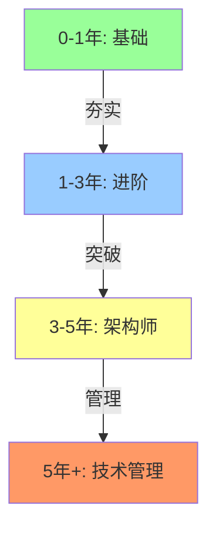

# 后端路线

> 后端工程师技术路线图：从 0 到 5 年的成长路径。

## 文章

### 已建

| 篇目 | 内容 |
|---|---|
| [1_3-to-5-year](./1_3-to-5-year) | 3-5 年成长路径 |

### 待建方向

| 方向 | 内容 |
|---|---|
| 0-1 年 | 基础夯实（Java/MySQL/Redis/框架） |
| 1-3 年 | 进阶突破（并发/架构/中间件） |
| 3-5 年 | 架构师路线（分布式/高可用/团队） |
| 5 年+ | 技术管理/CTO 路线 |

## 说明

后端工程师的技术成长路径——从初级到架构师到技术管理者。

## 路线图

## 开放问题

1. 什么时候该从开发转架构？
2. 技术深度 vs 广度怎么选？
3. 管理岗 vs 技术岗怎么选？
