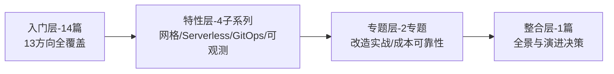

# 从零开始认识云原生系列导读 · 范式迁移的全景地图

> 本系列 14 篇（0 导读 + 13 正文），按云原生版图 13 个方向全覆盖：理念、容器、K8s 心智、不可变、网格、Serverless、可观测、存储、安全、多租户、FinOps、多云、演进路线。每篇四层结构：理论 → 实践 → 生产 → 主流。

## 一、为什么需要这套系列

「上云」不等于「云原生」——把虚拟机里的应用原样搬进容器，得到的是「更慢的虚拟机」。云原生是一套**利用云平台弹性和分布式优势的架构范式**：容器化封装、声明式 API、不可变基础设施、微服务与网格、按需弹性。这套范式的每一环都在对抗传统运维的某个痛点，系列主线就是把这些「对抗关系」讲清楚。

## 二、全局心智模型

```mermaid
flowchart TD
    CN[云原生五大理念] --> I1[容器化封装: 交付单位革命]
    CN --> I2[声明式 API: 描述终态而非步骤]
    CN --> I3[不可变基础设施: 改即新建]
    CN --> I4[微服务与网格: 服务间治理下沉]
    CN --> I5[弹性与按需: 从容量规划到自动伸缩]
    I1 & I2 & I3 & I4 & I5 --> L[分层版图:<br/>运行时(容器/存储) - 编排(K8s) - 网格 - Serverless - 可观测 - 安全 - FinOps]
```

三个要点：

1. **五大理念互为前提**：不可变依赖容器化，弹性依赖声明式，网格依赖微服务——拆开单用任何一环都拿不到全收益。
2. **版图分层**：底层是运行时与编排（容器/K8s），中层是治理（网格/可观测/安全），上层是商业模式（Serverless/FinOps/多云）——本系列 13 篇按这个版图逐一落位。
3. **K8s 不是云原生的全部**：它是编排层的执行器；理念与分层视角（本系列）比组件细节（K8s 生态系列）更长寿。

## 三、系列导航表（14 篇）

| # | 篇目 | 一句话定位 |
|---|---|---|
| 0 | 系列导读 | 范式迁移全景 |
| 1 | [云原生是什么](./1_云原生是什么-范式迁移-入门.md) | 五大理念与范式迁移的动因 |
| 2 | [容器化基石](./2_容器化基石-镜像与运行时-入门.md) | 镜像分层/运行时标准/交付单位革命 |
| 3 | [Kubernetes 心智模型](./3_Kubernetes心智模型-声明式与控制循环-入门.md) | 声明式 API 与控制循环两大机制 |
| 4 | [不可变基础设施](./4_不可变基础设施与声明式配置-入门.md) | 改即新建 与配置漂移治理 |
| 5 | [服务网格](./5_服务网格-Sidecar与东西向治理-入门.md) | Sidecar 模式与东西向流量 |
| 6 | [Serverless 与 FaaS](./6_Serverless与FaaS-从常驻到按需-入门.md) | 计费/并发/冷启动的范式切换 |
| 7 | [云原生可观测](./7_云原生可观测-三大支柱与OpenTelemetry-入门.md) | Metrics/Logs/Traces 与 OTel |
| 8 | [云原生存储](./8_云原生存储-有状态应用的持久化-入门.md) | PV/PVC/CSI 与有状态上云 |
| 9 | [云原生安全](./9_云原生安全-零信任与供应链-入门.md) | 零信任/供应链/运行时安全 |
| 10 | [多租户与资源隔离](./10_多租户与资源隔离-入门.md) | 命名空间/配额/隔离强度谱系 |
| 11 | [FinOps 云成本治理](./11_FinOps云成本治理-入门.md) | 可见性/优化/运营闭环 |
| 12 | [多云与混合云架构](./12_多云与混合云架构-入门.md) | 分布/迁移/防锁定 |
| 13 | [云原生演进路线](./13_云原生演进路线-迁移策略与反模式-入门.md) | 迁移策略与反模式收官 |

## 四、怎么读

- **新手**：0-13 顺序读，每天 2-3 篇
- **上云实践者**：4（不可变）+ 5（网格）+ 6（Serverless）+ 8（存储）按用到的方向挑
- **架构决策者**：11（FinOps）+ 12（多云）+ 13（演进）——决策视角三篇

## 阅读的前置与去向

- 前置：容器与 K8s 的操作细节归本仓库 devops 域（kubernetes/docker 系列）——本系列讲「为什么与何时」
- 去向：微服务治理细节归 service-governance 子域；数据产品归 data/middleware 域

---



---

## 📌 数据与事实声明

本文的五大理念与版图划分源自 CNCF 官方定义（github.com/cncf/toc）与公开技术文献的机制级归纳；阅读节奏建议为教学归纳。以 CNCF 官方资料为准。

## 📚 参考资料

| 类型 | 标题 | 来源 |
|---|---|---|
| 定义 | CNCF Cloud Native Definition v1.0 | github.com/cncf/toc |
| 图书 | Cloud Native Patterns | Manning（2018） |
| 系列文章 | K8s 生态系列 / Docker 系列 | 本仓库 devops/ |

**Trade-off 量级分档**：10w 请求以下传统部署可能更经济；百万日活开始弹性与交付收益显性化；亿级则五大理念缺一即瓶颈。

---
