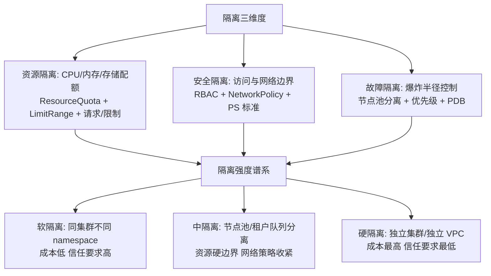
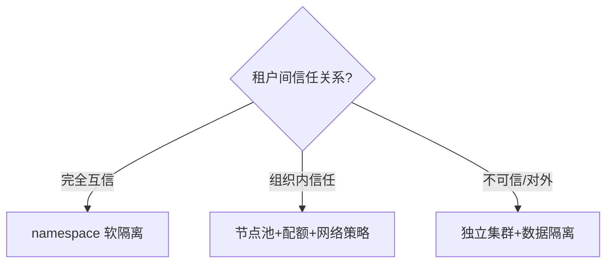

# 多租户与资源隔离

> **一句话摘要**：多租户 = 多个「租户」（团队/客户/业务）**共享同一平台且互不干扰**——隔离的维度有三：资源隔离（谁也不能吃光）、安全隔离（谁也不能越界）、故障隔离（谁的故障不扩散）；K8s 的命名空间/配额/策略是「软隔离」，虚拟机/独立集群是「硬隔离」——隔离强度是成本与信任的单调函数，选型按租户间的信任关系定价。

> **本文核心**：机制链 = **共享的价值（成本/效率/统一治理）与共享的风险（吵闹邻居/越权/故障扩散）→ 隔离三维度（资源/安全/故障）→ 隔离强度谱系（命名空间软隔离 → 节点池 → 独立集群硬隔离）→ 配套机制（配额/NetworkPolicy/限流/计费标签）→ 模型选择（按租户信任关系定强度）**——「吵闹邻居」（Noisy Neighbor）是多租户的头号故障形态。

前置阅读：[Kubernetes 心智模型](./3_Kubernetes心智模型-声明式与控制循环-入门.md)、[云原生安全](./9_云原生安全-零信任与供应链-入门.md)。

## 1. 背景：共享与隔离的永恒矛盾

平台化的经济动机是共享：一个 K8s 平台服务全部团队（成本摊薄、治理统一）。但共享立刻暴露三个问题：**吵闹邻居**（一个团队的任务吃光 CPU/内存，其他团队变慢）、**越权风险**（A 团队看到或操作 B 的资源）、**故障扩散**（A 的事故拖垮全平台）。多租户架构的全部内容就是**在这三风险与共享收益之间设计隔离谱系**——隔离越硬越安全但越贵，越软越便宜但风险越大。

## 2. 核心机制：隔离三维度与强度谱系

- **资源隔离的 K8s 三件套**：**ResourceQuota**（namespace 总配额：CPU/内存/对象数量上限）、**LimitRange**（单 Pod/容器默认与上下限）、**请求/限制**（每个 Pod 的资源声明）——三层叠加让「总量封顶 + 单体约束」同时成立；再配合节点池分离（不同租户调度到不同节点组），资源吵闹邻居被结构性排除。
- **安全隔离的三层**：RBAC 按 namespace 授权（A 团队的角色看不到 B 的 ns）+ NetworkPolicy 默认拒绝（ns 间网络不通，按需开白）+ Pod 安全标准（租户无法运行特权容器危害宿主与邻居）。
- **故障隔离的手段**：**优先级与抢占**（PRIORITY：核心业务优先级高，资源紧张时抢占低优先级）、**PDB**（PodDisruptionBudget：保底副本数，节点维护不砸垮租户）、**节点池/独立集群**（物理级爆炸半径收敛）——故障隔离是「爆炸半径」的设计学。
- **模型选择：信任关系定强度**：① **同团队多项目**（完全信任）→ namespace 软隔离；② **同公司不同团队**（组织信任）→ namespace + 节点池 + 配额硬约束；③ **对外部客户**（零信任/SaaS）→ 强隔离（独立集群/独立数据层——SaaS 的租户模型是独立架构题，见多云篇的关联）。

## 3. 落地实践：多租户平台的治理纪律

1. **租户=namespace 的标准模板**：新租户开通即生成标准模板（ns + 配额 + NetworkPolicy + RBAC 角色 + 资源标签）——平台工程团队交付「租户开通自动化」，避免手工建配置的漂移。
2. **配额按容量评审授予**：配额不是「先随便给」——按租户的容量评审（业务预估）授予，扩容走变更流程（防止配额成为内存泄漏的挡箭牌）。
3. **计费/成本可见性先行**：每个租户的资源消耗可归集（资源标签 + 计量）——「谁用了多少」不可见，配额治理就无依据（FinOps 篇的可见性原则在租户层的落地）。
4. **平台 SLA 分级**：不同隔离等级承诺不同 SLA（软隔离无强承诺、节点池承诺资源、独立集群承诺独占）——SLA 与隔离强度一起卖。
5. **平台自身的治理**：平台组件（控制面/监控/CI）自身是「第 0 号租户」——它的高可用与隔离要优先于所有业务租户。

## 4. 生产视角：多租户的事故形态

- **配额缺失的集群级挤兑**：某租户的失控任务把集群资源吃光——全平台变慢。整改：全 ns 配额 + LimitRange 全覆盖 + 超配告警。
- **命名空间 RBAC 配错的越权**：角色绑定到 cluster-admin（图省事）——租户获得了全集群权限（安全篇的过度权限在租户域的形态）。整改：角色模板化 + 权限审计常态化。
- **节点池的隐性共享**：号称「租户专属节点池」，但 daemonset/平台组件仍全节点运行——「专属」是相对的；平台组件的干扰要单独度量与承诺。
- **无计费标签的成本黑洞**：租户资源没有统一标签——成本无法归集，FinOps 无从谈起（FinOps 篇的标签纪律在租户层的刚需形态）。
- **租户开通无治理的配置漂移**：每个租户手工建配置（各不相同）——租户治理的漂移。开通自动化模板 + 定期配置审计归零此类问题。

## 5. 主流系统怎么做：多租户的生态工具

| 层 | 主流工具 | 机制要点 |
|---|---|---|
| 命名空间治理 | K8s ns + ResourceQuota/LimitRange | 软隔离标配 |
| 策略治理 | Kyverno/OPA（租户策略模板化） | 租户策略即代码 |
| 节点隔离 | 节点池/taints+tolerations | 中硬隔离 |
| 集群隔离 | 多集群管理（Cluster API 类） | 硬隔离 |
| vCluster | 虚拟集群（ns 里跑虚拟 K8s） | 中间形态：ns 成本 + 集群体验 |
| 平台工程 | Backport/内部平台门户 | 租户自助开通与配额申请的门户化 |

规律：**多租户的工具演进是「从手工配置到平台工程」**——租户自助 + 策略模板化是平台工程的成熟标志。

## 6. 典型场景

- **企业内部平台**（团队级）：多团队共享 K8s——namespace 软隔离 + 节点池中隔离的混合。
- **SaaS 平台**（对外级）：外部客户租户——强隔离（独立集群或独立数据层）+ 计费与 SLA 制度化。
- **AI 训练平台**（GPU 级）：GPU 资源昂贵且稀缺——配额 + 优先级 + 队列调度是核心（GPU 多租户的隔离难度与价值最高）。

## 7. 与相邻概念的区别

- **多租户 vs 多实例**：多租户共享基础设施分租户使用；多实例是每个租户独立部署一套——共享（成本低/隔离弱）vs 独立（隔离强/成本高），SaaS 的租户建模经典二选一。
- **软隔离 vs 硬隔离**：namespace（共享内核与节点）vs 节点池/集群（独立资源域）——信任关系决定，不是技术偏好。
- **多租户 vs 单租户托管**：多租户共享服务（成本效率）；单租户托管（每客户独立服务——合规与隔离优先）——金融等行业合规要求单租户托管。
- **本篇 vs FinOps 篇**：多租户管「隔离与配额」；FinOps 管「成本可见与优化」——配额是治理，计量是依据，两者共享「标签归集」的数据基础。

## 8. 常见误区与不适用

- **「namespace 建了就是隔离了」**：ns 只是「分组」——配额/RBAC/NetworkPolicy 三件套不配，ns 就是目录不是隔离。
- **「配额是限制团队」的误解**：配额是「保护所有人」——无配额的平台是「先到的吃光」的丛林；配额的沟通要按「保护」叙事。
- **「软隔离省钱所以全部软隔离」**：软隔离的信任前提是「租户间完全互信」——外部客户/不可信代码用软隔离是安全事故预备役。
- **「多租户平台建好就一劳永逸」**：租户治理是持续运营——配额复审/策略更新/成本归集/合规检查都是常态化动作。
- **不适用**：完全互信的单团队（无需租户化）；对隔离有硬性合规要求的外部客户（直接独立集群/独立环境）；无平台团队的原始运维模式（先建平台能力再谈租户）。

## 9. 你们可能会问

- **一个集群能承载多少租户？** 技术上限高（万级 ns），但**运维上限**才是真瓶颈——策略数量/事件量/审计量随租户线性增长；行业经验在「数百 ns/集群」量级就要开始评估集群分片。
- **吵闹邻居在软隔离下怎么根治？** 软隔离的资源约束（配额+请求/限制）只能「缓解」不能「根治」——根治只有节点池/独立集群的硬边界；缓解与根治按租户信任关系选择。
- **租户开通自动化的最小形态？** 一个模板化脚本/流水线：生成 ns + 配额 + 策略 + 角色绑定 + 标签——半天工作量，收益是租户治理的一致性起点。
- **GPU 多租户的隔离有什么特殊？** GPU 是稀缺且不可分片（或仅 MIG 可切）资源——配额+优先级+队列（调度器）的组合，且「占用时长计量」是计费刚需（FinOps 的 GPU 章）。
- **怎么向租户解释配额与 SLA？** 一张表：隔离等级 → 配额上限 → SLA 承诺 → 计费标准——租户选隔离等级就像选机票舱位，明码标价。

## 10. 一句话总结 + 5W 速记卡 + 自测三问

**🎯 核心带走**：

- **核心一句话**：多租户 = 共享平台的隔离设计学——资源/安全/故障三维度 × 软/中/硬强度谱系，隔离强度按租户信任关系定价；配额/策略/计费标签三件套是多租户的治理地基。

**5W 速记卡**：

| 维度 | 内容 |
|---|---|
| What | 三维度隔离 + 强度谱系 + 配额三件套 + 租户模板 |
| Why | 共享收益与吵闹邻居/越权/扩散的风险要成对治理 |
| When | 平台化建设、新租户开通、租户事故排查、SaaS 建模 |
| Where | K8s namespace/节点池/集群三级 |
| How | 信任关系定强度 → 模板化开通 → 配额硬约束 → 计费可见 |

💡 **实战提示**：租户开通自动化；配额按容量评审；计费标签先行；RBAC 禁 cluster-admin；GPU 租户加队列计量。

**开放问题**：AI 平台的 GPU 多租户正在催生「算力即服务」的新隔离需求（MIG/时间片/抢占式队列）——GPU 时代的多租户会不会反哺通用 K8s 多租户的设计？

**决策（何时用）**：平台化团队/对外 SaaS/共享 GPU 全场景适用；推荐「租户开通模板 + 计费标签 + SLA 分级表」作为多租户平台的最小交付物。

**Trade-off（代价与反方案）**：软隔离用「信任与缓解成本」换「共享效率」；硬隔离用「成本」换「爆炸半径与合规」；配额用「申请流程」换「公平与保护」；多租户 vs 多实例的整体权衡：平台效率 vs 租户自主——信任关系是唯一的定价锚。

**演进视角**：多租户从「虚拟机托管」（每个客户几台 VM）到「容器共享」（ns 划分）到「虚拟集群/平台工程」（租户自助）——隔离强度与自助程度在两轴上演进；AI GPU 租户正在把「计量与队列」推向新的复杂度高峰——多租户是云原生的「商业化终点」，一切技术最终要回答「谁来付费」。

---

**下篇预告**：租户用了多少要能算清——下一篇[FinOps 云成本治理](./11_FinOps云成本治理-入门.md)讲可见性、优化与运营的闭环。

---

## 深度追问与设计思想

为什么软隔离「不能根治」吵闹邻居？因为 namespace 的资源配额只约束「申请量」——同节点的进程仍共享内核与硬件。**再问一层：硬隔离（独立节点）就一定贵吗？** 节点池分离的增量成本可能只是几台节点，而一次邻居事故的业务损失可能远超——隔离强度的定价应该按「事故概率×事故损失」算。

**设计思想：把「隔离强度」从技术偏好变成信任关系的函数**——同团队互信任→软隔离；跨团队→中隔离；对外客户→硬隔离。信任关系是业务属性不是技术属性——隔离设计的第一问永远是「租户之间是什么信任关系」。**Trade-off 量级分档：10w 请求**namespace 即可；**千万级**需要节点池分离；**亿级**必须独立集群。

---

## 📌 数据与事实声明

ResourceQuota/LimitRange/NetworkPolicy/PDB/taints 语义为 Kubernetes 官方文档；vCluster/Ambient 等为各项目官方文档；「数百 ns/集群」的运维瓶颈与 GPU 多租户形态为行业实践共识。以官方文档为准。

## 📚 参考资料

| 类型 | 标题 | 来源 |
|---|---|---|
| 文档 | Kubernetes: 多租户最佳实践白皮书 | github.com/kubernetes-sigs/multi-tenancy |
| 项目 | vCluster / Karmada（多集群） | vcluster.com · karmada.io |
| 系列文章 | 云原生安全（零信任联动） | 本仓库同系列 |
| 系列文章 | FinOps 云成本治理（下一篇） | 本仓库同系列 |
