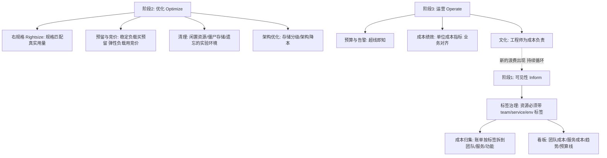

# FinOps：云成本治理

> **一句话摘要**：FinOps = 让「云成本」成为**可归集、可归因、可优化的运营学科**——三阶段闭环（可见性：谁花了多少 → 优化：怎么花更少 → 运营：持续治理）；云的按量计费把成本决策分散到了每个工程师手里，FinOps 的本质是**把成本意识还给工程师**（成本是可变成本，需要像性能一样被工程化治理）。

> **本文核心**：机制链 = **云账单失控的根源（按量付费 + 决策分散 + 无人对账单负责）→ 可见性（标签归集 + 成本分摊 + 团队/服务维度看板）→ 归因（成本到团队/服务/功能的映射）→ 优化（右规格/预留/清理/架构）→ 运营（预算告警 + 目标治理 + 文化）**——「工程师自己为自己的架构决策付账」是 FinOps 的文化内核。

前置阅读：[多租户与资源隔离](./10_多租户与资源隔离-入门.md)（标签与计量是 FinOps 的数据地基）。

## 1. 背景：云账单为什么失控

传统数据中心的成本是「资本支出」（买机器一次付清，成本固定可见）；云的成本是「运营支出」（按量持续付费，成本随行为漂移）。三个失控机制：① **决策分散**——每个工程师的每个架构选择（实例规格/存储类型/Region）都在实时产生成本；② **无人对账**——账单只有总额，没有「哪个团队/服务/功能花的」；③ **增长静默**——数据/日志/流量的自然增长带来「无声的成本爬升」。FinOps（Financial + DevOps）的回答：把成本变成**可观测、可归因、可优化的工程指标**。

## 2. 核心机制：三阶段闭环

- **可见性阶段的标签纪律**：标签是成本归集的唯一钥匙——**资源无标签 = 成本无主**。最小标签集（team/service/env/owner）进资源模板与 IaC 校验（无标签资源 CI 拦截或不允许部署）；「无主成本」看板每周公布，逼标签治理常态化。
- **单位成本指标（Unit Economics）**：把成本对齐到业务量——「每千次请求成本」「每活跃用户成本」「每单成本」——绝对成本受业务波动影响，**单位成本才是工程效率的度量**；单位成本上升 = 工程效率劣化的早期信号。
- **优化的四大杠杆**（按收益排序，行业经验）：① **右规格**（实例规格匹配真实用量——CPU/内存长期低于 30% 的实例降规格）；② **购买优化**（稳定负载买预留/节省计划——折扣显著；弹性负载用竞价/抢占式实例）；③ **清理**（闲置资源/孤儿磁盘/遗忘环境——纯浪费直接删）；④ **架构优化**（存储分级/数据生命周期/架构降本——长期收益最大）。
- **预算与告警的层级**：总预算 → 团队预算 → 服务预算逐级设线——「成本告警」要像性能告警一样被响应（超线即查）。

## 3. 落地实践：FinOps 的启动清单

1. **标签治理先行**：最小标签集（team/service/env/owner）强制化（IaC 模板 + CI 校验）——无标签成本看板每周公布，「认领」逐渐归零。
2. **建立成本看板**：团队/服务双维度看板（当月/上月/预算线/趋势）——可见性是一切治理的起点。
3. **首轮清理行动**：闲置资源大扫除（孤儿磁盘/闲置 IP/遗忘环境/未挂载卷）——首轮通常能砍出 10-30% 的纯浪费（行业经验量级）。
4. **右规格常态化**：基于利用率数据（CPU/内存 P95）推荐降规格——自动化工具或季度评审。
5. **文化机制**：成本纳入架构评审维度 + 单位成本进团队看板 + 成本 KPI 与业务对齐——「工程师为自己的架构决策付账」的文化养成。

## 4. 生产视角：成本失控的形态

- **「沉默的成本爬坡」**：数据/日志/流量的自然增长——月账单逐月上升无人察觉（直到财务来问）。预防：预算线 + 单位成本看板。
- **僵尸资源的存量**：实验环境忘记删、缩容后的孤儿盘、未挂载 IP——纯浪费的存量。定期清理自动化（未使用超 N 天自动回收）。
- **「为峰值全年付费」**：按大促峰值配全年容量——利用率常年低下。治理：弹性优先（按需扩缩）+ 预留只买基线。
- **跨团队的成本扯皮**：共享资源（数据库/中间件/网络）的成本无法归集到团队——共享成本按「驱动因素」分摊（调用量/数据量/占用率），分摊规则要透明且共识。
- **优化与稳定性打架**：降规格降出了稳定性事故——成本优化的每一步都压测验证，「成本节约」与「稳定性风险」一起上会。

## 5. 主流系统怎么做：FinOps 的工具与组织

| 环节 | 主流工具/机制 | 机制要点 |
|---|---|---|
| 账单归集 | 云厂商成本 API + FinOps 平台 | 账单数据按标签维度拆解 |
| 看板 | 自建 / 云成本工具 / FOCUS 标准 | 团队与服务双维度 |
| 右规格建议 | 利用率分析工具（云原生或商用） | 基于 P95 用量的规格推荐 |
| 预算告警 | 云预算 API + 告警联动 | 逐级预算线 + 超线通知 |
| 组织 | FinOps 团队（中央协调）+ 各团队成本 Owner | 中心协调 + 分散执行的混合模式 |

规律：**FinOps 组织模式是「中央协调 + 分散执行」**——中央团队管标准/工具/看板，各团队成本 Owner 管自己的优化执行；纯中央（瓶颈）或纯分散（失控）都不可持续。

## 6. 典型场景

- **大促成本规划**（弹性级）：活动期间弹性扩容的成本预估与预算审批——弹性成本的「事前算账」。
- **季度成本复盘**（运营级）：单位成本趋势 + 优化项跟踪 + 下季目标——成本治理的节奏感。
- **新服务立项**（事前级）：新服务的成本预估进立项材料——「事前算账」比「事后追责」文化健康得多。

## 7. 与相邻概念的区别

- **FinOps vs 成本砍预算**：砍预算是「一刀切压总额」；FinOps 是「归因后精准优化」——一刀切伤稳定性，FinOps 是外科手术。
- **FinOps vs 采购谈判**：谈判优化「单价」（折扣/预留）；FinOps 优化「用量与效率」——两者互补，谈判省 10-30%，工程优化可省更多但需投入。
- **成本优化 vs 稳定性**：天然张力——右规格降成本可能降冗余；解法是「压测验证 + SLO 不降级」的约束下优化。
- **本篇 vs 多租户篇**：多租户建立「隔离与配额」（谁用多少）；FinOps 建立「成本归集与优化」（用了多少钱、怎么省）——配额的数据基础直接喂给 FinOps。

## 8. 常见误区与不适用

- **「FinOps = 砍成本」**：FinOps 是「最大化业务价值/云成本」的比率——有时正确的决策是「多花钱」（新业务投入/性能换转化率）；目标是价值最大化不是成本最小化。
- **「成本是财务的事」**：云成本由工程决策产生——只有工程师能优化；财务的角色是预算框架与合规，优化的主战场在工程。
- **「一次优化运动解决」**：运动式清理一次性见效，但云成本随行为漂移——治理是持续运营（月度节奏），不是年度运动。
- **「标签以后再补」**：标签缺失的每一分钟都在制造「无主成本」——回补标签的历史成本远高于上线时打好；「标签即门禁」从第一天执行。
- **不适用**：固定成本的传统数据中心（成本结构不同——但 FinOps 思想仍可迁移到「软件许可与资产治理」）；纯内部私有化部署（无按量计费则优化对象变为利用率）。

## 9. 你们可能会问

- **FinOps 团队应该几个人？** 中央协调 1-3 人（小团队）起步：看板建设 + 优化建议 + 节奏运营——优化执行分散在各团队成本 Owner；规模化后再扩。
- **怎么让工程师关心成本？** 三招：成本可见（团队看板）、成本归因（自己的决策自己的账）、成本激励（节约共享或纳入绩效）——「可见性」是三招的地基。
- **预留和竞价怎么组合？** 稳定基线买预留/节省计划（一年期起步），可中断负载用竞价（批处理/无状态计算），突发弹性按需——三层组合是成本优化的最大杠杆。
- **单位成本指标怎么选？** 选「与业务价值直接相关」的分母：电商用「每订单成本」、内容用「每 DAU 成本」、SaaS 用「每租户成本」——分母要与业务目标一致。
- **FinOps 成熟度怎么评估？** FinOps Foundation 的三阶段模型：爬行（只有账单）→ 走（有归集与优化）→ 跑（自动化治理 + 文化）——自评定位后按短板补。

## 10. 一句话总结 + 5W 速记卡 + 自测三问

**🎯 核心带走**：

- **核心一句话**：FinOps = 把云成本变成可归集、可归因、可优化的工程学科——标签归集、单位成本度量、四大优化杠杆、中央协调+分散执行的组织闭环。

**5W 速记卡**：

| 维度 | 内容 |
|---|---|
| What | 可见性/优化/运营三阶段 + 单位成本 + 四大杠杆 |
| Why | 按量计费 + 决策分散 + 无人对账 = 云账单失控三机制 |
| When | 月度成本运营、大促规划、新服务立项、成本事故 |
| Where | 云账单 → 标签归集 → 团队/服务看板 → 工程优化 |
| How | 标签门禁 → 看板建立 → 清理与右规格 → 预算告警 → 文化养成 |

💡 **实战提示**：标签即门禁；单位成本比绝对成本诚实；首轮清理砍闲置；优化与压测同行；成本 Owner 到人。

**开放问题**：AI 工作负载（GPU 训练/推理）的成本量级与优化维度与传统计算完全不同（GPU 时/Token 计费）——FinOps 的方法论要为 AI 时代扩展哪些新指标与新杠杆？

**决策（何时用）**：云支出超预算、无成本可见性、月账单持续爬升时启动；推荐「标签门禁 + 团队看板 + 季度复盘」作为 FinOps 的最小运营闭环。

**Trade-off（代价与反方案）**：右规格用「余量减少」换「成本下降」；预留购买用「灵活性下降」换「折扣」；标签门禁用「CI 流程成本」换「归集完整性」；治理节奏用「组织精力」换「持续优化」——云成本的治理强度要按「浪费金额 × 团队规模」定价，小团队月度看板即可，大团队需要专职 FinOps。

**演进视角**：从「IT 预算年审」（传统）到「云账单月度看」（上云初期）到「FinOps 三阶段闭环」（行业标准化，FinOps Foundation 2020 成立）——云成本的治理在十年内从财务问题变成工程学科；AI 时代的 GPU 成本正在把这门学科推向它的下一个成熟度台阶。

---

**下篇预告**：一个平台服务多个世界的客户——下一篇[多云与混合云架构](./12_多云与混合云架构-入门.md)讲分布、迁移与防锁定的架构策略。

---

## 深度追问与设计思想

为什么「标签」是 FinOps 的第一道门禁？因为云账单默认只有「资源 ID」——没有标签的资源无法归集到团队/服务，「谁花的钱」不可知。**再问一层：标签为什么不能「事后补」？** 补标签要逐个资源修改（量大易错）且历史账单无法追溯——上线时打好的成本接近零，事后补的成本按资源数量线性增长。

**设计思想：把「成本决策」还给做决策的人**——传统 IT 的成本由采购部门决定；云的成本由每个工程师的每次架构决策实时产生——决策权已经分散，FinOps 的作用是让决策的成本后果回到决策者眼前。**Trade-off 量级分档：10w 请求**月度看板即可；**千万级**需要自动右规格+预算告警；**亿级**需要专职 FinOps 团队+自动化治理。

---

## 📌 数据与事实声明

FinOps 三阶段模型与组织模式出自 FinOps Foundation（finops.org）官方框架；优化收益量级（10-30% 首轮清理）为行业经验值；右规格/预留/竞价的机制为各云厂商官方文档。以 FinOps Foundation 与云厂商文档为准。

## 📚 参考资料

| 类型 | 标题 | 来源 |
|---|---|---|
| 框架 | FinOps Foundation（框架与成熟度模型） | finops.org |
| 文档 | 各云厂商成本管理与预算告警文档 | 各云官方文档 |
| 系列文章 | 多租户与资源隔离（上一篇） | 本仓库同系列 |
