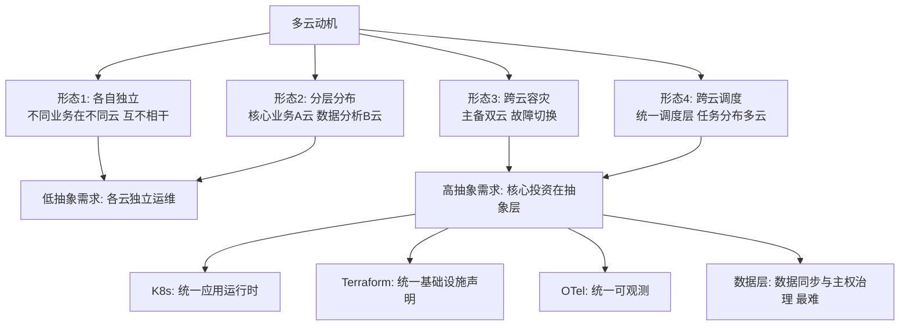
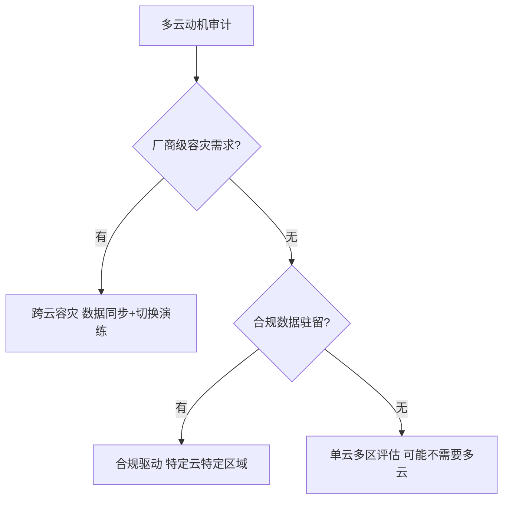

# 多云与混合云架构

> **一句话摘要**：多云 = 同时使用多个云厂商——**动机决定形态**：防锁定（可迁移）、合规（数据驻留）、容灾（厂商级故障）、能力互补（各取所长）；混合云 = 云与本地的组合。多云的每一分「议价能力与容灾信心」都对应一份「运维复杂度与一致性成本」——抽象层是多云的核心投资，没有抽象层的多云是运维灾难。

> **本文核心**：机制链 = **多云动机（防锁定/合规/容灾/能力）→ 四种形态（各自独立/分层分布/跨云容灾/跨云调度）→ 核心投资：抽象层（K8s/Terraform/OTel——屏蔽差异）→ 一致性治理（安全/网络/可观测跨云统一）→ 数据的引力（数据是多云最难的部分——数据引力与主权）**——「抽象层投资够不够」是多云成败的第一判据。

前置阅读：[不可变基础设施](./4_不可变基础设施与声明式配置-入门.md)（IaC 抽象层）、[FinOps](./11_FinOps云成本治理-入门.md)（多云成本治理）。

## 1. 背景：多云的动机与幻想

企业选择多云的四种真实动机：① **防锁定**——单一厂商的议价能力与断供风险；② **合规与主权**——数据驻留法规（某些数据必须在特定地域/特定厂商）；③ **容灾**——厂商级故障（整个云区域瘫痪）的容灾；④ **能力互补**——A 厂商的 AI 平台 + B 厂商的数据库各有所长。**但多云有幻想成分**：「多云部署 = 自动高可用」（不同步状态的两朵云不互为容灾）、「多云 = 省钱」（复制运维团队更贵）——动机要审计真实性，幻想要清除。

## 2. 核心机制：四种形态与抽象层投资

- **四种形态的抽象需求差异**：形态 1（各自独立）只需要「统一账号与账单管理」；形态 2（分层分布）需要「跨云网络互通」；形态 3（跨云容灾）需要「数据同步 + 流量切换」——最难；形态 4（跨云调度）需要「统一资源抽象与调度」。**先定形态再谈技术**——很多多云失败源于「想做形态 4 却只准备了形态 1 的能力」。
- **抽象层的三大件**：① **K8s 作为统一应用运行时**——应用在哪个云都跑在 K8s 上，应用层操作面统一；② **Terraform 统一基础设施声明**——「一套语法声明多云资源」（provider 抽象）；③ **OTel 统一可观测**——跨云的统一遥测与关联。这三件把「多云运维」从「N 套控制台」收敛为「一套抽象 + N 个后端」。
- **数据引力（data gravity）是多云最重的力**：数据有「引力」——计算趋向数据（数据在哪，计算就在哪处理最划算）；跨云的数据同步有延迟、带宽费与一致性难题。**多云架构设计的第一问：数据放哪、谁需要读它**——把「数据的引力」当作选址的第一约束，很多「跨云」设计会自然退化为「分层数据分布」。
- **防锁定的真实解药**：彻底防锁定 = 全用开源抽象（K8s/Postgres/Kafka 自建）——但放弃云的托管红利；现实解药是「**有管理的锁定**」：接受局部锁定（如托管数据库），但保持「核心层可迁移」（K8s 抽象层 + IaC）——「锁定要有对价」（换来的托管红利值得付）。

## 3. 落地实践：多云的工程纪律

1. **先做「云中立评估」再上多云**：评估三问——真有厂商级容灾需求吗（还是单云多可用区已够）？数据主权是硬约束吗？团队有双云运维能力吗？三问不过，多云缓行。
2. **抽象层三件套先行**：K8s + Terraform + OTel 覆盖后才启动第二朵云——抽象层是「进入多云的门票」。
3. **网络互联优先设计**：跨云网络（专线/VPN/对等连接）是多云的地基——延迟与带宽成本直接决定跨云架构的形态。
4. **安全与身份统一**：跨云统一身份（联合认证）+ 统一策略——两套 IAM 的权限漂移是多云安全头号隐患。
5. **成本的多维对比**：多云的成本对比要「同规格对齐」（实例/存储/网络/出口流量），出口流量费是多云的隐藏大头（跨云数据传输费远高于云内）。

## 4. 生产视角：多云的事故形态

- **跨云容灾的「切换不了」**：主云故障 → 切备云 → 发现备云数据不是最新的（同步延迟）/备云容量没预热/切换脚本从没演练过——「容灾设计没演练 = 没有容灾」。
- **抽象层泄漏**：K8s 统一了应用层，但云特色功能（A 厂的特殊存储/B 厂的 AI 服务）用不得——「抽象层之下的差异化能力」要么放弃要么写适配器（成本再+1）。
- **两套 IAM 的权限漂移**：多云身份不统一——A 云的权限模型与 B 云不同步，审计困难、最小权限失守。统一身份（联合认证）是多云安全的必修课。
- **跨云流量费 surprise**：跨云的数据同步/查询产生巨额出口流量费——「数据引力」的货币化表达；跨云架构设计必须算流量账。
- **运维团队的能力撕裂**：两朵云两套技能——团队规模不足以维护两套专家能力时，多云的运维质量双双下降。

## 5. 主流系统怎么做：多云的生态工具

| 层 | 主流工具 | 机制要点 |
|---|---|---|
| 运行时抽象 | Kubernetes（跨云一致） | 应用层统一的事实标准 |
| 基础设施声明 | Terraform / Pulumi / Crossplane | 多 provider 声明式管理 |
| 跨云网络 | 专线 + 跨云 CNI（Submariner 类） | 网络互通是跨云地基 |
| 容灾切换 | DNS 全局负载均衡 + 数据同步 | 流量层切换 + 数据层同步 |
| 管理 | 多云管理平台（CMP）/ FinOps 工具 | 账号/账单/合规的统一管理 |

规律：**多云工具的核心价值是「抽象与统一」**——K8s 统一运行时、Terraform 统一声明、OTel 统一观测、CMP 统一管理；每个「统一」都是投资，投资组合要匹配形态。

## 6. 典型场景

- **合规驱动的数据驻留**（合规级）：特定数据必须在特定地域/特定类型云——合规是多云的最硬动机，不可协商。
- **厂商级容灾**（容灾级）：核心业务跨云主备——最高成本形态，只用于「停机损失巨大」的核心业务。
- **能力互补组合**（能力级）：A 云的 AI 平台 + B 云的数据仓库——按各云的差异化能力组合，用抽象层（数据管道/OTel）缝合。

## 7. 与相邻概念的区别

- **多云 vs 混合云**：多云是「多个公有云」；混合云是「公有云 + 本地数据中心」——组合对象不同，混合云多了「本地」这一极（延迟/合规/遗留系统的特殊约束）。
- **多云 vs 分布式多云（分布式云）**：分布式云把云的「控制面」延伸到任意位置（边缘/客户机房）——云的运行时 everywhere 化，是混合云的极致形态。
- **防锁定 vs 开源化**：防锁定不等于全开源——「抽象层 + 可迁移架构」才是现实解药；全开源自建放弃托管红利，是过度矫正。
- **本篇 vs 灾备（稳定性域）**：单云容灾（可用区级）与多云容灾（厂商级）是两个量级的投资——「灾备等级」按业务损失定价，不按技术雄心。

## 8. 常见误区与不适用

- **「多云 = 自动高可用」**：没有数据同步与自动切换的两朵云互为备份是幻觉——容灾是「同步机制 + 切换能力 + 演练」的完整工程，多云只是提供了场地。
- **「抽象层能屏蔽一切差异」**：抽象层泄漏是常态（云特色功能/性能差异/配额模型）——抽象层能收敛 80% 的操作面，剩下 20% 是各云的「原生差异税」。
- **「多云 = 一定防锁定」**：K8s 层可迁移，但托管数据库/AI 服务/IAM 的锁定依旧存在——「有管理的锁定」才是诚实表述。
- **「多厂数据库跨云强一致」**：跨云数据强一致的延迟与成本不可行（网络物理限制）——跨云数据一致性要按最终一致 + 冲突治理设计。
- **不适用**：无多云动机（单云多可用区够用）——最强反模式是「为多云而多云」；小团队无双云运维能力；数据强一致需求的单一系统（拆分前不要跨云）。

## 9. 你们可能会问

- **多云的第一朵第二朵怎么选？** 第二朵云按「互补能力 + 合规要求 + 出口成本」选，不按「最大厂商」选——第二朵云的定位决定一切架构（形态 1-4）。
- **K8s 在多云里扮演什么角色？** 「应用运行的统一抽象」——应用在 K8s 上开发部署，K8s 由各云托管或自建——应用层的云中立由 K8s 保证。
- **跨云数据同步用什么？** 按同步时效：准实时（CDC/消息桥接）、小时级（批量导出导入）、日级（对账文件）——时效与成本成正比，按业务容忍度定。
- **怎么控制多云的出口流量费？** 三招：数据引力优先（计算靠近数据）、压缩与增量同步、CDN 卸载对外分发——出口流量费是多云成本的隐藏大头。
- **怎么向管理层汇报多云的 ROI？** 用「风险对冲价值 + 合规避免的损失 + 能力互补收益」对照「抽象层投资 + 双运维成本 + 流量费」——多云是风险管理决策，不是性能决策。

## 10. 一句话总结 + 5W 速记卡 + 自测三问

**🎯 核心带走**：

- **核心一句话**：多云/混合云 = 「动机定形态、抽象层定成败」——四种形态各有抽象需求，K8s+Terraform+OTel 三件套是核心投资；数据引力是选址第一约束，切换能力必须演练。

**5W 速记卡**：

| 维度 | 内容 |
|---|---|
| What | 四种形态 + 抽象层三件套 + 数据引力 + 有管理的锁定 |
| Why | 防锁定/合规/容灾/能力互补是真实动机 |
| When | 多云立项、容灾设计、厂商谈判、数据主权合规 |
| Where | 多公有云/混合云/边缘 |
| How | 审计动机 → 定形态 → 投资抽象层 → 数据引力选址 → 演练 |

💡 **实战提示**：抽象层三件套先行；数据引力当第一约束；出口流量费算进总账；切换脚本必须演练；安全身份跨云统一。

**开放问题**：云厂商间的「开放标准」（K8s/OTel/PostgreSQL 兼容层）持续降低迁移摩擦——「云厂商的差异化能力」还能维持多久作为锁定筹码？

**决策（何时用）**：多云立项评估、跨云容灾设计、混合云规划全场景；推荐「动机审计三问」作为多云立项的第一关；推荐「抽象层投资」作为多云预算的最大单项。

**Trade-off（代价与反方案）**：多云用「双运维团队 + 抽象层投资 + 流量费」换「议价能力 + 厂商容灾 + 合规」；反方案——单云多区（简单，无厂商级容灾）、全开源自建（零锁定，代价是托管红利放弃）、混合云（折中，代价是两套环境）；「有管理的锁定」是比「零锁定幻想」更成熟的姿态。

**演进视角**：从「单厂商绑定」（早期上云）到「多云幻想」（2018-2020 热潮）到「理性多云」（形态分明的务实期）——多云的演进正在从「恐惧驱动」转向「价值驱动」；数据引力、出口流量费、有管理的锁定这些「现实主义概念」的流行，标志着行业对多云的认知走向成熟。

---

**下篇预告**：全系列的收官与迁移指南——下一篇[云原生演进路线](./13_云原生演进路线-迁移策略与反模式-入门.md)讲从传统到云原生的迁移策略与反模式清单。

---

## 深度追问与设计思想

为什么「数据引力」是多云设计的第一约束？因为数据有引力——计算趋向数据（数据在哪，计算在哪处理最划算）；跨云的数据传输费与延迟让「跨云调用数据」的架构天然昂贵。**再问一层：能不能把数据同步到多云让它处处都有？** 同步有延迟与一致性代价——处处都有的幻想要用最终一致+冲突治理的真金白银来换。

**设计思想：多云的「有管理的锁定」比「零锁定幻想」更成熟**——彻底防锁定=全开源自建（放弃托管红利）；彻底绑定=单厂商依赖；现实的答案：K8s 层保持可迁移、托管层接受合理锁定、每个锁定都有对价评估。**Trade-off 量级分档：10w 请求**单云多区即可；**千万级**多云分层分布；**亿级**多云容灾+统一调度。

---

## 📌 数据与事实声明

多云动机分类与抽象层策略为多云架构领域公开共识（CNCF 多云白皮书类资料与各云厂商架构指南的机制级归纳）；「数据引力」概念为公开技术术语；出口流量费为各云定价文档内容；SLSA/SPIFFE 等为公开框架。以各云官方文档为准。

## 📚 参考资料

| 类型 | 标题 | 来源 |
|---|---|---|
| 文档 | 各云厂商多云/混合云架构指南 | AWS/Azure/GCP/阿里云官方 |
| 工具 | Terraform / Crossplane / Karmada | 各官方文档 |
| 系列文章 | FinOps（多云成本）/ GitOps（特性层） | 本仓库同系列与特性层 |
