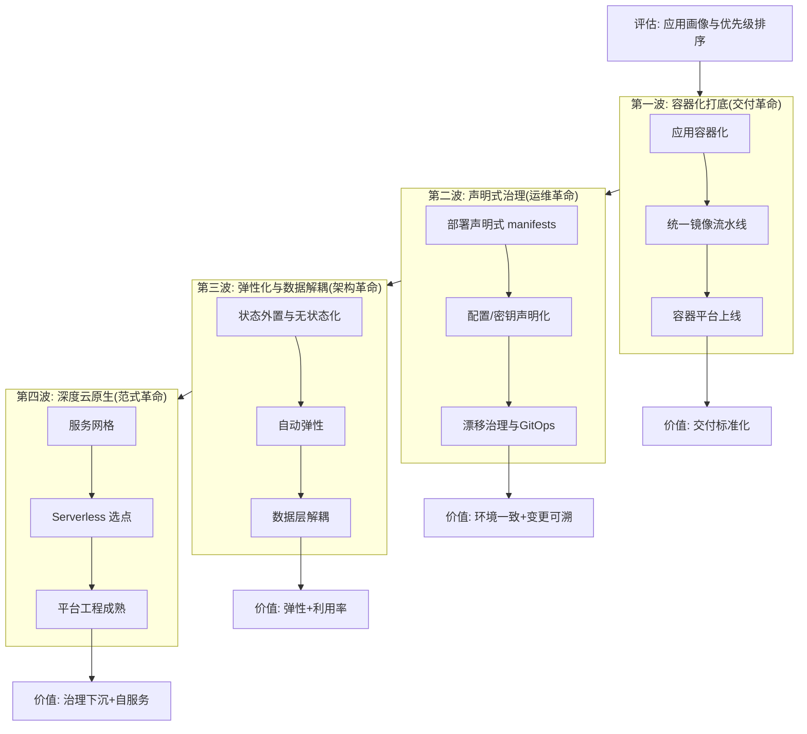
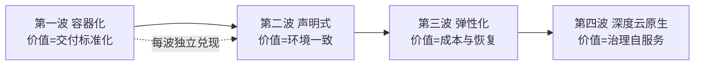

# 云原生演进路线：迁移策略与反模式

> **一句话摘要**：云原生迁移不是「重写」，是**分阶段的渐进演进——按「容器化 → 声明式 → 弹性化 → 深度云原生」四波推进，每波有明确的准入条件与退出标准**；最大的风险不是技术，是「一步到位的冲动」与「迁移了架构没迁移文化」；本篇是全系列收官：给一条务实的演进路线与一张反模式清单。

> **本文核心**：机制链 = **评估（应用画像：依赖/状态/架构形态）→ 四波路线（容器化打底 → 声明式治理 → 弹性化与数据解耦 → 深度云原生）→ 每波的准入/退出标准 → 反模式清单（大爆炸重写/为云原生而云原生/迁移了架构没迁移组织）→ 收益兑现节奏：每波都要有独立可兑现的业务价值**——演进策略 = 「价值前置 + 风险后置」的排序艺术。

前置阅读：全系列 1-12 篇（本篇是收官与路线图）。迁移中的组织视角与[系统架构演进全景](../../../system-design/distributed-system-design/入门层/从零开始认识分布式系统设计系列/2_系统架构演进全景-入门.md)互为补充。

## 1. 背景：迁移失败比不迁移更常见

行业观察的冰冷现实：大量云原生迁移项目以「半途搁置」或「成本失控」告终——**不是因为技术不可行，是因为策略错了**。三类典型失败：① **大爆炸重写**——一次性重写全部系统再切换，两年后新系统没上线旧系统没人维护；② **为云原生而云原生**——没有业务驱动，为技术履历而迁移；③ **迁移了架构没迁移组织**——团队还是「开发交运维部署」的协作模式，云原生的自服务红利无从兑现。成功的迁移是**分波推进、每波独立兑现价值**的渐进工程。

## 2. 核心机制：四波演进路线

- **第一波·容器化**：应用打包成镜像、统一镜像流水线、容器平台（K8s 或托管）上线。**准入**：应用可容器化（12-Factor 兼容度尚可）；**退出标准**：全部核心应用镜像化交付 + CI/CD 流水线统一。价值：交付标准化与环境一致。
- **第二波·声明式治理**：部署配置全部声明式进 Git、配置与密钥声明化、漂移治理上线。**退出标准**：无手工生产变更、变更可追溯、漂移接近零。价值：环境一致性与变更可审计。
- **第三波·弹性化与数据解耦**：应用无状态化（状态外置）、自动伸缩上线、数据层解耦（缓存分层/读写分离/对象存储下沉）。**退出标准**：弹性扩缩常态化、资源利用率达标、数据层的独立伸缩。
- **第四波·深度云原生**：服务网格、Serverless 选点落地、平台工程成熟（自服务门户/Operator 化运维知识）。**退出标准**：新服务默认云原生、平台自服务率、治理策略全覆盖。

每波铁律：**每波独立兑现业务价值**（交付更快/成本更低/恢复更快）——不产生可感知价值的波次，组织不会支持你走下一波。

## 3. 落地实践：应用画像与优先级排序

迁移的排序工具是**应用画像四维评估**：

| 维度 | 评估问题 | 迁移策略 |
|---|---|---|
| 架构形态 | 单体/微服务/遗留？ | 遗留系统先评估重写 vs 容器化 |
| 状态与数据 | 有状态？数据量？依赖数据库？ | 强状态应用排后（存储篇五问） |
| 变更频率 | 天天发？年度发？ | 高频变更的应用优先（收益最大） |
| 团队意愿 | 团队有动力与能力吗？ | 意愿高的团队当先锋 |

排序口诀：**「高频变更 + 低状态依赖 + 团队有意愿」的应用先迁**——先赢几场建立信心与能力，再攻坚硬骨头（强状态/遗留系统）。

## 4. 生产视角：迁移反模式清单

- **反模式 1：大爆炸重写**：停旧系统重写云原生版本再切换——两年周期内业务停摆、需求积压、新系统上线即落后。正解：绞杀者模式（Strangler Fig）逐步替换。
- **反模式 2：lift-and-shift 当终点**：原样搬上云（无容器化无声明式）——只拿到「更贵的机房」；lift-and-shift 只该是过渡态不是终点。
- **反模式 3：微服务先行**：先拆微服务再容器化——顺序反了；先容器化单体（拿部署红利），拆分随业务演进。
- **反模式 4：平台大而全上线**：一次性上齐网格/Serverless/可观测/安全全套——团队消化不了、运维不了。按痛点逐个引入（每篇的第 1 节都给痛点）。
- **反模式 5：迁移了架构没迁移组织**：团队协作模式还是「开发写完交运维」——云原生的自服务与所有权文化无从落地。组织演进（DevOps 文化/平台工程团队）与架构演进同步。

## 5. 主流系统怎么做：演进路线的行业模式

| 业界形态 | 演进模式 | 机制要点 |
|---|---|---|
| 互联网原住民 | 生而云原生 | 无历史包袱，直接全栈 |
| 传统企业数字化 | 分波渐进 + 平台团队 | 本篇四波路线的典型用户 |
| 金融核心改造 | 绞杀者模式 + 双轨过渡 | 稳定性约束下最慢但最稳 |
| 出海/合规驱动 | 合规区域先行 + 逐步扩展 | 合规约束重塑路线优先级 |

规律：**成功案例的共同点是「渐进 + 价值前置 + 组织同步」**；失败案例的共同点是「技术驱动 + 一步到位 + 组织原地」。

## 6. 典型场景

- **新 CTO 的云原生议程**（决策级）：接手存量团队后的头 90 天——先做五环自评（篇 1）与应用画像，再定路线，切忌新官上任直接上 K8s。
- **单体的最后一搏**（技术级）：单体架构的性能与交付瓶颈——容器化 + 声明式治理先行，微服务拆分按业务演进自然发生。
- **平台工程的立项**（组织级）：云原生基础设施成熟后，平台工程（自服务门户/黄金路径）成为下一阶段——演进没有终点，只有下一阶段。

## 7. 与相邻概念的区别

- **演进路线 vs 架构演进**：架构演进（篇 2 的系统形态演进）讲「系统的形态怎么变」；云原生演进讲「组织的工程范式怎么变」——技术形态与组织形态双线。
- **迁移策略 vs 重写决策**：迁移（绞杀者/容器化）保留业务逻辑资产；重写（从零）承担业务语义丢失风险——重写的门槛是「业务语义本身过时」。
- **绞杀者模式 vs 大爆炸**：渐进替换 vs 一次性切换——绞杀者的风险分散、周期长；大爆炸的周期短、风险集中。规模越大越要绞杀。
- **本篇 vs 全系列**：本篇把 1-12 篇的「单方向知识」组装成「组织级演进路线」——知识地图的最终交付物是「路线图」。

## 8. 常见误区与不适用

- **「云原生迁移 = 技术项目」**：它是「技术 + 组织 + 流程」三位一体的变革项目——技术只占三分之一的工作量与风险。
- **「所有应用都要迁移」**：部分应用的最优归宿是「退役/替换/保留」——迁移清单要有「不迁」的选项与理由。
- **「平台建好团队自然会来」**：平台的价值要靠「黄金路径 + 自服务 + 推广运营」兑现——平台工程的产品思维不可少。
- **「迁移完成后就自由了」**：云原生是持续运营的范式（漂移治理/成本治理/安全治理/演进）——「完成态」的心智是松懈的开始。
- **不适用**：业务窗口极紧的稳定系统（迁移风险 > 收益）；即将退役的系统（不值得投入）；无法投入组织变革的团队（技术先行会孤军深入）。

## 9. 你们可能会问

- **四波路线必须全走吗？** 不必须——按业务痛点与团队成熟度「跳跃」是常见的（直接到第三波的弹性化）；但跳跃的前提是「跳过的波的能力以其他方式补齐」。
- **怎么度量迁移的成功？** 三层指标：技术层（容器化率/声明式覆盖率/MTTR）、业务层（发布频率/故障损失）、组织层（自服务率/平台满意度）——只看技术层是常见盲区。
- **绞杀者模式的具体操作？** 在旧系统前放门面（路由层）→ 新实现逐个功能替换 → 门面按功能路由新旧 → 旧功能全部替换后拆除旧系统——每步都可回退。
- **迁移期间新旧怎么共存？** 隔离共存：新云原生系统先承载新业务，旧系统维持存量——共存期以「接口契约」对接，避免新旧直接耦合。
- **怎么保持迁移期间的团队士气？** 短周期兑现（每波有看得见的价值）+ 先锋团队的选择（意愿高的先行）+ 失败的容忍（第一波允许试错）——士气是长周期迁移的最大消耗品。

## 10. 一句话总结 + 5W 速记卡 + 自测三问

**🎯 核心带走**：

- **核心一句话**：云原生演进 = 四波渐进（容器化→声明式→弹性化→深度）——每波独立兑现价值、有准入退出标准、技术与组织同步迁移；反模式清单是路线图的安全护栏。

**5W 速记卡**：

| 维度 | 内容 |
|---|---|
| What | 四波演进 + 应用画像排序 + 反模式清单 |
| Why | 一步到位与大爆炸是迁移失败的最高频形态 |
| When | 云原生立项、迁移规划、迁移中途复盘 |
| Where | 组织级（技术+组织+流程三线同步） |
| How | 画像排序 → 四波推进 → 每波兑现价值 → 反模式护航 |

💡 **实战提示**：高频变更+低状态+高意愿的应用先迁；绞杀者替代大爆炸；组织演进与技术演进同步；每波有独立可感知的价值。

**开放问题**：AI 辅助的「自动化迁移」（代码理解→自动容器化→自动声明式改造）正在兴起——云原生迁移的四波路线会被 AI 压缩成一键转换吗，还是「组织与流程」的波永远无法自动化？

**决策（何时用）**：一切云原生迁移与演进的规划场景；推荐「四波路线 + 应用画像 + 反模式清单」三件套作为迁移项目的标准交付物；推荐「每波独立兑现价值」作为路线设计的第一原则。

**Trade-off（代价与反方案）**：渐进迁移用「长周期与新旧共存成本」换「风险分散与持续价值兑现」；反方案——大爆炸重写（周期短，风险集中且以年计）、不迁移（稳定，代价是瓶颈固化与人才流失）；「每波价值兑现」与「总体最优路线」存在张力——务实的选择是「波内求最优、波间可调整」。

**演进视角**：云原生迁移的知识从「个人经验」（2015 前后先驱者）到「方法论框架」（2018+ CNCF 与咨询公司体系化）到「平台工程产品化」（2020s 迁移工具与评估模型）——迁移正在从「艺术」变成「工程」，但每个组织的迁移故事仍是独一无二的——方法论框住风险，业务现实决定路线。

---

## 🎓 云原生系列全 14 篇收官

13 个方向的理念、机制、实践与决策全覆盖——从「什么是云原生」到「怎么演进过去」的完整知识闭环；K8s/Docker 的操作细节在 devops 域、治理机制在 service-governance 域、数据产品在 data/middleware 域——本仓库各域协同，云原生是它们的**统一视角**。

---

## 深度追问与设计思想

为什么「每波必须独立兑现价值」是第一原则？因为云原生迁移的周期以年计——组织对看不见价值的投入的耐心通常只有几个月；每波的可感知价值（交付更快/成本更低/恢复更快）是组织持续投入的唯一燃料。**再问一层：怎么定义「可感知」？** 用业务语言不用技术语言——「发布从两周变一天」比「我们实现了 CI/CD」更有说服力。

**设计思想：把「迁移风险」从集中爆发变为分散消化**——大爆炸迁移的风险在切换日一次性兑现；四波渐进的风险在每一波内被准入条件+退出标准逐步消化——风险管理的本质不是消除风险而是把大风险拆成小风险分批承担。**Trade-off 量级分档：10w 请求**渐进容器化即可；**千万级**需要完整四波+平台团队；**亿级**需要多集群+多云+专职平台工程。

---

## 📌 数据与事实声明

四波演进路线与反模式清单为云原生迁移领域公开共识（CNCF 白皮书、Gartner 迁移模型与行业案例的机制级归纳）；「绞杀者模式」出自 Martin Fowler（2004）；12-Factor 为公开方法论；失败率表述为行业观察的定性归纳。以公开资料为准。

## 📚 参考资料

| 类型 | 标题 | 来源 |
|---|---|---|
| 文章 | Strangler Fig Application（Martin Fowler） | martinfowler.com |
| 方法论 | The Twelve-Factor App | 12factor.net |
| 图书 | Cloud Native Migration 实践类出版物 | 各出版社 |
| 系列文章 | 本系列全部篇章 + K8s 生态系列 | 本仓库 |
