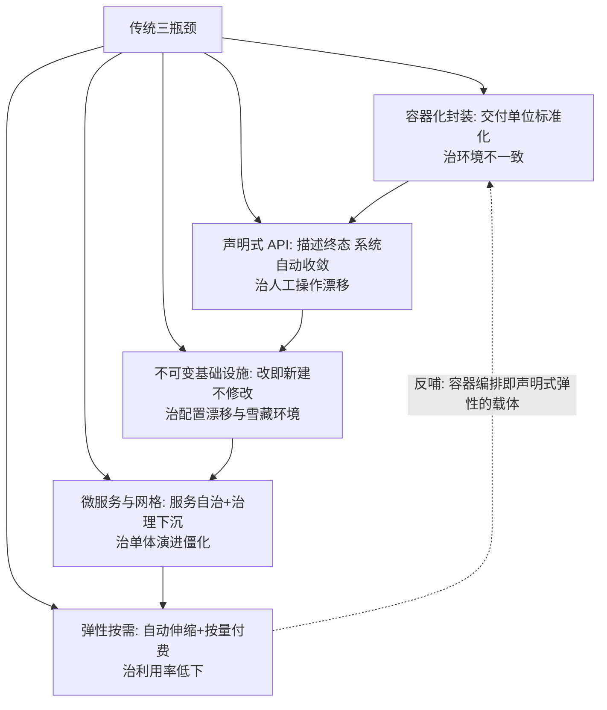
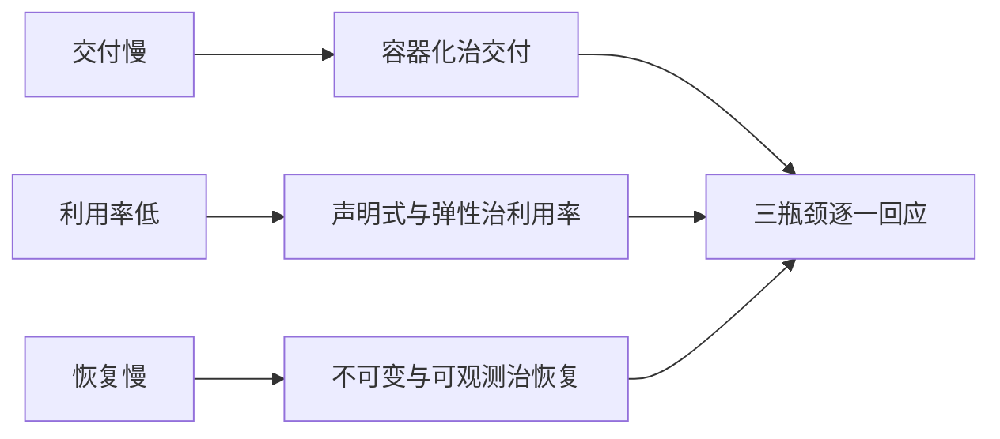

# 云原生是什么：范式迁移

> **一句话摘要**：云原生不是「把应用搬上云」，是**重构应用的构建与运行方式，让应用天生利用云的弹性、分布式与托管能力**——五大理念（容器化、声明式、不可变、微服务网格、弹性按需）互为前提，缺一环则收益塌一角。

> **本文核心**：机制链 = **传统架构的三大瓶颈（交付慢/资源利用率低/故障恢复慢）→ 云原生五大理念逐一对抗 → 五环互锁：容器化是交付地基、声明式是治理语言、不可变是一致性保证、微服务网格是演进能力、弹性是商业兑现**——CNCF 的正式定义即这五环的官方表述。

前置阅读：[系列导读](./0_系列导读-全景.md)。K8s 操作细节归本仓库 devops/kubernetes 系列。

## 1. 背景：范式为什么必须迁移

传统架构的三个结构性瓶颈，在业务规模上去后集中爆发：**交付慢**（发布以周计，环境不一致导致「在我机器上能跑」）、**资源利用率低**（虚拟机按峰值预留，均值利用率常低于 20%——行业通用认知）、**故障恢复慢**（人工定位 + 手工回滚，MTTR 以小时计）。云原生五大理念正是对这三个瓶颈的逐条回应：容器化治交付、声明式与弹性治利用率、不可变与可观测治恢复。

## 2. 核心机制：五大理念与互锁关系

五环互锁的机制解读（追问链）：

- **为什么容器化是一切的地基？** 声明式 API 的「声明对象」必须是标准化交付物（不可变镜像）、弹性的伸缩单位必须是可复制的封装——没有容器化，声明式与弹性没有作用对象。
- **为什么声明式是不可替代的一环？** 命令式（人执行步骤）的规模上限是「人的数量」，声明式（系统收敛到终态）的规模上限是「机器的数量」——K8s 的控制循环、GitOps 的漂移检测、云资源的 IaC，全是声明式思想的具体化。
- **弹性为什么是「商业兑现」？** 前四环是技术能力，弹性按需把能力变成成本结构优势（闲时缩容/峰时扩容/按量计费）——没有弹性兑现，云原生只是「更复杂的部署方式」。

## 3. 落地实践：云原生成熟度的自评

按五环逐项打分（每环 0-2 分：没做/部分/到位）：

1. **容器化**：核心应用是否全部镜像化交付？构建是否可重复？
2. **声明式**：基础设施与部署是否全部声明式（IaC/K8s manifests）？有无手工改线上？
3. **不可变**：是否「改即新建」（发布=换镜像）？还是 SSH 上去改文件？
4. **微服务与网格**：服务边界清晰吗？服务间治理（重试/熔断/mTLS）是否下沉平台？
5. **弹性**：扩缩容是否自动？资源请求/限制是否按真实用量设置？

10 分以上才算「云原生架构」，6 分以下是「容器化的传统架构」——**自评的诚实度比分数重要**。

## 4. 生产视角：半途范式的形态

- **「K8s 化的单体」**：单体应用打包成镜像跑在 K8s——拿到了部署标准化，但发布仍是整体替换、故障仍是全局爆炸。这是大多数团队的第一个阶段（合理），但误当终点则浪费了平台投入。
- **「伪弹性」**：HPA 配了但副本数手工锁死——因为「怕打爆下游」；正确路径是先做下游容量治理（限流/信号量），再放开弹性。
- **「声明式的空壳」**：manifests 在 Git 里但没人信它（线上状态靠手工救）——声明式的价值前提是「Git 即事实源」，漂移必须当事故治理（GitOps 篇展开）。
- **成本反弹**：弹性扩容无预算约束——云账单随弹性同步失控（FinOps 篇的治理闭环）。

## 5. 主流系统怎么做：理念的行业兑现形态

| 理念 | 主流兑现 | tips |
|---|---|---|
| 容器化 | OCI 镜像 + Docker/Podman 构建 | 机制细节归 Docker 系列 |
| 声明式 | K8s manifests / Terraform / Crossplane | 声明对象的三个层级：工作负载/基础设施/服务 |
| 不可变 | 不可变镜像 + GitOps 部署 | 与 12-Factor 的「一次构建多次部署」同源 |
| 网格 | Istio/Linkerd | Sidecar 与 ambient 两条路线（网格篇展开） |
| 弹性 | HPA/VPA/Cluster Autoscaler/KEDA | 伸缩的对象：实例/资源/节点/事件 |

规律：**每条理念都有 CNCF 主流兑现组件**——组件会轮替（ Istio→ambient、Docker→containerd），理念不变。

## 6. 典型场景

- **互联网业务上云**（弹性级）：流量波动大——弹性与容器化收益最大化的主场。
- **企业核心系统改造**（演进级）：按演进路线分阶段迁移（演进篇），而非一次性重写。
- **创业公司 Greenfield**（原生级）：从第一天就全栈云原生——无历史包袱时理念成本最低。

## 7. 与相邻概念的区别

- **云原生 vs 上云**：上云是「部署位置变化」（IaaS 迁移）；云原生是「架构范式变化」——租了云的 VM 不叫云原生。
- **云原生 vs 微服务**：微服务是服务划分风格；云原生是更广的范式集（含基础设施与运维维度）——微服务可以不云原生（自建机房微服务），云原生也可以暂不微服务（容器化单体）。
- **云原生 vs DevOps**：DevOps 是工程文化与协作实践；云原生是技术架构范式——云原生为 DevOps 提供技术载体（声明式让「开发自服务运维能力」成为可能）。
- **CNCF vs Kubernetes**：K8s 是 CNCF 毕业项目之一（编排层的执行器）——把 CNCF 版图等同于 K8s 是视野收缩。

## 8. 常见误区与不适用

- **「用了 K8s 就是云原生」**：K8s 是工具不是范式——无声明式纪律、无不可变、无弹性的 K8s 集群只是「更复杂的虚拟机池」。
- **「云原生 = 微服务」**：容器化单体也是合法的云原生起步态——范式五环可以渐进达标，不必先拆微服务。
- **「云原生省钱」**：初期更贵（平台建设 + 学习成本）——成本优势在中长期与规模化后兑现（FinOps 篇的成本曲线）。
- **「小团队不配云原生」**：小团队恰恰适合（托管服务 + Serverless 免运维）——按业务形态裁剪范围即可。
- **不适用**：强监管单机遗留系统（改造成本 > 收益的存量）；超低延迟硬实时（GC/调度抖动不友好）；离线一次性任务（无需常驻架构）。

## 9. 你们可能会问

- **怎么向管理层论证云原生投入？** 三笔账：交付账（发布频率与故障恢复 MTTR）、资源账（利用率提升幅度）、风险账（故障爆炸半径与回滚速度）——用业务语言不用技术语言。
- **五大理念可以只取两三个吗？** 可以且常见——按「瓶颈优先」取舍；但「容器化 + 声明式」是最小组合（其余理念的兑现载体），不建议再少。
- **传统 VM 应用怎么过渡？** 先容器化不改代码（拿交付标准化）→ 再做 12-Factor 改造（外置配置/无状态化）→ 最后微服务化（演进篇的路线展开）。
- **云原生的「云」必须公有云吗？** 不是——私有数据中心同样可以建设云原生平台（K8s + 自建组件）；「云」指的是「云式架构能力」，不是「公有云厂商」。
- **怎么避免「为云原生而云原生」？** 每个理念落地前回答「它对抗的痛点我有吗」——没有对应痛点就缓上；本系列每篇的第 1 节都先给痛点。

## 10. 一句话总结 + 5W 速记卡 + 自测三问

**🎯 核心带走**：

- **核心一句话**：云原生 = 五大理念互锁的架构范式——容器化（交付）、声明式（治理）、不可变（一致性）、微服务网格（演进）、弹性（商业兑现），对抗传统架构的交付慢/利用率低/恢复慢三瓶颈。
- **链条复述**：三瓶颈 → 五理念逐条对抗 → 五环互锁（容器化地基→弹性兑现）→ 成熟度自评 → 半途范式的识别与推进。
- **失效点与边界**：强监管遗留、硬实时、一次性任务不适用；K8s ≠ 云原生；初期成本更高。

**5W 速记卡**：

| 维度 | 内容 |
|---|---|
| What | 五大理念互锁的架构范式（CNCF 定义） |
| Why | 传统架构的三瓶颈在规模上去后集中爆发 |
| When | 业务规模化、交付瓶颈、上云决策期 |
| Where | 公有云/私有云皆可（「云」是能力不是厂商） |
| How | 痛点对照 → 五环自评 → 按瓶颈取舍渐进落地 |

💡 **实战提示**：最小组合是「容器化+声明式」；自评要诚实（漂移当事故）；每理念落地前先确认对应痛点存在。

**开放问题**：AI 时代的工作负载（GPU 弹性/大模型推理）正在重塑云原生版图——五大理念会扩容出第六环（如「智能弹性」）吗？

**决策（何时用）**：上云/改造/选型决策全场景；推荐「五环自评」作为年度架构健康度检查项；推荐「痛点对照表」作为云原生立项的第一份文档。

**Trade-off（代价与反方案）**：云原生用「平台建设 + 学习曲线 + 分布式复杂度」换「交付速度 + 资源效率 + 恢复能力」；反方案——留在 VM 模式（简单稳定，代价是瓶颈固化）、Serverless 优先（免运维，代价是绑定与冷启动）；渐进 vs 一步到位的权衡：按团队学习容量与业务窗口定价。

**演进视角**：从 2013 年 Docker 横空出世、2015 年 CNCF 成立到今天 Serverless/FinOps/多熟的版图成熟——云原生从「运维技术运动」成长为「企业架构默认选项」；理念层十年未变，兑现层持续更替——这正是「学理念优先于学组件」的历史依据。

---

**下篇预告**：地基中的地基——下一篇[容器化基石](./2_容器化基石-镜像与运行时-入门.md)讲镜像分层、运行时标准与「交付单位革命」。

---

## 深度追问与设计思想

为什么容器化必须是地基？因为声明式 API 需要「作用对象」——没有标准化的交付物，声明终态无从声明、弹性伸缩无从复制。**再深一层：为什么不是 VM 镜像充当交付物？** VM 镜像也能「打包环境」，但 GB 级体积与分钟级启动让「弹性到秒」物理上不可行——容器把交付单位压到 MB/秒级，弹性的经济账才成立。

**设计思想：五环互锁而非五环并列**——容器化为声明式提供作用对象、声明式为不可变提供执行语言、不可变为弹性提供一致性保证、网格为微服务提供治理下沉、弹性为全部投入提供商业兑现。**Trade-off 量级分档：10w 请求以下**传统部署可能更经济；**百万日活**开始弹性与交付收益显性化；**亿级**则五大理念缺一即瓶颈。

---

## 📌 数据与事实声明

五大理念与云原生定义出自 CNCF 官方（Cloud Native Definition v1.0，github.com/cncf/toc）；资源利用率量级为业内通用认知（以自身账单为准）；12-Factor 为公开方法论（12factor.net）。以官方资料为准。

## 📚 参考资料

| 类型 | 标题 | 来源 |
|---|---|---|
| 定义 | CNCF Cloud Native Definition v1.0 | github.com/cncf/toc |
| 方法论 | The Twelve-Factor App | 12factor.net |
| 图书 | Cloud Native Patterns | Manning（2018） |
| 系列文章 | 容器化基石（下一篇） | 本仓库同系列 |
