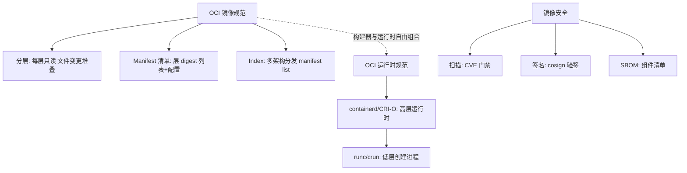
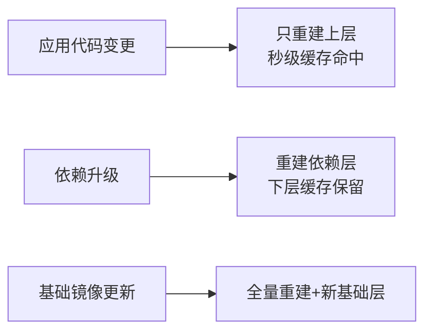

# 容器化基石：镜像与运行时

> **一句话摘要**：容器化 = **「镜像（不可变交付物）+ 运行时（标准执行环境）」的交付单位革命**——OCI 标准让镜像与运行时解耦（构建一次、任何兼容运行时执行）；本篇从云原生视角讲镜像分层、运行时谱系与「为什么容器是云原生的交付地基」。

> **本文核心**：机制链 = **镜像 = 分层只读文件系统 + 元数据清单（OCI 规范）→ 运行时 = 隔离执行（namespace/cgroups，机制见 Docker 系列）→ 解耦价值：任何 OCI 兼容构建器 × 任何兼容运行时自由组合 → 云原生视角的三件事：镜像即交付契约、运行时即平台承诺、镜像安全即供应链第一环**。

前置阅读：[云原生是什么](./1_云原生是什么-范式迁移-入门.md)。容器机制的完整展开（namespace/cgroups/构建缓存）归本仓库 Docker 系列。

## 1. 背景：交付单位革命为什么是革命

软件交付单位的演进就是部署可靠性的演进：**源码交付**（部署机现场编译——环境不可控）→ **二进制包**（依赖仍靠系统）→ **虚拟机镜像**（环境完整但 GB 级、分钟级启动）→ **容器镜像**（环境完整 + MB 级 + 秒级启动 + 分层共享）。容器镜像的革命性在于：**它把「应用 + 依赖环境」打包成一个不可变、可校验、可随处运行的标准化单元**——云原生的声明式、不可变、弹性全部以它为作用对象。

## 2. 核心机制：镜像、运行时与 OCI 解耦

- **镜像的分层经济学**：每层只存变更（内容寻址 digest 去重）——基础层全网共享、应用层只传增量；拉取按需、缓存按层。工程推论：**把「善变的东西」放上层、「稳定的东西」放下层**（依赖层在下、代码层在上——Docker 系列的层序纪律在云原生语境的再表达）。
- **OCI 双规范解耦**：镜像规范（怎么打包）+ 运行时规范（怎么执行）——buildkit/buildpacks/ko 任意构建，containerd/CRI-O/任意云节点任意执行。**「一次构建、处处运行」从口号变成规范保证**——这是云供应商锁定在交付层的解药。
- **多架构镜像（manifest list/index）**：一个镜像名覆盖 amd64/arm64 等多架构——拉取端按本机架构自动选层。Apple Silicon 与国产化 ARM 集群普及后，多架构构建（buildx）从加分项变成必选项。
- **镜像安全三件套**：**扫描**（Trivy/Grype 查 CVE，CI 门禁拦截高危）、**签名**（cosign 签发，部署侧验签——防篡改）、**SBOM**（软件物料清单——新 CVE 爆出时十分钟回答「我们受影响吗」）。三件套构成供应链的静态防线（运行时防线归安全篇）。

## 3. 落地实践：镜像的云原生工程纪律

1. **最小基础镜像**：distroless/alpine 起步——攻击面与拉取带宽同步下降；调试用 debug 侧车变体。
2. **层序缓存友好**：依赖清单 COPY → 装依赖 → 源码 COPY——改代码不重装依赖（Docker 系列的层序纪律）。
3. **多架构构建进 CI**：`docker buildx` 一次产出 manifest list，覆盖开发（Mac ARM）与生产（amd64）双架构。
4. **镜像治理进流水线**：扫描门禁（高危拦截）→ 签名 → SBOM 归档 → 只允许可信仓库部署——四步构成「供应链流水线」。
5. **镜像版本纪律**：语义版本 + git 短哈希双标签、digest 引用部署、latest 只留在开发机（镜像篇的不可变引用纪律）。

## 4. 生产视角：容器化的事故形态

- **「能跑的镜像」与「该交付的镜像」**：本地手工 docker commit 出的镜像（无 Dockerfile 可复现）——升级即失忆。镜像必须「可从源码确定性重建」。
- **超大镜像的连锁代价**：GB 级镜像拖慢拉取、放大扩容冷启动、挤占节点磁盘——多阶段构建 + 最小基础镜像 + .dockerignore 三连治。
- **latest 引用的发布事故**：两个环境的 latest 是不同内容——「测试过的不是上线」；部署引用 digest 是根治。
- **供应链攻击的现实化**：公共镜像被投毒/依赖被植入——私有仓库中转 + 签名验签 + SBOM 审计三道防线，缺一即敞口。

## 5. 主流系统怎么做：镜像与运行时的生态位

| 环节 | 主流选择 | tips |
|---|---|---|
| 构建 | BuildKit/buildpacks/ko | buildpacks 免 Dockerfile（源码直出镜像）；ko 服务 Go 应用零配置 |
| 运行时 | containerd（主流）/CRI-O | K8s 1.24+ 全线 CRI 化；Docker Engine 底层也是 containerd |
| 安全容器 | gVisor/Kata | 不可信负载强隔离（机制见 Docker 系列安全篇） |
| 分发 | Harbor/ghcr/云 ACR + P2P（Dragonfly） | 大规模集群拉取用 P2P 分发降带宽峰值 |

规律：**构建、分发、运行三环节各有事实标准**——全链路 OCI 化后可自由替换而不锁死。

## 6. 典型场景

- **CI 镜像流水线**（交付级）：构建 → 扫描 → 签名 → 推仓 → 部署引用 digest——供应链流水线的最小闭环。
- **多架构交付**（国产化级）：buildx 双架构 + manifest list——一套制品覆盖 x86 与 ARM 集群。
- **大规模弹性**（规模级）：镜像 P2P 分发 + 精简镜像——千节点扩容时拉取不拥塞（10w 实例级靠分层共享 + 预热）。

## 7. 与相邻概念的区别

- **镜像 vs 虚拟机镜像**：共享内核分层共享（MB 级秒启）vs 独立内核全量（GB 级分钟级）——隔离强度与交付效率的交换。
- **OCI 镜像 vs 语言包（jar/wheel）**：语言包缺环境；镜像含环境——「同一制品从测试跑到生产」的根据。
- **容器 vs 沙箱**：容器管「资源与视图隔离」（namespace/cgroups）；沙箱管「不可信代码逃不出去」（gVisor/Kata）——安全等级不同，威胁模型决定选择。
- **本篇 vs Docker 系列**：Docker 系列讲「怎么用好容器」（构建/网络/存储/安全全细节）；本篇讲「容器在云原生版图中的角色与标准」——工具域与架构域互指。

## 8. 常见误区与不适用

- **「容器化了就是云原生」**：容器化只是交付地基——声明式部署、不可变纪律、弹性运维缺一环，整体收益就塌一角（首篇五环互锁）。
- **「镜像越小越好，全用 scratch」**：无 shell 的 scratch 排障极难、动态链接库缺失即崩——「最小可运行 + 可运维」才是目标，不是极小竞赛。
- **「扫描过了就安全」**：扫描覆盖已知 CVE——逻辑后门、投毒依赖、运行时逃逸不在射程；扫描+签名+SBOM+运行时加固组合才是防御。
- **「容器内进程崩溃重启就没事」**：重启掩盖问题——崩溃率是质量信号，接监控告警而不是靠重启兜底。
- **不适用**：需要内核级特性的场景（特定内核模块/硬件直通——VM 更合适）；强 GUI 交互应用；许可证禁止容器化的商业软件。

## 9. 你们可能会问

- **镜像层是怎么叠起来的？** 联合挂载（overlayfs）：上层文件遮蔽下层同名文件——删除 = 白名单标记；「层只能增不能改」就是不可变的物理形态。
- **多阶段构建为什么能减小体积？** 编译工具链留在构建阶段，最终镜像只 COPY 产物——工具链（GB 级）根本不进最终层。
- **digest 是怎么算的？** 对 manifest 与各层内容做 SHA256——内容变 digest 必变，这就是「不可变引用」的密码学保证。
- **K8s 里镜像拉取策略怎么选？** Always（每次核对仓库）/ IfNotPresent（本地有就用）/ Never——生产固定版本标签用 IfNotPresent 即安全；latest 必须 Always。
- **怎么审计一个镜像的「出身」？** 四查：构建 provenance（谁/在哪/用什么构建）、Dockerfile 层历史（docker history）、SBOM（装了什么）、签名（谁签的）——出身链条完整才可信。

## 10. 一句话总结 + 5W 速记卡 + 自测三问

**🎯 核心带走**：

- **核心一句话**：容器化 = 「OCI 镜像（不可变分层交付物）+ OCI 运行时（标准执行）」的解耦——交付单位革命让云原生其余理念有了作用对象；镜像安全三件套是供应链第一环。
- **链条复述**：交付单位演进 → 分层经济学 → OCI 双规范解耦 → 多架构 → 安全三件套（扫描/签名/SBOM）→ 工程纪律（层序/最小/不可变引用）。
- **失效点与边界**：容器化 ≠ 云原生全部；极小镜像有运维代价；扫描 ≠ 安全全部。

**5W 速记卡**：

| 维度 | 内容 |
|---|---|
| What | OCI 镜像分层 + 运行时解耦 + 安全三件套 |
| Why | 标准化不可变交付物是云原生其余理念的作用对象 |
| When | 应用容器化、供应链治理、多架构交付、弹性扩容设计 |
| Where | 构建端到运行端的整条镜像链 |
| How | 层序缓存友好 → 最小镜像 → 扫描签名 SBOM → digest 引用 |

💡 **实战提示**：多阶段构建标配；digest 引用部署；多架构进 CI；latest 只留开发机；供应链三道防线缺一不可。

**开放问题**：WebAssembly（Wasm）作为「第四种交付单位」（更小更快更安全）正在 CNCF 崛起——它会取代容器镜像成为云原生的新交付标准吗，还是与容器长期共存？

**决策（何时用）**：一切应用容器化与镜像治理场景；推荐「供应链流水线四步」作为容器化团队的准入基建；推荐「多架构」在 ARM 集群立项时同步规划。

**Trade-off（代价与反方案）**：最小镜像用「可运维性下降」换「攻击面与带宽」；多架构用「构建时长翻倍」换「覆盖双生态」；供应链三件套用「流水线复杂度」换「投毒防御」；OCI 解耦用「规范遵循成本」换「零厂商锁定」——镜像工程的每个默认值都是安全、性能、便利的三角定价。

**演进视角**：交付单位十年四跳（虚拟机镜像→Docker 镜像→OCI 标准→多架构+Wasm 崛起）——每次跳变都把「环境一致性」的保证从人工纪律升级为规范与密码学；下一跳（Wasm/Valhalla 值类型交付）无论何时到来，「不可变 + 标准化 + 可验证」的交付哲学不会变。

---

**下篇预告**：交付物有了，谁来形容它该跑成什么样——下一篇[Kubernetes 心智模型](./3_Kubernetes心智模型-声明式与控制循环-入门.md)讲声明式 API 与控制循环两大机制。

---

## 深度追问与设计思想

为什么镜像层「只能增不能改」？因为层的存储按内容寻址（digest）——修改会破坏内容寻址的唯一性保证。**再问一层：为什么用 digest 而不用版本号？** 版本号可人为复用，digest 是内容的密码学哈希——「同名不同内容」的投毒在 digest 面前无所遁形。

**设计思想：把「环境一致性」从纪律变成密码学**——传统时代靠「部署手册 + 运维自觉」保证环境一致；OCI 用「内容寻址 + 分层去重」让一致性成为数学性质。**Trade-off 量级分档：10w 请求以下**单镜像够用；**千万级**必须多阶段构建与层序优化；**亿级**需要 P2P 分发与多架构。

---

## 📌 数据与事实声明

OCI 镜像/运行时规范、多架构 manifest list、镜像安全三件套（Trivy/cosign/SBOM）为 OCI 与各项目官方文档；「均值利用率低于 20%」为业内通用认知量级；供应链攻击形态为公开安全事件的一般化归纳。以官方文档为准。

## 📚 参考资料

| 类型 | 标题 | 来源 |
|---|---|---|
| 规范 | Open Container Initiative（image/runtime spec） | opencontainers.org |
| 工具 | BuildKit / cosign / Trivy 官方文档 | 各项目官方仓库 |
| 系列文章 | Docker 系列（容器机制细节） | 本仓库 devops/docker/ |
| 系列文章 | Kubernetes 心智模型（下一篇） | 本仓库同系列 |
