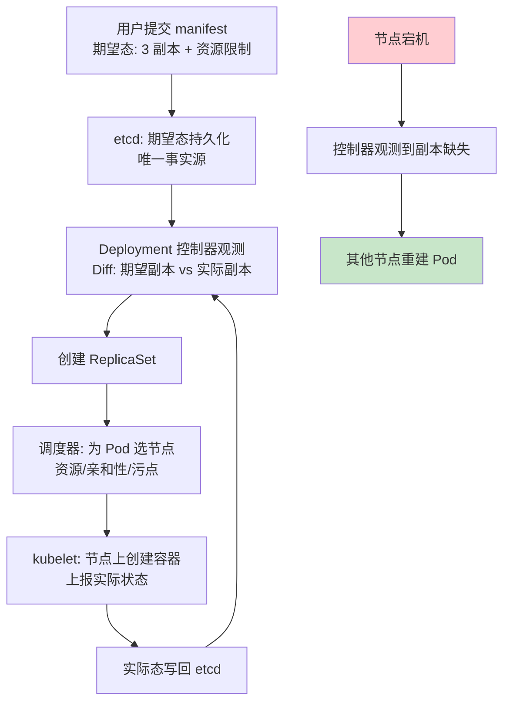
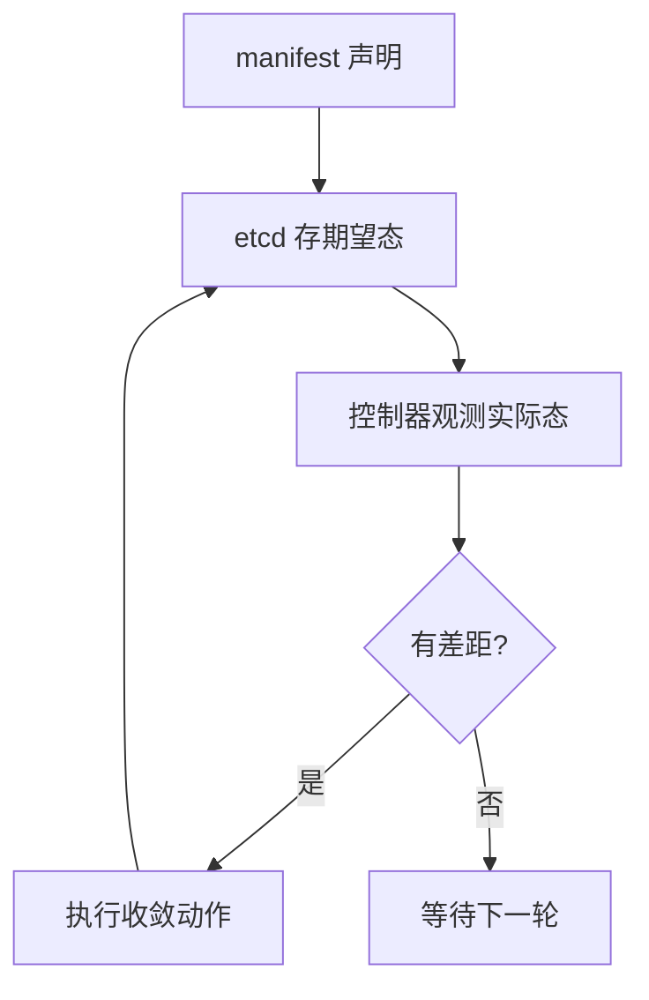

# Kubernetes 心智模型：声明式与控制循环

> **一句话摘要**：K8s 的全部行为可以浓缩为两大机制——**声明式 API（你描述期望终态，不描述步骤）+ 控制循环（控制器持续对比「期望态 vs 实际态」并收敛差距）**；Deployment/Service/HPA 全是这对机制的不同应用；读懂「声明 + 调谐」，K8s 的几十种资源对象就还原成同一模式的变奏。

> **本文核心**：机制链 = **期望态（manifest 声明）→ 存入 etcd → 控制器观测实际态 → Diff 差距 → 执行收敛 → 循环往复永不停止**——调谐循环（reconcile loop）是 K8s 的心脏；「声明式让系统自治、控制循环让系统自愈」；本篇从云原生视角建立心智模型，K8s 操作细节归 devops/kubernetes 系列。

前置阅读：[容器化基石](./2_容器化基石-镜像与运行时-入门.md)。K8s 的资源细节与运维归本仓库 devops/kubernetes 系列。

## 1. 背景：K8s 在解决什么

管理成百上千节点的容器集群，传统方式是「人执行操作脚本」——脚本会失败、会漂移、无法自愈。K8s 的回答是把「运维知识」编码成**控制器**：每个控制器盯一类资源，持续把实际状态拉向期望状态。节点宕机？副本控制器在其他节点重建 Pod——**没有人在执行恢复，恢复是循环的副产品**。这就是「自愈」「自伸缩」「自滚动」的全部秘密：它们都是控制循环对差距的自然收敛。

## 2. 核心机制：声明式与调谐循环

- **声明式的表达力**：你写「我要 3 个副本、镜像 v1.4、80 端口」——不写「先创建容器、再配网络、然后启动」。**「终态描述」让计划与执行解耦**：系统自行决定执行路径，还能在故障后自动重收敛——命令式脚本做不到「忘了执行一半后自愈」。
- **控制循环的普遍性**：Deployment 控制器管副本、Node 生命周期控制器管节点、EndpointSlice 控制器管服务端点、HPA 控制器管扩缩——**每个控制器独立循环、只盯自己的资源**；控制器之间通过 etcd 中的资源状态协作（松耦合）——这是 K8s 能容纳几千个贡献者写控制器的架构原因。
- **水平触发 vs 边缘触发的心智**：K8s 是水平触发（持续对齐差距）——「错过一次事件没关系，下次循环还会看到」；这与「边缘触发只通知一次」的系统（某些消息总线）形成可靠性差异——水平触发天生自愈。
- **声明式的代价**：① 终态无法表达「步骤」（迁移分两步走要拆成两个资源或用 Job/Operator）；② 循环有延迟（故障发现与收敛需要时间——秒级）；③ 复杂有状态逻辑需要 Operator 模式（自定义控制器）——代价催生了 Operator 生态。

## 3. 落地实践：用「声明式思维」设计部署

1. **一切资源皆 manifest**：部署、配置、权限、监控规则全部声明式（YAML/Helm/Kustomize）——「手改线上」等于破坏事实源（不可变篇的漂移治理）。
2. **资源设计先问「期望态是什么」**：副本数、更新策略、资源配额、亲和性——把运维意图翻译成终态字段，而不是翻译成执行脚本。
3. **变更即 git 提交**：改 manifest → CI 校验 → 部署（GitOps 篇的入口纪律）。
4. **自愈的正确期待**：Pod 级自愈是免费的；「数据正确性自愈」不是 K8s 的职责（应用层事务与对账——本仓库事务系列）。
5. **扩展遵循控制循环范式**：需要新运维能力时，写 Operator（自定义资源 + 自定义控制器）而不是外挂脚本——把运维知识「编译」进集群。

## 4. 生产视角：控制循环的失效形态

- **资源限制与实际不符的 OOM 循环**：limit 低于真实峰值 → OOMKill → 重启 → 再 OOM（CrashLoopBackOff）——声明式会把「错误期望」忠实执行到底。修法：压测校准 limit（不是拍脑袋）。
- **控制器风暴**：大量资源同时变更（批量发布）触发控制器密集调谐——API Server 与 etcd 压力骤升。缓解：分批、限速（--kube-api-qps）、错峰。
- **「声明了但没生效」的排查路径**：三层漏斗——manifest 有没有提交对（git 与集群 diff）→ 控制器有没有观测到（事件 kubectl describe）→ 有没有别的控制器覆盖（优先级/属主冲突）。
- ** Operator 的失控循环**：自定义 Operator 调谐逻辑有 bug，反复创建/删除资源——控制循环写错比脚本写错影响面更大（它永不停歇）；Operator 也要有「重试上限 + 告警出口」。

## 5. 主流系统怎么做：控制循环的生态化

| 形态 | 代表 | 机制要点 |
|---|---|---|
| 内建控制器 | Deployment/StatefulSet/DaemonSet | K8s 自带的工作负载族 |
| Operator 模式 | Prometheus Operator/Postgres Operator | 自定义资源 + 自定义控制器封装运维知识 |
| GitOps 控制器 | Argo CD/Flux | 把「Git 仓库」变成期望态来源（GitOps 篇） |
| 弹性控制器 | HPA/VPA/Cluster Autoscaler/KEDA | 期望副本/资源由指标动态决定（25 篇池化思想的 K8s 版） |

规律：**K8s 生态的扩展方式高度统一——「新资源 + 新控制器」**；学会写一个 Operator，等于拿到了 K8s 生态的扩展门票。

## 6. 典型场景

- **无状态服务部署**（入门级）：Deployment + Service + HPA——控制循环的标准应用。
- **有状态服务**（进阶级）：StatefulSet（有序部署 + 稳定网络标识）+ PV/PVC——存储细节见[云原生存储](./8_云原生存储-有状态应用的持久化-入门.md)。
- **运维能力产品化**（平台级）：把团队运维知识做成 Operator——平台工程的核心交付物。

## 7. 与相邻概念的区别

- **声明式 vs 命令式部署**：终态描述（可重复可自愈）vs 步骤脚本（一次性不可自愈）——命令式脚本的问题不是写不好，是无法自愈。
- **K8s vs Docker Compose**：单机多容器编排 vs 集群级声明式平台——Compose 管单机开发便利，K8s 管集群生产治理；规模分界明显。
- **控制循环 vs 事件驱动**：控制循环持续对齐（水平触发，错过重试）；事件驱动响应单次事件（错过即丢）——K8s 混用两者（Informer 用事件驱动提效，控制器语义保持水平触发）。
- **本篇 vs K8s 生态系列**：本篇是「心智模型」（为什么这样设计）；devops/kubernetes 系列是「资源与运维」（怎么用）——理念与操作的分工。

## 8. 常见误区与不适用

- **「K8s 会自动解决一切故障」**：它自愈的是「与声明的偏差」——应用 bug、数据损坏、下游故障都不在射程；「上了 K8s 就不用做高可用」是危险误解。
- **「声明式 = 不需要理解执行过程」**：排障恰恰需要理解控制器链路（Deployment→ReplicaSet→Pod→kubelet）——声明式隐藏日常操作，不隐藏机制。
- **「资源越多越好，限太小会崩就全放大」**：requests/limits 影响调度与邻居——拍脑袋放大挤占集群容量；按压测校准。
- **「YAML 工程就是运维自动化」**：YAML 只是载体——「Git 流程 + CI 校验 + 漂移治理」的纪律才是自动化（GitOps 篇）。
- **不适用**：超小规模单机（Compose/裸容器更简单）；强状态fulx超级低延迟（非 K8s 强项）；团队无运维能力且无托管服务（裸 K8s 运维门槛高——用托管）。

## 9. 你们可能会问

- **etcd 在整个机制里扮演什么角色？** 唯一事实源：期望态与实际态都存 etcd（Raft 强一致）——etcd 挂了集群失去「真相」（只能继续跑现有 Pod，不能变更）；这也是 etcd 运维是 K8s 运维核心的原因。
- **控制器的调谐间隔多久？** 默认重同步周期数分钟（可配）+ 事件驱动立即触发（Informer watch）——「事件快路径 + 周期兜底」双保险。
- **调度器怎么决定 Pod 放哪个节点？** 两阶段：过滤（Predicates：资源/亲和/污点）+ 打分（Priorities：均衡/亲和加权）——理解调度策略才能解释「Pod 为什么没调度上去」。
- **Operator 与 Helm 有什么区别？** Helm 是「模板化安装」（部署完即退出）；Operator 是「持续运维的控制器」（安装后持续调谐）——一次性交付用 Helm，长期运维用 Operator。
- **怎么开始写 Operator？** 从 KubeBuilder 起步：定义 CRD（自定义资源）+ 实现 Reconcile 函数（调谐逻辑）——「期望态 → 差距 → 收敛动作」的三段式与内建控制器同构。

## 10. 一句话总结 + 5W 速记卡 + 自测三问

**🎯 核心带走**：

- **核心一句话**：K8s = 声明式 API（描述终态）+ 控制循环（观测-收敛）——自愈/自伸缩/自滚动都是调谐循环的副产品；几十种资源对象是同一模式的变奏。
- **链条复述**：manifest 期望态 → etcd 事实源 → 控制器观测 Diff → 收敛执行 → 循环往复；故障恢复是循环副产品而非人工动作。
- **失效点与边界**：错误声明被忠实执行；收敛有秒级延迟；数据正确性自愈不归 K8s；复杂状态逻辑要 Operator。

**5W 速记卡**：

| 维度 | 内容 |
|---|---|
| What | 声明式 API + 控制循环 + 控制器生态 |
| Why | 集群规模的运维必须从人力执行转为系统收敛 |
| When | 集群部署、自愈排障、Operator 设计、平台建设 |
| Where | API Server/etcd/控制器/kubelet 全链路 |
| How | 一切皆 manifest → 变更走 Git → 排障走控制器链路 |

💡 **实战提示**：limit 按压测校准；变更全走 Git；排障沿「Deployment→RS→Pod」三层漏斗；运维知识做成 Operator。

**开放问题**：AI 辅助的「意图级声明」（自然语言 → 终态）会改变声明式的表达层吗——控制循环这个「机制内核」会被替代还是被加壳？

**决策（何时用）**：集群规模生产负载默认 K8s（或托管）；推荐「一切资源皆 manifest + Git 流程」作为团队基线；推荐「Operator 化运维知识」作为平台团队的核心产出方向。

**Trade-off（代价与反方案）**：声明式用「学习曲线与 YAML 工程成本」换「自愈、自伸缩与可审计」；控制循环用「收敛延迟与调谐开销」换「水平触发的自愈能力」；反方案——Compose（简单，代价是无集群能力）、裸 VM + 脚本（可控，代价是无自愈）、Serverless（免运维，代价是绑定与约束）——治理粒度与复杂度永远同步定价。

**演进视角**：从 Borg（Google 内部）到 Omega 再到 K8s 开源（2014）——「声明式 + 控制循环」的集群管理思想二十年从 Google 内部黑科技变成全行业基础设施；Operator 模式又把它变成「人人可编程的平台」——机制的胜利史，就是抽象正确的历史。

---

**下篇预告**：声明式收敛的「一致性基石」——下一篇[不可变基础设施](./4_不可变基础设施与声明式配置-入门.md)讲「改即新建」如何消灭配置漂移。

---

## 深度追问与设计思想

为什么声明式系统「忘了执行一半也能自愈」？因为控制循环不依赖「记忆执行到哪一步」——每次循环重新观测实际态并与期望态对比，任何偏差都会被下一轮收敛。**再深一层：这个自愈能力的边界在哪？** 它只能收敛「K8s 管理的资源偏差」——应用 bug、数据损坏、下游故障都不是「与声明的偏差」，K8s 无能为力。

**设计思想：把运维知识编码成控制器**——传统运维的知识存在人脑与文档里（不可执行、随人员流失衰减）；K8s 把「副本要 3 个、挂了要重建」编码成控制器代码——运维知识第一次成为可版本化、可测试、永不遗忘的资产。**Trade-off 量级分档：10w 请求**单集群即可；**千万级**需要多集群联邦；**亿级**需要多层集群+Cell 架构。

---

## 📌 数据与事实声明

声明式语义、控制循环（controller reconcile）、调度两阶段为 Kubernetes 官方文档与源码公开内容；etcd Raft 强一致为 etcd 官方文档；Operator 模式出自 CoreOS 公开文献； Borg/Omega 演进为 Google 公开论文（Large-scale cluster management at Google with Borg, EuroSys 2015）。以官方文档为准。

## 📚 参考资料

| 类型 | 标题 | 来源 |
|---|---|---|
| 文档 | Kubernetes Concepts（Architecture） | kubernetes.io |
| 论文 | Borg, Omega, and Kubernetes | ACM Queue（2016） |
| 工具 | KubeBuilder（Operator 开发框架） | kubebuilder.io |
| 系列文章 | K8s 生态系列（操作与运维） | 本仓库 devops/kubernetes/ |
