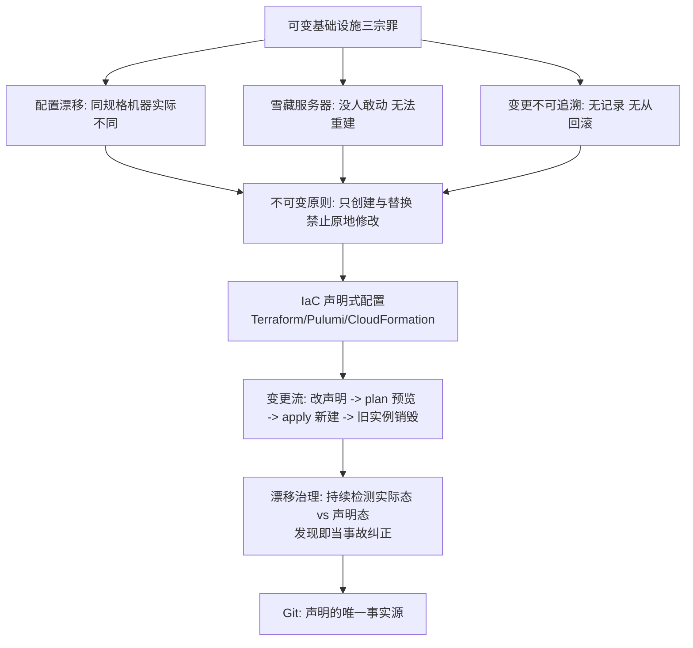
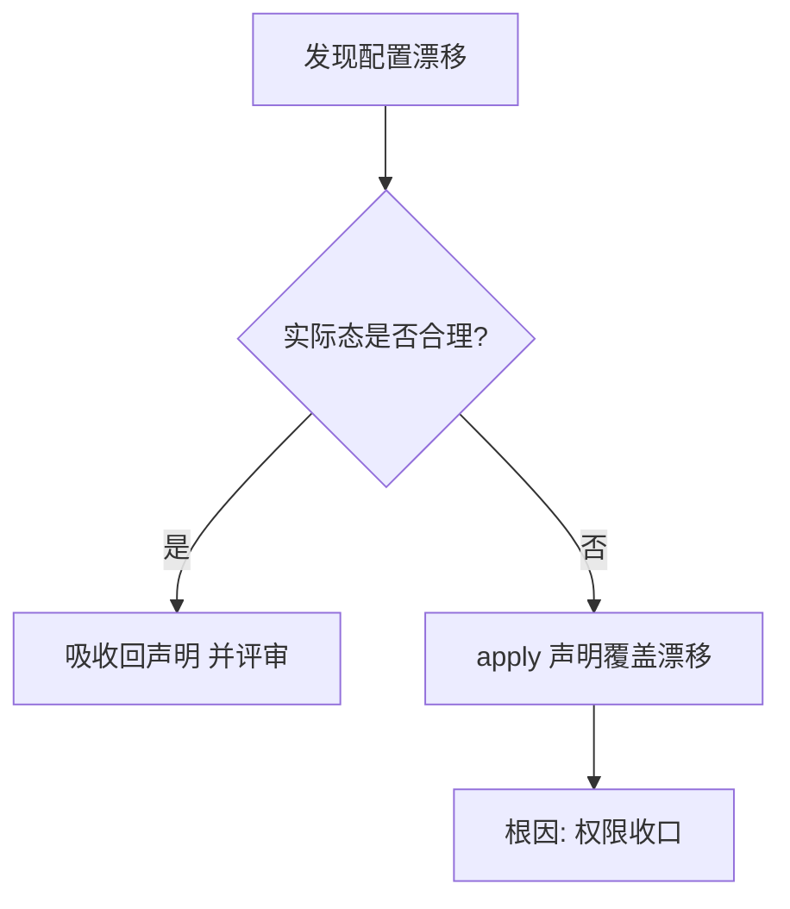

# 不可变基础设施与声明式配置

> **一句话摘要**：不可变基础设施 = 「服务器与部署**只创建和替换，绝不原地修改**」——消灭配置漂移、雪藏服务器与「这台机器特殊」的玄学；声明式配置是它的实现载体（Git 描述一切终态）；两者合起来把「环境一致性」从人工纪律升级为机器保证——这是 GitOps 与一切云原生运维实践的地基。

> **本文核心**：机制链 = **可变基础设施的三宗罪（配置漂移/雪藏服务器/变更不可追溯）→ 不可变原则：任何变更 = 销毁旧实例 + 用同一份声明创建新实例 → 声明式配置（IaC）承载「同一份声明」→ 漂移治理（检测→纠正→根因消除）→ 与 CI/CD 的闭环（构建新制品 = 构建新基础设施）**——「修改」这个动作被从生产环境里整体删除。

前置阅读：[Kubernetes 心智模型](./3_Kubernetes心智模型-声明式与控制循环-入门.md)。配置漂移与 GitOps 的联动见特性层[深入理解 GitOps 系列](../../../../index.md)。

## 1. 背景：「修改生产」为什么是万恶之源

可变基础设施的运维世界里，每台服务器都有「历史」：某次紧急修复手工改过一个参数、某台机器装过排查工具没卸、某个配置文件两个集群不一样——**配置漂移**让「同规格」的机器实际各不相同；「那台特殊机器」没人敢动（雪藏），坏了无法重建。更深的代价：**变更不可追溯**（谁在什么时候改了什么？没有记录），回滚只能靠记忆。不可变原则的回答：**把「修改」这个动作从生产环境删除**——变更永远是「用新版本声明新建一套」，旧的一套整体销毁。

## 2. 核心机制：不可变原则与 IaC 载体

- **不可变的两个层级**：① **基础设施层**——虚拟机/网络/数据库参数不原地改，改 Terraform 声明重建（代价更高的机器可以开「新实例 → 切流量 → 销毁旧实例」的蓝绿式轮换）；② **应用层**——容器镜像不可变，发布 = 换镜像（镜像篇的不可变引用在此的机制呼应）。
- **IaC 的语义**：Terraform/Pulumi 把基础设施写成声明式代码——**「声明」进 Git 评审、plan 预览变更、apply 落地、状态文件记录实际**；四步把基础设施变更纳入与代码变更同级的工程流程（评审/测试/回滚）。
- **漂移治理三步**：**检测**（持续比对实际态 vs 声明态——Atlas/DriftCTL 类工具或定时 plan）、**纠正**（差异即事故：要么 apply 声明覆盖、要么把合理的手工变更吸收回声明）、**根因消除**（为什么有人绕过流程改线上？权限回收 or 流程补洞）。
- **状态管理的暗坑**：IaC 的状态文件（Terraform state）记录「声明 ↔ 实际资源」的映射——状态文件损坏/丢失 = 无法管理既有资源。纪律：状态远端化（S3+锁）、禁止手工改状态、敏感信息不进状态明文。

## 3. 落地实践：不可变化的落地路径

1. **先容器化，再 IaC**：应用层先不可变（镜像发布），基础设施层随后 Terraform 化——两步降低一次性改造压力。
2. **权限收口是前提**：直接操作生产的手工权限不回收，不可变就是空话——「唯一能改生产的身份是 CI 流水线」。
3. **变更全部走流水线**：改声明 → PR 评审（plan 结果贴在 PR 里）→ 合并触发 apply——把「变更评审」从口头变成制品。
4. **漂移检测常态化**：定时 plan（无变更则确认无漂移）+ 告警——漂移检测是「不可变纪律的巡逻队」。
5. **legacy 系统的过渡**：暂时无法 IaC 的系统先做「配置基线快照 + 变更记录」，逐步吸收进声明——不强求一步到位。

## 4. 生产视角：违反不可变的事故形态

- **漂移导致的「恢复即事故」**：灾备切换到备机——备机配置与主机漂移（漏改一个参数），切换瞬间业务失败。不可变环境下备机 = 主机的同一声明产物，漂移不存在。
- **「只有一个人知道怎么部署」的巴士因子**：部署知识在某工程师的记忆/个人脚本里——不可变 + IaC 把知识从记忆变成 Git 里的声明（可读可评审可执行）。
- **手工修复引发的连锁**：一次紧急手工改线上参数救了火——但声明没同步，下次流水线 apply 把修复冲掉（事故复发）。纪律：紧急手工变更必须「当天回填声明」（热修流程闭环）。
- **状态文件事故**：Terraform state 误删/并发 apply——资源失联或重复创建。远端锁 + 备份 + 最小权限是标配。

## 5. 主流系统怎么做：不可变的生态兑现

| 层 | 主流工具 | 机制要点 |
|---|---|---|
| 基础设施 IaC | Terraform / Pulumi / Crossplane | 声明 + plan/apply + 状态管理 |
| 应用不可变 | 容器镜像 + GitOps（Argo CD） | 镜像不可变 + 集群向 Git 收敛 |
| 配置管理 | Kustomize/Helm（模板渲染产物仍声明式） | 模板是生成声明的手段，产物必须声明式 |
| 漂移检测 | 定时 plan / Argo CD 漂移状态 | 声明态与实际态的持续比对 |
| 服务器不可变 | 镜像化主机（AMI/黄金镜像 + 自动扩缩） | 虚机层也能不可变（镜像替换而非登录修改） |

规律：**不可变在每一层都有工具化兑现**——从虚机镜像到容器到云资源，「声明 + 替换」的模式跨层通用。

## 6. 典型场景

- **多环境一致性**（环境级）：dev/staging/prod 用同一份声明不同参数——环境差异参数化，结构零漂移。
- **灾备切换**（容灾级）：备站 = 主站声明的异地 apply——切换可信度由「同声明」保证。
- **安全审计**（合规级）：基础设施变更全在 Git（谁/何时/改了什么/谁批的）——审计即看 Git 历史。

## 7. 与相邻概念的区别

- **不可变基础设施 vs 配置管理工具（Ansible 类）**：Ansible 是「收敛配置到期望态」（仍是原地修改，可反复跑）；不可变是「禁止原地修改，替换实例」——思想分野：收敛 vs 重建。实践中 Ansible 也常被用于「重建后初始化」，两者可组合。
- **不可变 vs 幂等**：幂等是「重复执行结果一致」（Ansible 的性质）；不可变是「不执行修改」（原则）——幂等是可变世界的安全垫，不可变换了一个世界。
- **IaC vs GitOps**：IaC 是「基础设施即声明」；GitOps 是「Git 为唯一事实源 + 控制器自动收敛」——GitOps 是不可变 + 声明式 + 控制循环的组合应用（特性层专讲）。
- **本篇 vs K8s 心智模型（篇 3）**：K8s 的声明式资源本身不可变（Pod 不可改只能重建）——不可变原则在 K8s 里是「默认已实现」，本篇把它推广到全部基础设施层。

## 8. 常见误区与不适用

- **「不可变 = 不能有任何变更」**：是「不能原地修改」——通过「新建替换」的变更完全合法且是唯一合法方式。
- **「IaC 代码写了就是不可变了」**：声明存在 ≠ 被执行——绕过流水线的手工变更照样制造漂移；「权限收口 + 漂移检测」才是不可变成立的条件。
- **「不可变只管服务器」**：配置、网络、权限、DNS——一切生产组件都适用；「数据除外」（数据库内容是不可变原则的经典例外——数据靠迁移与备份治理）。
- **「不可变让紧急修复变慢」**：恰恰相反——紧急修复 = 改一行声明 + plan/apply（分钟级可回滚）；慢的是「没有流程的团队第一次建立流程」。
- **不适用**：数据本身（内容靠迁移与备份）；超短生命周期实验环境（用完即弃无漂移可治）；无法声明化的黑盒依赖（只能文档化 + 抽样核查）。

## 9. 你们可能会问

- **紧急修复怎么办，等流水线吗？** 预设「热修双通道」：紧急手工修（止血）+ 当天回填声明（持久化）+ 次日复盘根因——手工是止血不是治疗，回填是闭环。
- **Terraform 的 state 文件为什么是最大暗坑？** 它是「声明与现实的唯一映射」——丢失则无法管理既有资源、并发写则错乱。纪律：远端存储 + 状态锁 + 定期备份 + 最小权限。
- **数据库 schema 变更怎么纳入不可变？** schema 迁移脚本进 Git 版本化（Flyway/Liquibase 类）+ expand-contract 兼容纪律——数据内容不可变不适用，但「变更脚本不可变」完全适用。
- **怎么处理「声明无法表达」的资源配置？** 三层兜底：用 provider 的新特性（跟进版本）→ provisioner/local-exec 补丁（标记技术债）→ 文档化人工步骤 + 抽样核查——最后一级要登记债务。
- **不可变与成本的关系？** 正面：销毁旧实例即释放成本、环境按需重建省雪藏资源；反面：蓝绿/临时环境的双倍峰值成本——用「替换窗口最短化」与「按需环境」对冲。

## 10. 一句话总结 + 5W 速记卡 + 自测三问

**🎯 核心带走**：

- **核心一句话**：不可变基础设施 = 「只创建与替换，禁止原地修改」——IaC 声明承载唯一事实源（Git），漂移检测巡逻，紧急手工变更必须回填声明。
- **链条复述**：可变三宗罪（漂移/雪藏/不可溯）→ 不可变原则 → IaC 四步流（声明/评审/apply/销毁）→ 漂移治理三步 → 权限收口是前提。
- **失效点与边界**：权限不收口则不可变是空话；state 文件是暗坑需远端化；数据内容是经典例外。

**5W 速记卡**：

| 维度 | 内容 |
|---|---|
| What | 只创建替换 + IaC 声明 + 漂移治理 |
| Why | 配置漂移/雪藏机器/变更不可溯是可变世界的结构病 |
| When | 环境管理、发布流程、灾备切换、安全审计 |
| Where | 基础设施层与应用层（数据内容除外） |
| How | 声明进 Git → 权限收口 → 漂移检测 → 热修回填闭环 |

💡 **实战提示**：生产手工权限回收；plan 结果进 PR；漂移当事故；紧急变更当天回填声明；state 远端锁与备份。

**开放问题**：AI 生成的 IaC（从意图直接产出声明）会让「声明语言」的门槛消失——不可变纪律的执行会完全交给 AI 审查吗？

**决策（何时用）**：一切生产环境管理默认不可变原则；存量系统按「先容器化再 IaC」渐进；推荐「漂移检测 + 权限收口」作为不可变成立的两个前置检查。

**Trade-off（代价与反方案）**：不可变用「重建成本与 IaC 学习」换「一致性、可追溯与可回滚」；Ansible 收敛路线用「原地修改」换「渐进式低门槛」；state 集中管理用「单点风险」换「资源全局视图」——基础设施的每一个默认值，都是「稳定性与灵活性」的定价。

**演进视角**：从「宠物服务器」（每台有名字有历史）到「牲畜群」（同质可替换）的比喻演进，到 GitOps 把一切收敛进 Git——不可变思想十五年从边缘实践变成云原生默认；它的下一站与声明式 AI 交汇，但「消灭手工修改」的方向从未改变。

---

**下篇预告**：微服务数量上去后，服务间流量怎么治理——下一篇[服务网格](./5_服务网格-Sidecar与东西向治理-入门.md)讲 Sidecar 模式与东西向流量的下沉治理。

---

## 深度追问与设计思想

为什么「权限收口」是不可变成立的前提？因为不可变约束的是「修改的合法路径」（只允许流水线）——如果有人绕过流水线修改线上，漂移即刻产生。**再问一层：为什么紧急修复的豁免也要回填？** 不回填的每一次豁免都在声明「这次修改不需要追溯」——漂移的种子在豁免的那一刻就已埋下。

**设计思想：把「环境的正确性」从人的记忆转移给 Git**——传统运维的正确性存放在「老运维的经验」里；IaC 把这份经验编码成 Git 中的声明——新人 clone 仓库即获得全部环境知识。**Trade-off 量级分档：10w 请求**Ansible 收敛可能够用；**千万级**必须 Terraform+GitOps；**亿级**不可变+多环境模板是唯一可管理的方式。

---

## 📌 数据与事实声明

不可变基础设施概念出自 Chad Fowler（2013）与 Martin Fowler 公开阐述（martinfowler.com）；Terraform/Pulumi 状态管理与漂移检测为官方文档；12-Factor 相关原则为 12factor.net。以官方文档为准。

## 📚 参考资料

| 类型 | 标题 | 来源 |
|---|---|---|
| 文章 | Immutable Infrastructure（Martin Fowler / Kelsey Hightower 相关阐述） | martinfowler.com 等 |
| 文档 | Terraform 官方文档（state/plan/apply） | developer.hashicorp.com |
| 方法论 | GitOps Principles（OpenGitOps） | opengitops.dev |
| 系列文章 | Kubernetes 心智模型（上一篇） | 本仓库同系列 |
