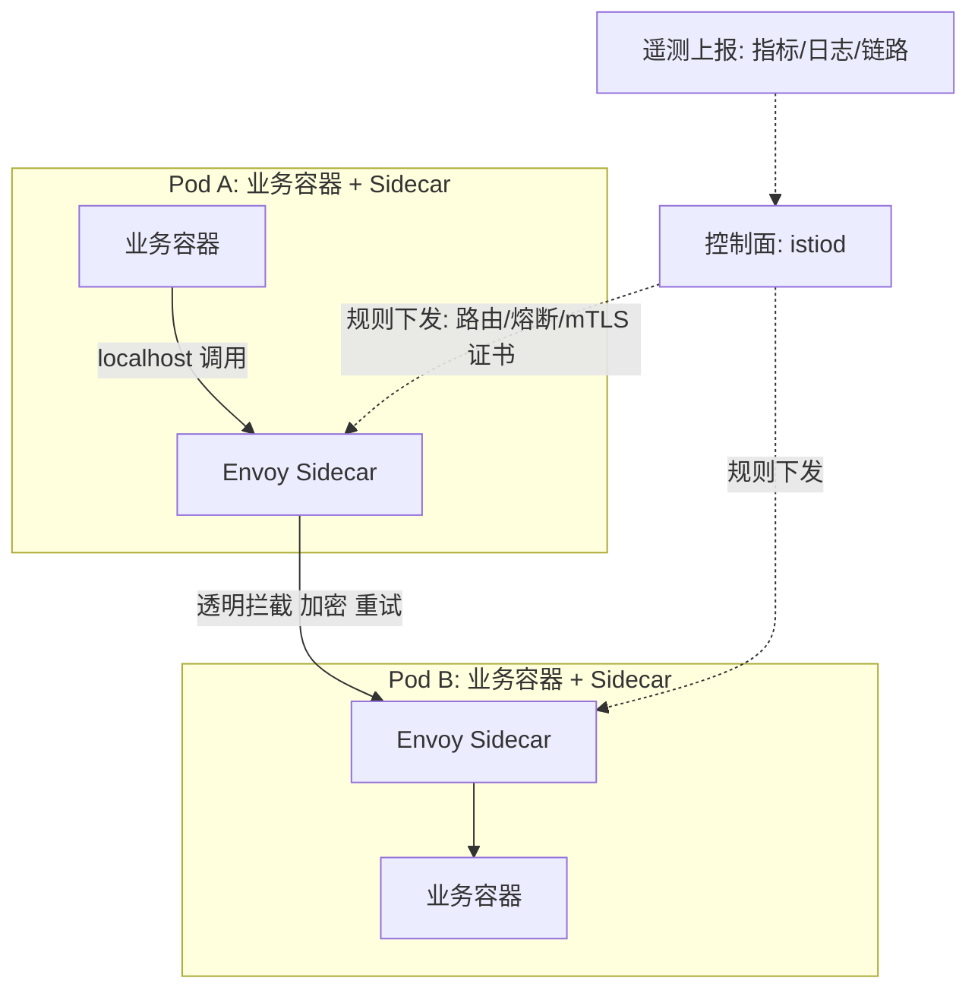
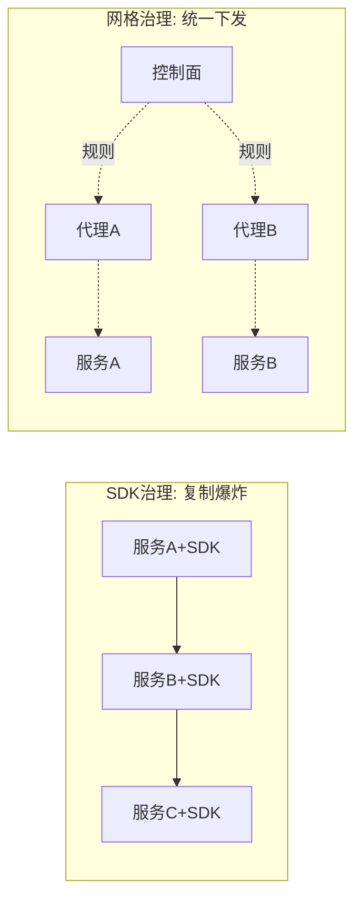

# 服务网格：Sidecar 与东西向治理

> **一句话摘要**：服务网格 = 把「服务间通信的重试/熔断/mTLS/灰度/观测」从业务代码里抽出来，**下沉到独立的代理层（Sidecar 或 Ambient）**——业务只管业务逻辑，通信治理全部平台化；它是「微服务数量上去后，治理逻辑复制爆炸」的解药——代价是代理层的延迟与运维复杂度。

> **本文核心**：机制链 = **东西向（服务间）流量的治理需求随服务数平方增长 → SDK 治理路线（Spring Cloud）：每个服务重复集成且语言绑定 → Sidecar 路线（Istio）：代理拦截全部进出流量，治理规则集中下发 → 数据面（Envoy 代理）+ 控制面（规则下发/证书）→ 现代演进：Sidecarless（Ambient/eBPF）降低代理成本**——网格的本质是「通信治理的基础设施化」。

前置阅读：[云原生是什么](./1_云原生是什么-范式迁移-入门.md)。服务治理的机制语义（重试/熔断/负载均衡策略）见本仓库 service-governance 子域，本篇讲「下沉与架构」。

## 1. 背景：治理逻辑复制爆炸的问题

10 个微服务，每个都要「重试 + 熔断 + mTLS + 链路追踪 + 灰度路由」——SDK 路线（Spring Cloud）下，这套治理逻辑要在**每个服务的每种语言**里各集成一遍：升级一个 SDK 版本 = 十几个服务滚动发版；多语言团队 = 每种语言找一个等价 SDK。**治理逻辑的复制份数 = 服务数 × 语言数**，且每份都可能漂移。服务网格的回答：治理逻辑抽出来放到基础设施层——业务进程只说「普通调用」，代理层统一治理。

## 2. 核心机制：Sidecar 数据面与控制面

- **Sidecar 模式的机制**：同一个 Pod 里塞两个容器（业务 + Envoy 代理），iptables/透明拦截把进出流量都导给 Sidecar——业务代码**零感知**地获得：自动重试、熔断、mTLS 双向加密、细粒度路由（按 header 灰度）、全链路遥测。治理规则由控制面（istiod）统一下发到所有 Sidecar——**规则改一处，全网生效**。
- **mTLS 是网格的明星收益**：服务间通信自动双向 TLS（证书自动轮换）——零信任网络的基石（安全篇联动），业务代码不碰任何证书逻辑。
- **流量治理的三层规则**：**路由**（按版本/header 分流——金丝雀发布的载体）、**韧性**（超时/重试/熔断/ outlier 逐出）、**策略**（限流/鉴权/配额）——三层规则在 Istio 里都是声明式 CRD（VirtualService/DestinationRule），与 K8s 声明式心智同构。
- **Sidecarless 演进**：Sidecar 的代价——每 Pod 一个代理的资源开销与升级的滚动成本。Istio Ambient 模式（2022+）：把代理拆成「节点级 ztunnel（L4）+ 可选 waypoint（L7）」——**按需分层的代理**；eBPF 路线（Cilium）则把部分治理直接放进内核——「代理下沉」从 Pod 级走向节点级/内核级。

## 3. 落地实践：网格的引入决策与纪律

1. **引入判据**：服务数 > 20、多语言混合、mTLS 合规要求、金丝雀发布需求——满足两条以上再考虑；10 个以内服务用 SDK/框架层治理足够（网格的运维成本收不回）。
2. **渐进引入**：先 namespace 级打标注入（auto-injection 按命名空间开），核心链路先行观察——不要全网一夜注入。
3. **资源与延迟预算**：Sidecar 注入后每请求增加约 1-3ms 延迟、每 Pod 增加约 0.5C/512Mi 资源（行业经验量级）——容量规划要把代理算进去。
4. **排障技能前置**：网格出问题时「业务团队看不懂 Envoy 日志」——Istio 的 `istioctl proxy-config` 系列命令与访问日志格式要进团队排障手册。
5. **规则治理纪律**：VirtualService/DestinationRule 也是声明式资产——进 Git、走评审、灰度下发（网格规则错误 = 全网流量事故）。

## 4. 生产视角：网格的事故形态

- **规则错误的全网放大**：一条 VirtualService 的重试配了无限次——雪崩放大器（重试风暴）。网格规则与代码同级评审。
- **Sidecar 升级的滚动风险**：Sidecar 升级 = 所有 Pod 重建（容器替换）——升级窗口与业务节奏对齐，或用 Ambient 模式解耦。
- **mTLS 迁移的双向豁免期**：注入 mTLS 后，「没注入的旧服务」发来的明文流量被拒——迁移要有 PERMISSIVE 模式过渡期，全网注入后再收紧 STRICT。
- **遥测数据洪峰**：全网格细粒度遥测的量级远超预期（每请求多条指标）——采样策略与遥测存储预算要提前定。

## 5. 主流系统怎么做：网格的生态位

| 方案 | 路线 | 机制要点 |
|---|---|---|
| Istio | Sidecar + Ambient 双模 | 功能最全，生态最大；Ambient 降资源门槛 |
| Linkerd | 轻量 Sidecar（Rust 数据面） | 资源占用小、上手快，功能相对克制 |
| Cilium 服务网格 | eBPF 数据面 | 内核级代理，高性能路线 |
| Consul Connect | HashiCorp 生态 | 多数据中心场景 |
| 云托管网格 | 各云托管 Istio/GRPC 路由 | 控制面托管免运维 |

规律：**网格的演进方向是「代理更轻、治理更强」**——Sidecar → Ambient → eBPF 的路线之争核心是「L4 够不够、L7 放哪里」。

## 6. 典型场景

- **零信任合规**（安全级）：全员 mTLS + 细粒度授权策略——监管或安全基线要求的标配方案。
- **金丝雀发布**（发布级）：按 header/权重分流到新版本 + 自动分析指标——渐进式交付的流量底座。
- **多语言微服务**（治理级）：Java/Go/Python 混合团队——治理逻辑统一下沉，各语言只写业务。

## 7. 与相邻概念的区别

- **服务网格 vs API 网关**：网格管**东西向**（服务间东西流量）；网关管**南北向**（外部进集群的入口流量）——位置与职责不同，大型系统两者共存（网关在边界、网格在内部）。
- **服务网格 vs SDK 治理（Spring Cloud）**：基础设施下沉（语言无关、统一升级）vs 应用内嵌（语言绑定、逐服务升级）——多语言/大规模选网格，单语言小规模 SDK 足够。
- **Sidecar vs Ambient**：每 Pod 代理 vs 节点级分层代理——资源成本与 L7 功能粒度的权衡（Istio 官方给的渐进路径）。
- **本篇 vs 服务治理子域**：治理子域讲「治理机制本身」（重试/熔断/限流的语义与参数）；本篇讲「治理的基础设施化架构」——机制与载体的分工。

## 8. 常见误区与不适用

- **「上了网格就不用 SDK 治理了」**：网格治理在「网络层」——业务内的重试（调库失败重查）、本地缓存等语义仍在应用；两层治理要分工不重叠。
- **「网格是性能优化」**：恰恰相反——网格增加一跳代理（延迟+资源），换来的是治理能力与安全性；它是治理投资不是性能投资。
- **「mTLS 开了就绝对安全」**：mTLS 只解决「传输加密与身份认证」——授权策略（谁能调谁）要另配 AuthorizationPolicy；证书体系被攻破则全失。
- **「网格规则随便改，反正能回滚」**：规则变更全网实时生效——错误路由/熔断参数会把流量打进深渊；规则变更要走与代码同级的灰度评审。
- **不适用**：服务数少且同语言的系统（SDK 治理更经济）；超低延迟核心链路（代理一跳的延迟敏感时慎入）；无平台运维能力的团队（网格运维比 SDK 重一个量级）。

## 9. 你们可能会问

- **Sidecar 怎么拦截流量的？** Pod 内 iptables/透明重定向规则把进出流量导向 Envoy 监听端口——拦截在应用无感知的网络层完成。
- **Istio 的虚拟服务（VirtualService）和 DestinationRule 分工？** VS 定义「路由怎么走」（按 header/权重分流），DR 定义「到达目的地后的策略」（负载均衡/连接池/ outlier 逐出）——路由与策略两层分离。
- **网格会让服务间调用的排障变难吗？** 会变的更「透明」而非更难——全网格自动注入 trace header 与访问日志，配合 Kiali 拓扑可视化，排障线索比无网格时代更全；难的是「多学一层工具」。
- **Ambient 模式的 ztunnel/waypoint 是什么？** ztunnel 是节点级 L4 代理（mTLS/遥测，资源省）；waypoint 是按需的 L7 代理（路由/策略需要时才挂）——「按需分层」降低网格的资源与运维税。
- **多集群网格怎么组网？** 两条路线：多控制面互信（各集群独立 istiod + 证书互信）与单控制面多集群——按故障域隔离需求与延迟预算选。

## 10. 一句话总结 + 5W 速记卡 + 自测三问

**🎯 核心带走**：

- **核心一句话**：服务网格 = 通信治理的基础设施化——Sidecar/Ambient 代理拦截东西向流量，重试/熔断/mTLS/灰度/遥测集中下发；买的是治理与安全，付的是延迟与运维复杂度。
- **链条复述**：治理复制爆炸 → Sidecar 透明拦截 → 控制面规则下发 → mTLS/路由/韧性三层规则 → Ambient/eBPF 降本演进 → 引入判据与治理纪律。
- **失效点与边界**：延迟与资源有代价；小规模不经济；业务内语义治理不归它；规则错误全网放大。

**5W 速记卡**：

| 维度 | 内容 |
|---|---|
| What | Sidecar/Ambient 数据面 + 控制面规则 + mTLS/路由/韧性 |
| Why | 治理逻辑复制爆炸（服务数 × 语言数）的基础设施化解法 |
| When | 服务多、语言杂、要 mTLS 合规、要金丝雀时 |
| Where | Pod 内代理 / 节点级代理 / 内核 eBPF |
| How | 渐进注入 → 规则进 Git 灰度 → mTLS 分级迁移 → 排障手册前置 |

💡 **实战提示**：重试必须配上限（网格内也一样）；mTLS 迁移走 PERMISSIVE 过渡；遥测采样提前定预算；规则变更走灰度评审。

**开放问题**：eBPF 与 Ambient 把代理推向内核与节点级，Sidecar 这个「网格的标志物」会彻底退场吗——无 Sidecar 的网格还叫网格吗？

**决策（何时用）**：多语言、20+ 服务、mTLS/金丝雀刚需时推荐引入；推荐「namespace 渐进注入 + 规则 Git 化 + 排障手册前置」的采纳路径。

**Trade-off（代价与反方案）**：网格用「代理延迟 + 资源开销 + 运维复杂度」换「治理统一 + 零信任 + 语言无关」；反方案——SDK 治理（经济，代价是复制漂移）、框架内治理（Spring Cloud 全家桶，代价是语言绑定）；Sidecar 与 Ambient 的权衡：L7 功能粒度 vs 资源成本——按「多常用的 L7 治理」渐进挂载。

**演进视角**：从 SDK 治理（2010s Spring Cloud 时代）到 Sidecar 网格（2017 Istio 发布）到 Sidecarless/eBPF（2022+）——「治理逻辑的位置」十年三迁且持续下沉；不变的判断句式：**当一种能力的重复实现成本超过平台化成本时，它就该下沉**——服务网格如此，未来的任何 X-as-infrastructure 亦然。

---

**下篇预告**：从常驻服务到按需执行——下一篇[Serverless 与 FaaS](./6_Serverless与FaaS-从常驻到按需-入门.md)讲计费与并发模型的范式切换。

---

## 深度追问与设计思想

为什么治理逻辑要下沉到代理而不是继续用 SDK？SDK 的治理规则更新需要每个服务重新编译部署——100 个服务 × 3 种语言 = 300 次发布才能统一一条重试规则；代理把规则下发变成控制面推送——秒级全网生效。**再问一层：为什么不用共享治理库代替代理？** 共享库仍是语言绑定且升级仍有发布成本——只有进程外代理才能做到真正的语言无关。

**设计思想：把「治理成本」从 O(服务数×语言数) 降为 O(平台数)**——网格的本质是治理成本的结构性优化。代价是每次请求增加一跳代理。**Trade-off 量级分档：10w 请求**SDK 治理更经济；**千万级**网格开始回本；**亿级**网格是唯一可管理的治理方式。

---

## 📌 数据与事实声明

Sidecar 模式、istiod 控制面、Ambient 模式（ztunnel/waypoint）、mTLS 语义出自 Istio 官方文档；eBPF 网格为 Cilium 官方文档；延迟与资源开销为行业经验量级；Linkerd/Consul 为各自官方文档。以各项目官方文档为准。

## 📚 参考资料

| 类型 | 标题 | 来源 |
|---|---|---|
| 文档 | Istio 官方文档（概念/Ambient） | istio.io |
| 文档 | Linkerd / Cilium Service Mesh | linkerd.io · cilium.io |
| 系列文章 | 服务治理子域（重试/熔断/负载均衡机制） | 本仓库 service-governance/ |
| 系列文章 | 不可变基础设施（篇 4） | 本仓库同系列 |
