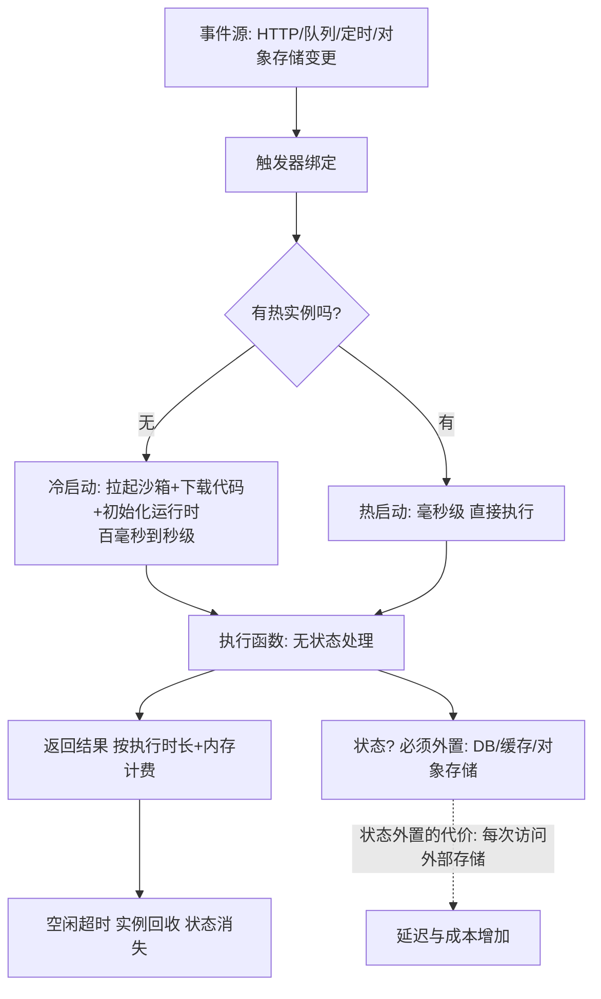
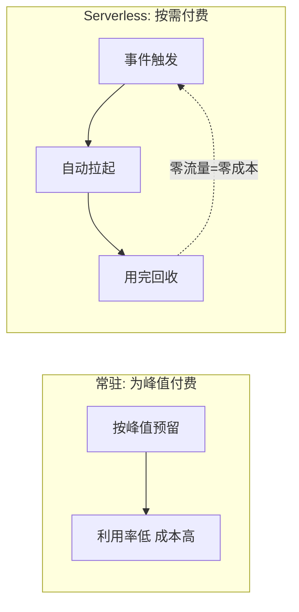

# Serverless 与 FaaS：从常驻到按需

> **一句话摘要**：Serverless 把「常驻服务」换成「**事件触发的按需执行**」——无服务器管理、按调用计费、自动弹性到零；FaaS（函数即服务）是它的函数形态。它用「冷启动延迟、运行时约束、厂商绑定、状态外置」四个新代价，换来「零运维 + 精确到毫秒的计费 + 极致弹性」——选型的本质是「负载形态与代价结构的匹配」。

> **本文核心**：机制链 = **事件（HTTP/队列/定时/流）→ 触发函数实例 → 冷启动（无实例时拉起：拉镜像+初始化运行时）或热启动（复用实例）→ 执行 → 按执行时长+内存计费 → 实例回收（状态不保留，状态必须外置）**——Serverless 改变的不是性能，是「容量规划、成本结构与运维责任」的分配方式。

前置阅读：[云原生是什么](./1_云原生是什么-范式迁移-入门.md)。异步编排与消息语义见[异步削峰](../../../system-design/distributed-system-design/入门层/从零开始认识分布式系统设计系列/5_异步削峰-入门.md)。

## 1. 背景：常驻服务的浪费与负担

传统常驻服务（一直运行的容器/进程）为「峰值」付费与运维：99% 时间的低流量也在烧资源；扩容要预估、缩容要谨慎；操作系统/运行时/依赖的安全补丁全部自己打。Serverless 的回答：**运行时也托管**——你只交代码（函数），平台负责拉起、伸缩、打补丁、计费到毫秒。这是「云原生理念」的极简化：不可变（代码包即部署单元）、声明式（事件源绑定）、弹性到零、按需付费——理念全部继承，运维全部上收。

## 2. 核心机制：冷启动、事件模型与状态外置



- **冷启动的构成与优化**：冷启动 = 沙箱分配 + 拉代码包 + 运行时初始化 + 函数初始化（连池/加载配置）。优化路径：**代码包瘦身**（依赖裁剪，镜像化 FaaS 可到百 MB 级）、**初始化懒化**（连池延迟建）、**预留实例**（付费保底热实例——但这就「部分 Serverless 化」了）、**快照恢复**（ Firecracker 微 VM 快照/内存快照恢复到毫秒级——平台演进方向）。
- **状态必须外置**：函数实例随时被回收/复制——**进程内存不可信**。所有状态落外部（数据库/Redis/对象存储）；「函数间通信」也走存储或消息，不做内存共享。这个约束同时是纪律：强制无状态化天然适配水平扩展。
- **事件模型的富ulfill**：Serverless 的本质是「事件驱动计算的托管化」——HTTP 请求、队列消息、存储变更、定时器、流事件都是一等触发源；**事件源与函数的绑定是声明式的**（配置而非代码）。
- **并发模型**：每个请求（或每批消息）一个函数实例（请求级隔离）——**无并发安全问题的编程模型**（实例间天然隔离），代价是实例数 = 并发数（洪峰时实例数暴涨，下游要扛得住——下游保护意识不可少）。

## 3. 落地实践：什么负载适合 Serverless

```text
高度适配:
  事件驱动的副动作: 图片上传缩略图/消息 webhook/审计落盘
  不定时批处理: 报表生成/数据清洗/定时对账
  流量极不稳定的 API: 内部工具/活动页(峰值瞬时)
  胶水与编排: 事件串联/ETL 轻步骤
不适合:
  恒定高 QPS 核心服务(预留实例成本 > 容器 + 状态外置延迟不可接受)
  长耗时任务(执行时长上限 15 分钟量级 - 行业惯例)
  强状态/低延迟(内存状态与微秒延迟是 FaaS 的死穴)
  WebSocket 长连接(连接保持与 Serverless 模型冲突)
```

四条纪律：① **幂等必配**（事件源至少一次投递——重复执行函数要无害，幂等篇的三层防线照用）；② **超时与重试策略显式**（平台默认重试可能造成副作用放大）；③ **冷启动敏感路径做预留或换形态**（用户直接交互的接口慎用纯冷启动）；④ **成本可观测**（按函数维度计量——「哪个函数烧钱」要能一键回答）。

## 4. 生产视角：Serverless 的事故形态

- **冷启动打崩体验**：突发流量来时全部冷启动（并发拉起受限）——首字节延迟秒级。缓解：预留并发/最小实例 + SnapStart 类快照 + 关键路径预热。
- **重试风暴的副作用放大**：队列触发 + 函数失败重试 + 无幂等——同一副作用执行多次（扣两次款/发两封邮件）。幂等键与重试策略必须成对评审。
- **隐性成本失控**：函数调外部 API 的一次调用 = 函数时长 + 外部费用双计费；日志/流量的隐形收费项也按量累积——「按量」的双刃剑是「不治理就无限增长」。函数级成本看板与预算告警是标配。
- **供应商绑定的迁移债**：函数签名/触发器配置/专有 SDK 深度绑定平台——迁移 = 重写。缓解：业务逻辑与平台胶水分层（核心逻辑纯函数化 + 平台层薄封装）。
- **可观测性的新形态**：分布式追踪跨「函数实例生命周期」——实例回收后日志消失，必须实时外送；冷/热启动的延迟差异要在观测里区分标记。

## 5. 主流系统怎么做：Serverless 的生态位

| 形态 | 代表 | 机制要点 |
|---|---|---|
| 公有云 FaaS | AWS Lambda / 阿里云 FC / 腾讯 SCF | 事件源绑定 + 按量计费 + 预留实例 |
| Knative | K8s 上的 Serverless（自建路线） | 缩容到零 + 流量灰度——Serverless 思想的 K8s 兑现 |
| 容器化 Serverless | 云原生容器实例（ACI/Cloud Run 类） | 容器镜像即函数——冷启动用镜像换灵活性 |
| 边缘函数 | Cloudflare Workers 类 | V8 隔离体冷启动毫秒级——边缘场景的形态 |
| 工作流编排 | Step Functions / 云工作流 | 函数串联编排的托管化（Saga 思想的托管版） |

规律：**Serverless 从 FaaS 单点扩展为「全托管家族」**——数据库（Serverless DB）、容器（缩到零）、消息（Serverless 队列）都在按需化；「托管边界持续外扩」是云计算十年主旋律。

## 6. 典型场景

- **文件处理管线**（事件级）：上传触发 → 缩略图 → 入库——事件驱动的教科书场景。
- **定时对账与报表**（任务级）：定时触发 + 结果落存储——免维护的任务执行器。
- **活动页突发 API**（弹性级）：活动期间瞬时峰值，平时趋零——Serverless 成本结构最优的场景。

## 7. 与相邻概念的区别

- **Serverless vs 容器**：托管执行 vs 自管运行时——「运维责任边界」的分配差异；容器 Serverless（Cloud Run/Knative）是中间形态。
- **FaaS vs BaaS**：FaaS 是函数托管（自写逻辑）；BaaS 是后端能力托管（数据库/认证/存储直接用）——Serverless = FaaS + BaaS 的组合拳。
- **冷启动 vs 水平触发等待**：冷启动是「实例拉起延迟」（平台侧）；锁等待/下游慢是「业务依赖延迟」（应用侧）——同为「慢」，归因与治理完全不同。
- **本篇 vs 异步削峰（设计系列）**：削峰讲「队列缓冲的通用机制」；Serverless 讲「托管化的事件执行」——削峰可以用 Serverless 实现，也可用 MQ+消费者自建。

## 8. 常见误区与不适用

- **「Serverless 一定省钱」**：恒定高负载下，按量计费贵于包月容器（预留实例也在逼近临界）——成本模型按「负载波动率」算，不是按信仰。
- **「无运维 = 无 SRE」**：平台托管的运维少了，但**可观测性、成本治理、安全配置、容量(预留)管理**仍是你的事——运维责任转移了形态没有消失。
- **「函数就是小，所以不用设计」**：恰恰因为单元小，函数边界/事件契约/幂等设计更需要前置思考——「小」放大了设计错误的影响面。
- **「锁死在一家也没事，反正能跑」**：三五年后的迁移成本/议价能力/合规要求都会变化——绑定是可计价的债务。
- **不适用**：恒定高流量核心链路（预留成本劣势+状态外置延迟）；长连接/有状态实时（模型冲突）；超长任务（时长上限）；强 GPU 常驻训练（形态不符——推理按需可用）。

## 9. 你们可能会问

- **冷启动到底多慢？** 因运行时而异：轻量运行时（Node/Python）百毫秒量级，JVM 类数秒量级；镜像化容器函数取决于镜像大小——「量级」随平台演进持续变化，以实测为准。
- **预留实例是不是「不 Serverless 了」？** 是「混合形态」：保底容量包月 + 弹性部分按量——成本优化的合法手段，不损失自动弹性的上限能力。
- **函数间怎么编排复杂流程？** 平台工作流服务（Step Functions 类）声明式编排 + 各函数单一职责；或事件链（A 完成发事件触发 B）——复杂状态编排别硬写在单函数里。
- **Serverless 的安全边界有什么不同？** 攻击面缩小（无持久主机）但配置面变大（每个函数的权限/触发器/环境变量）——最小权限（每函数独立角色）比传统服务更细粒度也更必要。
- **怎么逐步把存量服务 Serverless 化？** 从「事件驱动的边缘模块」试点（上传处理/定时任务）→ 验证成本与可观测体系 → 再评估核心链路——「边缘先行」与不可变篇的迁移思想同源。

## 10. 一句话总结 + 5W 速记卡 + 自测三问

**🎯 核心带走**：

- **核心一句话**：Serverless = 事件触发 + 按需执行 + 状态外置的托管计算——用「冷启动/绑定/状态外置」四个代价换「零运维 + 毫秒计费 + 弹性到零」；负载形态匹配是选型唯一标准。

**5W 速记卡**：

| 维度 | 内容 |
|---|---|
| What | 事件触发 FaaS + 冷启动 + 状态外置 + 按量计费 |
| Why | 常驻服务的资源浪费与运维负担按负载形态可免 |
| When | 事件驱动副动作、不定时任务、瞬时峰值 API |
| Where | 公有云 FaaS/Knative/边缘函数 |
| How | 幂等必配 → 超时显式 → 冷启动对策 → 成本看板 → 边界先行 |

💡 **实战提示**：事件重试配幂等；冷启动路径预留或换形态；函数成本按维度看板；逻辑与平台胶水分层防绑定。

**开放问题**：快照恢复与 WebAssembly 让冷启动逼近毫秒级——如果冷启动彻底消失，「常驻 vs 按需」的成本与架构分界还存在吗？Serverless 会不会成为一切计算的新默认？

**决策（何时用）**：事件驱动、波动负载、免运维诉求推荐 Serverless；恒定核心链路推荐容器；推荐「负载波动率 × 状态需求 × 延迟敏感度」三维评估表作为立项工具。

**Trade-off（代价与反方案）**：Serverless 用「冷启动/绑定/状态外置/观测形态变化」换「零运维与弹性到零」；预留实例用「部分包月成本」换「冷启动消除」；反方案——常驻容器（可控，代价是容量治理）、自建 FaaS 平台（Knative：可控，代价是平台运维）——每个「免运维」都对应一份「平台信托费」。

**演进视角**：从「数据中心」（自有机房）到「云主机」（IaaS 租机器）到「容器编排」（PaaS 自管）到「Serverless」（FaaS 全托管）——「云的责任边界」每五年上移一层；Serverless 不是终点，「意图级云」（声明业务意图、平台全托管）是云计算的下一张地图，而今天的冷启动/绑定问题就是那张地图的待画区域。

---

**下篇预告**：分布式系统的「神经系统」——下一篇[云原生可观测](./7_云原生可观测-三大支柱与OpenTelemetry-入门.md)讲 Metrics/Logs/Traces 与 OpenTelemetry 的统一。

---


## 深度追问与设计思想

为什么函数实例「必须无状态」？因为平台的调度器随时可能回收实例——如果状态在实例内存里，回收即丢失。**再问一层：能不能让平台「保证不回收」？** 可以买预留实例——但这就回到了「为峰值付费」的常驻模式，Serverless 的成本优势被部分放弃。状态外置不是平台的限制，是 Serverless 经济模型的前提。

**设计思想：把「容量规划」从人工预测变成平台自动**——传统服务要预估峰值并按峰值预留资源；Serverless 让平台按实际请求自动伸缩——「预测未来」这个最不可靠的环节被从系统里删除了。**Trade-off 量级分档：10w 请求**常驻容器可能更经济；**千万级**Serverless 开始回本；**亿级**必须全托管。



---

## 📌 数据与事实声明

冷启动构成、事件源绑定、按量计费模式为 AWS Lambda/阿里云 FC/Knative 官方文档的机制级概括；执行时长上限（15 分钟量级）为行业惯例认知；Firecracker 快照与边缘函数为各平台公开资料；成本结论请以自身账单实测为准。

## 📚 参考资料

| 类型 | 标题 | 来源 |
|---|---|---|
| 文档 | AWS Lambda / 阿里云函数计算 官方文档 | docs.aws.amazon.com · help.aliyun.com |
| 项目 | Knative 官方文档 | knative.dev |
| 图书 | Serverless Architectures on AWS（第二版） | Manning |
| 系列文章 | 异步削峰（设计系列） | 本仓库 distributed-system-design/ |
