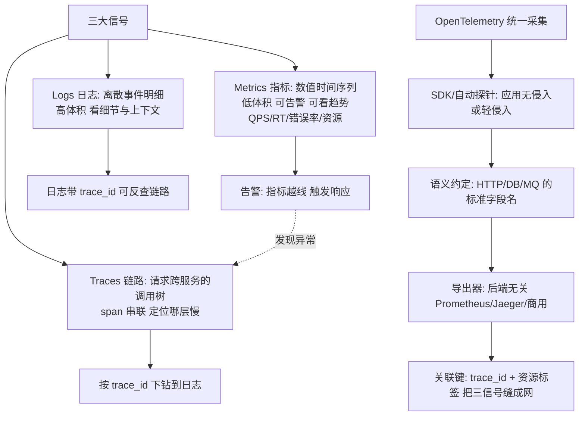
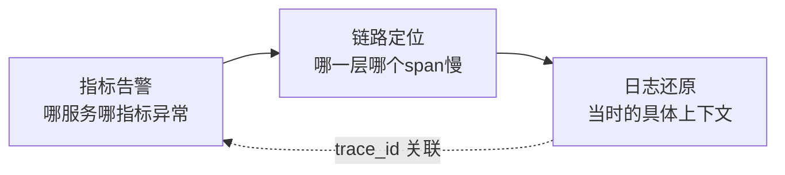

# 云原生可观测：三大支柱与 OpenTelemetry

> **一句话摘要**：可观测 = 从系统**外部信号推断内部状态**的能力——三大信号各司其职：**Metrics（指标：知道不对了）、Logs（日志：看到细节）、Traces（链路：跨服务定位）**；OpenTelemetry（OTel）把三信号的采集/传输/关联统一成一套标准——微服务时代的排障，没有统一可观测体系等于「蒙眼修车」。

> **本文核心**：机制链 = **分布式化的三大后果（调用链跨服务/实例瞬生瞬灭/数据量爆炸）→ 三大信号分工（Metrics 告警定位、Logs 细节还原、Traces 跨服务定界）→ 关联键（trace_id/资源标签）把三信号缝成一张网 → OTel 统一采集（SDK/自动探针 → 语义约定 → 后端无关导出）→ 高基数与采样是成本治理的两大战场**——可观测的目标不是「采集数据」而是「缩短 MTTR」。

前置阅读：[服务网格](./5_服务网格-Sidecar与东西向治理-入门.md)（网格自动注入遥测）。指标告警与稳定性工程的联动见稳定性子域。

## 1. 背景：为什么传统监控在微服务时代失效

单体时代的监控：看主机 CPU/内存 + 看应用日志——两块面板解决。微服务时代：**一次请求跨 10 个服务**，每个服务多个实例瞬生瞬灭——① 主机视角没了（实例是临时的）；② 「哪个服务慢了」无法从单机指标判断；③ 日志散在几十个节点的滚动文件里。可观测（Observability）作为独立能力的定义由此而来（Control Theory 借词）：**系统对外部输出的信息，要足以回答「内部发生了什么」**——三大信号 + 关联键是它的落地形态。

## 2. 核心机制：三大信号与 OTel 统一

- **三信号的分工与顺序**：排障的标准动线是 **Metrics 告警发现异常（哪服务哪指标）→ Traces 定位调用树（哪一层哪个 span 慢/错）→ Logs 还原细节（当时的具体上下文）**——三信号由 `trace_id` 与资源标签（service/version/环境）缝合。只有 Metrics 的团队知道「出了事」，加上 Traces 知道「在哪出事」，加上 Logs 知道「为什么出事」。
- **OpenTelemetry 统一了什么**：OTel 之前每个后端（Prometheus/Jaeger/Datadog）有自己的 SDK——换后端 = 全应用改埋点。OTel 统一了**采集 API + 语义约定（standard 字段：http.method、db.system…）+ 导出协议**——应用只做一次埋点，后端自由切换。它不提供存储与展示（那是后端的事），只统一「采集与传输」。
- **高基数（cardinality）是指标的头号成本坑**：标签值无限组合（user_id 做 label）会让时序数据库索引爆炸——**指标标签只放低基数值**（服务/环境/状态码），高基数细节交给日志与链路。这是 Metrics 设计的第一纪律。
- **采样的成本治理**：全量链路追踪的成本（每请求每 span 的存储与传输）在大流量下不可承受——**头部采样**（按比例保留完整链路）与**尾部采样**（保留全部错误/慢链路，丢弃正常链路）——尾部采样价值密度最高但需要集中决策点（成本更高），头部采样简单但可能丢弃「事后才知道重要」的链路。

## 3. 落地实践：可观测体系的建设清单

1. **统一语义与关联键**：全链路 trace_id 透传（HTTP header/消息属性）+ 日志带 trace_id + 服务名/版本标准化（OTel 语义约定）——「缝合」先于「采集」。
2. **指标分层**：基础设施指标（节点/Pod）→ 中间件指标（MQ lag/DB 连接）→ 应用黄金指标（QPS/错误率/延迟/饱和度——USE/RED 方法）→ 业务指标（订单率/支付成功率）——**每层都要有，故障定位是逐层收窄的**。
3. **日志结构化**：JSON 格式 + 固定字段（时间/级别/trace_id/服务名/消息）——非结构化日志无法有效检索与关联。
4. **告警纪律**：告警必须「可行动」（收到后知道做什么）；分级（P0 电话/P1 即时/P2 工单）；避免告警疲劳（噪声告警会让真告警被无视——告警治理是持续工程）。
5. **常态化压测与验证**：可观测体系自身要被验证——故障演练时核对「告警是否触发/链路是否完整/日志是否可查」。

## 4. 生产视角：可观测缺失的形态

- **「知道有故障但不知道在哪」**：只有聚合监控（总错误率上升）无链路——十个服务人工逐个排查。MTTR 的差异：有链路追踪的团队分钟级定位，无链路的团队小时级（行业共识）。
- **日志散落的拼图地狱**：一次排障要登 5 台机器 grep 5 个文件再人工拼时序——结构化集中检索（ELK/Loki）缺失的直接代价。
- **高基数打爆监控库**：把 user_id/order_id 放进指标标签——Prometheus 内存与存储被时序量撑爆。指标设计评审要含「基数预算」。
- **告警疲劳的真告警淹没**：日告警数千条、90% 无需行动——值班人对告警脱敏，真故障漏响应。告警的「信噪比」要像业务 SLA 一样治理。
- **采样把关键链路采丢了**：头部采样按比例丢弃——「恰好是出错的那个请求」没被采到；重要端点（支付）用尾部采样或强制保留。

## 5. 主流系统怎么做：可观测的生态位

| 信号 | 主流后端 | 机制要点 |
|---|---|---|
| Metrics | Prometheus + Grafana（云原生标配）/ VictoriaMetrics（大规模） | 拉取模型 + 时序存储 + PromQL |
| Logs | ELK / Loki / 云日志服务 | 集中检索 + 结构化索引（Loki 只索引标签省成本） |
| Traces | Jaeger / Tempo / 商用 APM | span 存储 + trace 检索 + 服务拓扑 |
| 统一采集 | OpenTelemetry Collector | 接收/处理/导出三段管道 |
| 持续剖析 | Pyroscope/Parca | 代码级 CPU/内存火焰图（第四信号的兴起） |

规律：**「OTel 统一采集 + 后端专业化」是当前格局**——采集标准化收敛到 OTel，存储与展示仍按信号专业化；Profiling（持续剖析）作为「第四信号」正在加入。

## 6. 典型场景

- **跨服务排障**（排障级）：告警 → 链路定位 → 日志还原的标准动线——MTTR 的主要缩短来源。
- **容量与成本治理**（FinOps 级）：资源指标 + 成本标签的联合分析——FinOps 的数据基础（FinOps 篇联动）。
- **发布验证**（发布级）：金丝雀发布期间的指标对比与链路错误率——自动化发布分析的数据源（Argo Rollouts 联动）。

## 7. 与相邻概念的区别

- **可观测 vs 监控**：监控是「预定义项的检查」（知道会出什么问题）；可观测是「未知问题也可探查」（开放式问询能力）——监控答已知问题，可观测答未知问题，两者组成完整体系。
- **Metrics vs Logs vs Traces 的选型误区**：三者不互替——「都能用日志查」的思路在大流量下成本失控；每个信号有性价比最优的用途。
- **OpenTelemetry vs 供应商 SDK**：OTel 是厂商中立标准（换后端不换埋点）；供应商 SDK 与其平台深度优化——「标准 vs 深度集成」的权衡，行业趋势在向 OTel 收敛。
- **本篇 vs 稳定性工程**：可观测是稳定性工程的「感知环节」（事中）；稳定性子域还包含预防/应急/演练的完整体系——信号与行动的分工。

## 8. 常见误区与不适用

- **「三大支柱是三套独立系统」**：支柱的价值在「关联」——trace_id 串联、统一资源标签；分建三套不关联 = 排障时三头对不上。
- **「数据全量采集最安全」**：全量的存储成本与检索噪声都是代价——按价值密度采样与分层保留是工程必答题。
- **「可观测 = 装 Prometheus」**：工具是载体——语义约定、关联键、告警纪律、排障动线的**体系**才是可观测；装了工具没建体系是常见的「可观测幻觉」。
- **「日志越多越好查」**：无结构化与分级的大量日志 = 存储成本与检索噪声双升——「有价值的结构化日志」优于「海量的非结构化文本」。
- **不适用**：超小单体系统（一台机器两块面板足够——体系成本不值）；强离线分析（离线数仓另说）——可观测体系的成本要配得上业务的 MTTR 价值。

## 9. 你们可能会问

- **trace_id 怎么跨进程传递？** W3C TraceContext 标准 header（traceparent）——HTTP header/消息属性/RPC 元数据逐跳透传；OTel SDK 自动注入与提取（跨语言一致）。
- **指标、日志、链路的存储保留期怎么定？** 按价值衰减：指标（原始 15 天 + 降采样 1 年）、链路（全量 7 天 + 采样 30 天）、日志（热 7 天 + 温 30 天 + 冷归档按合规）——保留期是「排障价值 × 存储成本」的定价。
- **RED 和 USE 方法是什么？** RED（Rate/Errors/Duration）面向服务请求指标；USE（Utilization/Saturation/Errors）面向资源——两套 checklist 覆盖「服务与资源」两视角的指标设计。
- **OTel Collector 要部署几层？** 典型两层：Agent（DaemonSet 贴近应用，做接收与缓冲）→ Gateway（集中做处理：采样/脱敏/路由）——小规模单层 Agent 直发也可。
- **怎么验证可观测体系是否合格？** 注入故障演练（错误注入/延迟注入/依赖断开）核对：告警是否触发、链路是否完整、日志是否可查、MTTR 是否达标——四项演练是可观测的验收标准。

## 10. 一句话总结 + 5W 速记卡 + 自测三问

**🎯 核心带走**：

- **核心一句话**：可观测 = Metrics 告警发现 + Traces 定界 + Logs 还原的三信号体系，由 trace_id 与统一语义缝合；OTel 统一采集，高基数与采样是成本治理的两大战场——目标是缩短 MTTR，不是采集数据。

**5W 速记卡**：

| 维度 | 内容 |
|---|---|
| What | 三大信号 + OTel 统一采集 + 关联缝合 + 采样治理 |
| Why | 分布式化让传统监控失效，排障需要跨服务证据链 |
| When | 故障排查、发布验证、容量治理、安全审计 |
| Where | 应用埋点 → 采集管道 → 后端存储与展示 |
| How | 缝合键先行 → 指标分层 → 结构化日志 → 采样策略 → 演练验证 |

💡 **实战提示**：trace_id 全链透传；指标标签控基数；日志结构化 JSON；告警必须可行动；故障演练验收可观测。

**开放问题**：AI 辅助排障（自动关联信号/定位根因/生成假设）正在成为 APM 的新卖点——「从数据到根因」的推理会被 AI 接管多少，工程师的排障技能要向哪里迁移？

**决策（何时用）**：微服务与云原生系统全场景必建；推荐「三信号关联 + 演练验收」作为可观测建设标准；推荐「告警信噪比」纳入稳定性 SLA 治理。

**Trade-off（代价与反方案）**：全量采集用「存储与传输成本」换「完整证据」；尾部采样用「集中决策成本」换「价值密度」；结构化日志用「格式纪律」换「可检索性」；告警从严用「漏报风险」换「信噪比」——可观测的每一档投入都在为 MTTR 定价，账要按「故障小时的业务损失」来算。

**演进视角**：从 SNMP/主机监控（1990s）到 APM（2010s 商用）到开源三件套（ELK/Prometheus/Jaeger）到 OTel 统一（2020s）再到 AI 排障（在途）——可观测三十年从「看单机」进化为「问系统」；信号在增多的路上（Profiling 第四信号），「从外部信号推断内部状态」的定义三十年如一日。

---

**下篇预告**：数据也上云原生——下一篇[云原生存储](./8_云原生存储-有状态应用的持久化-入门.md)讲 PV/PVC/CSI 与有状态应用的持久化方案。

---

## 深度追问与设计思想

为什么三个信号不能合一成一个？因为三者的数据形态与查询模式完全不同——指标是预聚合的时间序列（查询快但无细节）、日志是离散事件文本（细节全但检索贵）、链路是跨服务的调用树（定位准但成本高）。**再问一层：为什么需要 trace_id 缝合？** 因为排障的动线是跨信号的（告警→链路→日志）——没有关联键，三个信号就是三座孤岛。

**设计思想：把「可观测」从「采集数据」重新定义为「缩短 MTTR」**——传统监控的 KPI 是采集覆盖率；现代可观测的 KPI 是故障定位时长。**Trade-off 量级分档：10w 请求**基础监控够用；**千万级**需要全链路追踪+统一采集；**亿级**需要采样策略+成本治理+多信号关联。

---

## 📌 数据与事实声明

三大信号与 OTel 语义约定为 OpenTelemetry 官方文档（opentelemetry.io）；RED/USE 方法为公开方法论（Weave/Tom Wilander 等）；W3C TraceContext 为 W3C 标准；「尾采样价值密度」「MTTR 差异」为行业共识量级。以官方文档为准。

## 📚 参考资料

| 类型 | 标题 | 来源 |
|---|---|---|
| 标准 | OpenTelemetry / W3C TraceContext | opentelemetry.io · w3.org |
| 工具 | Prometheus / Jaeger / Loki / OTel Collector | 各官方文档 |
| 图书 | Distributed Systems Observability（Cindy Sridharan，免费电子书） | thenewstack.io |
| 系列文章 | 服务网格（网格遥测联动） | 本仓库同系列 |
