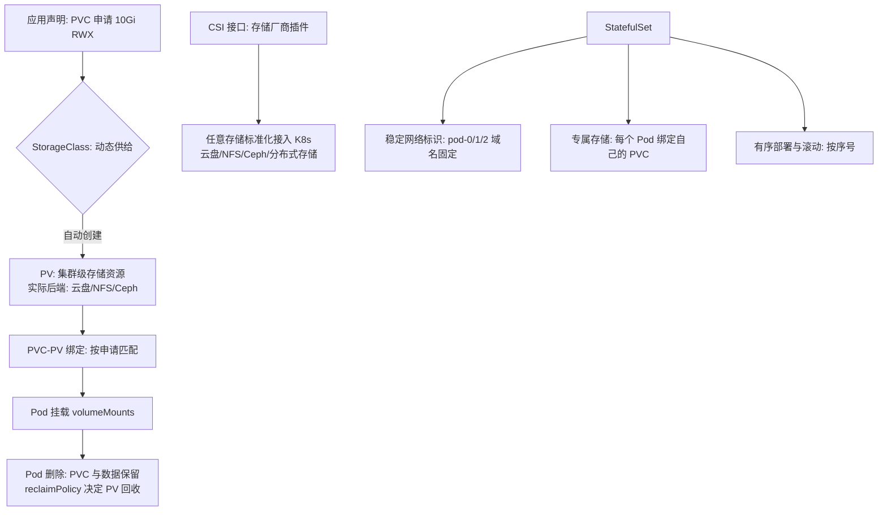
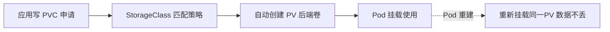

# 云原生存储：有状态应用的持久化

> **一句话摘要**：容器默认「无状态」（销毁即消失）——**有状态应用上云的关键是存储解耦：PV/PVC 把「存储申请」声明化，CSI 把任意存储系统插件化接入 K8s**；本篇讲穿「容器无状态 → 数据持久化的声明式方案 → 有状态应用的完整形态」这条云原生最难的一环。

> **本文核心**：机制链 = **容器可写层临时（销毁即失）→ Volume 挂载（Pod 级临时卷 vs 持久卷）→ PV（集群资源）/PVC（应用申请）/StorageClass（动态供给）三层解耦 → CSI 接口（任意存储厂商插拔）→ StatefulSet（稳定标识 + 有序部署 + 专属存储）支撑有状态应用 → 访问模式（RWO/ROX/RWX）决定存储拓扑**——「应用无状态化优先；必须持久化的用声明式存储」。

前置阅读：[Kubernetes 心智模型](./3_Kubernetes心智模型-声明式与控制循环-入门.md)。数据库本身的机制归本仓库 data 域（MySQL 系列）。

## 1. 背景：为什么「有状态」是云原生最难的一环

云原生的舒适区是无状态应用：可任意复制、销毁、迁移——弹性与自愈全靠「无状态」这个前提。但数据库、消息队列、文件服务**天生有状态**：数据不能丢、实例有身份、扩容要搬数据。有状态应用上云要过三关：**数据不丢**（持久化生命周期独立于容器）、**身份稳定**（重启后还是「原来那个」节点）、**拓扑有序**（主从关系与启动顺序）。K8s 用 StatefulSet + 持久卷体系正面回答，但复杂度显著高于无状态——「有状态上云」因此是云原生改造的最后一块硬骨头。

## 2. 核心机制：PV/PVC/StorageClass 三层与 CSI

- **三层解耦的语义**：**PVC** 是应用的「存储需求声明」（要 10Gi、可读写、快些）；**StorageClass** 是「供给策略」（用哪种存储、什么性能档、回收策略）；**PV** 是「实际的存储资源」。应用只写 PVC，管理员只管 StorageClass 与后端——需求与供给解耦，动态供给（Dynamic Provisioning）自动创建 PV。
- **访问模式决定拓扑**：RWO（ReadWriteOnce——单节点读写，云盘典型）、ROX（多节点只读——共享镜像）、RWX（多节点读写——NFS/分布式文件系统）。**RWX 是 Kubernetes 存储的稀有品**——选型时「是否需要多节点共享写」直接筛掉一批存储方案。
- **StatefulSet 的三件套**：**稳定网络标识**（`pod-0.svc` 域名固定——重启不换身份，主从关系靠它）、**专属存储**（每个 Pod 绑定自己的 PVC，重建后挂回同一卷——数据跟随身份）、**有序部署**（pod-0 就绪才起 pod-1——拓扑依赖的表达）。
- **CSI 的统一意义**：存储厂商实现 CSI 接口（创建/挂载/快照/扩容）即可被 K8s 标准化使用——存储的「设备驱动模型」：与 OCI 解耦构建/运行时同构（篇 2 的解耦思想在存储层的重演）。

## 3. 落地实践：有状态上云的工程纪律

1. **无状态化优先**：能外置的状态全部外置（对象存储/DB/缓存）——「必须集群内持久化」的清单越短越好。
2. **存储选型按访问模式**：块存储（低延迟、RWO，适合 DB）> 分布式文件（RWX，适合共享文件）> 对象存储（海量、HTTP 访问，适合静态资产）——按 IO 形态选，不按名气选。
3. **回收策略显式**：`reclaimPolicy: Retain`（保留数据，人工清理）用于生产数据库——Delete 策略误删即数据消失。
4. **备份独立于存储层**：卷快照（CSI Snapshot）+ 逻辑备份（dump）双轨——「存储冗余 ≠ 备份」（误删/逻辑损坏对冗余无效）。
5. **容量与性能监控**：卷水位（容量/ IOPS/吞吐）进监控——存储是「性能最慢、扩容最慢」的资源，预警要最提前。

## 4. 生产视角：存储事故的形态

- **Pod 重建后数据「消失」**：用了 emptyDir（Pod 级临时卷）——Pod 重建数据清零。emptyDir 只用于可丢失数据（缓存/临时文件），持久化必须 PVC。
- **RWO 卷的节点粘滞**：云盘卷同时只能挂一个节点——Pod 漂移到新节点时旧节点必须先卸载，卸载失败则 Pod 卡 ContainerCreating（经典卡死）。排查卷挂载与节点删除的时序。
- **数据库容器化的 IO 抖动**：共享存储/宿主机邻居干扰——数据库对 IO 延迟敏感，IO 抖动直接表现为 SQL 变慢。生产 DB 的存储要独享性能档位或干脆独立部署（容器化不等于一切上 K8s）。
- **删除 StatefulSet 的数据连锁**：删除 StatefulSet 不删 PVC（数据保留——好事），但重建后若 StorageClass/参数变了，新 Pod 挂不上旧卷——「数据在但挂不上」的修复需要手动对齐。
- **备份恢复从未演练**：卷快照存在但从未恢复过——恢复流程不可用等于没有备份（对账篇的演练纪律在存储的强化版）。

## 5. 主流系统怎么做：存储的生态位

| 形态 | 代表 | 机制要点 |
|---|---|---|
| 云块存储 | 云厂商云盘（CSI） | RWO、低延迟，适合 DB 单写 |
| 分布式文件 | CephFS / NFS / JuiceFS | RWX 共享，延迟与一致性各异 |
| 分布式块 | Ceph RBD / Longhorn（K8s 原生） | 自建集群的块存储，快照/复制能力 |
| 对象存储 | S3 类 / MinIO | 海量静态资产，HTTP 访问 |
| 有状态中间件托管 | 云托管 DB/MQ | 免自运维的「有状态不上集群」方案 |

规律：**「托管服务 > 集群内 StatefulSet > 裸容器挂卷」是数据存储的稳健度排序**——K8s 内跑数据组件是能力问题（StatefulSet 支持），托管是运维经济问题（行业主流共识：核心数据库多数仍独立部署）。

## 6. 典型场景

- **消息队列上集群**（中间件级）：Kafka/RocketMQ 的 StatefulSet 部署——稳定标识 + 专属卷 + 有序扩缩。
- **共享文件服务**（RWX 级）：多 Pod 共享读写文件（NFS/JuiceFS）——批处理与内容服务的共享层。
- **DB 的 K8s Operator 化**（前沿级）：Postgres Operator 管理的数据库集群——Operator 把 DB 运维知识编码成控制循环（进阶路线，慎用于核心库）。

## 7. 与相邻概念的区别

- **Volume（Pod 级） vs PV/PVC（集群级）**：Pod 生命周期 vs 独立生命周期——emptyDir 随 Pod 生灭、PV 独立存在；「临时缓存」与「持久数据」用不同的卷。
- **StatefulSet vs Deployment**：身份与存储的稳定 vs 无状态自由——有身份（主从/分片）用 StatefulSet，可替换副本用 Deployment。
- **块 vs 文件 vs 对象存储**：低延迟单写 vs 共享读写 vs 海量 HTTP——IO 形态三分，云原生存储选型的第一问。
- **本篇 vs MySQL 系列**：本篇是「存储的声明式架构」；MySQL 系列是「数据库本身的机制与运维」——容器只是数据库的宿主形态。

## 8. 常见误区与不适用

- **「容器化 = 一切进 K8s」**：核心数据库独立部署仍是行业主流——「能不能进」与「该不该进」是两问（运维经济与稳定性优先）。
- **「有副本就不需要备份」**：副本防硬件故障，不防误删/逻辑损坏/勒索——备份独立且要演练（对账篇纪律）。
- **「PVC 删除了数据也该在」**：取决于 reclaimPolicy——Delete 策略下 PV 与数据一起消失。生产数据库一律 Retain。
- **「存储扩容是随时可做的」**：文件系统扩容/存储后端扩容都有窗口与风险——容量水位监控提前于告警，扩容演练提前于容量告急。
- **不适用**：纯静态站点（无持久化需求）；一次性计算任务（emptyDir 即可）；极低延迟核心交易库（独立部署或专项 IO 保障）。

## 9. 你们可能会问

- **PVC 的容量可以缩吗？** 多数 CSI 只支持扩容不支持缩——容量规划宁多勿少，缩容靠迁移到新卷。
- **StatefulSet 扩容时数据怎么处理？** 新 Pod 获得新 PVC（空卷）——数据均衡要应用层负责（rebalance）或人工迁移；「自动均衡」不是 StatefulSet 的能力。
- **RWX 存储性能差怎么办？** RWX 天然是共享介质（NFS/分布式文件系统）——性能敏感场景改「各 Pod 独立 RWO + 应用层聚合」或上高性能分布式文件。
- **卷快照和数据库备份的区别？** 快照是「卷的块级时点拷贝」（崩溃一致性）；数据库备份是「逻辑一致导出」（含事务边界）——资金库两者都要（快照救硬件、逻辑备份救逻辑错误）。
- **怎么评估「这个有状态服务能不能上 K8s」？** 五问：数据可外置吗？身份可稳定吗？拓扑依赖可表达吗？存储性能可满足吗？备份恢复可演练吗？——五问全过才上。

## 10. 一句话总结 + 5W 速记卡 + 自测三问

**🎯 核心带走**：

- **核心一句话**：云原生存储 = 「无状态优先 + 持久化声明化」——PV/PVC/StorageClass 三层解耦 + CSI 插拔 + StatefulSet 三件套（身份/专属卷/有序），让有状态应用获得与无状态一致的治理体验。
- **链条复述**：容器无状态前提 → Volume 三层（PVC/SC/PV）→ 访问模式定拓扑 → CSI 插拔任意后端 → StatefulSet 支撑有状态 → 备份独立于冗余。
- **失效点与边界**：RWX 是稀有品；核心 DB 上 K8s 慎重；备份要演练；emptyDir 只装可丢数据。

**5W 速记卡**：

| 维度 | 内容 |
|---|---|
| What | PV/PVC/SC 三层 + CSI + StatefulSet 三件套 |
| Why | 有状态是云原生最难环——数据不丢/身份稳定/拓扑有序三关 |
| When | 消息队列/数据库/文件服务上集群的决策与排障 |
| Where | 集群卷（云盘/分布式存储/NFS） |
| How | 无状态优先 → 按访问模式选存储 → Retain + 备份演练 → 水位监控 |

💡 **实战提示**：生产卷 Retain；备份双轨且演练；emptyDir 只装可丢；存储水位监控最提前；「该不该上集群」先过五问。

**开放问题**：云托管数据库与 K8s Operator 数据库的竞争正在分流「数据上集群」的路线——五年后「集群内自管数据」还会是主流实践吗，还是彻底让位给「托管数据服务 + 集群只跑无状态」？

**决策（何时用）**：消息队列/文件服务上集群推荐 StatefulSet+CSI；核心数据库推荐独立部署或托管；推荐「五问评估」作为一切有状态上集群的准入流程。

**Trade-off（代价与反方案）**：有状态上集群用「复杂度（存储/身份/拓扑三关）」换「统一的调度与治理」；反方案——托管数据服务（免运维，代价是绑定与成本）、独立部署（稳健，代价是独立运维体系）；RWO 与 RWX 的权衡：性能与一致性 vs 共享便利——访问模式是选型的第一刀。

**演进视角**：云原生存储从「容器不适合有状态」的共识（2015 前后）到 StatefulSet/CSI/Operator 的体系成熟（2020+）——「无状态唯一论」被逐步打破，但「无状态优先」仍是最佳实践的金线；这条「能力追上需求」的演进在存储与 AI 负载（GPU 共享）上仍在继续。

---

**下篇预告**：云上的攻击面重塑——下一篇[云原生安全](./9_云原生安全-零信任与供应链-入门.md)讲零信任、供应链与运行时安全。

---

## 深度追问与设计思想

为什么「无状态优先」是最佳实践的金线？因为有状态引入三关（数据不丢/身份稳定/拓扑有序）——每关都是复杂度与故障面的倍增器。**再问一层：为什么数据库「不该」跑在 K8s 里而核心库还是独立部署为主？** K8s 擅长管理可随时替换的无状态工作负载；数据库的数据本地性与 IO 独占与 K8s 的可复制可迁移哲学存在结构性张力。

**设计思想：把「存储的申请」从「找管理员开机器」变成「写一个 PVC」**——存储的声明式化让「申请 100Gi 高性能盘」从提交工单等三天变成秒级自动供给。与计算资源的声明式同构——这是整个基础设施都在声明式化的大趋势在存储域的落点。**Trade-off 量级分档：10w 请求**托管 DB 最经济；**千万级**需要 StatefulSet+CSI；**亿级**需要多 Region 存储与灾备。

---

## 📌 数据与事实声明

PV/PVC/StorageClass/CSI/StatefulSet 语义为 Kubernetes 官方文档；「副本不防逻辑损坏」「核心库独立部署为主流」为行业公开共识；各存储产品能力为官方文档机制级概括。以官方文档为准。

## 📚 参考资料

| 类型 | 标题 | 来源 |
|---|---|---|
| 文档 | Kubernetes: Storage/StatefulSet/CSI | kubernetes.io |
| 项目 | Longhorn / Rook（云原生存储） | longhorn.io · rook.io |
| 系列文章 | MySQL 系列（数据库机制） | 本仓库 data/mysql/ |
| 系列文章 | 分布式事务系列（数据一致性） | 本仓库 distributed-transaction/ |
