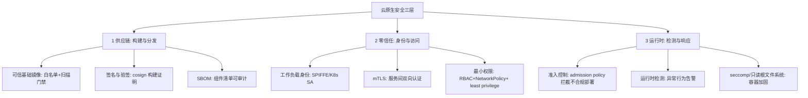
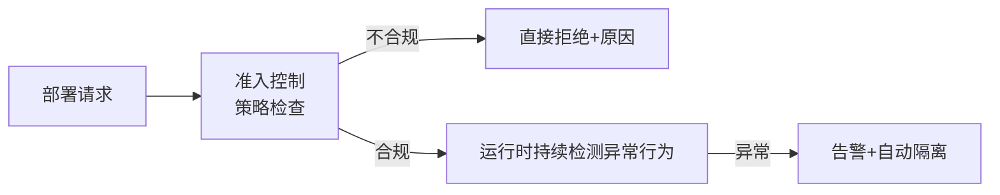

# 云原生安全：零信任与供应链

> **一句话摘要**：云原生把安全边界「打散」了——**没有固定边界可守，安全必须从「边界防御」转向「零信任」（永不信任、持续验证）+「供应链安全」（每个环节可验证）+「运行时防护」三层**；传统防火墙思维在容器/K8s 的动态世界里失效——攻击面随编排与镜像动态变化，安全必须同样声明化、自动化、左移。

> **本文核心**：机制链 = **云原生的攻击面重塑（动态 IP/短生命周期/镜像供应链/控制面成为最高价值目标）→ 零信任（身份即边界： workload 身份 + 最小权限 + 持续验证）→ 供应链三层（构建安全：可信基础镜像+扫描；分发安全：签名+验签；运行安全：准入策略+运行时检测）→ 声明化安全（Policy as Code：OPA/Kyverno）**——安全从「部署前检查清单」变成「持续运行的控制系统」。

前置阅读：[Kubernetes 心智模型](./3_Kubernetes心智模型-声明式与控制循环-入门.md)、[镜像安全三件套](./2_容器化基石-镜像与运行时-入门.md)。

## 1. 背景：边界消失后的安全范式

传统数据中心有清晰边界：防火墙内的「可信内网」。云原生的世界里：Pod IP 动态分配、服务自动伸缩、镜像来自公共仓库、控制面是全网最高权限——**「内网可信」假设全面崩塌**。零信任原则（Never Trust, Always Verify）因此成为云原生安全的官方姿势：**每一次访问都要验证身份与授权，无论来自内网还是外网**。同时，攻击者的重点也迁移到「供应链」（污染你即将部署的制品）与「运行时」（容器逃逸/横向移动）——安全战场从「边界」分散到「全链路」。

## 2. 核心机制：三层安全体系

- **零信任的三支柱在 K8s 的落地**：① **工作负载身份**——每个工作负载有可验证的身份（K8s ServiceAccount / SPIFFE ID），「IP 即信任」被「身份即信任」取代；② **服务间 mTLS**——网格自动双向认证与加密（网格篇的明星收益在此归位到安全视角）；③ **最小权限**——RBAC（谁能操作集群）+ NetworkPolicy（谁能连谁）+ Pod 安全标准（容器能做什么）三层各守一门。
- **Policy as Code（策略即代码）**：安全策略写成代码并进 CI——**准入控制**（Kyverno/OPA Gatekeeper：不合规的部署直接拒绝——如「禁止特权容器」「必须非 root」「必须带资源限制」）+ **CI 检查**（IaC 扫描/镜像扫描/密钥检测）——安全左移到开发期，违规在合并前拦截而不是上线后被扫出。
- **供应链攻击的防御纵深**：攻击路径「污染构建 → 投毒镜像 → 部署上线」的每一环都要验证——可信基础镜像（最小化+持续更新）、构建 provenance（SLSA 等级：构建过程可证明）、签名与验签（cosign）、SBOM 审计、私有仓库中转（不直连公共源）。**没有单一银弹，纵深是唯一解**。
- **运行时安全的两大信号**：**声明基线的偏差检测**（容器内启动了异常进程/异常外联——Falco 类运行时检测规则告警）与**准入后的持续合规**（漂移与漏洞新曝出）。运行时是最后一道防线，前三层失守时的「兜底探测器」。

## 3. 落地实践：云原生安全的工程清单

1. **基线先行**：Pod 安全标准（restricted 级）作为命名空间默认——非 root、禁特权、只读根文件系统、 dropping capabilities（Docker 安全篇的基线在集群的强化版）。
2. **密钥治理**：密钥不进镜像/不进 Git 明文（secret 扫描进 CI）——用平台密钥管理（K8s Secret + 加密 etcd / Vault 类）+ 最小权限注入。
3. **网络默认拒绝**：NetworkPolicy 默认 deny，按需显式放行——「默认全通」的内网在零信任里是漏洞。
4. **镜像供应链流水线**：可信基础镜像白名单 → 构建时扫描 → 签名 → 部署验签 → 运行时 CVE 持续监控（新 CVE 爆出时定位受影响工作负载）。
5. **安全左移进 CI**：IaC 扫描（Terraform/K8s manifests 检查）+ 密钥扫描 + 依赖审计（SCA）+ SAST——违规在合并前拦截。

## 4. 生产视角：云原生安全的事故形态

- **被泄露的镜像凭证**：CI 的 registry 凭证进了 Git 明文——攻击者用凭证推送恶意镜像覆盖版本。防线：短时效凭证 + 镜像签名验签（假镜像验签不过）。
- **过度权限的爆炸半径**：ServiceAccount 绑定了 cluster-admin——应用被攻破即整个集群沦陷。RBAC 最小权限评审是持续项不是一次性。
- **「内网可信」的横向移动**：一个 Pod 被攻破后，攻击者在内网自由横向（默认全通的网络 + 无 mTLS）——NetworkPolicy 默认拒绝 + mTLS 是横向移动的刹车。
- **被遗忘的漏洞镜像持续运行**：新 CVE 爆出但无人知道「哪些服务用了这个组件」——SBOM 缺失的代价；SBOM 库 + CVE 匹配是「漏洞响应十分钟化」的前提。
- **安全策略形同虚设**：准入策略部署了但紧急豁免通道常态化——「豁免要带过期时间与审批」是策略存活的条件。

## 5. 主流系统怎么做：安全工具的生态位

| 层 | 主流工具 | 机制要点 |
|---|---|---|
| 策略即代码 | OPA Gatekeeper / Kyverno | 准入控制 + CI 策略检查 |
| 镜像扫描 | Trivy / Grype | CVE 门禁 + 增量监控 |
| 签名验证 | cosign / Sigstore | 构建签名 + 部署验签 |
| 运行时检测 | Falco / Tetragon | 系统调用级异常检测 |
| 工作负载身份 | SPIFFE/SPIRE + mTLS | 身份即边界 |
| 依赖审计 | SCA 工具（Dependency-Track 等） | SBOM 管理 + CVE 匹配 |

规律：**安全工具链与 CI/CD/编排深度集成**——安全从「独立的检查团队」变成「流水线的内建关卡」；「Shift Left（左移）」是主旋律。

## 6. 典型场景

- **金融合规**（监管级）：mTLS 全覆盖 + 准入基线 + 审计留痕 + SBOM 报送——合规要求把安全三层全部制度化。
- **开源供应链治理**（供应链级）：私有中转 + 签名 + SBOM + CVE 响应 SLA——开源重度使用的团队必修。
- **多租户平台**（隔离级）：命名空间隔离 + 网络默认拒绝 + 资源配额 + Pod 安全标准——租户互不踩踏（多租户篇的联动）。

## 7. 与相邻概念的区别

- **零信任 vs 传统边界安全**：身份即边界 vs 网络即边界——零信任默认「攻击者已在内网」，每次访问验证；边界模型默认「进来就可信」。
- **云原生安全 vs 传统主机安全**：动态短生命周期（安全要自动化声明化）vs 长生命周期主机（可人工加固）——云原生安全的核心是「把安全编码进流水线与编排策略」。
- **认证（AuthN）vs 授权（AuthZ）**：你是谁 vs 你能做什么——mTLS/身份解决前者，RBAC/NetworkPolicy/授权策略解决后者；混谈会漏配。
- **本篇 vs Docker 安全篇**：Docker 篇讲「单机容器加固」（用户/能力/只读根）；本篇讲「集群与供应链的全链路」——单机与平台的分层。

## 8. 常见误区与不适用

- **「买了安全工具就安全了」**：工具产出告警与报告，「有人响应、有流程闭环」才是安全——安全运营（响应/复盘/策略迭代）比采购重。
- **「内网服务不需要 mTLS」**：横向移动正是从「可信内网」开始的——零信任的内网是「更需要验证」的地方。
- **「安全是安全团队的事」**：云原生安全一半在开发流水线里（扫描/密钥/依赖）——「安全左移」要求开发承担对应责任与技能。
- **「开源组件出 CVE 就要立刻升级」**：先评估可达性（漏洞路径是否会被触发）——盲目全量升级引入的兼容性故障也是事故；分级响应 + 临时缓解。
- **不适用**：安全不是「一个阶段」——它不是「做完就结束」的项目；本篇的每条防线都是持续运行的机制，不是一次性检查。

## 9. 你们可能会问

- **从哪里开始建云原生安全？** 三步优先级：① 密钥治理与镜像扫描（最高频漏洞入口）→ ② Pod 安全基线 + RBAC 最小权限 → ③ 网络默认拒绝 + mTLS——先堵最高频入口。
- **SBOM 的实际产出与消费怎么落地？** 产出：CI 构建 Syft 一类工具生成随制品归档；消费：新 CVE 爆出时按组件反向匹配受影响制品——「生成-归档-匹配」三步闭环。
- **准入策略与 CI 策略重复吗？** 不重复——CI 是「合并前拦截」（开发者体验好），准入是「部署时兜底」（防绕过）；两层同规则双保险。
- **怎么度量安全水位？** 四指标：高危镜像存量、策略豁免数量与时长、密钥泄漏事件、补丁时效（CVE 爆出到修复的天数）——安全要可度量才可治理。
- **零信任改造从哪起步？** 身份先行（工作负载身份 + mTLS）→ 网络默认拒绝 → 授权细化——「先认证、再隔离、后授权」的次序最稳。

## 10. 一句话总结 + 5W 速记卡 + 自测三问

**🎯 核心带走**：

- **核心一句话**：云原生安全 = 零信任（身份即边界）+ 供应链纵深（镜像/签名/SBOM）+ 运行时防护——边界消失后，安全从检查清单变成持续运行的声明式控制系统。

**5W 速记卡**：

| 维度 | 内容 |
|---|---|
| What | 供应链 + 零信任 + 运行时三层 + Policy as Code |
| Why | 边界消失与攻击面重塑，传统防御模型失效 |
| When | 容器化全程、新 CVE 响应、合规审计、租户平台建设 |
| Where | CI 流水线 + 镜像仓库 + 集群准入 + 运行时 |
| How | 基线先行 → 三件套纵深 → 左移进 CI → 度量治理 |

💡 **实战提示**：Pod 安全标准 restricted 起步；网络默认拒绝按需放行；密钥扫描进 CI；SBOM 归档支撑 CVE 响应；豁免必须带过期时间。

**开放问题**：AI 生成的代码与依赖正在加速供应链攻击的「产量化」——SBOM + provenance 的验证体系能跟上 AI 速度的攻击面扩张吗？

**决策（何时用）**：容器化全程适用（安全左移零时点开始）；存量集群按三步优先级整改；推荐「四指标安全水位」进团队月度安全看板。

**Trade-off（代价与反方案）**：零信任用「认证延迟与策略运维」换「横向移动刹车」；供应链纵深用「流水线复杂度」换「投毒防御」；安全左移用「开发责任加重」换「违规前置拦截」；默认拒绝用「配置成本」换「爆炸半径收窄」——安全的每一道防线都在为「攻击者的时间」定价，而攻击者的时间是无限的。

**演进视角**：从「防火墙 + 补丁」（2000s）到「主机加固 + IDS」到「零信任 + 供应链」（2020s）——安全范式三十年从「守边界」演进为「验一切」；云原生安全的未来在「安全的自动化与智能化」（策略生成/异常学习），但「纵深防御 + 最小权限」的零信任内核不可动摇。

---

**下篇预告**：多个团队共享一个平台——下一篇[多租户与资源隔离](./10_多租户与资源隔离-入门.md)讲命名空间、配额与隔离强度谱系。

---

## 深度追问与设计思想

为什么「内网可信」的假设崩塌了？因为云原生的攻击面是动态的——Pod IP 随时分配/回收、镜像来自公共仓库、控制面拥有全网最高权限——内网的边界已经无法定义。**再问一层：零信任的验证会不会让性能崩溃？** mTLS 的握手成本被连接复用摊薄、策略判定在本地缓存——零信任的性能代价在现代实现中已可控；而一次入侵的代价是不可控的。

**设计思想：把「安全的执行」从人的检查清单变成声明式策略的自动拦截**——传统安全靠安全团队人工审核部署；Policy as Code 让不合规的部署在准入层被机器直接拒绝——安全的执行成本从人力转移到代码，且 24 小时不间断。**Trade-off 量级分档：10w 请求**基础扫描即可；**千万级**需要全链路签名+策略即代码；**亿级**需要零信任全覆盖+运行时检测。

---

## 📌 数据与事实声明

零信任原则（NIST SP 800-207）、K8s Pod 安全标准、NetworkPolicy、RBAC、ObjectInputFilter、SPIFFE/Sigstore/Falco 语义为 NIST、Kubernetes 与各项目官方文档公开内容；供应链攻击案例为公开安全事件的一般化归纳（不指向具体公司）；SLSA 为公开框架。以官方文档为准。

## 📚 参考资料

| 类型 | 标题 | 来源 |
|---|---|---|
| 标准 | NIST SP 800-207（Zero Trust Architecture） | nist.gov |
| 文档 | Kubernetes: Pod Security Standards / Network Policy | kubernetes.io |
| 项目 | Kyverno / Falco / SPIFFE / Sigstore | 各官方仓库 |
| 系列文章 | 容器化基石（镜像三件套联动） | 本仓库同系列 |
