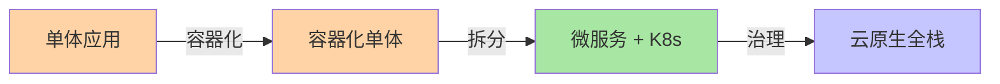
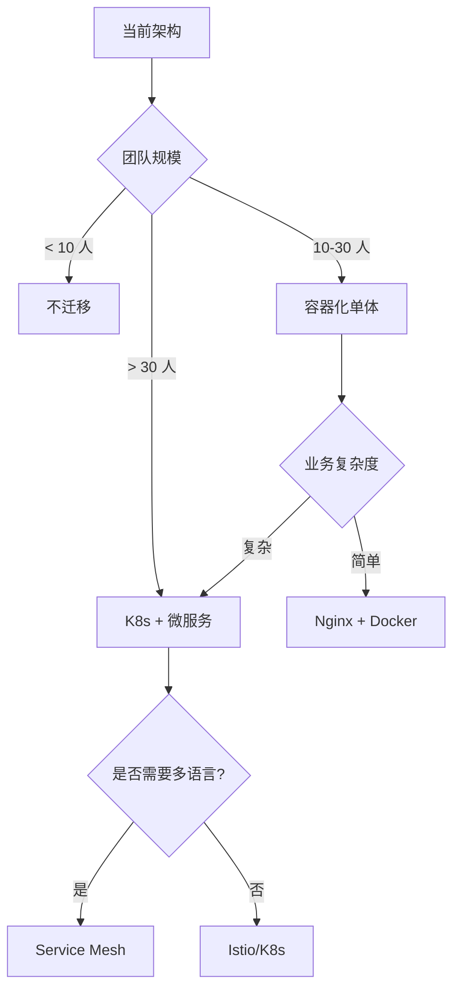
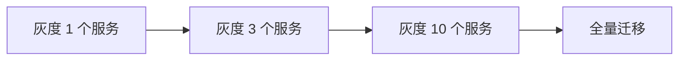

# 云原生迁移全景：从单体到云原型的代价分析

## 一句话摘要

云原生迁移不是「上了 K8s 就是云原生」，而是**业务 + 技术 + 组织**的三维变革。本文讲透迁移全景 + 代价分析 + 决策树。

## 云原生迁移三阶段

## 迁移代价评估

### 技术代价
- 学习曲线：K8s + Docker + Service Mesh
- 运维复杂度：集群管理 + 监控 + 调试
- 性能损耗：Sidecar + 网络开销

### 业务代价
- 停机风险：迁移期间可能影响业务
- 团队成本：需要云平台团队支撑
- 时间成本：完整迁移需要 3-6 个月

### 组织代价
- 团队技能升级
- 流程变革（CI/CD + GitOps）
- 跨团队协作

## 迁移决策树

## 迁移策略

### 策略一：渐进式迁移

### 策略二：混合架构
- 核心服务：云原生
- 边缘服务：保留单体
- 逐步迁移

### 策略三：全面迁移
- 一次性全量
- 风险高，收益快

## 迁移检查清单

### 迁移前
- [ ] 团队技能评估
- [ ] 业务影响评估
- [ ] 技术栈评估
- [ ] 预算评估

### 迁移中
- [ ] 灰度方案就绪
- [ ] 监控指标配置
- [ ] 回退方案准备
- [ ] 团队培训完成

### 迁移后
- [ ] 监控验证
- [ ] 性能对比
- [ ] 业务指标验证
- [ ] 文档更新

## 反模式

1. **盲目追云**：没有评估直接上 K8s
2. **过度治理**：小团队搞 Service Mesh
3. **忽略组织**：只有技术没有流程
4. **一次性全量**：灰度是必须的

## 量级考量

| 量级 | 迁移策略 |
|---|---|
| < 10 服务 | Docker 化 |
| 10-50 服务 | K8s + 微服务 |
| > 50 服务 | K8s + Service Mesh |

## 📌 数据与事实声明

- 迁移策略基于业界实践
- 代价评估为经验值
