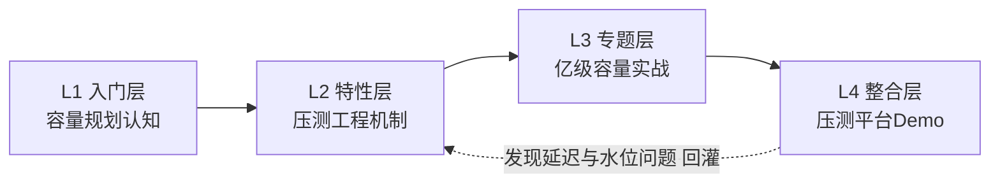

# ⬡ 工程治理

> 工程化验证域：测试验证、全链路压测、容量规划——「系统能不能扛住、扛多久、到顶了怎么办」的工程答案。与稳定性域（运行期韧性）的边界：稳定性管线上出事怎么办，工程治理管上线前怎么证明扛得住。

## 一句话摘要

本分类以「容量规划与全链路压测」为主方向铺 L1-L4（ADR-0012：方向=子目录，禁单篇/孤儿层）；已有整合层 Demo《从零实现全链路压测平台》为该方向 L4 占位（当前 1003 字未达工程级标准，L1-L3 铺完按 ADR-0012 重写）。

容量体系的原理主线：**容量 = 流量 × 单耗 ÷ 供给**——压测测「单耗」，监控量「流量」，预案管「供给」，三个机制层的上下游在这条公式上闭环；体系演进从人肉压测到全链路影子流量，每一次升级都在压缩「容量认知滞后于流量增长」的时间差。

## 规划（L1-L4，2026-09-10 收编孤儿整合层后定稿）

| 层 | 系列/篇目 | 状态 |
|---|---|---|
| L1 入门层 | 从零开始认识容量规划系列：1 什么是容量规划 / 2 单机基准与水位线 / 3 全链路压测入门 / 4 扩容模型（Little's Law） / 5 容量预案与降级水位 / 6 方法论总结 | ⏳ 待写 |
| L2 特性层 | 深入理解压测工程系列：1 影子流量与数据构造 / 2 压测指标体系与瓶颈定位 / 3 容量水位动态计算 | ⏳ 待写 |
| L3 专题层 | 亿级容量实战：1 大促容量预案全景 / 2 全链路压测的生产安全控制 | ⏳ 待写 |
| L4 整合层 | [从零实现全链路压测平台](./整合层/从零实现全链路压测平台/1_从零实现全链路压测平台-Demo.md)（**占位，待按 ADR-0012 重写至工程级**） | 🟡 占位 |

## 📌 数据与事实声明

- 本分类原「规范体系/流程管理」待建方向与压测平台分属不同方向——规范流程类方向暂缓，待用户点名再规划（广度定调：已有方向铺满优先）。
- 2026-09-10 收编记录：孤儿目录 `整合层/从零实现全链路压测平台`（并行会话产出，无 L1-L3、分类 index 未挂）按 ADR-0012 收编为容量规划方向 L4 占位。
