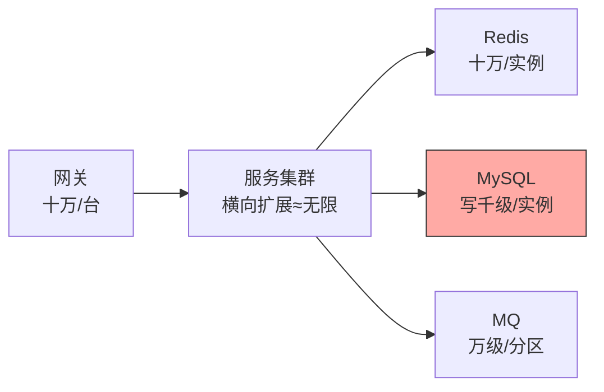
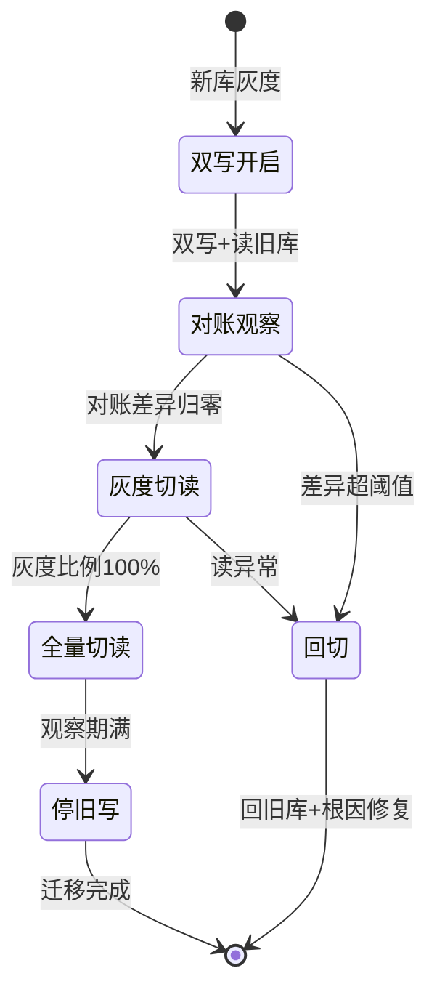
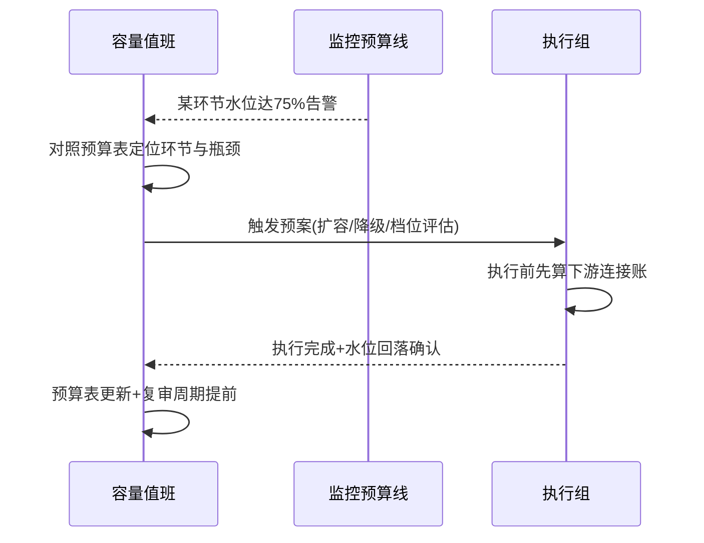

# 亿级容量实战选型决策：从水位拆解到架构档位

> 「亿级」不是一句口号，是一组必须拆开的水位数字：日活、峰值 QPS、数据量、连接数——每个维度跨过临界点，对应的架构档位就换一挡。本篇给一套可操作的容量决策法：先拆水位、再找瓶颈链、然后按档位选架构，最后用压测闭环验证。**容量决策的错误姿势是背架构清单，正确姿势是算自己的数。**

> **本文核心**：容量决策的本质是「水位 → 瓶颈 → 档位」的三段推理——先量化当前与目标水位（峰值 QPS、数据量、增长斜率），再沿请求链路找最先到顶的环节（瓶颈决定一切），最后按档位选型（单机 → 读写分离 → 分库分表 → 单元化）。**跳过水位拆解直接抄架构方案，是最常见也最昂贵的错误**——别人的亿级方案里藏着的先决条件，可能正是你没有的。

## 一句话摘要

容量选型决策是把业务规模翻译成技术档位的过程。核心方法链：①水位拆解——把「亿级」拆成峰值 QPS（日请求量 × 二八分布集中度）、数据量（行数 × 行宽 × 副本系数）、带宽与连接数；②瓶颈定位——沿链路（网关 → 服务 → 缓存 → 数据库 → 消息）估算每环节容量，最先饱和的环节决定系统总容量，木桶效应在容量维度是硬规则；③档位选型——数据库按单表行数与写入 QPS 走「B+ 树单表（千万级内）→ 读写分离（读放大）→ 分库分表（写入与容量双破）→ 单元化（地域扩展）」，缓存与消息按倍增系数预留；④压测闭环——选型结论用全链路压测验证，容量数字以实测为准而非估算收尾。

## 🎯 本文核心（机制坐标）

## 一、水位拆解：把「亿级」翻译成工程数字

**峰值 QPS 推导**：日请求量 × 二八定律集中度（业内常用 80% 流量集中在 20% 时段），再乘安全系数。例：日 2 亿请求 → 均值 ~2300 QPS → 峰值按集中度 ×10 ≈ 2.3 万 QPS → 规划按 1.5 倍余量 ≈ 3.5 万 QPS。**每个系数都要写出处**（行业基准或自有历史数据），拍脑袋的系数是容量事故的种子。

**数据量推导**：行数 × 行宽 × 索引膨胀系数（B+ 树二级索引通常使存储翻 2-3 倍）× 副本数。亿行 × 1KB 行宽 ≈ 100GB 数据 + 200-300GB 索引——单实例尚可；十亿行就是另一个档位。「数据量决策的是存储与分片，QPS 决策的是读写架构」，两条轴分别推导。

**增长斜率**：比绝对值更重要——月增 20% 与年增 20% 的架构余量设计完全不同。斜率决定「这次选型要扛几个重构周期」。

## 二、瓶颈定位：木桶在哪一块板

沿请求链路逐环估算容量上限（业内量级认知，需实测校准）：Nginx 单机数万到十万级、无状态服务横向扩展近似无限（受下游限制）、Redis 单实例约十万 QPS、MySQL 单实例读数千到万级写数百到数千、MQ 单分区万级。**最先饱和的环节决定系统容量**——典型误判是盯着应用层扩容，而瓶颈其实在数据库连接池（每实例 × 最大连接数 > 数据库 max_connections 时，扩容反而压垮数据库）。

两图说明容量运营的两个固定动作——迁移看状态机、越线看时序，都是预案先行而不是临场发挥。瓶颈会迁移：数据库分库分表后，写瓶颈解除，瓶颈常迁到「分片键查询的扇出」或「跨片聚合」——**容量优化是追着瓶颈走的循环，不是一次性工程**。

## 三、档位选型：数据库的四挡架构

| 档位 | 适用水位 | 解决什么 | 代价 |
|---|---|---|---|
| 单实例 + 从库 | 写 <5k QPS，数据 <500GB（业内量级认知） | 读扩展、高可用 | 写仍是单点 |
| 读写分离 | 读是写 5 倍以上 | 读容量线性扩 | 主从延迟带来读旧值 |
| 垂直分库 | 多业务混库互相挤兑 | 按业务域拆资源 | 跨库事务/Join 消失 |
| 水平分表/分库 | 单表 >5000 万行或写 >5k QPS | 容量与写线性扩 | 分片键设计、跨片查询、分布式事务全套成本 |
| 单元化 | 地域扩展、监管多活 | 无限水平扩展 + 容灾 | 数据同步、跨单元路由、一致性仲裁 |

选型的判定问题依次是：写是否已成瓶颈（否 → 读写分离就够）、数据是否单表临界（否 → 不分表）、业务是否天然可按维度切分（用户维度可切 → 水平分片；全局强一致维度 → 慎分）。

分库分表双写迁移的状态机（单向门的回退保障）：

扩容决策的值守时序：

## 四、事故叙事三则

**叙事一：只扩应用不扩数据库，扩容变成压垮。**大促前把应用实例从 20 扩到 60，QPS 略升后整体超时——每实例 20 个数据库连接 × 60 实例 = 1200 连接，远超数据库 max_connections 800，连接风暴把数据库打挂。回滚实例数后恢复。复盘沉淀：**扩容前先算下游连接账**——无状态服务的「横向无限」建立在下游承受力上，容量账要按链路算不能按单层算。

**叙事二：分片键选了时间，热点写打穿单分片。**消息系统按时间分片（当天的数据进当天的分片），写入天然集中在当前分片——其余分片闲着，当前分片写延迟飙升。重构为按业务键（设备 ID）哈希分片后写入均匀。复盘沉淀：**分片键的第一检验是写入均匀性**——时间类分片键几乎总是热点，除非业务本身就是时间分区归档型。

**叙事三：缓存命中率误估，容量数字整体失真。**容量规划按「缓存命中率 90%」推数据库压力，实际新业务冷启动命中率只有 60%——数据库实际压力是估算的 4 倍（1/(1-0.6) vs 1/(1-0.9)），上线即告警。复盘沉淀：**缓存命中率的指数级放大效应要敬畏**——命中率每差 10%，回源压力翻倍级别变化；容量估算的命中率必须用同业务形态的实测值，不能引用别家的经验数字。

## 五、追问链：把「容量档位」问穿一层

- **追问一：分库分表的临界点为什么常说是 5000 万行？**——依据是 B+ 树三层结构下的经验值：千万级行数内，二级索引通常 3 层，查询 3 次页 IO；行数继续涨到四层，每次查询多一次 IO，全表性能台阶式下降。**这不是物理极限是性能拐点**——行宽小、索引设计好的表到亿级仍可三层；临界点要用自己表的实际页深度验证（`INDEX_LENGTH` 与页数估算），不能背数字。
- **再追问：读写分离的主从延迟，业务怎么容忍？**——按读场景分级：自己写完自己读（读自己写）必须走主库（会话内路由或写后短窗口主读）；列表/详情类容忍秒级延迟走从库；关键校验类（支付结果核对）走主库。**「读写分离 + 全部走从库」是事故配方**——路由规则按读语义分级是标配。
- **打破砂锅：单元化是不是所有大系统的终点？**——不是。单元化的适用前提是业务可按维度（用户/地域）切分且跨单元交互稀疏——全局强一致的业务（全局账户、全局库存）单元化成本极高。**单元化是「可切分业务」的终点，不是「所有系统」的终点**；不可切分业务的容量天花板要靠业务自身的降级与异步化拉开。

## 六、反方案分析：不升级架构的替代路线

- **为什么不先优化再扩容**：多数「容量不足」里藏着 20%-50% 的优化空间（慢查询、无效缓存穿透、串行可并行）——优化便宜且不引入新架构成本。但优化有回报递减，**优化把容量买回来之后仍要扩容的，才进入档位升级**——顺序不能反，也不能停在优化
- **为什么不用「更大规格的单机」扛**：垂直扩容确实简单，但单机天花板（连接数、文件句柄、主备切换的数据量）会以更疼的方式撞上，且单点故障爆炸半径最大。垂直扩容作为过渡手段合理，作为终局规划危险
- **为什么不上分布式数据库一步到位**：分布式数据库（NewSQL）确实抹平分片复杂度，但迁移成本、运维心智、生态兼容是真代价——存量 MySQL 体系内按档位演进仍是多数团队的最优路径；新绿地系统可以直接从分布式库起步。**存量演进与绿地选择是两条不同的路**

## 七、设计思想：容量是预算不是结论

容量决策的产出不是「我们支持亿级」这句话，而是一份**可审计的预算表**：每个环节的当前水位、上限水位、余量比例、触发扩容的水位线。预算表让容量从「架构师的经验判断」变成「可运营的数字」——监控对准预算线，越线即告警，扩容决策从救火变成例行。**容量思维与成本思维（FinOps）在此汇合**：余量即成本，预算线的松紧就是成本与安全的定价。这套思想把容量规划从一次性项目变成持续运营的工程学科。

## 八、不同量级的思考：约束来源的换挡

- **十万级 QPS 以下**：约束来源是单点健康——单实例 + 从库 + 常规缓存，重点在慢查询治理与索引。这一档的核心问题是「单点是否健康」，而不是「要不要分片」
- **百万级 QPS**：约束来源是读写比例——读写分离 + 缓存纵深 + 无状态扩容是主体，数据库写路径开始逼近临界。这一档的核心问题是「读写比与缓存命中率」，解法在架构分层而不是硬件
- **千万级 QPS**：约束来源是数据分片——水平分片落地，分片键设计、跨片查询治理、分布式事务收敛成为日常。这一档的核心问题是「分片维度是否与业务查询模式对齐」
- **亿级 / 跨地域**：约束来源是物理定律与监管——机房延迟、跨地域带宽、数据合规，单元化与多活进入视野。这一档的核心问题是「业务可切分性与合规边界」，技术选型让位于业务建模

**自下而上与触发升级**：先实测当前各环节水位与预算线距离，距线远不折腾；触发升级的信号是「预算线内余量 <30%」「瓶颈优化两轮无效」「增长斜率把临界点推到两个季度内」——容量决策跟着预算表走，不跟着技术热点走。

## 九、参数级配置清单（ADR-0012）

| 配置项 | 默认参考 | 分档建议 | 为什么 |
|---|---|---|---|
| 峰值安全系数 | 1.5 倍余量 | 大促型业务 2-3 倍 | 峰值预测必然有偏差，余量是预测误差的保险 |
| 缓存命中率预算 | ≥90% 才做容量结论 | 冷启动期单独建模 | 命中率对回源压力是指数级放大 |
| 单表行数预警线 | 3000 万行告警 | 行宽大则提前 | B+ 树性能拐点的预警余量 |
| DB 连接池上限 | 单实例 20-50 | 扩容前必算总连接账 | 连接总数 vs 数据库 max_connections |
| 容量预算复审周期 | 季度 | 高增长业务月度 | 斜率决定复审频率 |
| 主从延迟告警 | >1s | 读分级严的业务 >200ms | 延迟预算决定读路由策略 |

## 十、步骤级操作（ADR-0012）

1. **前置**：拉取近 30 天流量曲线与数据量曲线（监控平台导出），确认业务增长口径与产品路线图对齐
2. **推演**：按水位拆解公式算目标水位（每系数标注出处），沿链路逐环估算容量并标出瓶颈
3. **验证**：全链路压测到目标水位（互指《全链路压测的生产安全》），实测值修正估算表
4. **落预算**：把各环节「告警水位线」写入监控（当前水位 60% 预警、75% 告警），纳入值班手册
5. **回退**：档位升级（分库分表等）必须双写迁移方案 + 回切窗口——「回不去的升级」不上生产

## 十一、业内惯例

- 容量评审惯例：大促容量评审会按「链路 × 水位」双维过表，每个环节责任到人，预算线进监控告警
- 分库分表落地惯例：双写迁移（新旧库双写 + 对账 + 灰度切读）为标准路径，禁止停机迁移亿级数据
- 业内公开口径参考：MySQL 单表 2000 万行的经验线广泛流传（源于 B+ 树层高与页大小推导），各团队按行宽与索引实测修正

## 你们可能会问

**Q1：容量估算的系数都是拍的，怎么让它可信？**
系数分级：有自有历史数据的用实测（大促曲线、压测结果），没有的用行业口径并标注「行业认知」，两者都没有的做小流量实验标定。**可信不来自系数精确，来自每个系数可追溯**——预算表上每个数字都能回答「哪来的」。

**Q2：业务方给不出增长预测怎么办？**
用历史斜率外推 + 情景规划：按保守/基准/激进三档算容量预算，激进档触发条件写进预算表（「DAU 破 X 时启动档位评估」）。容量决策不必等精确预测——**情景化预算 + 触发条件**就是不确定性的工程化处理。

**Q3：分库分表之后还能再合并吗？**
几乎不能——分片是单向门。所以分片前的验证清单最长：分片键稳定性（业务键不能变）、容量预测的余量（分片数按 3-5 年数据量算）、跨片查询的治理方案。**单向门决策要多花一个数量级的验证成本，这是分片成本的一部分。**

## 十二、什么时候用 / 不用

- ✅ 做容量拆解：任何架构选型前——水位是选型的输入，没有输入的选型是抄作业
- ✅ 按档位演进：水位到哪挡升哪挡，不为三年后的假想规模预支复杂度
- ❌ 不做：没有监控水位基线就谈容量——先建可观测再谈规划
- ❌ 不做：为「亿级」标签提前上单元化/分库分表——档位未到，复杂度先行
- ❌ 不做：压测验证缺失就给容量结论——估算必须闭环到实测

## Trade-off：余量、成本与复杂度的交换

容量预算的每一分余量都是真金白银（资源成本），而余量不足的风险是事故——**容量决策是在为「不确定性」定价**。档位升级降低单点风险却引入结构复杂度（分片的跨片查询、单元化的数据同步）。成熟的容量治理把三者放进同一张账：余量预算线 + 档位触发条件 + 复杂度运维成本，定期复审调整——容量不是静态结论，是持续运营的动态平衡。

## 开放问题

- 云原生弹性（HPA/Serverless）改变「余量 = 常驻资源」的等式，按量弹性让容量预算从「资源预算」转向「弹性策略预算」
- 存算分离与分布式数据库成熟度提升，「分库分表」这一中间档位在新系统中可能被直接跳过——档位序列本身在演化

## 💡 实战提示

- 💡 容量账按链路算：下游连接账、缓存命中率、瓶颈环节——单层无状态 ≠ 系统无限
- 💡 分片键第一检验是写入均匀性——时间键几乎总是热点
- 💡 命中率差 10% 回源翻倍——容量结论必须用同形态实测命中率
- 💡 预算线进监控：60% 预警 75% 告警——容量从经验判断变运营数字
- 💡 分库分表是单向门——双写迁移 + 回切窗口是准入条件不是可选优化

## 自测三问

1. 水位拆解的三条轴是什么？各自由什么系数推导？
2. 数据库四档架构的判定问题链是什么？
3. 为什么说「容量是预算不是结论」？预算表要含哪些要素？

## 🎯 核心带走

- **核心一句话**：容量选型 = 水位拆解 → 瓶颈定位 → 档位选型 → 压测闭环——每个系数可追溯、每条预算线可监控，容量才是工程而非玄学
- **四档位**：单实例主从 → 读写分离 → 水平分片 → 单元化，判定问题链依次是写瓶颈/单表临界/业务可切分
- **哪里会坏**：连接账没算、分片键热点、命中率失真、单向门无回切
- **边界**：优化先行但不止于优化；单元化是可切分业务的终点不是万能终点
- **量级迁移**：十万级问单点、百万级问读写比、千万级问分片对齐、亿级问切分与合规

### 热点问题的容量维度补充

容量账里最容易被漏的是「热点集中度」：平均水位健康不等于安全——大 V 账号、爆款商品、热门直播间会把十万分之一的键打成百万级 QPS 的单点。热点的三层防御：**发现层**（热点探测：访问频次统计 + TopK 算法实时识别）、**吸收层**（本地缓存 + 多级缓存吸收读热点；写热点按 key 加盐打散或队列化串行）、**隔离层**（热点路由到独立资源组，爆炸半径与常规流量隔离）。热点防御的容量意义在于：**它把「平均值设计」升级为「分位数设计」**——容量预算表要给热点单键预留独立预算行，而不是只看全网均值。这也是压测方案要包含「热点场景」的原因：均匀流量的压测永远压不出热点击穿。

## 📌 数据与事实声明

- 写于 2026-09-15；各环节容量量级为业内认知（Nginx/Redis/MySQL/MQ 单机能力），以自有压测实测为准
- 「单表 2000 万行经验线」为业内流传的 B+ 树推导经验值，按实际行宽与索引验证
- 事故叙事为业内高频容量事故模式的匿名化叙事，非特定公司事件
- 免责：组件容量随硬件与版本变化，以实测为准

## 📚 参考资料

| 类型 | 标题 | 来源 |
|---|---|---|
| 关联篇 | 《全链路压测的生产安全》 | 本目录 |
| 官方文档 | MySQL 参考手册（InnoDB 页与索引结构） | dev.mysql.com |
| 行业实践 | 大促容量规划与单元化公开分享 | 各厂技术博客公开报道 |
| 关联系列 | 稳定性武器库 / 观测体系运营 | large-scale/专题层 |
