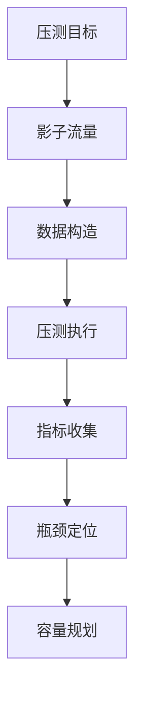

# 全链路压测生产安全 + 容量治理实战

## 一句话摘要

全链路压测是容量规划的终极验证手段，但生产安全是红线。本文讲透压测安全 + 容量治理实战。

## 全链路压测核心

### 影子流量
- 复制真实流量
- 不影响生产数据
- 验证系统瓶颈

### 数据构造
- 压测数据脱敏
- 数据量级模拟
- 数据分布模拟

### 压测执行
- 逐步加压
- 监控指标
- 记录瓶颈

## 生产安全红线

### 红线一：数据安全
- 压测数据必须脱敏
- 不能污染生产数据
- 压测环境数据隔离

### 红线二：流量安全
- 压测流量必须标记
- 不能影响真实用户
- 流量隔离机制

### 红线三：服务安全
- 压测不能打挂服务
- 熔断保护必须开启
- 回退机制必须就绪

## 容量治理

### 容量规划流程

### 容量评估指标

| 指标 | 含义 | 安全水位 |
|---|---|---|
| CPU 使用率 | CPU 利用率 | < 70% |
| 内存使用率 | 内存利用率 | < 80% |
| QPS | 每秒请求数 | < 阈值 |
| RT | 响应时间 | < 500ms |
| 错误率 | 错误占比 | < 0.1% |

### 扩容模型

| 模型 | 说明 | 适用场景 |
|---|---|---|
| 水平扩容 | 增加实例 | 无状态服务 |
| 垂直扩容 | 增加资源 | 有状态服务 |
| 弹性扩容 | 自动伸缩 | 突发流量 |

## 踩坑记录

1. **压测数据未脱敏**：生产数据泄露
2. **压测流量未隔离**：影响真实用户
3. **无熔断保护**：压测打挂服务
4. **容量评估不准**：扩容不及时

## 压测 Checklist

- [ ] 压测数据已脱敏
- [ ] 流量已隔离
- [ ] 熔断保护已开启
- [ ] 监控指标已配置
- [ ] 回退方案已准备

## 量级考量

| 量级 | 压测方案 |
|---|---|
| < 1000 QPS | 单机压测 |
| 1000-10000 QPS | 集群压测 |
| > 10000 QPS | 全链路压测 |

## 📌 数据与事实声明

- 踩坑来自生产环境经验
- 容量指标为行业认知
