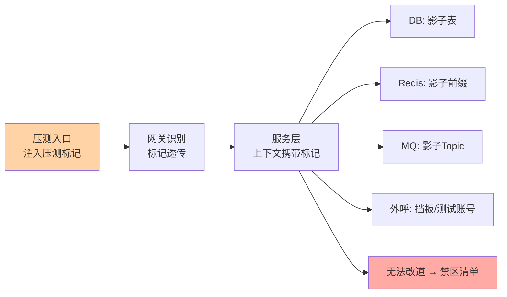
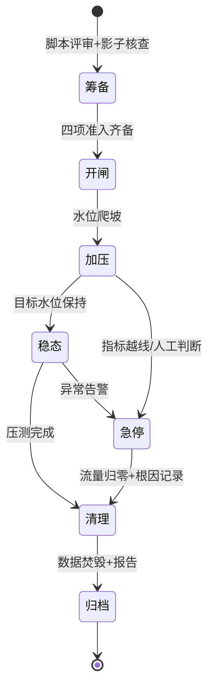
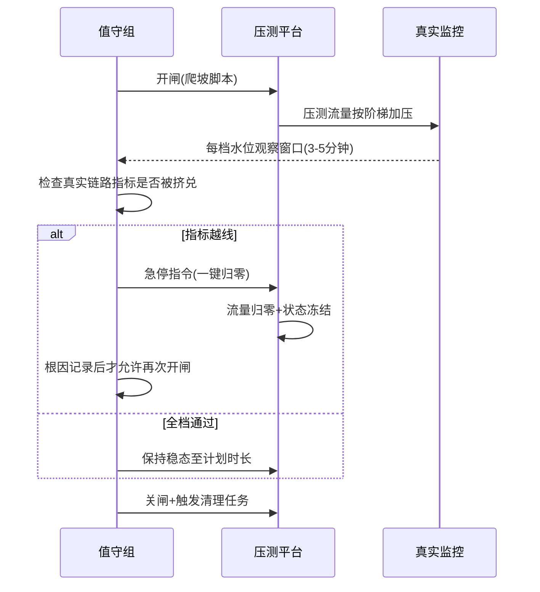
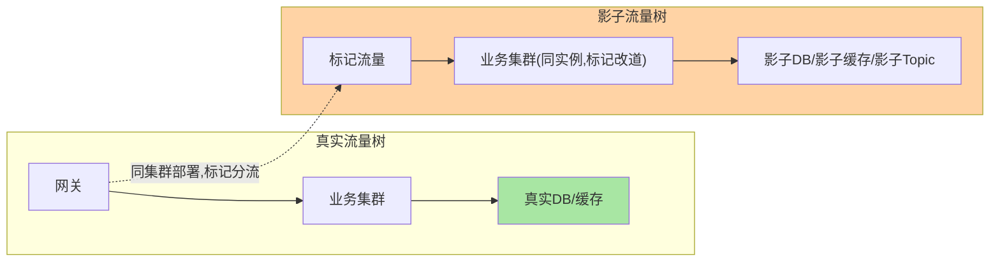

# 全链路压测的生产安全：影子链路、数据隔离与风险清单

> 全链路压测最大的悖论：要压得真实，就得在生产环境压；在生产环境压，就可能打伤生产。本篇讲的是这个悖论的工程解——影子链路如何让压测流量「看得见、隔离得住、撤得干净」，以及把压测从「高危操作」变成「例行演练」的完整清单。

> **本文核心**：全链路压测的生产安全 = 三条隔离（数据隔离/资源隔离/行为隔离）× 一个前提（流量可识别）。压测流量从入口打上标记（透传的压测标），沿途每个环节按标记改道——数据写影子表、缓存写影子 key、外呼走 mock 或测试账号；做不到改道的环节就是压测禁区，禁区清单与改造计划才是压测体系的核心资产。**没有影子链路的「直接压生产」不是压测，是赌博。**

## 一句话摘要

全链路压测（Full-Link Stress Testing）在生产或生产镜像环境上，模拟真实业务流量形态（登录、下单、支付全链路），验证系统在峰值负载下的容量与稳定性。与单接口压测的本质区别在于「链路真实性」：缓存、消息队列、数据库连接池、线程池的全链放大效应只有真实链路才压得出来。生产安全靠影子链路体系：入口注入压测标记（如透传 header），全链路中间件识别标记后改道——数据库路由影子表、Redis 加影子前缀、MQ 发影子 Topic、第三方外呼替换为挡板；同时压测账号、压测数据的生命周期管理（用完即焚）与监控告警的压测分离，构成完整的安全闭环。

## 🎯 本文核心（机制坐标）



## 一、为什么必须「影子」：三条隔离的机制

**数据隔离**：压测数据不能与真实数据混存——统计口径被污染是轻的，压测订单触发真实发货是事故。机制是存储层改道：影子表（同库同表名前缀 `_shadow`）或独立影子库；Redis 影子前缀 + 影子集群（防大 key 打爆共享实例）；MQ 影子 Topic（消费者也要影子化，否则压测消息触发真实消费）。改道的实现载体是全链路标记透传：入口 AOP/RPC 拦截器把标记放进上下文（ThreadLocal/TraceContext），存储客户端按上下文路由——**标记透传的完整性决定隔离的完整性，一条漏传的异步链路就是混写通道**。

**资源隔离**：压测流量对 CPU/连接/带宽的消耗与真实流量共享资源池。激进做法是同池压制（直接压出极限），安全做法是影子资源配额（影子连接池独立配置，压测打满影子池不影响真实业务）。两种模式的选择见量级节。

**行为隔离**：有副作用的动作必须改写——短信/推送走挡板、真实扣款走测试账号、风控名单与压测账号隔离。行为隔离清单最长，也最容易漏：**每一个外部副作用都是一个独立排查项**，压测方案的副作用清单要过业务负责人逐项确认。

## 二、源码/关键路径：标记透传的实现要点

```java
// 入口: 压测标注入上下文
boolean isShadow = "1".equals(request.getHeader("X-Stress-Tag"));
StressContext.set(isShadow);

// RPC 透传: 拦截器把标记塞进请求头
rpcFilter.onRequest(req) -> req.addHeader("X-Stress-Tag", StressContext.get());

// 异步边界: 线程池切换必须搬运上下文(最容易漏的环节)
executor.submit(() -> {          // ✗ 上下文丢失,影子数据落真实表
executor.submit(wrapped(runnable)); // ✓ 装饰器搬运 StressContext + trace 上下文
});

// 存储路由: 数据源按标记选影子
DataSource ds = StressContext.isShadow() ? shadowDs : prodDs;
```

三个高频翻车点：①线程池切换丢上下文（所有并发框架的提交点都要包装——用统一的 Runnable 装饰器收口，禁裸 submit）；②异步消息的标记在消息头里「有字段但消费端不读」——影子消息进了真实消费者；③标记生命周期没有清理边界（请求结束 ThreadLocal 未 remove，池化线程把压测标记串给下一个真实请求——**压测标记反向污染真实流量**是最危险形态）。

## 三、典型使用场景

- **大促容量验证**：峰值流量模型 + 影子链路，验证扩容后的全链水位
- **架构改造验收**：重构/换库/升级后，用等量压测流量对比改造前后性能基线
- **容量规划输入**：常态周期性压测（如每月）产出各链路容量水位，反哺容量预算
- **故障演练前置**：先压测（验证高负载稳态）再演练（验证故障下的行为），两级递进

压测窗口的状态机与急停路径：



开闸到急停的值守时序：



## 四、事故叙事三则

**叙事一：异步链路丢标记，压测订单进了真实发货。**压测链路里有个积分服务走线程池异步处理订单消息，提交点没做上下文包装——压测订单标记丢失，被当真实订单消费，触发了真实积分发放（影子表有数据、真实表也写进去了）。对账差异暴露，回滚靠逆向冲正。复盘沉淀：**异步提交点的上下文包装纳入压测准入静态检查**——裸 submit 直接拦在 CI。

**叙事二：压测缓存没加前缀，真实缓存被压测数据覆盖。**某系统 Redis 客户端只对写做了路由、读没做——压测期间真实用户读到压测用户的会话数据，出现「登录成别人」的诡异工单。根因是读写路由不对称。复盘沉淀：**影子路由的对称性要有契约测试**——每个存储客户端的读写路径都要有「标记一致」的断言用例。

**叙事三：压测告警没分离，真故障被当压测噪音。**压测窗口内数据库告警频发（预期内的水位上升），值班疲于忽略告警——期间一次真实的连接池泄漏告警也被当成压测噪音略过，故障发现延迟四十分钟。复盘沉淀：**压测窗口的告警必须分流**：影子链路指标静默或降级，真实链路指标保持原始灵敏度；值班手册写明「压测期间哪类告警仍需立即响应」。

## 五、追问链：把「影子链路」问穿一层

- **追问一：影子表和真实表同库，压测把库压挂了怎么办？**——同库共享连接与 IO，压挂是真实风险。分级方案：轻量压测同库影子表（接受共享风险）；重度压测影子库（独立实例，代价是数据同步与成本）。判断依据是压测目标强度：验证功能形态用轻量，验证容量极限必须影子库——**用同一套影子设施压所有强度，要么浪费要么危险**。
- **再追问：第三方外呼的挡板会降低真实性吗？**——会，且要诚实标注：挡板只回「正常/超时」两类响应，真实第三方的限流、抖动、降级行为压测里缺失。工程折中：挡板可配置延迟与错误率模拟（挡板也能压），并在报告里明确「第三方段为模拟数据」——**压测报告的结论边界必须与模拟边界一致**，否则容量结论会被超范围引用。
- **打破砂锅：能不能不压生产，用预发环境？**——预发的资源配比、数据量级、网络拓扑都与生产不同，压出的容量数字不可信（尤其是缓存命中形态与连接池水位）。预发压测验证「功能与脚本正确性」，生产影子压测产出「容量结论」——两者是流程的两步，不是二选一。

## 六、反方案分析：为什么不「直接压生产」

- **为什么不用低峰期直接压**：低峰的真实流量小，压测流量占比高，缓存命中形态、连接池行为全部失真——压出的是「压测流量自己的容量」不是「业务混部的容量」。且无影子隔离时，数据混写风险与流量大小无关
- **为什么不用日志回放替代脚本模拟**：回放真实请求确实形态真实，但回放流量不带压测标记的改造点与脚本模拟相同，且回放的时间压缩会破坏业务时序（回调、定时任务的对齐）。回放适合「流量模型建模」的输入，不适合直接当压测流量
- **为什么不全链路 mock（假生产环境）**：全 mock 环境即「预发压测」——中间件与数据的真实性丧失，容量结论不可信。mock 的正确位置是外部依赖段，不是链路本身

## 七、设计思想：压测从「事件」到「能力」

一次性压测是项目（临时脚本、临时改道、临时清理），常态化压测是能力（影子链路是常驻设施、压测流量模型版本化、结果基线可对比）。两者分水岭在**改道的常驻化**：影子路由写在业务代码里（标记判断常驻）而不是压测前打补丁——常驻化的额外成本（每个存储访问多一次标记判断）换来「随时可压」的能力。**压测能力化是容量运营的前提**：只有压测随时可做，容量水位才是持续监控的指标而不是年度评审的猜谜。

## 八、不同量级的思考：压测强度与隔离等级

- **十万级 QPS 以下**：约束来源是数据安全——同库影子表 + 独立影子 key 前缀 + 外呼挡板即可，重点在标记透传完整性。这一档的核心问题是「隔离是否严密」，而不是「资源配额」
- **百万级 QPS**：约束来源是资源挤兑——压测流量与真实流量的连接/带宽共享成为风险，影子连接池配额、独立影子缓存集群、MQ 影子集群提上日程。这一档的核心问题是「影子资源的独立配额」，解法是影子资源树与真实资源树物理分叉
- **千万级 QPS / 大促级**：约束来源是组织协同——全链路涉及几十个团队，压测窗口、脚本版本、禁区清单、值守安排成为跨团队作战；压测平台化（脚本托管、流量编排、自动清理）。这一档的核心问题是「压测的组织工程」，机制从技术清单升级为作战手册

**自下而上与触发升级**：先定压测目标强度（功能验证/容量水位/极限探测），由强度倒推隔离等级与影子设施投入；触发升级的信号是「影子资源被打穿影响真实」「跨团队协同成本超过技术成本」——从清单驱动迁到配额驱动再迁到平台化，压测体系随目标强度换挡。

### 参数级配置清单（ADR-0012）

| 配置项 | 默认参考 | 分档建议 | 为什么 |
|---|---|---|---|
| 压测标记 header | `X-Stress-Tag: 1` | 全局统一不可各搞一套 | 透传链唯一契约，多标并存必漏 |
| 影子表命名 | 真实表名 + `_shadow` 前缀 | 统一前缀便于批量清理 | 清理任务按前缀 truncate，命名散乱必留残留 |
| 影子连接池上限 | 真实池的 50%-80% | 大促级压测独立影子库 | 同库共享时为真实流量留余量 |
| 爬坡阶梯 | 每档 +20%，观察 3-5 分钟 | 极限探测档距收窄到 10% | 档距大易越过拐点失去定位能力 |
| 急停响应时长 | 指令到归零 ≤ 30 秒 | 大促窗口要求 ≤ 10 秒 | 急停时效是压测安全的第一指标 |
| 影子数据保留 | 压测结束即清理 | 疑难排查可申请延长 24h | 影子数据留存即混写风险敞口 |
| 告警分流 | 影子指标静默 | 真实指标保持原灵敏度 | 防真故障被噪音淹没 |

### 步骤级操作（ADR-0012）

1. **前置**：脚本评审通过 + 影子改造逐环节核查 + 副作用清单业务负责人签字 + 值守排班与急停演练过一遍
2. **开闸验证**：先发 10 QPS 探测流量 5 分钟，验证三件事——影子表有数据、真实表无增量、外呼挡板命中（`SELECT COUNT(*) FROM 订单_shadow` 与真实表对比）
3. **加压**：按阶梯爬坡，每档观察真实链路水位（CPU/连接池/缓存命中率偏移 <10% 为安全线）
4. **验证**：稳态保持期间抽样核对影子数据完整性与清理脚本干跑结果
5. **回退**：任何越线一键急停（流量归零）→ 影子数据清理任务触发 → 根因记录归档后才能再开闸；真实数据疑似混写时立即触发对账 + 冲正预案

## 九、业内惯例

- 压测标记的透传载体业内收敛为统一上下文（trace 体系扩展字段），标记字段全局唯一并纳入中间件规范
- 影子数据的生命周期惯例：压测结束即清理（影子表 truncate、影子 key 批量删除），清理任务压测平台自动触发并留执行凭证
- 压测准入清单惯例：脚本评审（流量模型与业务配比）+ 影子改造核查（逐环节确认改道）+ 副作用清单业务确认 + 值守安排——四项齐备才开闸
- 压测结果归档基线化：每次压测存「流量模型版本 + 环境拓扑版本 + 结果」，容量结论必须引用可复现的基线组合

## 你们可能会问

**Q1：影子表压测的统计数据会污染真实报表吗？**
会，除非报表链路也识别影子标记——更省事的做法是影子数据放独立库（物理隔离），统计天然不混。同库影子表是低成本起步形态，统计口径有强隔离诉求时升影子库。

**Q2：压测发现容量不够，怎么办？**
压测的价值恰恰是「生产前发现」。结论分三档：扩容（资源问题）、限流降级预案（保护问题）、架构改造（结构问题）——按瓶颈层次选。压测报告必须落到「哪个环节、什么水位、建议动作」三要素，没落地的压测只是演习。

**Q3：微服务几十个，影子改造怎么推进？**
按「链路准入」推进而不是全量改造：第一期压核心链路（交易主链），只改造链上服务；影子改造成中间件组件（SDK 统一提供路由能力），新服务引入即自带影子能力——改造被框架吸收后，边际成本递减。全量改造是压测平台成熟的终态而非起步条件。

## 十、什么时候用 / 不用

- ✅ 必做：大促前、重大架构变更后、容量规划周期点
- ✅ 常态化：核心链路月度水位压测（能力成熟后）
- ❌ 不做：无影子设施直接压生产——不是不做压测，是先建设施
- ❌ 不做：数据一致性无对账手段时压写链路——出事回滚不了
- ❌ 不做：告警分流未配置时压高水位——真故障会被噪音淹没

压测流量与真实流量的混部视角：



## Trade-off：真实性、成本与安全的三角

影子链路体系是「真实性（生产环境压）+ 安全（三条隔离）」的组合，代价是改造成本（中间件 SDK、存储客户端、外呼挡板）与常驻复杂度。降低成本的路径是框架吸收（SDK 统一影子能力），而不是业务逐个改造。**压测体系的钱花在影子设施上是一次性的，花在事故上是加倍的**——三角里唯一不能省的角是安全，真实性可以按目标强度分级，安全不行。落到组织层面还有第四角——协同成本：链路涉及的团队越多，「谁签字、谁值守、谁急停」的责任面越重要，压测手册本质上是技术方案与责任面的合订本。

## 开放问题

- 压测流量与混沌工程融合（压测中注入故障）在头部团队成型，「高负载下的故障行为」成为压测结论的新维度
- 基于线上流量画像的自动压测（流量模型自动生成与更新）在演进，流量模型的人工维护成本有望大幅下降

## 💡 实战提示

- 💡 异步提交点必须包装上下文——裸 submit 是影子链路的头号漏洞，静态检查拦在 CI
- 💡 影子路由读写对称性要契约测试——只写不读或只读不写的路由都是混写通道
- 💡 压测窗口告警分流：影子指标静默、真实指标原灵敏度——值班手册写明响应边界
- 💡 ThreadLocal 压测标记请求结束必 remove——标记反向污染真实流量是最危险形态
- 💡 压测报告结论边界 = 模拟边界——第三方挡板段的数据不能进容量结论

## 自测三问

1. 三条隔离（数据/资源/行为）各自的机制载体是什么？
2. 标记透传的三个高频翻车点是什么？哪个最危险？
3. 压测强度与影子隔离等级怎么对应？同库影子表适合什么强度？

## 🎯 核心带走

- **核心一句话**：全链路压测的生产安全 = 可识别的流量标记 × 三条隔离改道 × 不可改道的禁区清单——影子链路常驻化，压测才能从高危事件变成例行能力
- **机制链**：入口注入标记 → 全链透传 → 存储/MQ/外呼按标记改道 → 清理即焚 → 告警分流
- **哪里会坏**：异步丢标记、读写路由不对称、标记串线程、真故障被噪音淹没
- **边界**：预发验功能、生产影子出容量结论；第三方段为模拟数据不入容量结论
- **量级迁移**：十万级问隔离严密、百万级问影子配额、千万级问组织工程

## 📌 数据与事实声明

- 写于 2026-09-15；影子链路与流量标记为业内通行工程实践，实现细节以各团队中间件规范为准
- 事故叙事为业内高频压测事故模式的匿名化叙事，非特定公司事件
- 免责：具体组件能力以对应版本文档为准

## 📚 参考资料

| 类型 | 标题 | 来源 |
|---|---|---|
| 行业实践 | 全链路压测体系公开分享（阿里/美团/字节技术博客） | 公开报道 |
| 开源组件 | 全链路压测标记透传相关 SDK（如 simulations/全链路灰度组件） | github.com 公开仓库 |
| 关联篇 | 《亿级容量实战选型决策》 | 本目录 |
| 关联系列 | 稳定性武器库（限流降级预案） | large-scale/专题层 |
