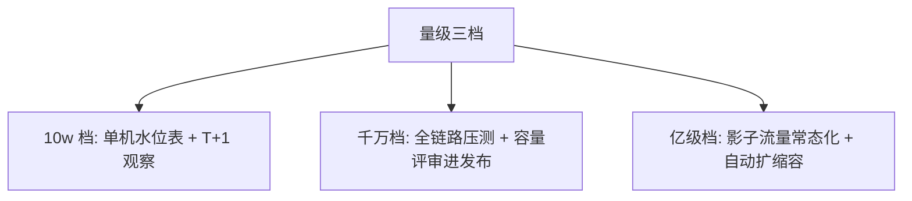

# 从零开始认识容量规划系列导读

> 「容量」不是拍脑袋的数字——是流量 × 单耗 ÷ 供给的持续求解。这个系列把容量规划从「大促前的恐慌」变成「常年的工程纪律」。

## 一句话摘要

容量规划 = 测单耗（压测基准）→ 量流量（峰谷模型）→ 算供给（扩容模型）→ 管水位（预案与告警）四步闭环；10w 档单机水位表够用，千万档必须全链路压测，亿级档需要影子流量与自动扩缩容。

## 篇目规划（L1-L4，ADR-0012 方向=子目录）

| 篇目/层 |
|---|
| L1 入门层（本层 6 篇） · 1 什么是容量规划 / 2 单机基准与水位线 / 3 全链路压测入门 / 4 扩容模型 Little's Law / 5 容量预案与降级水位 / 6 方法论总结 |
| L2 特性层 · 深入理解压测工程系列：影子流量与数据构造 / 压测指标体系与瓶颈定位 / 容量水位动态计算 |
| L3 专题层 · 亿级容量实战：大促容量预案全景 / 全链路压测的生产安全控制 |
| L4 整合层 · [从零实现全链路压测平台 Demo](../../整合层/从零实现全链路压测平台/1_从零实现全链路压测平台-Demo.md)（占位，待按 ADR-0012 重写至工程级） |
## 怎么推进

- L1 六篇按 ADR-0012 工程级标准依次落盘（每篇带参数表/代码/步骤/三档数据）；
- L4 Demo 重写时吸收 L1-L3 的参数与步骤；
- 验收：注入式压测演练全链路通过。

**机制定位与取舍**：本方向的每个机制（原理与底层实现）都在篇目里锚定了位置——规划期的取舍是「机制原理优先于操作罗列」，代价是入门读者需要更多耐心，收益是后续每篇的参数与步骤都有原理可归因；架构上各层互为上下游，边界由「机制讲透」与「操作可执行」这条线划分。

## 演进视角

容量规划方法的演变：从经验拍脑袋，到单机压测估算，到全链路影子压测——每一次升级都由一次「容量估错导致的事故」驱动；上游是业务流量预测，下游是扩容与降级预案，模块边界在「证明扛得住」这一件事上。

## 📌 数据与事实声明

- 本文件为方向骨架规划（篇目标注 ⏳ 待写 / ✅ 已落地），依据 ADR-0012 工程级深度标准与 4 层架构规范；量级与参数数字均为行业认知量级，落篇时以实测替换。

## 📚 参考资料

- 本仓库稳定性系列（水位告警的分资损侧）；《Site Reliability Engineering》容量规划章节。
