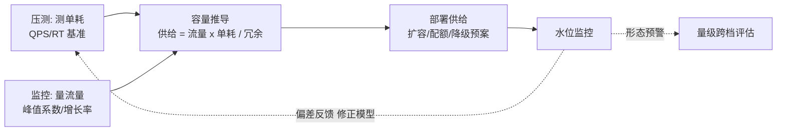
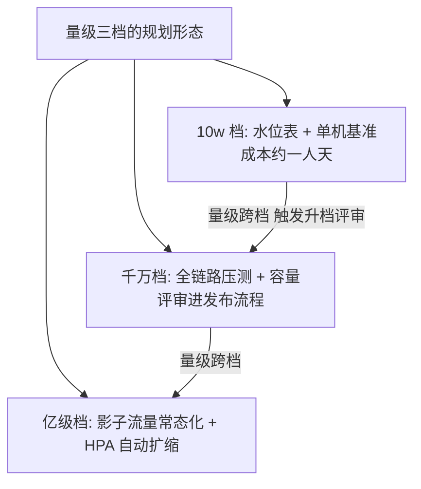

# 什么是容量规划：从拍脑袋到工程纪律

> 「双促流量估计是我们的五倍，机器准备多少？」——这个问题如果靠拍脑袋回答，要么浪费一半预算，要么在大促当晚崩给你看。容量规划就是把这个问题的答案从「猜」变成「算」：**测得出单机能力、算得出流量增长、推得出需要多少供给、管得住水位红线**。

## 一句话摘要

容量规划 = **流量 × 单耗 ÷ 供给** 的持续求解闭环：压测测出「单耗」（单机/单实例的吞吐与延迟基准），监控量出「流量」（现值与增长预测），推导出「供给」（需要多少机器/连接/配额），再用水位线与预案管住「余量」。10w 档一张水位表够用；千万档必须全链路压测；亿级档需要影子流量常态化与自动扩缩容。

## 🎯 本文核心

**核心机制一句话**：容量规划的本质是给「流量增长」与「系统供给」建一条可计算的换算关系——所有方法（压测/监控/公式）都服务于这条换算链的准确性与时效。

**机制链**：单机基准（压测测单耗）→ 流量建模（峰值形态与增长）→ 容量推导（Little's Law 类公式）→ 供给部署 → 水位监控 → 偏差反馈修正模型。上下游：上游是业务流量预测（产品/运营输入），下游是扩容预案与成本预算——容量规划是「业务增长」与「系统供给」两个世界的换算器，模块边界清晰：它不负责压（那是压测工具），不负责扩（那是发布系统），只负责**算清楚与提前说**。

## 典型使用场景

- **大促/活动容量预案**：预估峰值 QPS → 推导各层（网关/应用/DB/缓存）所需规格 → 提前扩容 → 压测验证；
- **日常水位管理**：服务的水位线（CPU/连接数/队列深度）设告警阈值，水位逼近红线触发扩容评审；
- **成本优化**：反向求解——当前流量下最小供给是多少，找出过度配置的服务缩容；
- **架构演进决策**：量级跨档（用户量/吞吐翻倍）时，判断当前架构还能撑多久、什么时候必须换形态（链回分库分表系列的量级跨档）。

## 机制：为什么「压测 + 公式 + 监控」缺一不可

**只监控不压测**——你知道现量下的水位，但不知道「离极限还有多远」：单机在当前流量 RT 50ms，极限是 80 QPS 还是 800？没压测过就没有分母，容量结论全靠猜。

**只压测不监控**——压测给出单机基准，但线上流量形态（峰值系数、混合场景干扰）与压测流量不同：基准 × 系数才是真实容量，系数从历史监控数据来。

**只算不看水位**——流量预测必有偏差（行业认知：非大促日常流量的月度预测误差 ±20% 是常态），水位监控是模型的误差反馈回路：实际水位持续高于预测 → 模型修正。

**设计思想**：这套三层结构（测/算/管）本质是控制论里的「模型 + 反馈」——容量规划不是一次性算术题，是**带反馈回路的持续系统**。为什么很多团队做了压测还是出容量事故？因为他们只做了开环（算一次就完），没有闭环（水位偏差不回流修正模型）。

## 💡 实战提示

- 💡 单机基准要压到「拐点」而不是「刚好达标」：RT 开始陡增的 QPS 才是真实上限，达标线以下的数据没有容量意义（压到 RT 曲线的膝点再停）。
- 💡 容量按「峰值」不按「均值」：日均 1 万 QPS、峰值 5 万的服务，容量答案永远是 5 万口径——峰谷比（行业认知 3-10 倍）是容量规划的第一输入。

## 与「性能调优」的区别（跨域辨析）

- 性能调优问「这个接口为什么慢、怎么变快」——优化单点效率；容量规划问「这样的请求量需要多少份这个能力」——优化总量供给。先调优后规划：单机基准没调优过就做容量规划，是把浪费乘以机器数；
- 与「高可用」的区别：高可用防「部分失败」（冗余/切换），容量规划防「全体过载」（供给不足）——冗余节点也要参与容量计算（N+1 的 +1 不是无限兜底，全量切到备份时备份也要接得住，链回稳定性系列）。

## 常见误区

- ❌「容量 = 机器数」——CPU/连接数/带宽/存储/第三方配额（短信/支付通道限频）都是容量维度；行业里最常见的容量事故是**机器够但数据库连接池打满**——只算机器不算连接的单维容量规划等于没做；
- ❌「压测过了就安全了」——压测验证的是「当时架构在当时的场景混比下」的能力；业务改版、数据增长、依赖升级都会让基准过期，基准有效期要管理（特性层篇 2）；
- ❌「冗余 = 容量安全」——N+1 冗余在「主全量切备」场景下，备份必须能接 100% 流量而非 1/N；容量与冗余要联合设计；
- ❌「大促前才做容量规划」——临时抱佛脚的压测发现瓶颈时，已经没有时间做架构级修复；容量规划是常年的水位管理 + 大促前的专项深化。

## 代价与边界

容量规划的底层原理是「用可控的小规模实验（压测）换取对大规模行为（生产）的预测能力」——实验与生产的等价性（流量形态/数据分布/依赖版本）是预测精度的天花板，等价性越差误差越大。

容量规划的成本：压测环境与人力（全链路压测是重型工程，特性层展开）、基准维护（每季度或大变更后重压）、水位体系开发。边界：容量规划管「可压测、可预测的确定性容量」——突发性外部流量（刷子/热点事件）只能靠限流与弹性兜底；第三方依赖的容量（支付通道限频）只能协商不能自测——**自研可控的部分规划，外部依赖的部分协商与降级**。

## 事故推演：一次「每层都对、整体崩了」的容量事故

行业化用案例：某平台大促前每层单独压测通过（应用单机 2000 QPS ✅、DB 5000 QPS ✅、缓存 10 万 QPS ✅），大促当晚应用层打满——事后归因：压测时每层**独立压**（单机压应用时 DB 压力是Mock的），真实混合流量下应用处理 2000 QPS 时 DB 实际承受了 8000 QPS（含缓存未命中的回源放大），DB 先崩拖垮应用。**复盘 Action**：① 单层压测的结论必须乘「层间放大系数」（缓存命中率决定回源倍数）；② 全链路压测立项（篇 3）——**分层正确 ≠ 整体正确，容量是链路属性不是节点属性**。

## 演进视角

容量规划的演变：人肉经验（老工程师说再加两台）→ 单机压测表 → 全链路影子压测 → 自动扩缩容（HPA/弹性池）——每一次升级都在压缩「流量增长到供给到位」的时间差。**未来方向**是反馈回路全自动化：水位 → 自动扩容 → 基准自动复测——但架构形态的量级跨档（如单库到分库）在可见的未来仍是人工决策（代价太大不能自动）。

## 反方案对照：为什么不用「监控顶一顶」

反方案（只靠监控不做压测）的死法：监控只能看到「当前流量下的水位」，极限吞吐这一分母缺失——水位 60% 时你以为还有 40% 余量，真实拐点可能在 65%（RT 陡增），事故当夜才第一次知道极限在哪。反方案的代价（一次大促事故）远高于压测建设成本（一人天起步）——这就是反方案被否决的取舍依据。

## 你们可能会问

**Q1：小团队（10w 档）最小可行的容量规划是什么？**
三件套：每个服务压一次单机基准（记录拐点 QPS）+ 一张水位表（服务 × 当前峰值 × 拐点 = 剩余余量）+ 水位告警（CPU/RT 超 70% 基线告警）——成本约一人天，覆盖 80% 的容量风险。

**Q2（追问）：水位红线为什么常设 70% 而不是 90%？**
预留三部分：流量预测误差（±20%）+ 突发毛刺（瞬时尖峰）+ 滚动发布时的容量抖动（部分实例下线）——90% 水位时这三项任何一项波动都越线，70% 是留出「反应时间」的设计。为什么这么设计？**容量余量的本质是买反应时间，不是买保险。**

**Q3（再追问）：怎么向老板要机器？**
用「水位 → 预计越线时间」说话：「当前水位 65%、流量月增 15%，按模型 6 周后越线，扩容需要 2 周采购 + 1 周接入，本月必须立项」——容量规划的语言是**时间**，不是台数。

## 开放问题

- AIGC 流量的不可预测性（爆款应用一夜十倍）对传统「预测-扩容」模型的挑战——应对形态（极致弹性架构/按请求计费的云服务依赖）在成本与稳定性上的最优解仍在演化，值得持续跟踪。

## 决策

**决策**：何时启动容量规划——服务开始出现「流量翻倍要临时加机器」的被动场景时（第一次被流量打疼就是最好的启动时机）；何时建全链路压测——服务依赖超过 3 层或单层放大系数无法估算时。怎么选起步：先水位表（一天）→ 单机基准（一周）→ 水位告警 → 全链路压测——与「最短路径」原则一致：先拦住最贵的无知。

## 自测三问

1. 容量规划的四步闭环是什么？（测单耗 → 量流量 → 算供给 → 管水位，带偏差反馈）
2. 为什么三层结构缺一不可？（只监控不知极限、只压测不知形态、只算不管水位无反馈——开环必败）
3. 水位红线 70% 的三部分余量给谁？（预测误差 / 突发毛刺 / 发布抖动——余量买反应时间）

## 5W 速记卡

| 问题 | 答案 |
|---|---|
| What | 流量 × 单耗 ÷ 供给的求解闭环 |
| Why | 把「加多少机器」从猜测变成计算 |
| 三支柱 | 压测（测）/ 公式（算）/ 水位（管）——缺一即开环 |
| 三档 | 10w 水位表 / 千万全链路压测 / 亿级影子常态化 |
| 边界 | 外部依赖靠协商降级；突发流量靠限流弹性 |

## 🎯 核心带走

**核心带走**：容量规划 = 测单耗、量流量、算供给、管水位的反馈闭环；容量按峰值算、按链路算（层间放大）、按余量管（70% 红线买反应时间）。**失效点**——分层独立压测忽略放大系数、基准过期不重压、单维容量（只算机器）、临时抱佛脚。金句带走：

> **容量规划的语言是时间不是台数——「六周后越线」比「需要二十台」有用十倍。**

> **容量余量的本质是买反应时间——70% 红线的 30% 余量，是给意外留的缓冲区，不是给浪费留的礼物。**

## 📌 数据与事实声明

- 「预测误差 ±20%」「峰谷比 3-10 倍」「RT 100ms 转化率降 1-3%」「误杀容忍率」等为行业认知量级（公开实践归纳）；事故叙事为行业典型案例化用，不含真实公司数据。

## 📚 参考资料

- 《Site Reliability Engineering》——容量规划章节（Google 方法论正源）
- 特性层《深入理解压测工程系列》（单耗的测量方法）
- 本仓库稳定性系列（水位告警与降级预案的联动）
