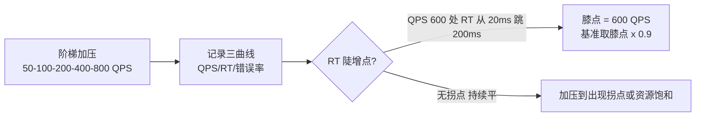
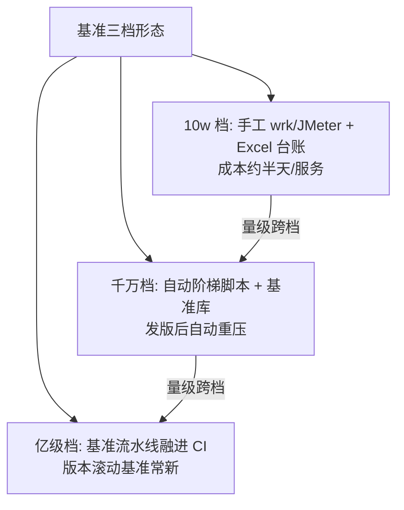

# 单机基准与水位线：容量规划的地基

> 「这台机器到底能扛多少 QPS？」——所有容量推导的第一个数字。基准（Benchmark）给出单机的真实能力拐点，水位线（Watermark）告诉你离拐点还有多远。这一篇讲基准怎么测才可信、水位线怎么设才有效，参数与三档配置全给。

## 一句话摘要

**单机基准** = 压到 RT 曲线「膝点」得到的服务单实例真实吞吐（不是配置的理论值）；**水位线** = 当前负载占基准的比例红线（常用 70%），为预测误差、突发毛刺、发布抖动预留反应时间。基准是分母，水位是安全系数——两者合起来回答「还能撑多久、什么时候必须扩」。

## 🎯 本文核心

**核心机制一句话**：单机基准测的是「服务能力的物理上限」（RT 陡增的膝点），水位线是把上限换算成「行动触发器」的管理工具——基准给分母，水位给纪律。

**机制链**：构造标准请求 → 阶梯加压 → 记录 RT/QPS/错误率曲线 → 找膝点（RT 拐点）→ 基准入表 → 线上水位 = 当前负载 ÷ 基准 → 水位超线触发扩容。上下游：上游是被压服务的依赖环境（基准可信度取决于环境等价性），下游是容量推导公式与告警配置（篇 1 的闭环在这里取数）。

## 典型使用场景

- **新服务上线前**：压出基准入表——没有基准的服务上线 = 容量黑箱；
- **水位例行巡检**：每周对照基准看各服务水位，越线排期扩容；
- **扩容验收**：扩容后复压，确认新供给真的提升了基准（机器加了但能力没涨 = 白买）；
- **基准过期复测**：大版本/大配置变更后基准重测（基准有效期纪律）。

## 机制：膝点为什么是唯一可信的基准

**为什么取膝点不取「最大 QPS」**——膝点之后服务进入过载区：QPS 还能缓慢涨，但 RT 指数上升（队列堆积），错误率开始出现——**过载区的吞吐是带毒的**（用户侧体验已不可用）。取膝点 × 0.9 为基准入表，留 10% 工程余量。

**设计思想**：基准测试的本质是「给服务的处理能力画一条供需失衡的临界线」——膝点之前排队可控（RT 线性），膝点之后队列正反馈（越慢越积、越积越慢）。理解了这个非线性拐点，就理解了为什么「平时快不代表扛得住峰值」。

**基准可信度三条件**（每个都是常见翻车点）：① **环境等价**——压测环境与生产的机器规格/网络/数据量一致（测试库数据量只有生产 1% 时，索引与缓存行为完全不同）；② **依赖真实**——被压服务的下游要么真实、要么 Mock 得像（Mock 返回太快会高估基准，Mock 返回不稳定会低估）；③ **数据等价**——缓存预热后再压（冷缓存的第一轮数据作废），数据分布贴近生产。

**关键参数表（基准与水位，三档）**：

| 参数 | 默认值 | 10w 档 | 千万档 | 亿级档 | 为什么 |
|---|---|---|---|---|---|
| 阶梯步长 | 每 30s 加一档 | 手工阶梯 | 自动阶梯 | 自动 + 持续施压 | 步长过粗会跳过膝点区间 |
| 每档时长 | 30-60s | 60s | 60s | 120s（含预热） | 短于 30s 的档位读数不稳 |
| 基准折扣系数 | 0.9 | 0.9 | 0.85 | 0.8 | 量级越大环境噪声越大，折扣越保守 |
| 水位告警线 | 70% | 70% | 70% | 65%（叠加多活切流余量） | 余量 = 预测误差 + 毛刺 + 发布抖动 |
| 基准有效期 | 90 天 | 180 天 | 90 天 | 30-90 天（随变更频率） | 大版本/配置变更即重测 |

## 💡 实战提示

- 💡 压测客户端自身要先验证够力：单台施压机打不满目标 QPS 时（客户端先到瓶颈），测出的是客户端基准不是服务基准——施压机集群化或确认客户端 RT 正常再信数据。
- 💡 基准表要记「环境指纹」：机型/核数/内存/依赖版本/数据量——没有指纹的基准数字半年后无法解释（「当时是什么机器测的？」是容量评审最常问的一句话）。

## 与「性能监控」的区别（跨域辨析）

监控给「现状」（当前 QPS 下的 RT 与资源），基准给「上限」（膝点能力）——水位 = 现状 ÷ 上限，**两个数来自两个体系缺一不可**。与「全链路压测」的区别：单机基准压的是「一个实例」（分母最小化），全链路压的是「整条调用链」（含层间放大）——单机基准是地基，全链路是高楼（篇 3），地基数字不准高楼全歪。

## 常见误区

- ❌ 「配置高的机器基准一定高」——同规格机型可能因宿主机邻居干扰（虚拟化环境噪声）差 20-30%（行业认知），基准必须逐台或抽样实测，不能按机型查表；
- ❌ 「压一次管一年」——JVM/容器/依赖升级、数据量增长都会移动膝点；基准有效期参数是纪律不是建议；
- ❌ 「CPU 水位代替一切」——多数服务的膝点先出现在连接数/队列深度/GC 停顿，CPU 反而是最后饱和的资源；水位要按「最先饱和的那个资源」设（每个服务的首要瓶颈资源不同，压测时识别）；
- ❌ 「基准取平均」——压测数据要取 P99 RT 曲线的膝点（平均值会掩盖长尾，长尾才是用户体感与超时触发的来源）。

## 代价与边界

基准建设成本：每服务首次约 0.5-1 人天（环境准备 + 阶梯压测 + 入表），复测 0.5 天。边界：基准只对「无状态服务」直接有效——有状态服务（DB/缓存）的基准要带数据量前提（空库基准毫无意义），且受数据增长漂移，容量规划方式不同（DB 靠容量模型与水位，缓存靠命中率与淘汰率）——**无状态压基准、有状态建模型**，这是容量规划在内部分工上的第一条边界。

## 与「容量模型」的区别和衔接（有状态服务的另一半）

无状态服务用基准，有状态服务（MySQL/Redis/ES）用**容量模型**：它们的膝点随数据量漂移（空表与亿行的查询能力天差地别），无法给出单一基准值——取而代之的是「数据量-性能」曲线建模（如 B+ 树三层红线推导单表上限，链回分库分表系列）+ 现场抽样压测校准。为什么分开管？——无状态的能力由代码与配置决定（相对稳定），有状态的能力由数据决定（持续漂移），两者的保鲜机制完全不同；一条衔接纪律：**有状态服务被无状态服务依赖时，无状态的基准压测必须在有状态容量模型的覆盖范围内做**（否则压的是假容量）。

## 接入步骤（新服务的基准与水位建设）

1. **前置**：压测环境与生产同规格；确认施压机能力充足；依赖真实或高质量 Mock；
2. **压测执行**：阶梯加压（参数表）→ 记录 RT/QPS/错误率三曲线 → 找膝点 → 基准 = 膝点 × 折扣系数；
3. **入表**：基准表记录数值 + 环境指纹 + 测试日期 + 有效期；
4. **水位配置**：服务监控加「水位 = 当前负载 ÷ 基准」指标，70% 告警（P2）、80% 告警（P1，链回告警分级）；
5. **验证点**：注入 1.1×基准的流量，验证水位越线告警真实触发；
6. **回退**：水位告警可静默（不影响服务），回退即调整阈值——水位体系自身零风险。

## 演进视角

基准与水位的演变：手工压测 + Excel 台账（10w 档现状）→ 自动化基准流水线（发版自动重压，基准随版本滚动）→ 水位平台化（全服务水位一屏可见，链回监控大盘篇）——演进的终点是「基准与 CI/CD 融合」：每次发版自动产出新基准，水位体系永远新鲜。这一演变在工程化域才刚起步，是未来三年的方向。

**反方案对照：为什么不用「线上高峰数据当基准」**——反方案的逻辑是「高峰扛住了，高峰值就是能力」，缺陷有三：① 高峰没有梯度（看不到膝点在哪）；② 高峰可能被限流/降级保护过（扛住的是被削过的流量）；③ 高峰不可复现与控制（无法做变量对照）——用真实高峰当基准，得到的是「历史巧合」不是「能力证书」，这就是该反方案被否决的取舍依据。

## 你们可能会问

**Q1：膝点找不出来（RT 一直平）怎么办？**
说明还没压到极限——继续加压直到出现拐点或资源饱和（CPU 100%/连接打满）；RT 全程平到打不上去，通常瓶颈在施压端或网络，换判据（资源饱和点即膝点）。**找不到膝点的压测不是压测，是流量回放。**

**Q2（追问）：水位为什么不用 CPU 而用「负载 ÷ 基准」的比值？**
CPU 只是资源之一且往往不是先饱和的——「负载 ÷ 基准」直接度量「离膝点多远」，是业务视角的容量语言；CPU/连接数/队列深度作为辅助信号并列监控，但水位的分子分母必须是同构的吞吐量。

**Q3（再追问）：微服务链路上每个服务基准不同，水位看谁的？**
每层各自看，但**告警取整链最高水位**——链路容量 = min(各层容量)，木桶在容量域同样成立；链路水位进大盘时按 min 展示 + 各层明细下钻（链回监控大盘篇）。

## 开放问题

- 基准的自动化回归（发版即重压）在快速发布团队的成本与收益平衡——全自动基准流水线（压测即 CI 环节）会显著拉长发布流水线时间，「抽样式基准」（按变更风险抽样重压）的可靠性边界是开放问题。

## 决策

**决策**：何时建基准表——服务数量 > 5 或第一次容量事故后（立刻）；何时把水位挂进告警——基准覆盖率 > 50% 时（半盲状态的水位告警会误导）。怎么选基准折扣：环境噪声越大（虚拟化/共享集群）折扣越保守，裸金属可放宽到 0.9。

## 自测三问

1. 基准为什么取膝点不取最大 QPS？（过载区吞吐带毒——RT 指数上升队列正反馈）
2. 基准可信度三条件？（环境等价 / 依赖真实 / 数据等价）
3. 链路水位怎么取？（各层 min——链路容量等于最弱一层）

## 5W 速记卡

| 问题 | 答案 |
|---|---|
| What | 膝点基准（分母）+ 70% 水位线（纪律） |
| Why | 「离极限多远」是容量规划的第一数字 |
| 三条件 | 环境等价 / 依赖真实 / 数据等价 |
| 参数 | 折扣 0.8-0.9 / 告警 70% / 有效期 90 天 |
| 边界 | 无状态压基准、有状态建模型 |

## 🎯 核心带走

**核心带走**：基准 = 膝点 × 折扣（过载区吞吐带毒），水位 = 现状 ÷ 基准（70% 买反应时间），基准表带环境指纹与有效期。**失效点**——客户端瓶颈当服务能力、按机型查表不实测、CPU 单维水位、基准过期。金句带走：

> **没有基准的水位是情绪，没有水位的基准是废纸——容量规划的两个数字必须成对出现。**

> **压到膝点才停：达标线以下的压测数据没有容量意义——拐点之前都是假象，拐点之后都是代价。**

## 📌 数据与事实声明

- 「虚拟化噪声 20-30%」「水位 70% 惯例」为行业认知量级；阶梯压测方法为通用实践（JMeter/wrk/Gatling 类工具通用）；参数随环境校准。

## 📚 参考资料

- 篇 1《什么是容量规划》（闭环定位）
- 特性层《压测指标体系与瓶颈定位》（基准数据的深加工）
- wrk / JMeter / Gatling 官方文档（施压工具）
