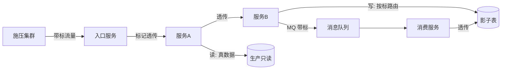
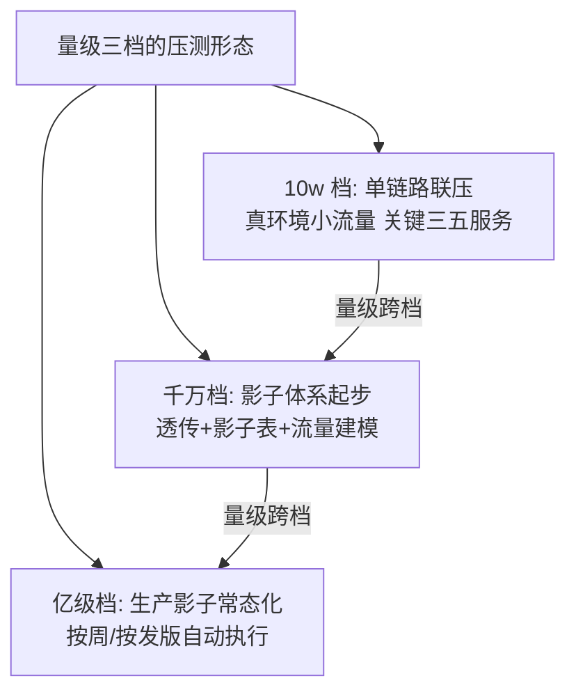

# 全链路压测入门：让容量验证贴近真实战争

> 单机基准各自漂亮，链路一压全露馅——「每层都对、整体崩了」的容量事故（篇 1 的事故推演）只有一种根治手段：**全链路压测**。把真实的调用链、真实的数据形态、真实的流量混合在受控环境里重演，这篇讲它的原理、安全边界与接入路径。

## 一句话摘要

全链路压测 = **影子流量**（打标透传全链路，写操作落影子表不碰真数据）+ **流量建模**（按生产流量形态构造混合场景）+ **整链施压**（从入口打到最深依赖）——验证的是「链路在混合负载下的整体容量与层间放大效应」，单机基准测不到的「层间放大」与「连接争抢」只有它能暴露。

## 🎯 本文核心

**核心机制一句话**：全链路压测 = 让压测流量「像真流量一样走完全链路」，又「不像真流量一样污染数据」——标记透传与数据隔离是它的两大机制支柱。

**机制链**：流量录制/构造（按生产形态）→ 打标（压测标记进入调用上下文）→ 透传（RPC/MQ/Job 全链路携带）→ 影子表路由（写操作按标记落影子表）→ 整链施压与观测 → 按标记回收清理。上下游：上游是流量模型（场景配比与峰值系数），下游是容量结论与瓶颈清单（篇 1 闭环的「测」环节加强版）。

## 典型使用场景

- **大促容量验证**：预估峰值流量按生产配比回放，验证整链供给与预案；
- **架构升级验收**：分库分表/服务化改造后，整链容量是否真的提升（改造收益的实证）；
- **新场景上线**：新业务链路第一次接入混合流量的容量摸底；
- **年度容量审计**：常态化的链路级基准（单机基准会过期，链路基准同样会）。

## 机制：两大支柱的原理

**支柱一：标记透传**。压测标记（如 `x-load-test: 1`）进入入口请求后，必须在每一跳传播：RPC 头透传、MQ 消息属性透传、线程池上下文传递（异步场景的 ThreadLocal 丢失是经典翻车点）。**为什么必须全链路透传**——任何一跳丢标，压测流量就「变回」真实流量写脏真数据：这是全链路压测最严重的事故形态（比压不出结果严重得多）。

**支柱二：影子表路由**。带标的写操作按路由规则落**影子存储**（同构的影子表/影子库/影子 Redis 前缀），读操作可以读真数据（读不脏数据）——真实性与安全性的平衡点。路由的实现层各有取舍：SDK 层（数据访问组件按标路由，侵入小覆盖全）vs 存储层（影子库，隔离彻底但成本翻倍）。

## 💡 实战提示

- 💡 第三方依赖（支付通道/短信）不能被压测打真实调用——对外的出口必须 Mock 挡板（返回预设响应）：**链路到外部边界为止，挡板是链路的墙**。
- 💡 影子表的清理要自动化（压测数据带标记可批量删除），且**清理脚本要限速**——海量 DELETE 对生产库的冲击（链回 Buffer Pool 抖动原理）。

## 与「单机基准」的区别（跨域辨析）

单机基准回答「一个实例的能力」，全链路回答「整条链的容量与放大系数」——三个只有链路压测能暴露的问题：① **层间放大**（应用 2000 QPS 时 DB 实际 8000：缓存未命中回源、扇出调用）；② **连接争抢**（跨片查询打满连接池）；③ **混合场景干扰**（多场景共享资源时的相互挤占）。代价对比：单机基准一人天/服务，全链路是平台级工程（千万档起步建设）——**先地基后高楼，顺序不可反**。

## 常见误区

- ❌ 「全链路压测就是多压几个服务」——不透传标记、不隔离数据的多服务压测 = 联合污染生产数据；透传与隔离是它的定义而不是可选项；
- ❌ 「压测环境压完就行」——压测环境的容量与生产差数量级时结论失真；行业成熟做法是**生产环境影子压测**（低峰期 + 影子数据 + 严格隔离），这正是它工程门槛高的原因；
- ❌ 「流量随便造」——压测流量的场景配比失真（把读多写少压成写多）会让结论完全错误；流量模型必须来自生产录制或生产监控统计（特性层篇 1 展开）；
- ❌ 「压出结果就完事」——压测报告的价值在「瓶颈清单 + 修复 + 复压」，不复压的压测只完成了一半（修复有效性未验证）。

## 代价与边界

全链路压测的成本：标记透传改造（全链路组件埋点，一次性大工程）、影子存储（同构影子表翻倍存储）、平台建设（施压/观测/报告）、常态化运营。边界：它验证「可重放的确定性流量」——突发性流量形态（传播性热点）只能靠限流与弹性兜底；对 **不可 Mock 的核心外部依赖**（如银联通道）只能降额压测或挡板近似——挡板与真实通道的行为差是结论的误差项，要在报告中标注。

## 演进与取舍的机制底色

全链路压测的底层原理是「生产环境的可复现实验」——它的可信度来自三个等价性：流量等价（场景配比真实）、数据等价（数据量与分布真实）、链路等价（版本与配置真实）。三个等价性每失守一个，容量结论的可信度就掉一个档次；**取舍上宁可缩小压测规模也要保等价性**——小而真的压测优于大而假的压测，这是全链路压测所有设计决策的第一原则。

## 接入步骤（全链路压测的最小可用落地）

1. **前置**：单机基准体系已完成（各服务膝点入表）；业务方确认可压场景与封网窗口；
2. **标记透传改造**：入口打标 → RPC/MQ/异步上下文全链路透传（按组件清单逐个埋点，漏一跳即事故）；
3. **影子路由建设**：写操作影子表路由（数据访问层改造）+ 影子表初始化；
4. **流量建模**：从生产监控统计各场景配比与峰值系数，构造施压流量（录制优先）；
5. **验证点**：① 标记透传校验（每跳检查标记存在）；② 影子隔离校验（压测后真数据零污染比对）；③ 链路容量报告产出（各层水位 + 瓶颈清单）；
6. **回退**：施压停止开关化；影子数据批量清理（限速）；透传改造保留（常态下标记不携带零开销）。

## 演进视角

全链路压测的演变：线下环境联压（失真大）→ 生产低峰真流量压测（风险高）→ **生产影子压测**（行业成熟形态）→ 常态化自动化（按周/按发版自动执行，报告进容量看板）。演进的每一步都在解决「真实性」与「安全性」的矛盾——影子技术是当前两者的最优平衡点，未来向「压测即服务」（容量验证 API 化）演进。

**反方案对照：为什么不满足于「分层压测汇总」**——反方案（各层压完按理论放大系数汇总）的缺陷：放大系数本身依赖缓存命中率/数据分布等运行时状态，理论推算与实测偏差常达数倍（篇 1 事故的 4 倍偏差即是实证）；链路压测的额外成本（平台级）买到的是「放大系数的实测值」——这笔取舍在千万档之后稳赚，之前可用理论值过渡。

## 你们可能会问

**Q1：10w 档需要全链路压测吗？**
不需要——10w 档用「单链路联压」的轻量版：真环境 + 小流量 + 关键三五个服务，不建影子体系（成本不匹配）。行业认知的分界：日千万交易量或服务链超 3 层再上完整全链路。

**Q2（追问）：影子表和真表同库还是分库？**
同库影子表（成本低、路由简单）起步，容量冲突（影子数据影响真表缓存与统计信息）后升级分库——取舍在「隔离彻底性」与「资源成本」之间，按数据敏感度与量级递进。

**Q3（再追问）：压测流量会不会影响真实用户的缓存命中？**
会——带标读请求也会刷共享缓存（把压测数据缓存进去挤掉真实热点）。治理：缓存读写按标记路由到影子前缀（缓存也要影子化），或压测场景缓存预热的专门设计——**缓存影子化是全链路压测改造清单里最容易漏的一项**。

## 开放问题

- 影子流量的自动化常态化（每次发版自动触发小规模链路压测并出报告）与发布流水线时长的矛盾——「抽样链压」（按变更影响面选链路）的可靠性边界是工程开放题。

## 决策

**决策**：何时启动全链路压测建设——日交易量过千万、服务链超 3 层、或出现一次「分层对、整体错」的容量事故（任一条件）；何时做生产影子压测——压测环境与生产差异无法收敛时。怎么选首批压测链路：选「资损敞口最大」与「流量峰值最高」的两条链路（价值最高、教训最痛）。

## 自测三问

1. 全链路压测的两大机制支柱？（标记透传 + 影子表路由）
2. 最严重的事故形态是什么？（丢标变真流量污染生产数据）
3. 哪三个问题只有链路压测能暴露？（层间放大 / 连接争抢 / 混合干扰）

## 5W 速记卡

| 问题 | 答案 |
|---|---|
| What | 打标透传 + 影子隔离的整链施压 |
| Why | 层间放大与争抢只有链路视角能暴露 |
| 铁律 | 全跳透传不丢标 / 写落影子 / 外部挡板 |
| 成本 | 平台级工程，千万档起步 |
| 边界 | 外部依赖挡板近似；突发流量靠限流弹性 |

## 🎯 核心带走

**核心带走**：全链路压测 = 真实性（整链混合负载）+ 安全性（标记透传与影子隔离）的平衡工程；它的独有价值是暴露「层间放大系数」——单机基准永远算不出这个数。**失效点**——丢标污染、缓存未影子化、流量配比失真、压完不复压。金句带走：

> **单机基准是体温，全链路压测是体检——体温正常不等于器官没问题，层间放大的病只有体检照得出来。**

> **丢一跳标记就是污染一次生产数据——全链路压测的全部工程难度，都集中在这句话上。**

## 📌 数据与事实声明

- 影子压测架构与透传机制为业界公开实践归纳（阿里/美团/京东全链路压测公开分享）；成本与量级分界为行业认知；「缓存影子化易漏」为公开复盘的高频教训归纳。

## 📚 参考资料

- 篇 1/2（闭环与地基）、特性层《影子流量与数据构造》（标记与隔离的工程细节）
- 本仓库稳定性系列大促保障专题（演练与压测的组织联动）
- 全链路压测公开技术白皮书（行业认知来源）
