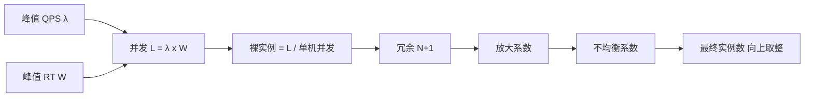
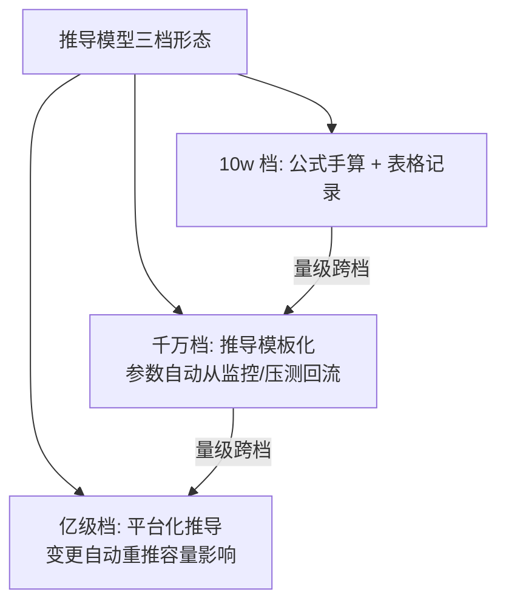

# 扩容模型：用 Little's Law 把容量算成数学题

> 「峰值 5 万 QPS，每台 2000，是不是 25 台？」——错，至少差三倍。并发数、QPS、RT 是被一条定理锁死的三个变量（Little's Law），扩容推演必须从这条公式出发，再叠加冗余、放大与不均衡三个修正因子。这一篇把扩容从「拍脑袋加机器」变成一道有公式的数学题。

## 一句话摘要

**Little's Law：并发数 L = 到达率 λ × 停留时间 W**——L（系统内同时在处理的请求数）由 QPS 与 RT 相乘决定，它是线程池、连接池、实例数所有容量推导的原子公式。实例数 = 峰值 QPS ÷ 单机基准，再乘三个修正因子：**冗余系数**（N+1 容灾）、**放大系数**（层间回源与扇出）、**不均衡系数**（热点与长尾）。

## 🎯 本文核心

**核心机制一句话**：扩容推导 = 原子公式（L = λ×W）定并发 → 基准定单机 → 三修正因子兜现实，公式管骨架，因子管肉。

**机制链**：峰值 QPS（流量侧）× 峰值 RT（能力侧）→ 并发数 → ÷ 单机并发能力 → 裸实例数 → × 冗余 × 放大 × 不均衡 → 最终实例数。上下游：上游是峰值预测（篇 1 的流量建模）与单机基准（篇 2），下游是成本预算与资源申请——每个数字都有出处，预算评审才能通过。

## 典型使用场景

公式的适用前提要先说清（它假设系统处于稳态：到达速率与处理速率平稳）：以下场景都在稳态假设内——突发尖峰的兜底交给限流与弹性（篇 1 边界的重申），重尾 RT 分布用 P99 敏感性检查对冲。


```text
场景：下单接口峰值 20000 QPS，压测单机基准 2000 QPS（膝点 x 0.9），
     平均 RT 50ms（0.05s），N+1 容灾，缓存命中率 80%（回源放大 5 倍），
     灰度发布期间容量抖动 20%。

Step 1 原子公式：L = λ x W = 20000 x 0.05 = 1000 并发
Step 2 单机并发：基准 2000 QPS x 0.05s = 100 并发/台
Step 3 裸实例：1000 / 100 = 10 台
Step 4 修正：
  冗余 x (10+1)/10 = 1.1  ->  11 台
  不均衡 x 1.2（流量不均/发布抖动） -> 13.2
  （放大系数作用于 DB 层：20000 x 5 = 10 万 QPS 打 DB，按 DB 基准另算）
结论：应用层 14 台（向上取整含灰度余量），DB 层按 10 万 QPS 单独推导。
```

## 机制：三个修正因子各自修正什么现实

**冗余系数（N+1）**：任意一台宕机时剩余实例仍接得住全量——为什么只 +1：宕机是小概率单事件，+1 覆盖；同可用区多机同挂（大故障）交给故障转移与降级预案（不在容量模型内兜底，兜不起）。

**放大系数**：上游 1 个请求在下游产生多个请求——缓存未命中回源（命中率 80% → 回源 5 倍）、扇出调用（一单查 3 个下游）、重试放大（失败重试 ×2）。**这是分层容量推导的核心参数**，每个上下游边界都要单独算（篇 1 事故的教训制度化：放大系数必须实测——压测时统计下游调用次数/上游请求数）。

**不均衡系数**：流量在实例间不均匀（网关负载不均/热点 key 路由集中）+ 发布期间部分实例摘流——负载均衡越好多余量越小（行业认知 1.1-1.3）。



## 💡 实战提示

- 💡 公式里的 RT 用「峰值期实测 RT」不是压测基准 RT——真实流量的 RT 含混合场景干扰（GC/锁/缓存争抢），通常比单场景压测高 20-50%（行业认知）；RT 变大 → 并发 L 变大 → 实例需求变大，**RT 是容量模型的放大器**。
- 💡 有状态的层（DB/缓存）不用实例数推导，用吞吐推导（QPS 需求 ÷ 单机吞吐基准）+ 容量模型（数据量维度，篇 2 的衔接纪律）——两层两套公式别混用。

## 与「弹性伸缩」的区别（跨域辨析）

扩容模型给出「稳态容量」的静态推导（提前买/提前配），弹性伸缩（HPA）给「瞬时波动」的动态响应（实时加副本）——两者是**防线纵深**关系：弹性兜毛刺波动（分钟级），模型保峰值底座（采购与扩容是天级动作）。为什么弹性不能替代模型：扩缩容有滞后（指标采集+调度+启动预热），秒级洪峰弹不起来；且弹性上限本身要由模型确定（maxReplicas 定多少还是这道题）。

## 常见误区

- ❌ 「按 QPS ÷ 单机 QPS 一除就完事」——漏了 RT 维度：RT 翻倍时同样 QPS 需要双倍并发承载，一除法掩盖了 RT 恶化对容量的放大；
- ❌ 「放大系数拍脑袋设 2 倍」——缓存命中率 95% 与 60% 的回源放大差 8 倍，这个系数必须实测（压测时统计上下游调用比），拍脑袋是容量事故的高频根因；
- ❌ 「只算应用层」——应用/DB/缓存/第三方配额每层独立推导（各自的基准、放大、瓶颈资源），层间用放大系数串联——单层推导是篇 1 事故的同款错误；
- ❌ 「实例数就是成本」——连接数（每实例 × 连接池 × 实例数 ≤ DB max_connections）、带宽、第三方 QPS 配额都是并发约束，实例算完还要对齐这些隐藏天花板。

## 代价与边界

模型推导的成本：参数采集（基准/RT/放大系数/不均衡度）需要压测与监控数据支撑——**模型的精度上限 = 输入参数的精度**。边界：Little's Law 假设系统稳定（到达与处理速率平稳），突发尖峰、长尾分布重（RT 方差大）的场景公式偏差增大——取「峰值 RT 的 P99」代入而非均值可部分对冲，极端突发交给限流与弹性兜底。

## 与「成本优化」的衔接（反向求解的另一半）

同一套模型反向跑就是成本优化：正向是「流量 → 需要多少实例」，反向是「当前实例 → 能承接多大流量」——把每台服务的实测负载与模型推导对比，**长期低于模型值 50% 的服务就是过度配置候选**（缩容或降配）。为什么反向经常被忽略？——正向连着事故（有痛感），反向连着预算（痛感在别人部门）；工程纪律是把反向求解纳入季度容量评审（链回篇 1 的偏差反馈回路），让模型的误差反馈同时驱动省钱。

## 接入步骤（新服务的容量推导清单）

1. **前置**：单机基准已入表（篇 2）；峰值流量预测已确认（业务输入）；
2. **原子推导**：L = λ × W（W 取峰值期实测 RT 或压测 RT × 1.3 修正）；
3. **单机换算**：单机并发 = 基准 QPS × 同一 W，裸实例 = L ÷ 单机并发；
4. **三因子修正**：冗余（N+1）× 放大（实测）× 不均衡（1.1-1.3）→ 最终实例数；
5. **隐藏天花板对齐**：连接数/带宽/第三方配额逐一校验（`实例数 × 每实例连接 ≤ 下游上限`）；
6. **验证点**：大促/压测实测峰值 vs 模型预测，偏差 > 20% 则回溯修正参数（闭环回流，链回篇 1 的反馈回路）。

## 演进视角

容量推导的演变：经验表格（「一台 8C16G 大约 3000 QPS」）→ 公式化（Little's Law + 实测参数）→ 平台化推导（输入流量预测自动出全链路容量报告）→ 与弹性伸缩融合（模型定上限、弹性管波动）。演变的主线是**参数的自动采集**——公式三十年没变，变的是参数从人肉查表到自动回流；未来方向是容量推导嵌入发布系统（变更自动重推容量影响）。



**设计思想**：为什么把「放大系数」从直觉变成一等公民参数？——设计思想层面，容量模型的价值不在公式（公式只有一条），而在**参数的采集与保鲜机制**：基准有有效期、放大系数要压测实测、不均衡系数随负载均衡演进漂移——模型是死的，参数的治理才是活的。为什么这么设计（参数化而非整体经验系数）？因为只有参数化才能定位「哪个假设失效了」，整体经验系数失效时无从归因。

## 你们可能会问

**Q1：RT 怎么取？均值还是 P99？**
推导并发用均值 RT（Little's Law 的 W 是平均停留时间）；但需要**用 P99 做敏感性检查**——P99 RT 恶化到什么程度会让所需实例数跳档，这个「RT-容量」敏感性是容量预案的输入。为什么两个都用？——均值管常态容量，P99 管尾部的体验与超时风险，一个问题两个视角。

**Q2（追问）：缓存命中率从 95% 掉到 80%，容量怎么变？**
回源放大从 20 倍变 5 倍——DB 层容量需求 ×4；应用层不变。这正是「放大系数必须按层独立推导」的原因：命中率漂移只冲击 DB 层，把整个链路等比扩容会浪费应用层预算。命中率是容量模型里最敏感的参数之一（专题层大促篇展开活动期的命中率治理）。

**Q3（再追问）：推导出来 13.2 台，到底买 13 还是 14？**
14（向上取整）——容量推导的取向永远是保守侧：不足的代价是事故，多一台的代价是成本；同时把「0.8 台的零头」记录为下一个优化项（RT 优化或命中率提升可能把它省回来）。**向上取整是纪律，零头是优化线索。**

## 开放问题

- AIGC 类长连接/流式请求（RT 分布极重尾、会话时长不定）对 Little's Law 的适用性挑战——W 的「平均停留时间」在流式场景如何定义，容量模型的下一代形态仍在探索。

## 决策

**取舍与模型的思想内核**：容量推导的每一次取舍（冗余多一倍还是少一倍、参数偏保守还是激进）都在「事故代价」与「资源成本」之间称重——这套模型的设计思想是把称重过程显式化：每个因子的数值与依据写进推导记录，评审时争议点落在参数上而不是结论上。为什么这么设计？因为参数可以实测校准，而「结论正确与否」永远无法事后校准——把可校准的部分参数化，把不可校准的部分交给保守取向。

**决策**：何时开始用公式推导——第一次资源申请超过 10 台或第一次容量事故后（之前用经验表格过渡）；何时做全链路分层推导——服务依赖 ≥ 2 层且存在缓存/重试（放大系数不可忽略）。怎么选冗余系数：N+1 是下限，可用性 SLA 要求跨 AZ 容灾时 N+AZ 数，预算紧时用弹性伸缩承接溢出（模型下限 + 弹性上限）。

## 自测三问

1. Little's Law 的三个变量与关系？（L = λ × W：并发 = 到达率 × 停留时间）
2. 三个修正因子各修正什么现实？（冗余修宕机 / 放大修层间回源扇出 / 不均衡修负载漂移）
3. 为什么 RT 用峰值实测而不是压测均值？（混合场景干扰——RT 是容量模型的放大器）

## 5W 速记卡

| 问题 | 答案 |
|---|---|
| What | L = λ×W 原子公式 + 三修正因子的扩容推导 |
| Why | 把「加多少机器」从直觉变成可复算的数学 |
| 参数来源 | 基准（篇2）实测、放大系数压测统计、不均衡 1.1-1.3 |
| 隐藏天花板 | 连接数/带宽/第三方配额逐一校验 |
| 边界 | 稳态假设；突发交给限流与弹性 |

## 🎯 核心带走

**核心带走**：扩容推导 = 原子公式定并发 + 单机基准定分母 + 三因子兜现实；每层独立推导、层间放大串联、隐藏天花板对齐。**失效点**——RT 维度缺失、放大系数拍脑袋、单层推导、零头向下取整。金句带走：

> **QPS、RT、并发被一条定理锁死——容量推导的全部魔法，就是诚实地把三个数字都测准。**

> **向上取整是纪律，零头是优化线索——容量模型的每个余数，都是一条性能优化的线索。**

## 📌 数据与事实声明

- Little's Law 为排队论公理（J.D.C. Little, 1961，公开数学结论）；「峰值 RT 放大 20-50%」「不均衡 1.1-1.3」为行业认知量级；示例推演数字为教学构造。

## 📚 参考资料

- 篇 1/2/3（闭环、基准、链路压测——公式的参数来源）
- 《Site Reliability Engineering》—— per-request 资源与容量章节
- Little's Law 原始论文（证明与适用条件）
