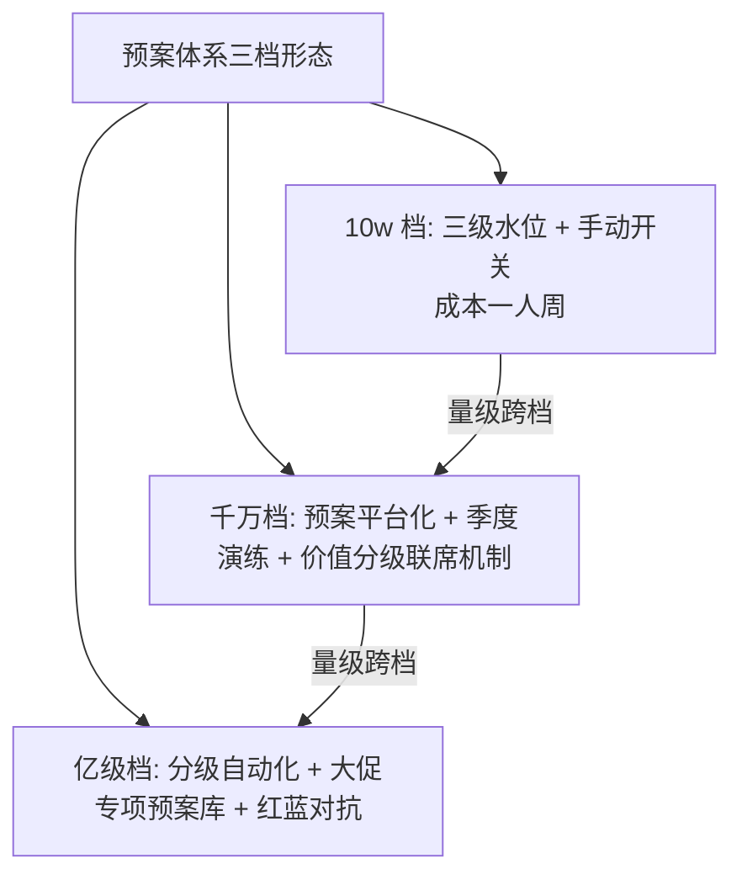

# 容量预案与降级水位：极限到来之前定好动作

> 容量推导算出「需要多少」，预案定义「不够的时候砍什么」——两者合起来才是完整的容量管理。没有预案的容量规划在峰值越线时只剩一个动作：看着它崩。这一篇讲降级水位的分级设计、预案的编写标准与触发演练。

## 一句话摘要

容量预案 = **把「过载时砍什么」的决策前置到平静期**：按水位分级（黄 70% / 红 85% / 黑 95%）预绑定降级动作（砍非核心 → 限流 → 熔断兜底），每个预案带触发条件、动作指令、恢复条件三要素，并通过演练验证「砍了之后业务真的还能活」。水位线是触发器，预案是扳机后面的子弹——两者缺一，水位就只是个仪表读数。

## 🎯 本文核心

**核心机制一句话**：预案 = 预先定价的「业务牺牲清单」——按价值从低到高排序的降级序列，让过载时的取舍在几秒内执行而不是几十分钟内争论。

**机制链**：业务价值分级（核心/重要/可牺牲）→ 降级序列设计（先砍谁后砍谁）→ 水位触发绑定（黄/红/黑各绑动作）→ 预案落开关（一键可执行）→ 演练验证（砍完核心业务仍健康）→ 复盘校准。上下游：上游是容量推导（篇 4，知道极限在哪才知何时启动预案），下游是稳定性系列的降级熔断执行（预案调用稳定性域的开关机制）。

## 典型使用场景

- **大促预案**：活动峰值可能超容量 30% 时，预案定义「关闭推荐/压缩响应/降级非核心查询」的序列；
- **依赖故障预案**：某下游（推荐服务/积分服务）不可用时，主交易降级为「默认值/跳过」继续；
- **成本预案**：流量低谷期的自动缩容策略（与扩容模型反向运行，链回篇 4 反向求解）。

## 机制：降级序列怎么排序

**排序原则：业务价值密度（单位资源产出的业务价值）从低到高砍**——先砍「占资源大、价值密度低」的（推荐/榜单/个性化），保「占资源小、价值密度高」的（下单/支付）。两个设计要点：

1. **分级与水位绑定**：黄线（70%）触发「可牺牲项降级」、红线（85%）触发「重要项限流」、黑线（95%）触发「仅保留核心交易链」——为什么分级绑定：过载程度不同时牺牲的边际代价不同，一次砍到底会过度牺牲；
2. **预案三要素**：触发条件（哪个水位/哪个指标）+ 动作指令（开关 ID，可一键执行）+ 恢复条件（什么状态可恢复）——缺恢复条件的预案是单向门（链回止损篇的时效过期设计）。

## 💡 实战提示

- 💡 预案的每个动作必须**开关化**（配置中心一键切换）且演练过——「写在本子上但没做成开关」的预案，执行成本高到事故时没人用。
- 💡 降级动作要带**用户感知设计**：降级后的文案（「活动太火爆」）、空数据占位、异步补偿承诺——技术降级 + 体验设计一起上，客诉才不会成为第二事故。

## 与「熔断降级」的区别（跨域辨析）

稳定性熔断是「故障触发」（下游坏了自动切），容量降级是「水位触发」（流量大了主动砍）——触发信号不同（错误率 vs 水位线）、决策者不同（熔断可全自动，容量降级通常人工确认 + 自动执行，因为「砍业务」的商业代价需要人背书）。为什么容量降级不全自动——误砍的业务损失要有人定价与担责，这与止损授权的取舍同构（链回防资损止损篇的授权三条件）。

## 常见误区

- ❌ 「预案写在文档里」——文档预案在事故时不可执行；预案的存在形式必须是「开关 + 自动化触发 + 演练记录」；
- ❌ 「降级只降技术指标」——降级后的业务指标（转化率/客单价）也要监控：降级过度时「系统健康但业务死亡」是隐性事故；
- ❌ 「恢复立即全量」——降级解除与止损恢复同构：分步放量 + 双指标观察（链回止损篇的恢复五步）；
- ❌ 「预案万能」——预案覆盖「预判过的过载形态」，超出预案的黑天鹅（依赖全部故障+流量洪峰叠加）只能靠架构韧性兜底——预案是概率武器不是全保险。

## 代价与边界

预案体系的成本：业务价值分级的产品/运营输入（价值排序是商业判断）、开关建设、每季演练。边界：预案只能降「有开关的可降项」——架构里没有开关的模块（不可降级）等于「过载时必然拖垮全链的硬依赖」，**容量评审要给每个不可降级依赖标红**（它们是容量规划里最危险的存在，改造进 roadmap）。

## 机制原理：为什么「分级 + 绑定」优于「一刀切」

预案体系的设计思想源自控制论里的分级响应：过载是一个连续恶化的过程（70% → 95%），分级绑定的本质是**给每个恶化阶段匹配一个「最小充分动作」**——动作不足则水位继续恶化，动作过度则业务过度牺牲。为什么一刀切（只设黑线全量熔断）不可取：从 70% 直接跳到全熔断，中间 25% 的恶化区间里业务本可以无损运行却被提前牺牲——分级就是用「动作粒度」去逼近「过载粒度」，这是整个预案体系的机制原理。

## 接入步骤（新服务的预案建设）

1. **前置**：容量推导完成（知道极限与水位含义，篇 4）；业务方给出价值分级输入；
2. **价值分级**：核心链（交易/支付）— 重要链（查询/详情）— 可牺牲（推荐/统计），业务 + 工程联席定级；
3. **降级序列设计**：按价值密度排序 + 水位绑定（黄/红/黑三段动作）；
4. **开关落地**：每个动作做成配置开关，接入一键执行（链回止损执行器模式）；
5. **验证点**：演练注入过载（施压到黄线），验证「触发 → 动作 → 业务存活」全链路；恢复流程反向验证；
6. **回退**：预案开关化，误触发即关闭并复盘（与止损误触发同款治理）。

## 演进视角

预案的演变：纸面预案（事故时翻文档）→ 开关化预案（一键执行）→ 分级自动化预案（水位触发自动执行 + 人工背书）——演进的每一步都在压缩「从越线到动作」的延迟。与止损自动化同样的设计哲学：**人的决策提前到平静期，机器在事故期只做执行**——这条哲学贯穿防资损与容量两个域。

**反方案对照：为什么不用「临时开会决定砍什么」**——反方案（事故现场拉会决策）的真实成本：决策链 30 分钟起步（拉人/对齐/拍板）× 每分钟放大的过载损失，且临场决策质量劣化（压力下倾向保守不敢砍或情绪化全砍）——预案机制用平静期的评审买断事故期的决策时间，这笔取舍是预案体系存在的理由。

## 你们可能会问

**Q1：预案分级怎么和业务方对齐？**
用「资源占比 × 业务价值」的二维表量化对齐：每个场景占多少资源（压测实测）、贡献多少业务价值（运营口径）——数据摆出来，砍谁的争议就从情绪讨论变成数字讨论。为什么必须数据化：价值排序的争论在事故现场没有输出，前置的数据对齐才有决策效率。

**Q2（追问）：降级期间积压的请求怎么处理？**
预案三要素之外要加第四项「积压去向」：拒绝型（引导稍后再试）、暂存型（限流重放）、降级型（返回默认值）——不同类型对应不同的恢复动作（暂存型的重放要限速，链回止损恢复的流量冲击教训）。为什么积压去向是必须项：不定义去向的降级，恢复时就是一波无预期的流量洪峰。

**Q3（再追问）：黄线触发的降级要不要人工确认？**
黄线（70%）动作轻（砍可牺牲项）→ 自动执行 + 事后通报；红线（85%）动作重（限流重要项）→ 自动执行 + 值班实时确认可回退；黑线（95%）→ 自动保核心 + 管理层通报。**分级的核心思想：动作越重，人的确认越前移到预案评审期**——与止损自动化的哲学完全一致。

## 开放问题

- 降级序列的自动排序（按实时业务价值密度动态调整砍序）依赖业务价值数据的实时归因，目前业界以静态排序为主——动态化的数据基础（实时价值归因）是开放课题。

## 决策

**决策**：何时建预案——容量推导完成、且业务存在「流量可能超供给」的真实可能时（理论上所有在线服务都可能）；何时演练——每季度 + 大促前必演（与防资损演练节奏对齐）。怎么选首个降级对象：价值密度最低 + 开关化成本最低的场景（推荐/统计类是常见首选）。

## 自测三问

1. 预案三要素 + 第四项？（触发条件/动作指令/恢复条件 + 积压去向）
2. 三级水位各绑什么？（黄砍可牺牲 / 红限流重要 / 黑仅保核心）
3. 为什么容量降级不全自动？（砍业务的商业代价需人定价——决策前移到评审期）

## 5W 速记卡

| 问题 | 答案 |
|---|---|
| What | 水位分级绑定的降级序列与开关化预案 |
| Why | 过载时的取舍必须前置到平静期 |
| 排序 | 价值密度低先砍（推荐/统计→重要→核心） |
| 配套 | 开关化 + 演练 + 用户感知设计 + 积压去向 |
| 边界 | 只降有开关的项；不可降级依赖要标红改造 |

## 🎯 核心带走

**核心带走**：容量预案 = 价值密度排序的降级序列 × 水位分级触发 × 开关化执行 × 演练验证；预案四要素（触发/动作/恢复/积压去向）缺一不可。**失效点**——文档预案不可执行、降级不看业务指标、恢复一步到位、无积压去向定义。金句带走：

> **水位线是仪表读数，预案才是武器——没有开关化的预案，事故现场连纸都翻不开。**

> **人的决策提前到平静期，机器在事故期只做执行——容量预案、止损授权、熔断联动，全都遵循这条哲学。**

## 📌 数据与事实声明

- 水位分级（70/85/95）、价值密度排序法为业界通行实践归纳（公开大促预案分享）；降级转化的客诉影响为行业认知；场景示例为通用化构造。

## 📚 参考资料

- 篇 4《扩容模型》（水位的水位含义与推导）
- 本仓库稳定性系列（熔断降级执行机制、止损授权对照）
- 专题层《大促容量预案全景》（本篇的亿级实战展开）
