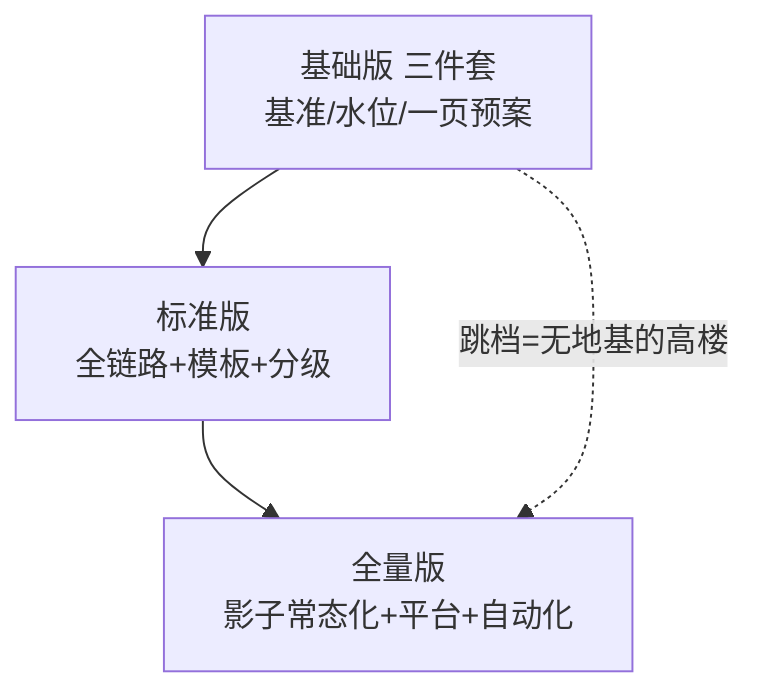
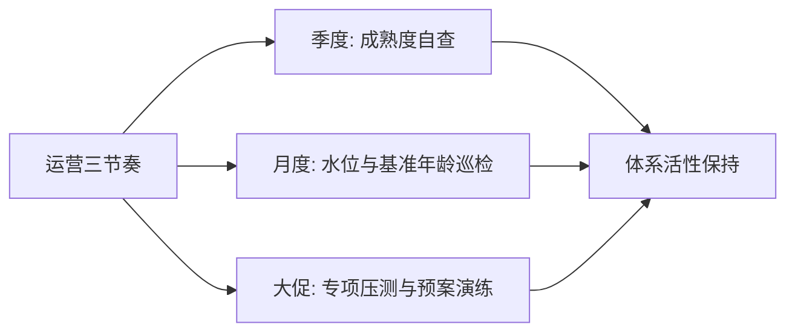
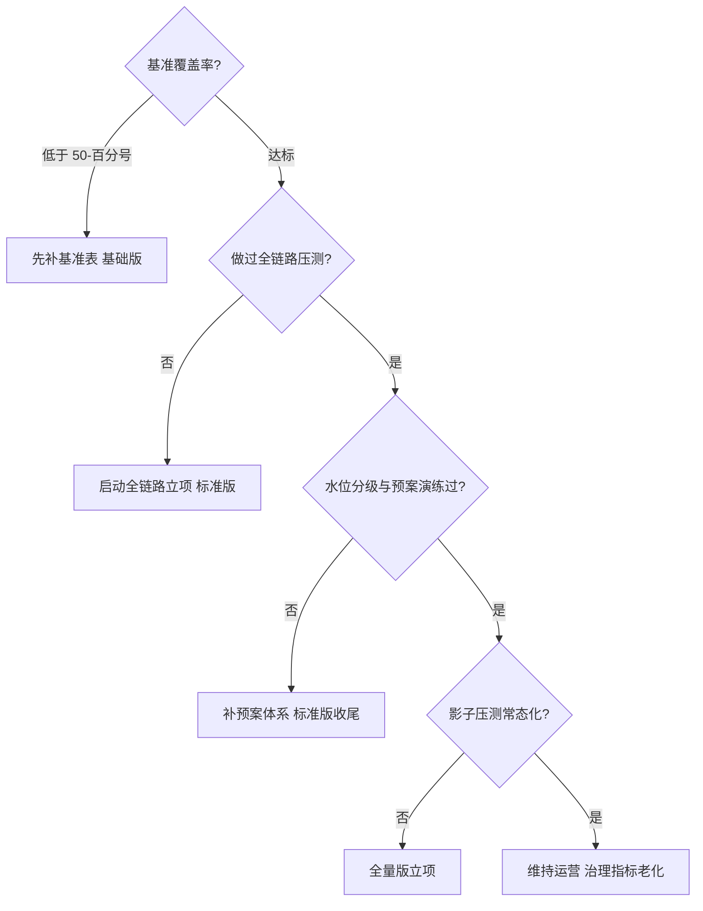

# 容量规划方法论总结：四步闭环的路线图

> 系列入门层收束：测单耗（篇 2）、量流量、算供给（篇 4）、管水位与预案（篇 5）、全链路验证（篇 3）——收成一张成熟度路线图：**你在哪一档、下一步建什么、建成与否怎么验收**。

## 一句话摘要

容量规划三档成熟度：**基础版**（单机基准表 + 水位告警 + 简单预案）、**标准版**（全链路压测 + Little's Law 推导模板 + 水位分级预案）、**全量版**（生产影子压测常态化 + 容量平台化 + 预案分级自动化）——建设顺序不可跳档：没有基准表的推导是猜，没有预案的推导是纸。

## 🎯 本文核心

**核心机制一句话**：容量体系 = 按量级选档、按闭环顺序补齐、按「基准覆盖率/水位准确率/演练通过率」三指标验收——路线由清单驱动。

**机制链**：基准（篇 2 地基）→ 推导（篇 4 公式）→ 水位与预案（篇 5 纪律）→ 全链路验证（篇 3 真实战争）→ 闭环反馈（篇 1）修正全链。上下游：上游是单机基准与流量预测，下游是扩容执行与降级预案——这条链上任何一环缺失，容量规划的输出都退化为参考意见。

## 典型使用场景：三档成熟度自查表

| 能力项 | 基础版（10w 档） | 标准版（千万档） | 全量版（亿级档） |
|---|---|---|---|
| 基准 | 关键服务手工压测入表 | 全服务覆盖 + 发版自动重压 | 基准流水线融进 CI |
| 推导 | Little's Law 手算 | 推导模板化（参数自动回流） | 平台化（变更自动重推容量） |
| 压测 | 无或单链路联压 | 全链路压测（大促前必压） | 生产影子常态化 |
| 水位 | 水位表 + CPU 告警 | 水位分级（黄/红/黑）+ 大盘 | 动态基线 + 自动扩缩容 |
| 预案 | 手动开关 + 文档 | 开关化 + 季度演练 | 分级自动化 + 红蓝对抗 |

**验收标准示例（标准版）**：全服务基准覆盖率 ≥ 90%；大促前全链路压测通过且瓶颈修复复压通过；水位告警演练触发成功率 100%；预案半年度演练全过。

## 机制：为什么建设顺序不可跳档

**推导依赖基准**（无基准的公式是猜）；**预案依赖推导**（不知道极限在哪，预案的触发水位就是乱设）；**全链路依赖前两者**（链路压测的报告要对照单机基准与推导值才知偏差在哪）——每一档都是前一档的消费者。跳档建设的事故形态：直接买压测平台却无基准对照 → 压测报告无人能解读 → 平台闲置。**设计思想**：容量体系与防资损体系（姊妹系列）共享同一条建设哲学——按闭环顺序补齐、按清单验收、用过程指标（覆盖率/及时率/通过率）而非结果指标（没出事）衡量体系健康。

## 💡 实战提示

- 💡 成熟度自查每季度跑一次（对照三档表打勾），自查结果进团队 OKR——体系升级从「有感」变「有数」。
- 💡 三档的跃迁都有标志物：基础→标准 = 第一次全链路压测报告；标准→全量 = 影子压测常态化运行满一个季度——用标志物验收，不用自我感觉。

## 与稳定性体系的关系（跨域收束）

容量域与稳定性域共用「水位/开关/演练」三类设施，决策轴不同：稳定性按「故障影响面」决策（冗余/切换），容量按「流量-供给缺口」决策（扩容/降级）——**容量的尽头是稳定性预案**（扩不起时降级），稳定性的底线是容量兜底（切换后接得住）。两体系的联合演练（故障切换 + 容量验证同时验）是成熟组织的标志。

**与「容量事故复盘」的区别（跨域辨析）**：复盘回答「这次为什么崩」，方法论回答「体系哪里缺」——每次容量事故复盘的产出必须落为成熟度表的一项升级（例如「发现无基准」→ 基准建设立项），事故才转化为体系资产；只复盘不升级体系，同类事故必然重演——这是防资损「Action 反哺」思想在容量域的投影。

## 常见误区

- ❌ 「容量规划是大促团队的事」——日常水位管理（常态化）与大促专项（深化）是同一体系的两个节奏，只做大促专项的团队在日常小事故上反复流血；
- ❌ 「推导一次永久有效」——业务改版/依赖升级/数据增长都在让模型过期；体系的核心指标是「模型年龄」（上次校准距今），不是「模型存在」；
- ❌ 「自动化越彻底越好」——形态跨档决策（分库分表/多活）不可自动化（代价太大）；**自动化的边界是参数级（扩容/水位），架构级永远人工评审**——与防资损止损授权的边界思想一致；
- ❌ 「先买监控平台再谈容量」——工具是手段，闭环是目的：一个 Excel 水位表 + 手工压测的基础版，比空有监控平台而无闭环的「全量版」更能防事故。

## 代价与边界

体系成本：基准建设（0.5 人天/服务）、全链路平台（千万档的团队级投入）、演练与评审的常态化人力。边界：容量规划管「确定性供给」，极端不确定性（病毒式爆量）交给限流+弹性+预案的韧性组合——**容量规划降低事故概率与损失，不承诺消灭**，这条预期要向管理层讲清（与防资损体系的边界声明同款）。

## 演进视角

容量管理的演变终点不是「全自动」而是「人机分工的再定义」：参数级决策（扩多少实例/水位阈值）走向自动化，架构级决策（换形态/多活）保留人工但由模型提供证据——**从「人算机器执行」到「机器算人拍板」**，这条人机边界的持续右移，是容量体系未来五年最值得投入的方向。

## 机制原理：为什么闭环压倒一切

容量体系的底层原理是一条控制论公理：**开环系统无法应对模型误差，只有闭环可以**——基准会过期、预测会偏差、预案会失效，这三类过期只能靠「水位偏差回流修正」这一条反馈回路兜住。为什么建体系的投入重点在闭环（巡检/评审/演练）而不是在工具？因为工具产出的是快照，闭环维护的是快照的新鲜度——**一个每天被巡检的 Excel，强过一个季度没人看的平台**。这就是整个容量方法论的设计思想内核：体系的价值 = 构件价值 × 活性系数，而活性只来自运营节奏。

## 你们可能会问

**Q1：最小可行起步是什么？**
一周三件套：关键服务基准表（2 天）+ 水位告警（1 天）+ 一页纸预案（价值分级 + 三个开关，2 天）——覆盖最高频的容量风险场景，之后再按量级信号升档（三个升档信号：量级跨档/变更频率/时效要求，与防资损升档信号同构）。

**Q2（追问）：怎么向上层证明容量体系的 ROI？**
「预计越线时间 + 事故成本对照」：水位模型给出「6 周后越线」，事故案例库给出「一次容量事故的平均损失」，对照扩容与体系成本——ROI 叙事用风险语言不说教；同时交付过程指标（基准覆盖率/演练通过率）证明体系活着。

**Q3（再追问）：多团队场景下容量体系归谁？**
分层归责：单服务基准与水位归业务团队（自测自治），跨链路压测与平台归工程效能/SRE 团队，容量评审结论由架构委员会拍板——**工具集中、数据共享、责任下沉**是成熟组织的通行结构（行业认知）。

## 开放问题

- 容量模型的自动校准（水位偏差自动回流修正预测系数）依赖高质量的归因数据，误报噪音会污染模型——反馈回路的信噪比治理是数据侧的长期开放题。

## 决策树：从现状选下一步

## 决策

**取舍与边界声明（给管理层的预期管理）**：容量体系的建设成本是确定性的（人力与工具），收益是概率性的（避免的 N 次事故）——这个不对称决定了投入的叙事方式：不承诺「永不容量事故」，承诺「事故概率逐季下降 + 单次损失逐季下降（发现更快/预案更全）」。为什么这么声明：概率性收益用确定性 KPI 考核会逼出数字造假（事故瞒报），用趋势语言考核才是可持续运营方式。边界重申：外部依赖容量靠协商、极端爆量靠限流弹性、架构级跨档靠人工评审——模型与预案管它们之间的全部灰区。

**决策**：何时启动——第一次被流量打疼或服务数过 10（两者取早）；何时升档——量级跨档/变更频率上升/发现时效要求提升三信号任一触发。怎么选建设顺序：基准 → 水位 → 预案 → 全链路——与「先地基后高楼」一致，顺序反了体系必歪。

## 自测三问

1. 三档成熟度的构成与验收？（基准/推导/压测/水位/预案五能力项；验收看覆盖率与演练通过率）
2. 为什么不可跳档？（每档是前档产出物的消费者——无基准的推导是猜）
3. 容量域与稳定性域的分工？（故障影响面 vs 流量供给缺口；共用设施分决策轴）

## 5W 速记卡

| 问题 | 答案 |
|---|---|
| What | 三档成熟度路线图（基准/推导/压测/水位/预案） |
| Why | 把容量从一次性算术变成持续闭环 |
| 最短路径 | 基准 → 水位 → 预案 → 全链路（不可跳档） |
| 运营 | 模型年龄管理 + 季度演练 + 反向求解进评审 |
| 边界 | 架构级决策人工评审；极端不确定性靠韧性组合 |

## 🎯 核心带走

**核心带走**：容量规划 = 四步闭环（测/算/管/验）+ 三档成熟度（基础/标准/全量）+ 三指标验收（覆盖率/准确率/通过率）；自动化边界在参数级，架构级保留人工。**失效点**——跳档建设、模型过期不校准、用事故数当 KPI、只算机器单维。金句带走：

> **容量体系的成熟度不看工具多贵，看三件事：基准新不新、水位准不准、预案练没练——三件事全是运营，不是采购。**

> **自动化接管参数，人工保留架构——机器算得越准，人越要把精力放在只有人能拍板的那一次量级跨档上。**

## 📌 数据与事实声明

- 三档成熟度、建设顺序、运营节奏为业界实践归纳（公开分享与 SRE 方法论）；「一人天/服务」「半年衰减」等为行业认知量级。

## 📚 参考资料

- 本系列篇 1-5（各机制入门详解）
- 特性层《深入理解压测工程系列》（L2 展开正源）
- 《Site Reliability Engineering》容量规划与弹性章节
