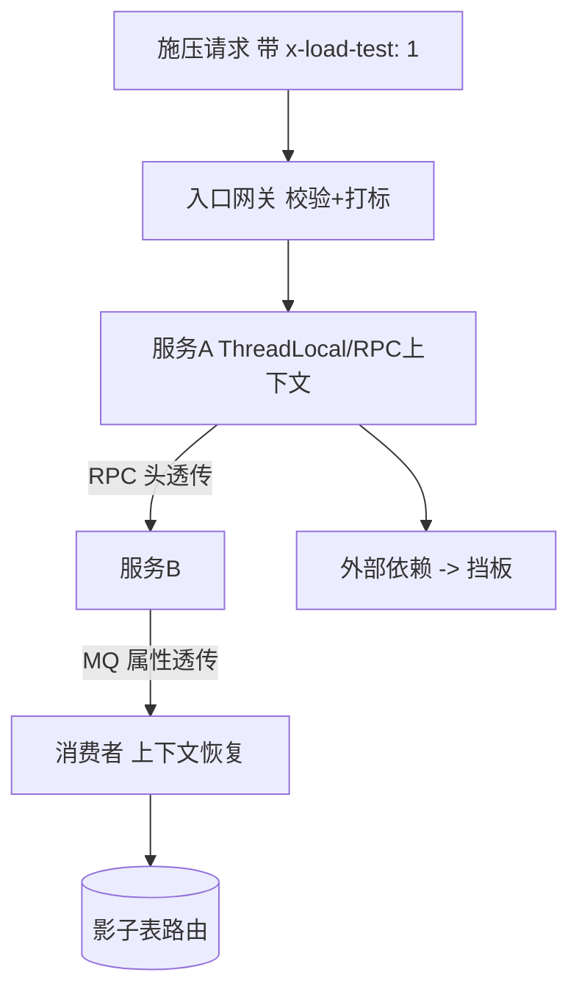
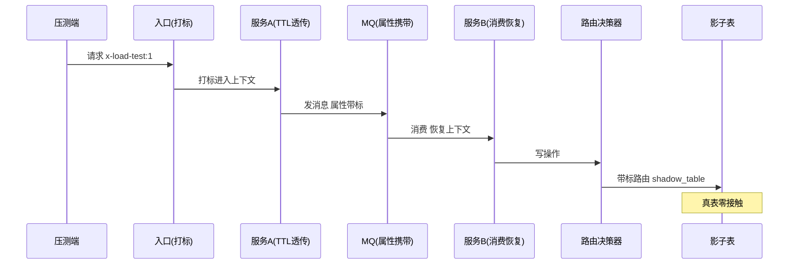
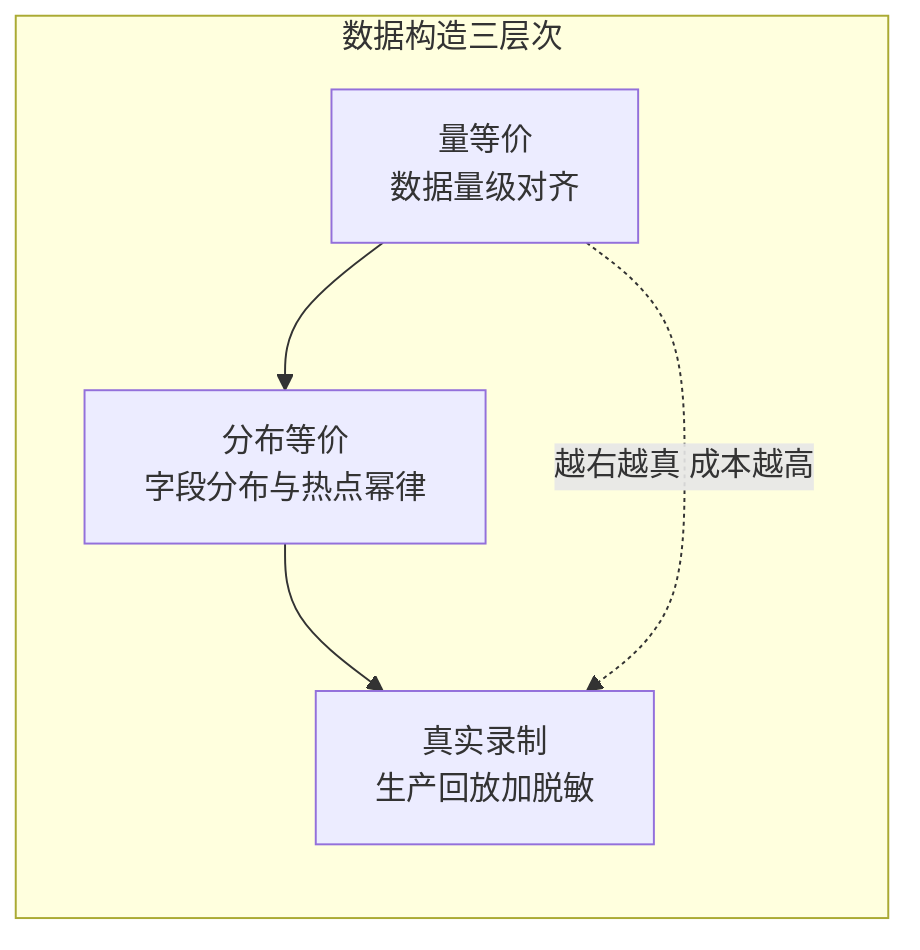

# 影子流量与数据构造：打真链路不脏真数据

> 全链路压测的全部工程难度浓缩成一句话：**让压测流量在链路上与真流量无法区分（保真实性），又让它对真数据的污染为零（保安全性）**。影子流量体系就是这对矛盾的工程解——标记透传、数据隔离、第三方挡板三大件，每一个都有参数、代码与事故。

## 一句话摘要

影子流量体系三支柱：**标记透传**（压测标从入口到最深依赖全程携带，任何一跳丢标即事故）、**数据隔离**（写操作按标记路由到影子表/影子前缀，读操作读真数据保真实性）、**出口挡板**（外部依赖 Mock 化，链路到边界为止）。数据构造是它的供给侧：按生产分布录制与脱敏构造压测数据，数据等价性决定容量结论的可信度。

## 前置阅读

- 入门层篇 3《全链路压测入门》（两大支柱的定位）

## 🎯 本文核心

**核心机制一句话**：影子流量 = 「标记」作为贯穿全链路的安全边界——带标流量享有「真链路 + 假数据」的待遇，标记的传播完整性是这个体系的生死线。

**机制链**：入口打标 → RPC/MQ/异步上下文透传 → 存储层按标路由（影子表）→ 外部出口挡板 → 压测结束标记回收。数据构造链：生产录制 → 脱敏 → 分布校准 → 注入影子表。两条链在「标记」上会师——标记既是流量的身份，也是数据隔离的路由依据。

## 上下游一分钟

影子流量在压测工程的位置：它是全链路压测（入门篇 3）的**安全实现层**——施压与观测建立在它之上。向上它被流量建模驱动（构造什么样的影子数据），向下它改造三个技术面：入口入口（打标）、调用框架（透传）、数据访问（路由）。模块边界：影子体系只管「隔离与透传」，不管「压多大力」（那是施压模块）与「结果怎么解读」（那是指标模块，篇 2）。

## 一、标记透传：全链路不丢标的工程实现



**逐跳透传的实现清单**（每一跳都是漏标事故的候选点）：

| 链路环节 | 透传机制 | 经典丢失场景 |
|---|---|---|
| HTTP 入口 | Header 解析入上下文 | 网关重写请求丢 Header |
| RPC（Dubbo/gRPC） | attachment/metadata 透传 | 异步 RPC 回调线程未恢复上下文 |
| 线程池切换 | 装饰 Runnable 传递上下文（TransmittableThreadLocal） | `@Async`/自定义线程池裸用 |
| MQ | 消息属性携带 + 消费端恢复 | 广播/重试消息属性丢失 |
| 定时任务 | 任务参数显式携带 | 调度触发无上下文（设计为不透传，需场景化处理） |

💡 实战提示：透传改造完成后，**每条链路做一次「标记到达断言」**——在最深依赖处记录标记到达率，任何一跳 < 100% 立即修复。丢标检测本身要常态化（埋点监控标记到达率），不能只在演练时查一次。

## 二、数据隔离：影子路由的三层实现

```python
# 影子路由决策器（简化骨架——生产实现于数据访问层 SDK）
SHADOW_TABLE_PREFIX = "shadow_"
SHADOW_CACHE_PREFIX = "press_"

def route_write(table: str, ctx: Context) -> str:
    """写操作路由：带标落影子表，不带标走真表"""
    if ctx.get("load_test"):
        return SHADOW_TABLE_PREFIX + table     # 同库影子表（起步形态）
    return table

def route_cache_key(key: str, ctx: Context) -> str:
    """缓存影子化（最易漏的改造点——压测读也会刷共享缓存）"""
    if ctx.get("load_test"):
        return SHADOW_CACHE_PREFIX + key
    return key

def route_db_conn(table: str, ctx: Context) -> str:
    """隔离升级形态：影子库（隔离彻底，成本翻倍）"""
    if ctx.get("load_test") and table in SHADOW_DB_TABLES:
        return f"shadow_db.{table}"
    return table
```

**隔离形态三档**（ADR-0012 参数表）：

| 参数/形态 | 默认值 | 10w 档 | 千万档 | 亿级档 | 为什么 |
|---|---|---|---|---|---|
| 隔离形态 | 同库影子表 | 同库影子表 | 同库影子表 + 缓存影子化 | 影子库/独立 Redis 前缀集群 | 隔离彻底性与资源成本的递进 |
| 影子数据清理 | 压测后手动 | 手动+脚本 | 压测后自动限速清理 | 自动 + 清理窗口 | 海量 DELETE 对生产库冲击（链回 Buffer Pool 抖动） |
| 透传覆盖率断言 | 无 | 每次演练 | 常态埋点监控 | 常态 + 丢标熔断（丢标请求直接拒绝进压测） | 丢标是 P0 级事故源 |
| 挡板覆盖 | 外部支付/短信 | 按需 | 全外部依赖 | 全外部 + 挡板行为校准 | 挡板与真实行为差 = 结论误差项 |

**业内惯例**：影子表与真表同库起步（路由简单、成本零增），当影子数据影响真表统计信息/缓存命中率时升级分库——行业升级信号是「压测后真表慢查询突增」。

## 三、数据构造：等价性的三个层次

压测数据的可信度 = 与生产数据的分布等价程度，三个层次逐级逼近：

1. **量等价**：数据量级对齐（生产 1 亿行的表，压测环境放 1 万行——索引层级/缓存命中完全失真）；
2. **分布等价**：字段值分布对齐（热点 user_id 的幂律分布、状态字段的占比、时间跨度）——用生产统计快照指导生成器；
3. **真实录制**（最高等价）：生产流量录制回放（GoReplay/tcpcopy 类）+ 脱敏替换——真实形态零失真，代价是脱敏工程与合规评审。

```python
# 分布校准的数据生成器（简化骨架）
def generate_users(target: int, hot_distribution) -> list:
    """按幂律分布生成用户访问热点（模拟真实热点 user_id）"""
    users = []
    for i in range(target):
        rank = int((1 - random.random()) ** 2 * hot_distribution.head_count)
        users.append(f"user_{rank:08d}")   # 头部 rank 高频出现，长尾低频
    return users
```

**为什么幂律分布是关键**——真实流量中 Top 5% 的键贡献 60% 的访问（行业认知，链回数据倾斜篇）；均匀分布的压测数据会系统性高估缓存命中与容量——**数据分布的失真是压测结论失真的隐形大头**。





## 三点五、透传实现的三条技术路线（选型对比）

| 路线 | 做法 | 优点 | 代价 | 适用 |
|---|---|---|---|---|
| **SDK 显式接入** | 业务代码显式传递上下文对象（或 TTL 包装） | 实现直观、调试容易 | 侵入所有业务代码，漏接靠人肉 | 小团队起步 |
| **字节码增强**（Agent） | Java Agent 类加载时织入透传（skywalking 式） | 业务零侵入、覆盖全 | Agent 兼容性维护、排查黑盒 | 千万档以上、组件多 |
| **框架原生** | 框架自带传播（Sleuth/OTel context） | 标准化、与可观测共用 | 依赖框架版本统一 | 微服务标准化好的团队 |

三条路线的取舍轴是「侵入度 ↔ 覆盖率 ↔ 维护成本」：SDK 起步、字节码增强规模化、框架原生是终局——行业主流是「OTel context 为标准载体 + Agent 兜底自动透传」的混合形态（演进方向：压测标记与链路追踪共用传播通道，一套机制两用）。

## 四、事故推演：一次丢标引发的数据污染

## 四、事故推演：一次丢标引发的数据污染

行业化用案例：某团队全链路压测时，消息消费者的异步处理链路用了自定义线程池（未接 TransmittableThreadLocal），压测标记在消费侧丢失——**3 万条压测订单以真实身份写入生产订单表**，与真实订单混在一起无法按标记区分。处置：按压测时段 + 压测账号 + 金额特征三条件圈定污染集，逐单人工核删（48 小时）。复盘 Action：① 透传改造纳入组件接入清单（新异步组件上线必测透传）；② 标记到达率常态监控上线（丢标熔断：到达率 < 100% 的链路自动摘出压测）；③ 污染圈定三条件法沉淀为应急预案——**每一条都指回「透传完整性是生死线」的设计决策**。

## 与「测试环境数据」的区别（跨域辨析）

测试环境数据服务「功能正确性」（数据少而全即可），影子数据服务「容量等价性」（数据必须量级+分布双等价）——为什么影子数据要逼近生产：容量结论的可信度等于数据等价度；测试环境功能数据的构造逻辑（少量样例）与影子数据的构造逻辑（分布模拟/生产录制）是两套完全不同的工程。共用设施（脱敏工具）可复用，构造管线分治。

## 常见误区

- ❌ 「影子表只需要建核心几张」——链路写操作清单要全量排查（漏一张表的写 = 真表污染），排查手段：数据访问层全量 SQL 审计 + 影子路由白名单外默认拒绝；
- ❌ 「读操作不用管」——带标读刷共享缓存挤掉真实热点（入门篇 3 的教训）、带标读命中压测刚写的影子数据造成「读到了假数据」的业务误判——读路径的缓存影子化与读语义定义是隐形工程量；
- ❌ 「挡板返回 200 就行」——挡板与真实依赖的行为差（时延分布/错误率/限流行为）直接进入容量结论的误差项；挡板要按真实依赖的监控数据校准（时延分布/失败率注入）；
- ❌ 「录制回放可以直接上」——回放流量含真实用户数据，脱敏与合规评审是前置硬门槛；且回放时钟要重排（录制时间戳与回放时间窗对齐）。

## 源码关键路径

- **透传载体**：TransmittableThreadLocal（TTL）的装饰原理（`TtlRunnable` 包装任务捕获上下文快照）——异步丢标的根治件；
- **数据源路由**：ShardingSphere 的 hint 路由机制（`HintManager.setDatabaseShardingValue`）可承载压测标路由——SDK 层路由的生产级实现参考；
- **流量录制**：GoReplay 的 `--output-parallel` 双发机制（真流量 + 影子复制）与 tcpcopy 的内核态复制——录制侧两大公开实现的取舍。

## 五、挡板行为校准：误差项的显性化

挡板与真实依赖的行为差会直接进入容量结论——「永远 5ms 返回」的挡板对应真实依赖 P99 200ms 时，链路容量被系统性高估。挡板校准三步：

1. **采集真实画像**：从生产监控取依赖的 RT 分布（P50/P99）、错误率、限流行为——挡板按分布模拟（随机延迟 + 按比例失败），不按均值模拟；
2. **差异报告**：压测报告附录标注「挡板替代项 + 校准来源 + 已知误差方向」——误差项显性化后，结论使用者才知道哪部分要打折；
3. **关键依赖例外**：资损相关依赖（支付通道）的挡板除行为校准外还要过业务评审——挡板返回「成功」的语义必须与真实通道对齐（幂等/超时语义），否则压测验证的幂等是假幂等。

**设计思想**：挡板的目标不是「像」，是「误差可量化」——把不可控的外部依赖变成「已知误差的受控变量」，压测结论才有置信边界。为什么这么设计？——绝对真实性不可能（外部依赖不可压），可量化的近似是工程上唯一诚实的替代品。

## 接入步骤（影子体系的最小可用落地）

1. **前置**：链路清单与写操作清单全量排查（数据访问层 SQL 审计）；外部依赖清单与挡板范围确认；
2. **透传改造**：入口打标 → 逐组件透传（RPC/MQ/TTL）→ 每链路「标记到达断言」通过；
3. **影子路由**：数据访问层路由决策器上线（白名单外默认拒绝）+ 影子表初始化（数据量对齐生产）；
4. **数据构造**：按三层次构造（量/分布/录制），脱敏与合规评审前置；
5. **验证点**：① 丢标熔断演练（人为摘一跳标记，验证链路被摘出压测）；② 隔离零污染校验（压测后真表与影子表比对）；③ 挡板行为校准报告；
6. **回退**：压测停止 = 标记不再下发；影子数据按标记限速清理；路由决策器关闭即全走真表（回退零残留）。

## 数据构造的工作流（从生产到影子库的五步）

数据构造是影子体系的供给侧，五步工作流把「等价性三层次」落到执行：

1. **采集**：生产流量录制（入口层 GoReplay）+ 生产数据分布统计快照（字段值分布/表行数/热点键 Top N）——两路采集互为校验；
2. **脱敏**：PII 不可逆替换（保格式保分布）、金额等比缩放、行为序列保留——脱敏方案过合规评审是前置门槛；
3. **构造/回放**：录制流量直接回放（时钟重排）或按分布生成器合成（热点幂律/状态占比校准）；
4. **校验**：分布偏差校验（压测数据 vs 生产快照的 KS 检验式对比，偏差超阈重造）——为什么机器校验不靠人眼：分布失真是隐形失真，人眼查不出「user_id 不够热」这类偏差；
5. **注入与生命周期**：影子表注入（限速）→ 压测使用 → 压后按标记限速清理——构造-使用-清理全生命周期留痕（审计要求）。

**为什么录制优先**——录制的等价性是「免费的」（真实流量天然分布正确），构造的等价性是「工程的」（每个字段都要建模）；录制管线（采集/存储/回放）建好后边际成本趋零，构造管线每次新场景都要重新建模——**长线成本录制更优，起步门槛构造更低**，按团队能力选入口、向录制演进。

## 业内惯例与生产实践

- **惯例一**：压测标记的全链路「到达率」作为影子体系的北极星指标——100% 是唯一及格线；
- **惯例二**：影子数据「生命周期管理」压测结束即启动（不过夜），清理限速参数压测前评审；
- **惯例三**：外部挡板的行为校准报告（时延分布/错误率对比）进压测报告附录——误差项显性化。

**取舍与体系定位的再声明**：影子体系的全部复杂度（透传/路由/挡板/构造四件套）只为兑现一句承诺——「压测结论可信」。这个承诺的代价三段：建设（3-6 人月）、维护（随业务增长）、演练（常态化）；收益三段：容量事故下降、压测结论可复算、大促预案有实证。取舍的天平在日千万交易量之后才明显倾斜——之前用联压过渡、之后全力建设，与全链路压测的量级分界完全一致。

## 你们可能会问

**Q1：影子表与真表同库，会不会互相影响？**
会——影响路径：统计信息共享（影子数据污染优化器）、缓存资源争抢、锁表级操作互斥。起步可接受（量小），升级信号：压测期真表慢查询突增 / 执行计划漂移——升级影子库（篇 4 特性层参数表的递进逻辑）。

**Q2（追问）：为什么丢标要「熔断」而不是「告警后人工处理」？**
丢标的压测流量 = 真实写操作——告警到人工处理的分钟级窗口内，污染已在发生且不可逆（写入即事实）；熔断（该链路自动摘出压测）把不可逆污染的窗口压到秒级。**不可逆操作的风险处理原则：自动止血优先于人工发现**（与止损授权同哲学）。

**Q2.5（追问）：影子体系的工程量到底有多大，为什么不能「简单做做」？**
量化一下：透传改造覆盖「入口 × 调用框架 × 异步设施」三类组件（中型系统 10-20 个接入点）；影子路由覆盖全部写操作表（中型系统 30-100 张）；挡板覆盖全部外部依赖（5-20 个）；数据构造管线（采集/脱敏/校验/注入）是独立的平台件——合计是 **3-6 人月的平台工程**，且随业务增长持续维护。为什么不能简单做做？因为它的三个失效模式（丢标/漏表/挡板失真）全部指向「生产数据污染或结论失真」——半成品的影子体系比没有更危险（给了你假的安心）。这就是全链路压测被列为「平台级工程」的原因：门槛在体系完整性，不在单点技术。

**Q3（再追问）：生产录制的数据脱敏到什么程度够？**
按数据分级：用户 PII（姓名/手机/证件）必须不可逆替换（保分布保格式）；资金金额可等比缩放（保业务语义）；行为序列尽量保留（等价性来源）——脱敏方案要过合规评审，「保分布的不可逆脱敏」是行业折中点。

## 演进视角（跨周期）

影子体系的演变：2015 年前后各大厂从「克隆库压测」起步（数据全拷贝，成本极高时效差）→ 2018 年前后影子表 + 标记透传成为行业标准形态 → 当下向「压测标记与 OTel 追踪共用传播通道」「影子数据湖化」演进——十年演变的驱动因素始终是「真实性-安全性-成本」三角的再平衡；上游是流量录制技术（内核态复制到 SDK 化），下游是容量平台（压测报告自动化消费），影子体系卡在中间，是三个时代各自投资最重的模块边界。

## 开放问题

- 影子流量的「自动等价性度量」（自动对比压测流量与生产流量的分布偏差并量化等价度）——等价性从「评审确认」走向「机器度量」的工具还在早期，值得关注。

**演进的两个新增细节**：① 影子标记的语义正在从「是/否」二元演化为「压测批次 + 场景 + 压测组织」的结构化标记——多团队共享一套影子设施时，标记要能路由与隔离到团队粒度；② 影子数据的构造正在从「压测前构造」走向「常备影子数据池」（按生产分布定期刷新，压测即取即用）——构造成本前置摊销，压测的启动成本降到分钟级。这两点都是多团队平台化（亿级档形态）的必然配套。

## 决策

**决策**：何时建影子体系——全链路压测立项时同步建设（影子是全链路的前置件不是后续件）；何时升级影子库——影子数据影响真表性能的证据出现时。怎么选录制 vs 构造：有生产录制能力且合规可过 → 录制；否则分布模拟构造（等价性三层次逐级逼近）。

## 自测三问

1. 影子体系三支柱与各自的 P0 事故源？（透传丢标污染 / 路由漏表污染 / 挡板失真误差）
2. 数据等价三层次？（量级 / 分布 / 真实录制——幂律分布是隐形大头）
3. 丢标为什么要熔断不告警？（写入不可逆——自动止血压窗口，人工来不及）

## 5W 速记卡

| 问题 | 答案 |
|---|---|
| What | 标记透传 + 影子路由 + 出口挡板 + 分布化数据构造 |
| Why | 「打真链路不脏真数据」的全链路压测安全实现层 |
| 北极星 | 标记到达率 = 100%（丢标熔断） |
| 三档 | 同库影子表 → 缓存影子化 → 影子库 |
| 边界 | 外部依赖挡板近似；等价性决定结论可信度 |

## 🎯 核心带走

**30 秒复述**：影子流量 = 标记为安全边界的三件套（透传/隔离/挡板）+ 三层次数据构造（量/分布/录制）；北极星指标是标记到达率 100%，丢标熔断不可商量。**失效点**——异步线程池丢标、缓存未影子化、挡板行为失真、影子数据漏清理。金句带走：

> **影子流量的信誉是「零污染」——一次丢标，全链路压测的所有结论都要重新背书。**

> **压测数据分布错了，容量结论就错了——等价性不是工程美德，是结论可信度的数学前提。**

## 📌 数据与事实声明

- 透传/影子路由/录制回放为业界全链路压测公开实践归纳（阿里/美团/有赞公开分享）；TTL/ShardingSphere hint/GoReplay 为公开组件；污染圈定与脱敏折中为行业认知实践。

## 📚 参考资料

- TransmittableThreadLocal（alibaba/TTL）与 ShardingSphere hint 路由官方文档
- GoReplay / tcpcopy 官方仓库（录制回放实现）
- 入门层篇 3《全链路压测入门》、特性层篇 2《压测指标体系》（姊妹篇）
