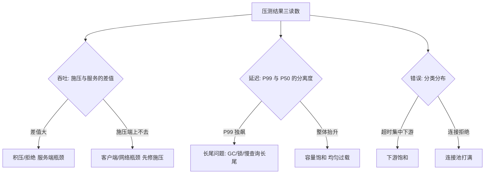
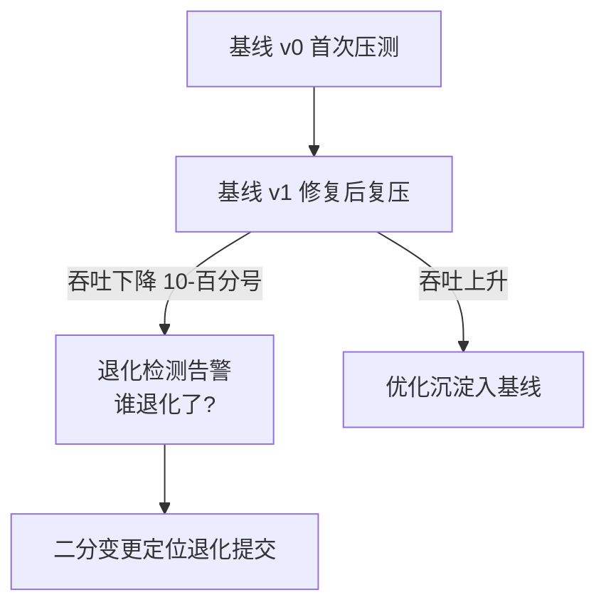

# 压测指标体系与瓶颈定位：从「压出数字」到「找到病根」

> 压测报告上写着「峰值 8000 QPS、P99 800ms」——然后呢？8000 这个数字本身毫无价值：**瓶颈在哪一层、为什么停在那里、解决后能涨到多少**，这才是压测的产出。指标体系决定你「看得见什么」，归因方法决定你「找得到病根吗」。这一篇把两件事的工程方法一次讲透。

## 一句话摘要

压测指标体系三层：**结果层**（吞吐 QPS/TPS、延迟 P50/P95/P99、错误率——回答「压到多少了」）、**资源层**（CPU/内存/IO/连接数/队列深度——回答「谁先饱和」）、**链路层**（各服务段的 RT 分解与调用比——回答「时间花在哪了」）。瓶颈定位 = **归因树 + USE 法**（对每资源查利用率/饱和度/错误）+ **分解验证**（拆掉可疑层复压对照）——三层指标逐层下钻，直到病根。

## 前置阅读

- 特性层篇 1《影子流量与数据构造》（压测流量的来源与隔离）
- 入门层篇 2《单机基准与水位线》（膝点与基准概念）

## 🎯 本文核心

**核心机制一句话**：压测的可观测 = 三层指标（结果/资源/链路）× 一个归因方法（USE 逐资源 + 分解验证）——指标回答「哪层先饱和」，归因回答「饱和为什么发生」。

**机制链**：施压 → 结果层读数（吞吐/延迟/错误）→ 饱和判定 → 资源层逐资源 USE 检查 → 定位饱和资源 → 链路层 RT 分解（时间花在哪段调用）→ 病根假设 → 拆层复压验证 → 瓶颈结论。上下游：上游是压测执行与监控采集，下游是扩容决策与优化排期——瓶颈报告是压测与性能优化两个团队的接口文件。

## 上下游一分钟

指标体系在压测工程的位置：它是影子流量（篇 1）与容量结论（篇 3 水位动态）之间的「翻译层」——把施压过程翻译成可决策的数字。向上它服务压测报告与容量评审，向下它消费监控采集（Metrics/Tracing/Profile）。模块边界：指标体系只管「采集与呈现」，归因方法只管「定位」——修复动作本身属于性能优化域（不做扩容建议之外的修复承诺）。

## 一、结果层：三个数字的正确读法

**吞吐（QPS/TPS）**：施压端发出的速率与服务端实际处理速率要分开读——两者差值 = 请求积压或被拒（施压端 QPS 高、服务端低 = 服务端过载积压；施压端上不去 = 施压端或网络瓶颈）。

**延迟**：必须看分位数（P50/P95/P99/P999），均值会骗人——P50 稳定而 P99 飙升 = 长尾恶化（GC/锁竞争/慢查询长尾），均值读不出。**延迟的分位数在不同并发档位下对比**才有意义：单点数字无诊断价值。

**错误率**：错误要分类统计（超时/5xx/业务拒绝/连接拒绝）——不同错误指向不同瓶颈：超时集中在下游调用 = 下游饱和；连接拒绝 = 连接池打满；5xx 分布式 = 内存/GC。



## 二、资源层：USE 法逐资源检查

USE 法（Utilization 利用率 / Saturation 饱和度 / Errors 错误）对每类资源三问：用满了吗、在排队吗、有报错吗——**饱和度（排队）比利用率（占用）更早暴露瓶颈**：CPU 利用率 80% 但运行队列长队 = 已饱和；利用率 95% 但队列空 = 尚健康。

| 资源 | Utilization | Saturation（饱和信号） | Errors |
|---|---|---|---|
| CPU | 利用率 | 运行队列长度 / load 与核数比 | throttle（限频） |
| 内存 | 已用/总量 | swap/回收频率 | OOM |
| 磁盘 IO | util% | await 排队时间 | IO error |
| 网络 | 带宽占比 | 重传/丢包 | 网卡 error |
| 连接池 | 活跃/上限 | 获取等待时间 | 获取超时 |
| 线程池 | 活跃/上限 | 队列深度 | 拒绝 |
| JVM | 堆占用 | GC 频率与停顿 | OOM/Full GC |

💡 实战提示：压测期间资源指标要**秒级粒度**（常规 15-30s 采集会抹平瞬时饱和）——压测专用的细粒度采集是压测观测与日常监控的第一配置差异。

## 三、链路层：RT 分解找到「时间花在哪」

结果层说「P99 800ms」，链路层回答「800ms 花在哪」：Trace 按调用树分解各段耗时（自研服务段/下游调用/DB/缓存/MQ），找**最大耗时段**下钻。三个经典分解发现：

1. **下游吞噬**：本服务自身计算 50ms、下游调用 750ms——瓶颈在下游（对下游做同样的分解下钻）；
2. **串行放大**：循环里逐条调下游（N 次串行 RT 累加）——批量化改造的依据；
3. **缓存缺席**：本应命中的缓存每次回源——命中率指标与压测数据形态联合分析（链回篇 1 的分布等价性）。

**分解验证**（归因的最后一步）：对病根假设做对照实验——如怀疑「连接池太小」，把连接池翻倍复压：吞吐显著上升 → 假设成立；无变化 → 排除，回到归因树。**没有对照验证的瓶颈结论都是假设**——这是压测报告「瓶颈清单」每项必须附「验证实验」的原因。

## 三点五、长尾瓶颈专题：P99 独立恶化的四个病根

P50 稳定而 P99/P999 飙升是压测最棘手的形态（整体看健康、尾部已坏死），四个病根按出现频率排序：

1. **GC 停顿**：Full GC/CMS 退化在压测压力下周期性 STW——证据：P99 尖峰与 GC 日志时间对齐；处置：调优或换 ZGC 类低停顿收集器；
2. **锁竞争**：热点锁在高并发下排队（RT 尾部指数化）——证据：火焰图出现锁等待栈；处置：锁粒度/无锁化/分片；
3. **慢查询长尾**：少量查询走了坏计划（执行计划漂移）——证据：慢查询日志占比小但耗时巨大；处置：索引/计划绑定；
4. **连接池耗尽抖动**：池在临界点震荡（借还竞争）——证据：获取等待时间与池占用同步抖动；处置：池参数或池化策略。

为什么单独成节——长尾瓶颈的共性是「均值指标全部正常」，只有分位数曲线与 Profile 能抓到；**压测报告缺长尾判读 = 这四类病全部漏诊**。

## 三点六、压测报告四段式的详解（模板级）

业内通行的四段报告，每段写什么、给谁看：

| 段 | 内容 | 给谁看 |
|---|---|---|
| 结果数字 | 三层指标读数 + 与基线对比 + 分离度判读 | 全员 |
| 瓶颈清单 | 每项：现象/证据/定位过程/验证实验 | 性能优化团队 |
| 验证实验 | 每瓶颈的对照实验记录（改动-复压-结果） | 架构评审 |
| 容量结论 | 当前容量、预测越线时间、建议动作 | 管理层 |

**取舍说明**：报告的详略是一对永恒的取舍——过详（全指标附录）没人读完，过略（只给结论）无法复核；四段式的平衡点是「结论层人人可读、证据层可追溯」，取舍的锚是「读者是否需要复现结论」。

## 四、核心参数表（指标体系三档）

| 参数 | 默认值 | 10w 档 | 千万档 | 亿级档 | 为什么 |
|---|---|---|---|---|---|
| 压测期采集粒度 | 15s | 15s | 5s | 1-5s | 粒度粗抹平瞬时饱和（资源层秒级是底线） |
| 指标保留期 | 30 天 | 30 天 | 90 天 | 1 年（对比历史压测） | 压测间对比需要历史基线 |
| Trace 采样率 | 按常态 | 压测期全量 | 压测期全量 | 全量（压测期）+ 尾部触发采样 | 压测期 Trace 是分解的主数据 |
| P99 突变告警 | — | 人工看 | 3σ 自动标注 | 自动标注 + 瓶颈假设推荐 | 归因自动化程度随档位递进 |
| 报告基线对比 | 无 | 与上次压测 | 滚动 3 次基线 | 全历史分位对比 | 容量退化的纵向检测 |

## 五、代码级：瓶颈归因的自动化骨架

```python
# 归因树自动评估（简化骨架——从监控数据推瓶颈层）
def locate_bottleneck(metrics: dict) -> dict:
    """按饱和信号排序资源，输出瓶颈假设"""
    signals = []
    # 资源层：饱和度优先（排队早于占满）
    for res, m in metrics["resources"].items():
        if m.get("queue_depth", 0) > m.get("queue_warn", 0):
            signals.append((m["saturation_time_ratio"], f"{res}: 排队饱和"))
        elif m.get("util", 0) > 0.95:
            signals.append((m["util"], f"{res}: 利用率打满"))
        if m.get("errors"):
            signals.append((1.0, f"{res}: 错误 {m['errors']}"))
    signals.sort(reverse=True)
    # 链路层：最大耗时段
    top_span = max(metrics["spans"], key=lambda s: s["self_time_ms"])
    if signals:
        return {"bottleneck": signals[0][1], "evidence": signals[:3],
                "next_action": f"复压验证: 调整 {signals[0][1].split(':')[0]} 后对照吞吐"}
    return {"bottleneck": "链路层", "evidence": [f"最大自耗时段: {top_span['name']}"],
            "next_action": "对 top_span 下钻分解"}
```

**为什么归因要输出「下一步验证动作」而不是「结论」**——归因树给的是假设排序，假设成立的唯一证据是对照实验（拆层/调参复压）；自动归因的目标是把人从「翻指标」解放到「设计验证」，不是替代判断。

## 六、接入步骤（压测观测体系的落地）

1. **前置**：压测期细粒度采集通道就绪（秒级）；Trace 全链路覆盖（压测期全量采样）；
2. **指标接入**：三层指标（结果/资源/链路）按清单接入压测看板；
3. **基线建立**：首次压测全量记录为基线（后续压测纵向对比）；
4. **归因工具**：归因树脚本/平台接入指标源（输出瓶颈假设 + 验证建议）；
5. **验证点**：已知瓶颈的注入演练（人为限制 DB 连接），验证归因树能正确定位；
6. **回退**：压测观测独立于生产监控（细粒度采集压测后关闭，不增常态成本）。

```mermaid
sequenceDiagram
    participant L as 压测负载
    participant M as 指标采集(秒级)
    participant T as Trace 全量
    participant PF as Profile 采样
    participant A as 归因树
    L->>M: 施压期持续
    L->>T: 每请求全量采样
    L->>PF: CPU/Alloc 采样(30s窗口)
    M->>A: 饱和信号排序
    T->>A: RT 分解 top_span
    PF->>A: 层内热点函数
    A->>A2[假设清单 + 验证动作建议]
```



## 源码关键路径

- **秒级采集**：Prometheus `scrape_interval` 压测期覆盖为 1-5s（服务端 `--storage.tsdb.retention` 分池）——为什么不用 push 网关：pull 模型的超时即信号（采集超时本身说明目标已饱和）；
- **Trace 全量**：采样策略切「压测全量」（OTel ` ParentBased(traceFlags)` 覆盖）——注意异步段（MQ 消费）的 span 关联靠消息属性携带 traceparent（与影子标记同通道，两套标记可共乘）；
- **Profile 采集**：async-profiler（CPU/alloc 火焰图，`-e wall` 看锁等待）——压测期的火焰图与指标对齐时间窗，才能把「P99 尖峰时刻」与「那一秒的函数热点」对上；
- **退化二分**：基线对比发现退化后，`git bisect` + 每提交压测（自动基准流水线的退化定位形态）。

## 七、业内惯例与生产实践

- **惯例一**：压测报告固定四段（结果数字 / 瓶颈清单 / 每瓶颈附验证实验 / 与上次基线对比）——报告模板化让跨团队读报告零学习成本；
- **惯例二**：瓶颈按「收益/成本」排优先级（连接池调参十分钟涨 30% 吞吐 优先于 架构重构涨 5%）——压测产出的优化清单要排 ROI；
- **惯例三**：压测期 Profile（CPU 火焰图/alloc profile）与指标同步采集——指标定位「哪层」，Profile 定位「层内哪段代码」，两层证据链闭环。

## 八、事故推演：被「优化」掉的三倍吞吐

行业化用案例：压测发现订单服务卡在 3000 QPS（基准预期 9000），团队按 P99 曲线判断「DB 慢查询」，优化两周慢查询后复压——还是 3000。第二轮才做分解验证：Trace 显示 80% 耗时在「下游库存服务的锁等待」，库存服务的 DB 才是真瓶颈。损失：两周优化在错误层。复盘 Action：① 压测报告强制附「RT 分解表」（没有分解不下结论）；② 归因树工具上线（饱和资源自动排序）；③ 「跨服务瓶颈」检查进压测 checklist——**教训的机制形态：分解验证是归因的法定步骤，不是可选动作**。

## 与「线上 APM 监控」的区别（跨域辨析）

APM 看常态（真实流量的健康度，采样低成本），压测观测看极限（可控施压下的饱和行为，全量高成本）——为什么压测期要独立采集：常态采样率（1%）在压测期会漏掉饱和瞬间的证据；且压测观测要「施压端与服务端双侧对照」（APM 只有服务端）。共用存储与展示，采集策略分治。

## 常见误区

- ❌ 「指标越多越好」——无假设驱动的指标墙会稀释注意力；三层清单 20 个指标覆盖 95% 场景，多出来的按需加；
- ❌ 「瓶颈就是利用率最高的资源」——利用率高 ≠ 饱和（排队才是），且最高利用率可能是「健康的满负荷」而真瓶颈在别处排队——USE 三问的 Saturation 优先于 Utilization；
- ❌ 「压测数字达标就提交」——达标数字背后若 P99/P50 分离度异常（长尾恶化），达标是暂时的；报告必须附分离度判读；
- ❌ 「一次压测定容量」——每次压测的结论要与前次基线对比（纵向退化检测）：同场景同压力下吞吐下降 10% = 有东西退化了，这条发现与绝对值同样重要。

## 演进视角（跨周期）

压测观测的演变：纸质记录（手工抄表时代）→ 报表化（压测工具自带报告）→ 平台化（指标/Trace/Profile 三源合一的压测看板）→ 智能归因（饱和信号自动排序 + 假设推荐）——**四代演变的主题词是「人工阅读量的压缩」**：从人翻十个系统到人只看一份假设清单。取舍贯穿始终：自动化每进一步，「人对系统的直觉理解」就退化一分——归因自动化程度高的团队，要刻意保留「手动分解验证」的演习（与红蓝对抗的逻辑同构）。

## 你们可能会问

**Q1：归因树自动定位的准确率有多少？**
已知失效模式（连接/线程/GC/下游）覆盖率高（八成以上场景可正确定位到层），新型瓶颈（新中间件/新依赖）首见必错——自动归因定位「层」，层的内部病根仍需人用 Profile 挖。为什么这么设计：自动化的价值是缩小搜索空间，不是替代判断。

**Q2（追问）：P99 突增但吞吐正常，算瓶颈吗？**
算「长尾瓶颈」——吞吐未损说明系统还能处理，但 P99 用户已进入坏体验区（且超时重试会放大流量）。处置分两档：长尾占比小且用户可感知弱 → 记录观察；P999 同步恶化（超时边界）→ 按瓶颈处理。判断依据回到业务：超时率与重试率的变化比 P99 数字本身重要。

**Q3（再追问）：分解验证要复压几次才够？**
每次假设一次对照（单变量改动 + 复压），收敛即可——行业经验：多数瓶颈 2-3 轮对照收敛；超过 5 轮未收敛说明瓶颈是多因子耦合，需要引入 Profiling 级证据（火焰图逐函数）而不是继续盲试。

## 开放问题

- AI 辅助归因（LLM 读 Trace + 指标自动产出瓶颈假设与修复建议）在压测域的落地案例渐多——假设的幻觉率与验证闭环（AI 假设也必须走对照实验）如何工程化，是压测平台演进的开放方向。

## Trade-off 三则（指标体系的取舍定价）

- **采集粒度 vs 观测开销**：1s 粒度的指标基数是 30s 粒度的 30 倍——压测期细粒度、常态粗粒度的双模是这笔代价的标准解法；取舍的错解是「全时细粒度」（存储与查询成本失控）；
- **归因自动化 vs 判断力保持**：自动归因压缩人肉翻指标的时间，代价是团队「从数据推导病根」的手艺退化——取舍解法是自动给假设、人工定验证，保留手艺的演习制度；
- **指标全面性 vs 信噪比**：每加一个指标都在稀释注意力——加指标的代价是「未来某次事故里它制造的一次误导」，这个隐性代价要求指标清单做减法比做加法更勤（与大盘瘦身的季度惯例同构）。

## 五点五、瓶颈定位六步法（操作步骤级）

归因方法的可执行版本（每步带产出物）：

1. **前置**：压测期秒级采集/Trace 全量/Profile 采样三通道就绪；基线可查；
2. **Step 1 结果层判读**：吞吐差值（施压 vs 服务端）、P99/P50 分离度、错误分类——产出「问题形态」初判；
3. **Step 2 资源层 USE 扫描**：按资源清单逐个三问（利用率/饱和度/错误）——产出饱和资源排序；
4. **Step 3 链路层分解**：Trace 调用树 top 耗时段 + 调用比统计（放大系数实证）——产出「时间去哪了」分布；
5. **Step 4 病根假设**：归因树合并三层证据 → 假设清单（按置信度排序，每条附验证动作）；
6. **Step 5 对照验证**：逐条执行验证动作（调参/拆层/扩容复压）——产出定案瓶颈；
7. **Step 6 报告与回流**：四段报告 + 基线更新 + 优化清单排 ROI——产出可追溯的压测资产。

**验证点**：Step 5 的对照实验必须「单变量 + 复压」——同时改两个变量的对照实验无法归因（实验设计的纪律与科学实验同构）。**回退**：观测通道压测后关闭，回归常态采集。

## 决策

**决策**：何时建压测观测体系——全链路压测立项时同步建设（观测是压测的报告器官）；何时上归因自动化——压测频率月均 2 次以上或瓶颈定位平均耗时超半天。怎么选指标清单：三层 20 指标起步，按「第一次归因失败」的教训增补——指标清单是被失败喂养大的。

## 自测三问

1. 三层指标各自回答什么？（结果层：压到多少 / 资源层：谁先饱和 / 链路层：时间花在哪）
2. 为什么饱和度优先于利用率？（排队早于占满——运行队列长队比 CPU 95% 更早暴露瓶颈）
3. 瓶颈结论的法定证据是什么？（对照实验——拆层/调参复压，无验证不结论）

## 5W 速记卡

| 问题 | 答案 |
|---|---|
| What | 三层指标 + USE 归因 + 分解验证 |
| Why | 压测产出的是瓶颈清单与验证实验，不是数字 |
| 配置 | 压测期秒级采集 / Trace 全量 / 基线纵向对比 |
| 报告 | 四段式：结果/瓶颈/验证实验/基线对比 |
| 边界 | 自动归因定位「层」；层内病根用 Profile |

## 🎯 核心带走

**30 秒复述**：压测可观测 = 三层指标（结果三读数/资源 USE 三问/链路 RT 分解）+ 归因树（饱和排序输出假设）+ 分解验证（对照实验定案）；压测期秒级采集与 Trace 全量是配置底线。**失效点**——均值读延迟、利用率当饱和、无分解下结论、不与基线对比。金句带走：

> **「压到 8000 QPS」是原料，「瓶颈在库存服务的锁、验证实验是连接池翻倍复压」才是产品——压测的价值全部在后半句。**

> **归因树的每个节点都是假设，唯一的证据是对照实验——分解验证不是严谨的装饰，是结论的准入门槛。**

### 归因的元纪律：先证伪「单点瓶颈」

瓶颈定位最常见的失败不是「找不到」，是「找到一个就停」——压垮系统的几乎从不只是一个瓶颈，而是「瓶颈链」：数据库慢导致连接池占用升高、连接池耗尽导致线程阻塞、线程阻塞导致上游超时重试、重试放大流量反过来加固数据库慢。修掉第一层就复测的团队会经历「修一个涨一点、再修再涨」的漫长拉锯。元纪律是：**每修一层后必须重新全链路测量，用新的瓶颈分布决定下一层动作**——瓶颈定位是循环不是直线，循环的终点是「没有任何单点越过预算线」，而不是「某个数字变好看了」。

## 📌 数据与事实声明

- USE 方法（Brendan Gregg）与三/四黄金信号为公开方法论；RT-转化率、采样策略为行业认知量级；事故叙事为行业化用；归因自动化准确率表述为经验认知。

## 📚 参考资料

- Brendan Gregg《Systems Performance》——USE 方法正源
- 本仓库监控大盘与告警分级篇（防线二监控的姊妹篇）
- 特性层篇 1（影子流量）、篇 3《容量水位动态计算》（水位指标的消费方）
