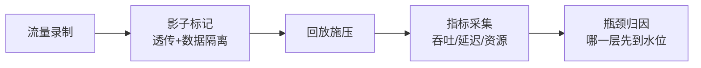
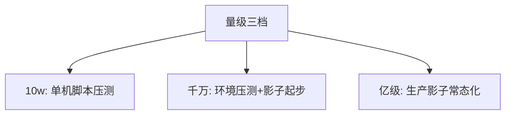
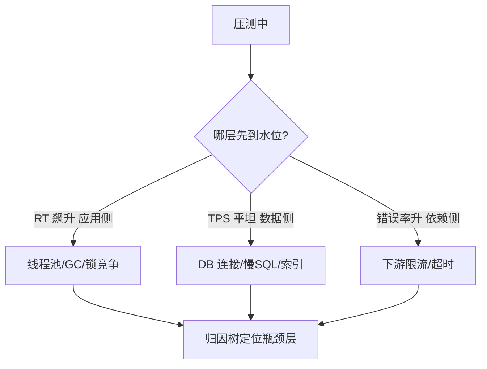

# 深入理解压测工程系列

> 压测不是「多打点请求」——影子流量隔离、数据构造、瓶颈归因，每个环节都有工程标准。

## 一句话摘要

压测工程的三个机制核心：影子流量（打真链路不脏真数据）、指标体系（吞吐/延迟/资源三层定位瓶颈）、水位动态计算（从静态阈值到基线自适应）；三档形态从单机 JMeter 到全链路生产影子。

## 篇目规划（L1-L4，ADR-0012 方向=子目录）

| 篇目/层 |
|---|
| 篇 1 · 影子流量与数据构造（标记透传/落库隔离/回收） |
| 篇 2 · 压测指标体系与瓶颈定位（三层指标与归因树） |
| 篇 3 · 容量水位动态计算（基线自适应阈值） |

**机制定位与取舍**：本方向的每个机制（原理与底层实现）都在篇目里锚定了位置——规划期的取舍是「机制原理优先于操作罗列」，代价是入门读者需要更多耐心，收益是后续每篇的参数与步骤都有原理可归因；架构上各层互为上下游，边界由「机制讲透」与「操作可执行」这条线划分。

## 演进视角

压测工装的演变：JMeter 脚本 → 平台化录制回放 → 生产影子常态化；每一次升级都在回答同一个问题——「怎么让压测流量尽可能等价于真实流量而不伤害真实数据」。

## 📌 数据与事实声明

- 本文件为方向骨架规划（篇目标注 ⏳ 待写 / ✅ 已落地），依据 ADR-0012 工程级深度标准与 4 层架构规范；量级与参数数字均为行业认知量级，落篇时以实测替换。

## 📚 参考资料

- 全链路压测公开实践（阿里/美团技术分享）；本仓库 Prometheus 相关篇。
