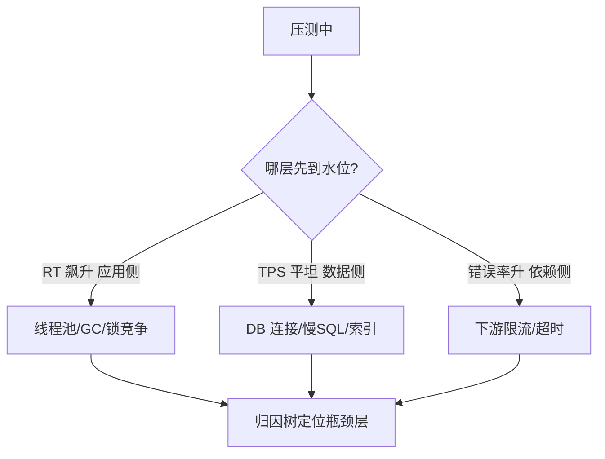

# 深入理解压测工程系列

> 压测不是「多打点请求」——影子流量隔离、数据构造、瓶颈归因，每个环节都有工程标准。

## 一、本子系列在 4 层架构中的位置

| 层 | 定位 | 本子系列位置 |
|---|---|---|
| L1 入门层 | 概念扫盲 + 会用 | [入门 0_导读](../../入门层/从零开始认识容量规划系列/0_系列导读-全景) |
| **L2 特性层** ✅ | 单点纵向深挖 | **本子系列** |
| L3 专题层 | 行业级实战 | 亿级容量实战 / 全链路压测生产安全 |
| L4 整合层 | Demo 落地 | 从零实现全链路压测平台 |

## 二、规划方向

| 方向 | 覆盖内容 |
|---|---|
| 影子流量 | 流量录制/标记/隔离/回收 |
| 指标体系 | 吞吐/延迟/资源三层指标 |
| 瓶颈归因 | 哪一层先到水位 |
| 水位计算 | 基线自适应阈值 |

**主线：** 影子流量 → 指标体系 → 瓶颈归因 → 水位计算

## 三、全局心智模型

## 四、四层进阶路径

- L1 入门：容量规划概念 + 压测基础
- L2 特性：本子系列（压测工程深度）
- L3 专题：亿级容量实战 + 全链路压测生产安全
- L4 整合：从零实现全链路压测平台

## 五、每篇核心知识点一句话摘要

1. 影子流量与数据构造：影子标记透传 + 落库隔离 + 数据回收
2. 压测指标体系与瓶颈定位：吞吐/延迟/资源三层指标 + 归因树
3. 容量水位动态计算：基线自适应阈值 + 静态阈值对比