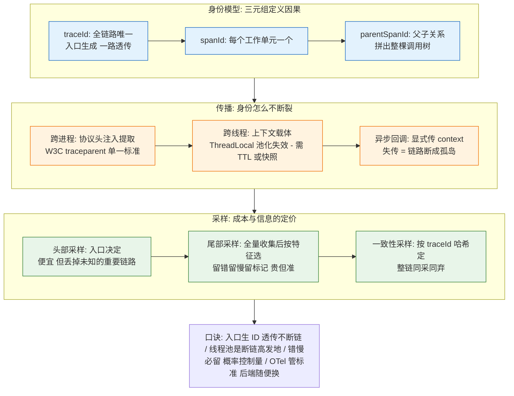
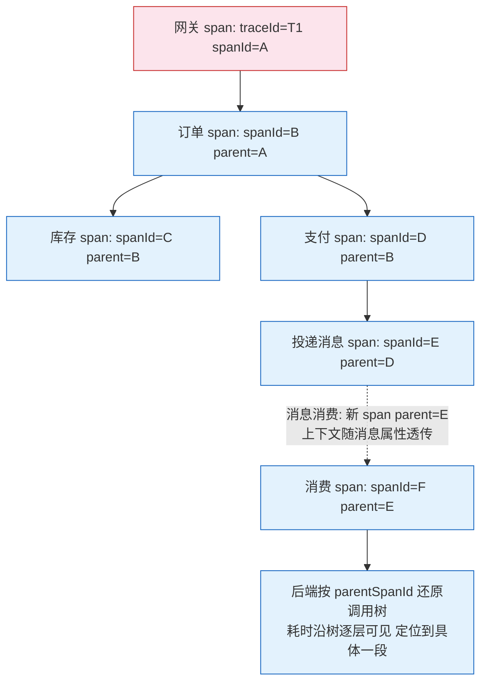
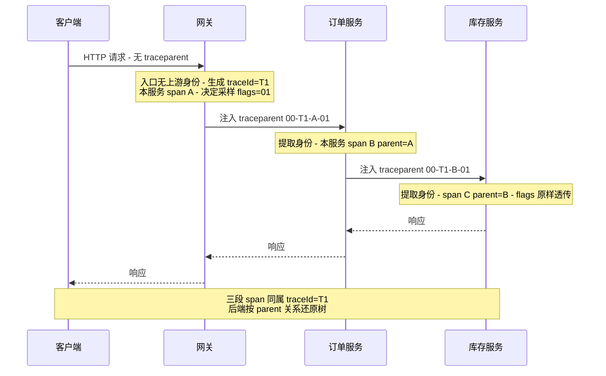
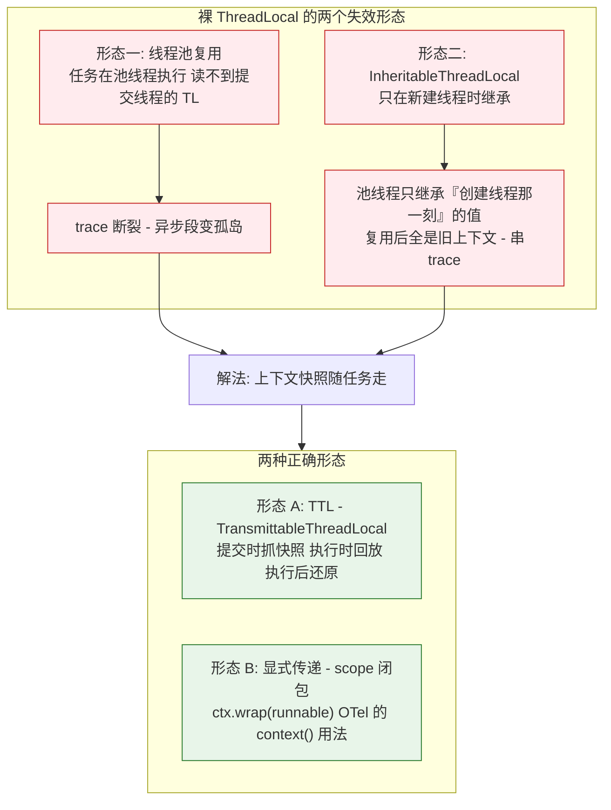
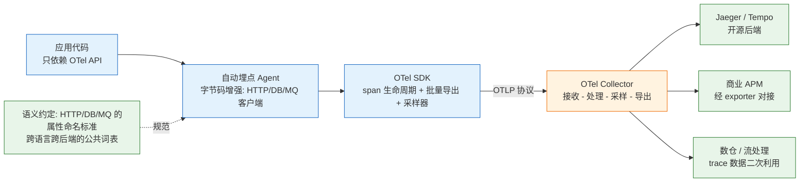

# Trace 上下文与采样原理

> **本文核心**：链路追踪的原理只有一句话——**给整条请求链一个全局身份（traceId），给每个工作单元一个局部身份（spanId）与父子关系（parentSpanId），让这对身份在跨进程、跨线程的每一次传递中不断裂**。工程难点全部长在「传播」上：跨进程靠协议头注入提取（W3C Trace Context），跨线程靠上下文载体的正确选型（ThreadLocal 在线程池复用下必然失效，需 TransmittableThreadLocal 或显式快照传递）；采样则回答「全量记录太贵怎么办」——头部采样便宜但会把未知的重要链路一起丢掉，尾部采样按「错、慢、特殊」保留关键链路但支付集中处理成本。OpenTelemetry 的标准化位置在于把「埋点、传输、存储、展示」四段彻底解耦，让上下文与采样成为跨厂商的公共资产。

## 一图看懂



## 一句话摘要

链路追踪的可用性上限由上下文传播决定（断一次链，整条 trace 报废），成本下限由采样决定（全量是存储与网络的定价陷阱）；理解 W3C 头格式、线程池失传场景与头部/尾部采样的定价差异，就能独立设计一套不断链、可控成本的追踪体系。

## 前置阅读

- [全链路追踪机制与全链路大盘](../../../system-design/stability/专题层/可观测性与服务大盘深度/3_全链路追踪机制与全链路大盘-深度.md)：追踪数据在大盘层的消费视角
- [可观测性三支柱与指标体系](../../../system-design/stability/专题层/可观测性与服务大盘深度/1_可观测性三支柱与指标体系-深度.md)：指标、日志、追踪三支柱的分工
- [K8s 全链路追踪 OTel 与 Jaeger/Tempo](../../../../devops/kubernetes/专题层/K8s可观测性专题/3_全链路追踪OTel与JaegerTempo-深度.md)：部署形态视角

## 5W 速记卡

| 维度 | 一句话 |
|---|---|
| What | traceId/spanId/parentSpanId 三元组 + 跨进程跨线程传播 + 头部/尾部采样 |
| Why | 分布式排障的第一现场是「这次请求经过了谁、每段多久」；没有全局身份只能靠日志人肉拼时间线 |
| How | 入口生成身份 → 协议头透传 → 线程内 ThreadLocal/显式传参 → 出口采样控制数据量 |
| When | 微服务链路排障、性能分析、容量定位，以及一切「日志孤岛」发生时 |
| Where | SDK 埋点层（OTel API/Agent）、传输层（OTLP）、后端（Jaeger/Tempo/商业 APM） |

## 一、问题起点：日志孤岛与因果重建

一次下单请求穿过网关、订单、库存、支付、消息五个环节，每处日志都记录了自己那一段——排障时却要把五份日志按时间戳人肉对齐。链路追踪要解决的就是**因果关系的机器可读化**：请求进系统的第一刻领取全局身份，此后每一次跨进程调用都把这个身份连同「我是谁、我爹是谁」一起带走，后端按 parentSpanId 拼出调用树。



Span 模型四件套：**名称**（谁在干什么）、**时间**（起止戳，算耗时）、**属性**（HTTP 状态、SQL 语句等维度）、**引用**（父子/并行因果关系）。模型本身很薄，真正的工程密度在传播与采样两节。

## 二、跨进程传播：协议头注入与提取

### W3C Trace Context：单一标准

跨进程传播的载体是协议头。W3C Trace Context 定义了单一 `traceparent` 头（公开标准）：

```text
traceparent: 00-4bf92f3577b34da6a3ce929d0e0e4736-00f067aa0ba902b7-01
             |  |                                  |                  |
           版本  traceId(16 字节 hex)          parentSpanId(8 字节)  flags(采样标记)
```

四个字段里最容易被忽略的是 flags（trace-flags）：最低位表示是否采样——**头部采样的一致性就靠它**：入口节点决定采不采，把决定写进 flags，下游不再各自为政。除 HTTP 外，RPC 元数据、消息属性（Kafka headers、RocketMQ 用户属性）都是等价载体；数据库调用、缓存调用由 SDK 自动注入。历史包袱是多套私有头（B3 系列、各类 APM 私有格式），OTel 的 propagator 机制支持多套并存互认，迁移期不丢链。

### 传播时序穿透



关键判定只有一处：**入口收到无 traceparent 的请求才生成新 traceId，收到就沿用**——生成的责任在链路最上游，透传的责任在所有中间节点。任何一环「自作主张重新生成」，链路就从那里断成两条孤立的 trace。

**为什么不选「各服务自己生成 traceId 再靠日志时间对齐」？** 再对齐方案在跨时区、时钟漂移、请求并发下不可靠，且对齐逻辑要为每条新链路重写一遍；身份透传把对齐从「事后人肉/脚本推理」变成「生成时就写对的因果字段」，成本一次性支付在埋点层。这正是日志关联（traceId 打进日志行）成为业内标配的原因——日志与 trace 用同一个 ID 挂钩（业内惯例）。

## 三、跨线程传播：线程池是断链高发地

进程内传播的默认载体是 ThreadLocal——请求线程把上下文绑在 ThreadLocal 上，任何同线程代码随手可取。但它在线程池场景有结构性缺陷，这是链路断裂的头号来源：



用具体值推一遍失效过程：请求 T1 在 Tomcat 线程 http-8080-1 上执行，ThreadLocal 里是 `traceId=T1`；提交异步任务到核心线程池（线程 pool-1-1 在启动时创建）。裸 ThreadLocal：pool-1-1 读到的是 null——**异步段的 span 没有父，调用树断**。换成 InheritableThreadLocal 更隐蔽：pool-1-1 创建时继承了它创建那一刻恰好在线程里的某个 traceId（可能是几分钟前的旧请求），此后**所有任务都顶着这个旧 traceId 上报**——不仅断链还串链，脏数据混进别的请求的 trace，比断裂更难排查。

正确形态两种：TTL 在任务提交时抓取快照、执行时回放、执行后还原，适合既有代码大量使用 ThreadLocal 的存量改造；OTel 的做法是 context 显式随 Runnable/Callable 传递（`Context.current().wrap(task)`），不依赖线程变量，语义最干净。两者都遵循同一底层原理：**上下文的生命周期必须与任务的提交-执行对齐，而不是与线程的生命周期对齐**。

## 四、采样原理：头部与尾部的定价分歧

全量记录的代价是三段叠加：埋点开销（可控，微秒级）、传输流量（可控，批量导出）、**后端存储与索引（大头，随流量线性增长）**。采样不是「少收点」的权宜之计，而是信息与成本的定价机制：

| 维度 | 头部采样 | 尾部采样 |
|---|---|---|
| 决策点 | 链路入口（生成时决定） | 后端 Collector（收齐整链后决定） |
| 传输成本 | 只传被采样的，省 | 全量先收，贵 |
| 保真度 | 未知的重要链路（慢查询、异常路径）按概率被丢 | 按「错、慢、特殊标记」确定性保留 |
| 一致性 | flags 透传天然整链一致 | 需按 traceId 聚合后统一裁决 |
| 典型形态 | 概率采样（10%）、限速采样 | 留全部错误 + 留长尾慢调用 + 其余按率丢弃 |

**一致性采样**是两者的桥梁：不按「每段自己掷骰子」，而是按 `hash(traceId) % 100 < 采样率` 决定——同一个 traceId 在所有节点算出同一个结果，整链同采同弃，无需透传 flags 也不会出现「半条 trace」。头部 + 一致性是低成本的默认组合；尾部采样在成本允许（有专用 Collector 层）或保真要求高（支付、交易核心链路）时叠加。

**为什么不选「线上 100% 全量、存短一点」？** 存储成本随流量线性增长，秒级扣减保留期在大流量下省不出数量级；且高价值信息（异常、慢调用）在总量里的占比天然低，全量存储的钱大部分花在了正常样本上。分级形态（业内惯例）：错误与慢调用不采样（100% 保留）+ 正常调用按率采样 + 大促期间整体降采样率——**按信息价值分层定价，而不是按流量一刀切**。

## 五、OpenTelemetry 的标准化位置：把四段解耦

OTel 的价值不在「又一个追踪系统」，而在**协议与接口层的大一统**：埋点只用它的 API，后端随便换。



四段解耦的分工：**API** 定义埋点接口（应用编译期唯一依赖）；**SDK** 提供实现（span 创建、上下文管理、批量导出、采样器接口）；**Collector** 是可插拔的数据管道（接收-处理-导出，尾部采样就长在这层）；**OTLP** 是传输协议，**语义约定**是属性命名的公共词表（http.method、db.statement 这些名字不再各家一套）。换后端 = 换 exporter 配置，埋点代码零改动——这个解耦正是头部/尾部采样可以独立演进的结构基础。

### 源码与关键路径

以 OTel Java 为例，关键路径三段（`java` 逻辑骨架）：

```java
// 1. 进程内上下文: ThreadLocal 封装在 Context 内部
// Context.current() 取当前; context.makeCurrent() 换入; scope.close() 还原
try (Scope scope = parentContext.makeCurrent()) {
    Span child = tracer.spanBuilder("SELECT orders")
            .setParent(parentContext)      // 显式指定父 - 不依赖线程变量
            .startSpan();
    try {
        // 业务执行: DB 调用被 Agent 拦截, 自动建子 span
    } finally {
        child.end();                        // 记录结束时间戳
    }
}

// 2. 跨进程注入: TextMapSetter 把身份写进协议头
// W3CTextMapSetter: traceparent = 00-<traceId>-<spanId>-<flags>
propagator.inject(context, httpRequest, setter);

// 3. 入口提取: TextMapGetter 从协议头读回身份, 无头则新建 root span
Context extracted = propagator.extract(Context.current(), httpRequest, getter);
```

Agent 形态的自动埋点走字节码增强，在 HTTP 客户端、JDBC 驱动、MQ 客户端的方法入口织入「提取-建 span-注入-结束」模板——**业务代码零侵入是 Agent 的卖点，但自定义段（业务埋点）仍需显式 API**。排查断链问题时，抓三条主线：入口有没有提取到 traceparent（头格式对不对）、线程切换处上下文有没有随任务走（第三节的两形态）、导出端有没有按采样器丢弃（采样配置）。

## 六、不同量级的思考：追踪体系随规模的换挡

- **十万级（日请求量或 span 量）**：约束来源是接入成本——此时最大的敌人是「没接」，不是「太贵」。这一档的核心问题是**用 Agent 自动埋点 + 全量头部采样把覆盖面铺开**，而不是调优采样率。思考方式：**覆盖优先驱动**。
- **百万级**：约束来源是后端存储的线性增长——span 量 = 请求数 × 链长，链长失控比请求量失控更凶。这一档的核心问题是**采样率与 span 瘦身**（属性裁剪、大 payload 不入 span、错误慢调用不采样正常调用按率），而不是给存储集群无限加盘。思考方式：**数据成本驱动**。
- **千万级**：约束来源是传输与 Collector 的聚合压力——全量先收再尾采的网络与算力账开始刺眼。这一档的核心问题是**分级采集架构**（本地代理预处理、机房级 Collector 聚合、按特征提前过滤），而不是单点 Collector 扩容。思考方式：**采集分层驱动**。
- **亿级**：约束来源是可观测数据自身的可靠性与成本占比——追踪系统故障会反过来干扰业务观测。这一档的核心问题是**可观测数据的治理体系**（配额、优先级、降采样、trace 数据入数仓二次利用），而不是继续在单点功能上做加法。思考方式：**数据治理驱动**。

自下而上串起演进线：覆盖优先 → 数据成本 → 采集分层 → 数据治理，每档都是上一档手段触到新约束后的换挡；触发升级的信号依次是：链路覆盖率不足 → 存储月增速超预算 → Collector 积压告警 → 可观测成本进入技术预算 top 榜。

## 七、业内惯例与生产实践

- **traceId 落日志是标配**：日志行携带 traceId，日志平台与 trace 后端按 ID 互跳——排障从 trace 定位时段，再用 traceId 捞全量日志（业内惯例）。
- **错误与慢调用不采样**：无论整体采样率多低，异常与超阈值的 span 全量保留——信息价值分层是采样设计的公共底座（公开口径）。
- **入口统一生成、出口统一导出**：网关/接入层负责身份生成与头部采样决策，应用只透传；采样率配置集中管理，避免各服务各采各的造成半条链。

## 八、事故与实践叙事（匿名化）

**事故一：异步改造后的集体断链。** 某服务把同步调用改为线程池异步后，trace 覆盖率监控显示断链率从接近 0 跳到 40%——异步段的 span 全部没有父。排查用「无父 span 的上游分布」定位到新加的线程池未接上下文传递；补 TTL 装饰后断链率回落。复盘动作：把「新建线程池必须过上下文装饰」写进代码评审清单，并把断链率做成常驻指标。教训：**传播是链路追踪的生命线，异步是它的天敌，改造必检**。

**事故二：全量采样把存储打到降级。** 某平台初期以「排障就要全」为由 100% 采样，半年后 trace 存储集群容量吃紧、查询超时，最终被迫降级到只存错误链路——历史正常样本全部丢失，恰逢一次跨服务性能劣化回溯时无历史可比。复盘后重构为分级采样：错误慢调用全留 + 正常调用按 5% + 大促动态降采样，成本降一个数量级且保真度反而上升（关键链路样本占比提高）。教训：**全量是采样问题最贵的解，保真与省钱可以同时成立，靠的是分层**。

**实践复盘：跨团队头格式不一致的排查。** 某条链路升级引入的中间件改写协议头时丢失 traceparent（网关转发白名单未包含新头名），下游全部变成新 root trace，调用树被腰斩。排查从「同一 traceId 的 span 数突然变少」入手，对中间件的头转发白名单逐项核对定位。复盘后把「协议头透传变更纳入链路回归用例」。这类问题形态上与代码 bug 无关，却直接决定可观测性基础设施的完整性。

## 九、设计思想

**因果关系的资产化。** traceId 看似只是一个随机 ID，本质是把「请求的因果链」从隐性上下文变成显式资产——日志、指标、告警都通过它挂接到同一因果树上。这是可观测性三支柱能联动的结构性前提：**支柱各自独立，靠因果键统一**。

**观测成本与信息价值分层定价。** 采样机制的设计哲学是承认「观测数据不是越多越好」：错误与慢调用信息密度高、正常样本密度低——按密度分层保留，总量可控且平均保真度反而更高。这套「按价值分层」的思想与日志分级、告警分级同源，是可观测性体系共同的经济学。

## 十、追问链

- **追问：flags 已经标了采样决定，为什么还要一致性采样？** 再追问：flags 透传在什么场景会失效？——消息队列等「发送与消费解耦」的载体里，flags 随消息走没问题，但私有中间件可能丢弃用户属性；而一致性采样只依赖 traceId 本身，载体丢不丢头都能算出同一结果。打破砂锅：两者矛盾吗？——不矛盾，flags 是「意图传递」，一致性哈希是「机制兜底」，生产配置常是入口决定 + traceId 哈希双保险，任一环节失误都不产生半条链。
- **追问：Agent 字节码增强会不会拖慢业务？** 再追问：埋点的开销花在哪一段？——span 创建与时间戳是纳秒-微秒级，真正可能贵的是属性膨胀（把大对象塞进 span）与同步导出（阻塞业务线程）；OTel SDK 默认批量异步导出就是为隔离这段。打破砂锅：怎么量化和守护这个成本？——盯三个指标：埋点引入的请求 P99 增幅（预算内应可忽略）、导出队列积压（积压说明后端或网络瓶颈）、单 span 平均属性数（膨胀预警）。

## 十一、你们可能会问

**Q1：已经有统一日志了，还需要链路追踪吗？** 日志回答「发生了什么」，trace 回答「因果关系与耗时结构」；没有 trace 的性能排查要靠时间戳人肉重建调用树，链路一长就失效。日志与 trace 用 traceId 互联是互补关系，不是替代关系。

**Q2：旧服务接不进 Agent 怎么办？** 退路有三：协议头透传（最少只透传不改代码，链路不断但缺 span 细节）、HTTP/RPC 拦截器手动埋点、网关层补 span（外层视角）。业内常见形态是新旧并存，断链率作为迁移完成度指标。

**Q3：trace 数据还能干什么？** 除排障外：调用关系图自动生成（服务依赖发现）、基于 span 耗时的容量与瓶颈分析、链路级 SLO 计算（分位数耗时的分子分母直接来自 span）。trace 入数仓做离线分析是成熟方向（业内惯例）。

## 什么时候用 / 不用

| 场景 | 推荐度 | 说明 |
|---|---|---|
| 多服务链路排障与性能分析 | 推荐 | 链路追踪的甜点区，OTel Agent 起步 |
| 单体应用内部观测 | 不推荐 | 日志与指标足够，追踪徒增接入成本 |
| 异步消息链路的一致性观测 | 推荐 | 上下文随消息属性透传，消费段补 span |
| 强审计场景的请求级证据链 | 慎用 | 采样会丢样本，审计该用不可变日志而非 trace |

## Trade-off

传播与采样的取舍各自成对：显式传 context 比隐式 ThreadLocal 语义干净，但要改代码——存量系统常选 TTL 折中，代价是多一层字节码/包装的心智负担；头部采样省传输但赌「事先知道什么重要」，尾部采样买保真但先付全量收集成本；自动埋点零侵入但依赖框架支持与版本兼容，手动埋点精确但覆盖靠纪律。OTel 统一了接口，却没有取消这些取舍——**标准化统一的是「怎么接」，策略层的定价依然要每个团队自己做**。

## 💡 实战提示

- 💡 新接入先看三个覆盖率指标：链路覆盖率（有 trace 的请求占比）、断链率（无父 span 占比）、采样率与实际入库存量的偏差——三个数健康，追踪体系才算立住。
- 💡 新建线程池一律过上下文装饰（TTL 或 context.wrap），把它做成脚手架默认值而不是口头约定——断链事故几乎都从「某个漏掉的线程池」开始。
- 💡 采样配置遵循「错误慢调用全留 + 正常按率 + 大促动态降采样」，并把采样率改动做成变更记录——排障时需要知道「那段时间丢了哪些样本」。
- 💡 协议头透传白名单（网关、中间件）纳入链路回归用例：头转发一变，断链是静默的，只有主动巡检能拦住。

## 自测三问

1. InheritableThreadLocal 在线程池下为什么比裸 ThreadLocal 更危险？
2. 一致性采样为什么能保证整链同采同弃？它依赖什么、不依赖什么？
3. 尾部采样的成本结构与头部采样差在哪一层？什么场景值得付？

## 开放问题

- 追踪与性能剖析（profiling）的融合（连续剖析数据挂接 span）在业内已有多家实践但接口未统一，OTel 的 Profiling 信号尚在演进，落地形态值得持续关注。
- 大促等极端场景下的「按业务价值动态采样」（按用户/交易重要级区分保留策略）涉及业务语义与可观测系统的耦合边界，公开实践口径分散，尚无标准答案。

## 📎 核心带走

- **一句话**：链路追踪 = 三元组身份（traceId/spanId/parentSpanId）+ 传播不断链（W3C 头 + 上下文随任务走）+ 采样控成本（头部便宜、尾部保真、一致性兜底）；OTel 把埋点、传输、存储解耦成可独立演进的四段。
- **链条复述**：入口生成身份 → 协议头注入/提取跨进程 → 线程池场景显式传递跨线程 → SDK 批量导出 → Collector 按策略采样 → 后端按 parent 还原调用树。
- **哪里会坏**：线程池裸 ThreadLocal（断链）、InheritableThreadLocal 旧值串 trace、中间件丢协议头（静默腰斩）、全量采样（存储失控）、导出同步阻塞（拖慢业务）。
- **失效边界**：采样有损，审计证据链不能依赖 trace；断链率不为零意味着调用树不完整，覆盖率指标是体系健康度的一部分。

## 📌 数据与事实声明

- W3C Trace Context 头格式、OpenTelemetry API/SDK/Collector/OTLP 架构与语义约定，均为 W3C 与 OpenTelemetry 社区公开标准与文档口径。
- 「业内认知」「业内惯例」标注处为工程社区普遍接受的量级与做法，非精确统计；采样率、成本等数字以各自实际压测与账单为准。
- 事故叙事为公开工程经验的匿名化改写，主体与数值全部泛化，不指向任何真实公司、系统与内部数据。

## 📚 参考资料

| 资料 | 说明 |
|---|---|
| W3C Trace Context 规范（w3.org/TR/trace-context） | traceparent/tracestate 头的公开标准 |
| OpenTelemetry 官方文档（opentelemetry.io） | API/SDK/Collector/OTLP 与语义约定的权威口径 |
| Google Dapper 论文（公开译本与原文） | span 树模型与采样思想的源头表述 |
| Jaeger / Grafana Tempo 官方文档 | 尾部采样与存储形态的后端实现口径 |
| 本仓库可观测性三支柱与全链路大盘篇 | 追踪数据在观测体系中的消费视角 |
