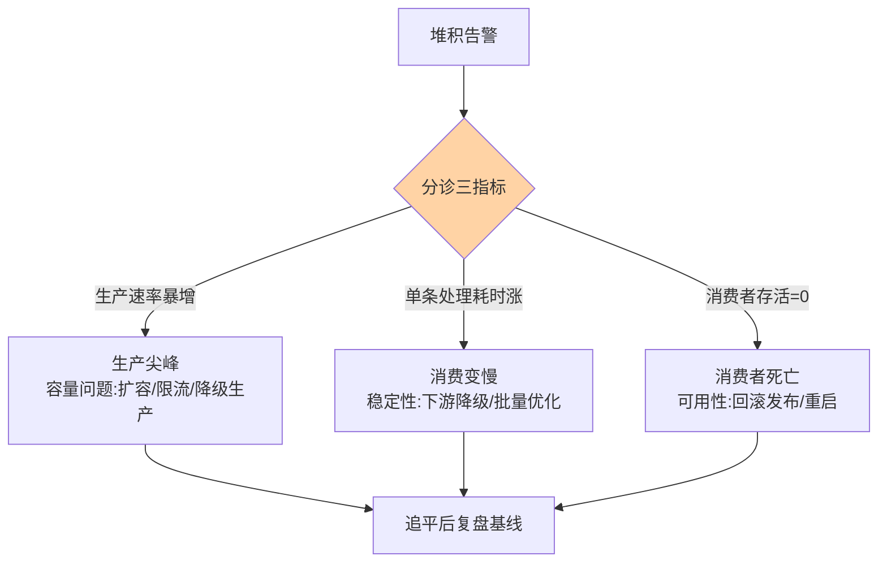
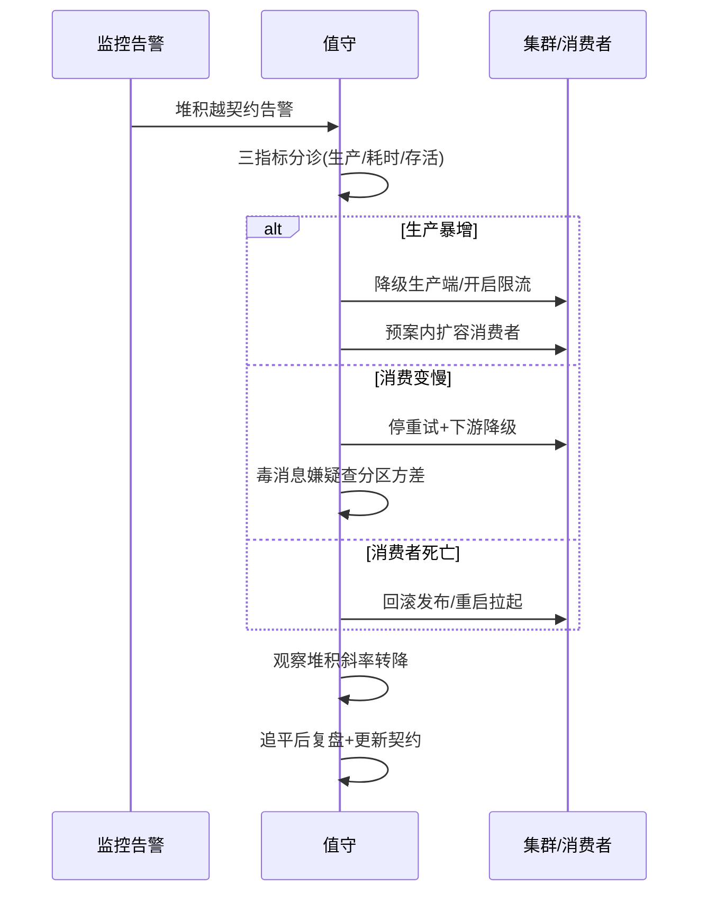
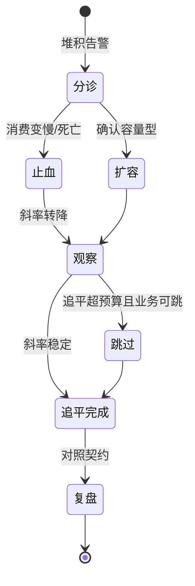
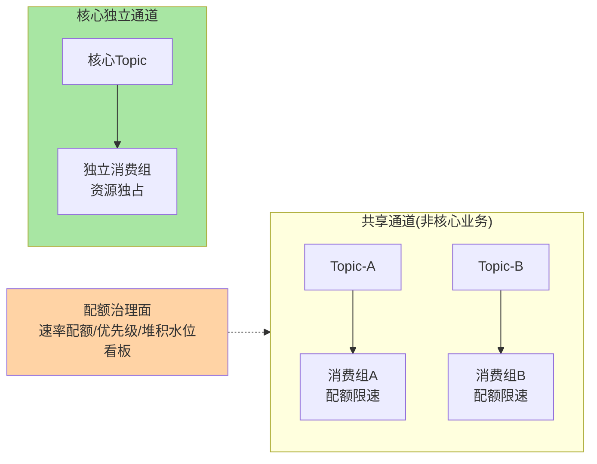

# 亿级消息堆积实战选型决策：从堆不动的真相到分层治理

> 消息堆积是事件驱动系统的第一现场故障——但「堆积」只是症状，真相藏在「生产速率、消费速率、保留策略」三条曲线的关系里。本篇给一套堆积治理决策法：先诊断堆积类型（生产暴增 / 消费变慢 / 消费者死亡），再按类型选处置（扩容、降级、跳过、追平），最后按业务形态选通道档位与保留策略。**堆积不可怕，可怕的是没有预案的堆积。**

> **本文核心**：堆积的数学本质极简——堆积速率 = 生产速率 − 消费速率，但工程处置的复杂度全在「速率为什么失衡」：生产侧尖峰（大促、重试风暴）是容量问题；消费侧变慢（下游拖累、毒消息阻塞）是稳定性问题；消费者全灭（发布事故）是可用性问题。三类问题三种药，用错药（如对毒消息阻塞扩容消费者）不仅无效还放大故障——**处置前先分诊，是堆积治理的第一纪律。**

## 一句话摘要

消息堆积（Lag）指通道中未消费消息的存量：Kafka 以消费组分区的 offset 差值计，RocketMQ 以队列堆积量计。亿级堆积的治理分三层：诊断层——区分「生产暴增 / 消费变慢 / 消费者死亡」三类根因（看生产速率曲线、单消费者处理耗时、消费者存活数三个指标即可分诊）；处置层——扩容消费者（受分区数上限约束）、提高单消费者并行（线程/批量）、跳过堆积（按 offset 跳转或设置跳跃策略，业务允许时）、下游降级保消费；架构层——堆积容忍度按业务分级（可丢的通知类 / 必须追平的状态类 / 不可丢的账务类），通道保留策略与堆积告警水位按分级配置。

## 🎯 本文核心（机制坐标）



## 一、分诊三指标：五分钟定位堆积类型

| 指标 | 生产暴增 | 消费变慢 | 消费者死亡 |
|---|---|---|---|
| 生产速率曲线 | 陡增尖峰 | 平稳 | 平稳 |
| 单条处理耗时 P99 | 平稳 | 陡增 | — |
| 消费者存活数 | 正常 | 正常 | 归零/骤降 |
| 堆积曲线形态 | 阶梯跳升后缓慢下降 | 持续爬坡不回头 | 阶梯跳升且不降 |

分诊纪律写在值班手册第一页：**先看生产速率，再看处理耗时，最后看存活数**——顺序反了（先扩容）会把毒消息阻塞误判成容量不足，白扩一轮。三个指标来自三个现成监控面：MQ 自带的生产/消费速率、应用的接口耗时 P99、消费组存活数——不需要新建监控，需要的是把它们拼成一张堆积分诊看板。

## 二、源码/关键路径：堆积在两个 MQ 里的实现细节

**Kafka**：堆积 = Log End Offset − Committed Offset（按分区）。消费者扩容的硬上限 = 分区数（同组内一分区一消费者），堆积时「加消费者」超过分区数就无效——**Kafka 追堆积的第一板斧是先加分区再扩消费者**，但分区数变更会破坏 key 路由（互指入门层篇 2），顺序敏感 Topic 加分区要评估乱序窗口。跳过堆积的机制是 `consumer.seek(offset)`：按时间戳或相对偏移跳转，跳过即丢失——只对「可丢业务」开放。

**RocketMQ**：堆积量按队列计，内置重试队列与死信队列让「毒消息」自动隔离（重试超限进 DLQ，不再阻塞主队列）——毒消息阻塞在 RocketMQ 是默认防御的，在 Kafka 要自建重试 Topic 链或消费框架的 recoverer。消费并行提升的机制差异：RocketMQ 消费线程数（`consumeThreadMin/Max`）直接可调，Kafka 靠 `max.poll.records` + 消费者内线程池。**同一问题（追堆积）在两个组件里操作面板完全不同**——选型与值班手册都要按组件分开写。

## 三、典型使用场景

- **大促流量尖峰**：生产暴增型堆积的预期管理——堆积水位预估、追平时间预算（尖峰过后的消化时长）
- **下游故障连带**：消费依赖的存储抖动导致处理变慢——下游降级（跳过非核心处理）保消费速率
- **发布事故回滚期**：消费者全灭的堆积积累——回滚后消费能力追平的时间预估与业务沟通口径
- **迁移与重放**：数据迁移后从历史位点重放，亿级历史消息的「合法堆积」——专用消费组 + 追平速率规划

堆积处置的值守时序：



处置动作的状态管理：



## 四、事故叙事三则

**叙事一：毒消息阻塞，扩容 20 台无效。**某风控消费逻辑对特定脏数据必抛异常，该消息反复重试阻塞所在分区——同分区的后续消息全部排队。值班按堆积告警扩容 20 台消费者，无效（新消费者分到的还是健康分区，毒分区依旧卡死）。定位后用「跳转 offset + 脏消息转死信」处置，五分钟消化。复盘沉淀：**分诊指标里补一条「分区间堆积方差」——个别分区堆积远高于均值即疑似毒消息阻塞**，方差指标让这类故障从「两小时」缩到「两分钟」识别。

**叙事二：重试风暴叠加生产尖峰，堆积翻了三倍。**下游存储抖动 → 消费失败触发重试 → 重试流量叠加当天大促生产尖峰，堆积从两百万涨到八百万。处置顺序失误：先扩消费者（内存与下游连接被重试流量挤占，健康消息的处理反而更慢），后停重试才稳住。复盘沉淀：**处置优先级应该是「先止血（停重试/降级）再扩容」**——重试流量是故障放大器（互指入门层篇 6），堆积处置手册里「关闭重试」要排在「扩容」之前。

**叙事三：堆积告警阈值静态，节假日天天误报。**告警阈值按日常水位设 10 万，大促期间正常堆积 50 万——告警疲劳后真异常漏报。改造为动态基线告警（按同时段历史水位 + 偏离率），误报归零。复盘沉淀：**堆积告警的本质是「偏离度」不是「绝对值」**——业务有周期，阈值就必须有周期。

## 五、追问链：把「追平」问穿一层

- **追问一：堆积五千万条，扩容到底能不能追平？**——算追平时间：堆积量 ÷ (消费速率上限 − 生产速率)。消费速率上限受三重约束：分区数（并行上限）、下游容量（DB/缓存写入上限——扩消费者常把瓶颈推给下游）、单条处理耗时。五千万 ÷ 追平速率 5000/s ≈ 2.8 小时——**先算账再动手**，算出来三天的追平时间，业务可能直接选择「跳过 + 事后补偿」，扩容就白做了。
- **再追问：跳过堆积的业务后果怎么评估？**——按事件可补偿性分级：状态快照类（缓存刷新、最新位置）可跳（下一条即覆盖）；账务累加类不可跳（少一条账不平）；通知类可跳但体验降级。**跳过的前提是该业务存在「自愈机制」**：快照会刷新、账务有对账、通知有重试——没有自愈机制的业务，堆积只能追平不能跳过。
- **打破砂锅：堆积是不是越少越好（堆积为零才健康）？**——堆积是削峰的缓冲垫，适度堆积（分钟级消化）恰恰是异步架构的设计价值；堆积为零反而说明消费容量过剩（成本浪费）或生产被限制。「健康」的定义是**堆积水位在预算内、追平时间在 SLA 内**——不是零。把堆积妖魔化的团队会做出「消费容量恒等于峰值生产」的过路费设计。

## 六、反方案分析：三个「直觉方案」为什么不成立

- **为什么不「堆积就加机器」**：三重约束（分区上限/下游容量/毒消息阻塞）下，加机器只对「容量型堆积」有效——不分诊就加机器，对毒消息无效、对下游瓶颈有害（连接挤兑）、对消费者死亡无意义。扩容是处置选项之一，不是默认动作
- **为什么不「把保留时间调大就不用管堆积」**：保留时间大只是让堆积「留得住」，不解决消费速率——且保留窗口放大后，消费者重启时的重放范围变大（位点落后多），恢复时长反而变长。保留策略是「丢了多可惜」的答案，不是「追不追得平」的答案
- **为什么不「把消息全存下来事后补」**：事后补的补偿任务本身是一套消费系统（幂等、顺序、对账全要），且补的时间窗内业务运行在缺失状态——除非业务明确容忍「最终补齐」，否则「实时追平 + 允许时跳过」优于「全攒着事后补」

## 七、设计思想：堆积预算是容量契约的一部分

堆积治理的工程化终点是把「可接受堆积」写成**契约数字**：每条业务链路声明「最大可容忍堆积量 + 最大追平时长 + 可否跳过」三要素，写入容量预算表（互指亿级容量篇）。有了契约，监控告警有依据（偏离契约即告警）、处置有授权（契约内值班自行处置，超契约升级）、扩容有依据（追平时间预算超限才扩）。**没有堆积契约的团队，每次堆积都是一次临场博弈**——业务方问「影响多大」，工程师答不出来。契约化把堆积从恐慌话题变成运营数字。

## 八、不同量级的思考：堆积治理的档位

- **十万级堆积以下**：约束来源是分诊正确性——三分诊看板 + 基础预案即可，重点是值班手册里「先止血再扩容」的顺序。这一档的核心问题是「分诊对不对」，而不是「架构够不够」
- **百万级堆积**：约束来源是追平时间——分区数与下游容量成为追平瓶颈，扩分区/扩下游的预案要预先验证（不是堆积来了才第一次试）。这一档的核心问题是「追平速率上限是多少」，解法是压测出消费速率天花板并写进预案
- **亿级堆积 / 多租户通道**：约束来源是隔离与公平——多业务共享通道时，一个业务的堆积拖累其他业务（共享分区的队头阻塞），按业务隔离通道、消费速率配额、优先级调度进入视野。这一档的核心问题是「堆积的爆炸半径」，解法是通道隔离 + 配额治理

**自下而上与触发升级**：先看分诊看板的堆积分布（全量均匀 vs 个别分区），决定处置路径；触发升级的信号是「追平时间超业务 SLA」「跨业务堆积传染」「重试风暴二次堆积」——治理从手册迁到预案验证再迁到隔离配额，档位跟业务形态走。

### 代码级：堆积处置的两段标准操作

```bash
# Kafka: 查看消费组堆积分布与方差(分诊第一命令)
kafka-consumer-groups.sh --bootstrap-server broker:9092 \
  --describe --group order-consumer
# 输出按分区列 Lag——个别分区 Lag 远超均值 = 毒消息阻塞嫌疑

# Kafka: 按时间戳跳过堆积(仅限可自愈业务,先记录原位点)
kafka-consumer-groups.sh --bootstrap-server broker:9092 \
  --group order-consumer --topic order-events \
  --reset-offsets --to-datetime 2026-09-15T00:00:00.000 --execute
```

```java
// RocketMQ: 消费并发与批量的追堆积配置(下游容量内拉满)
DefaultMQPushConsumer consumer = new DefaultMQPushConsumer("order-consumer");
consumer.setConsumeThreadMin(20);          // 追堆积时下限拉高,平时回调低配
consumer.setConsumeThreadMax(64);
consumer.setConsumeMessageBatchMaxSize(32); // 批量拉取,降低单条处理固定开销
consumer.setMaxReconsumeTimes(5);           // 重试上限即毒消息止损线
```

## 九、参数级配置清单（ADR-0012）

| 配置项 | 默认参考 | 分档建议 | 为什么 |
|---|---|---|---|
| 堆积告警阈值 | 动态基线（同时段历史 ±50%） | 大促窗口临时调整 | 绝对值阈值在周期业务下必然误报 |
| 分区堆积方差告警 | 单分区堆积 > 均值 5 倍 | 毒消息高发链路 3 倍 | 识别毒消息阻塞的灵敏指标 |
| 追平时间预算 | ≤30 分钟 | 账务类 ≤5 分钟 | 契约数字，超限升级处置 |
| Kafka 扩分区评估 | 顺序敏感链路禁随意扩 | 预足分区 + 监控水位 | 扩分区破坏 key 路由（乱序窗口） |
| RocketMQ 消费线程 | consumeThreadMin/Max 20/64 | 下游慢时先降并发排查 | 并发盲目拉大 = 下游连接挤兑 |
| 重试次数上限 | 5-16 次（组件默认） | 毒消息高发链路调低 | 重试是堆积放大器，上限即止损线 |
| 保留时间 | 3 天 | 重放需求长则 7 天 | 保留管丢失容忍，不管追平 |

## 十、步骤级操作（ADR-0012）

1. **前置**：堆积分诊看板上线（生产速率/处理耗时/存活数/分区方差四图）+ 值班手册含「先止血再扩容」顺序
2. **诊断命令**：Kafka `kafka-consumer-groups.sh --describe --group <g>`（看 Lag 分布与方差）；RocketMQ 控制台看队列堆积 + `mqadmin consumerProgress`
3. **验证**：处置后观察堆积曲线斜率（应转为持续下降）与下游水位（未被打穿）
4. **回退**：跳过 offset 前记录原位点（可回退重放）；扩容操作记录变更单（可缩回）；关闭重试的开关要有自动恢复定时
5. **复盘**：堆积归因（生产/消费/存活）与契约对照——超追平预算的堆积必出改进项

## 十一、业内惯例

- 大促堆积预案惯例：峰值堆积水位预估表（按流量模型推算）+ 追平时间预算 + 处置授权矩阵，写入作战手册
- 毒消息治理惯例：重试队列与死信分离、死信告警必达、死信重放走幂等前置检查（互指入门层篇 6）
- 多租户通道惯例：核心业务独立 Topic/队列，共享通道配消费速率配额——堆积的爆炸半径用物理隔离划界

## 你们可能会问

**Q1：Kafka 分区数一开始应该设多少？**
按「目标消费并行度 ÷ 单消费者吞吐」预留 2-3 年余量（宁可多分区，后补分区有乱序窗口），同时对照下游写入容量——分区数超过下游可承受并发只会在追平时打穿下游。起点常见 12-48 区间（业内量级认知），按业务实测校准。

**Q2：消费者重启后从哪开始消费，堆积怎么算？**
由 `auto.offset.reset` 与位点提交策略决定：已提交位点从提交处继续（正常），无提交则按策略 earliest/latest。堆积处置里要盯「位点提交频率」——提交太频性能损耗、太疏重启后重放范围大，常规按批处理节奏提交。

**Q3：堆积和延迟（端到端时延）是什么关系？**
堆积是存量、延迟是体验——堆积 10 万条在消费速率 5 万/s 时延迟仅 2 秒（可接受），堆积 1 万条在消费速率 10/s 时延迟 17 分钟（灾难）。**值班看延迟分位数，容量规划看堆积水位**——两个指标别混用，SLA 通常按延迟写。

## 十二、什么时候用 / 不用

- ✅ 立即处置：堆积超契约预算、延迟超 SLA、分区方差异常（毒消息嫌疑）
- ✅ 预案内观察：大促预期内堆积、追平时间预算内的增长
- ❌ 不扩容：未分诊先扩容——毒消息与下游瓶颈下扩容无效或有害
- ❌ 不跳过：无自愈机制的账务类堆积——跳过即永久缺失
- ❌ 不静态阈值：周期性业务的堆积告警必须动态基线——静态阈值制造告警疲劳

多业务共享通道的堆积隔离架构：



## Trade-off：追平速度、数据完整性与系统安全的三角

追堆积的每个动作都在三角里选位：扩容提追平速度但挤兑下游（安全）；跳过保系统但牺牲完整性；全量追平保完整但延迟随堆积线性涨。**三角的支点是业务的堆积契约**——契约里「可否跳过 + 追平时长」定了，动作就定了。没有契约的团队在三角里反复横跳，每次堆积都是新决策；有契约的团队按表执行，堆积处置从判断题变成执行题。亿级通道的隔离配额由此成为第四件治理资产——核心独立、共享限速、配额看板，堆积的爆炸半径用架构画界。

## 开放问题

- 分层存储（Kafka Tiered Storage）让堆积的成本焦虑缓解，「堆积留多久」与「堆积放哪层」解耦，保留策略决策简化
- 服务端消费调度（如 KIP 的 consumer group 协议演进）在改善 rebalance 与追赶行为，堆积处置的组件差异有望收敛

## 💡 实战提示

- 💡 分诊顺序刻进值班手册：先生产速率、再处理耗时、后存活数——顺序就是止血顺序
- 💡 补「分区堆积方差」指标：个别分区异常 = 毒消息阻塞的最早信号
- 💡 处置先止血后扩容：关重试、降下游，再谈加机器——重试流量是堆积放大器
- 💡 跳过前必须确认自愈机制存在：快照会刷、对账会补——没有自愈的只能追平
- 💡 SLA 按端到端延迟写、容量按堆积水位管——两个指标别混

## 自测三问

1. 堆积三分诊的三指标组合分别指向什么根因？
2. 「先止血再扩容」的机制依据是什么？重试流量如何放大堆积？
3. 堆积契约的三要素是什么？契约改变了处置的什么性质？

## 🎯 核心带走

- **核心一句话**：堆积速率 = 生产 − 消费，处置复杂度全在「为什么失衡」——先分诊（暴增/变慢/死亡）再处置（止血优先于扩容），堆积契约让处置从判断题变执行题
- **三指标分诊**：生产速率（容量）、处理耗时（稳定性）、存活数（可用性）+ 分区方差（毒消息）
- **哪里会坏**：不诊断先扩容、重试风暴二次堆积、静态阈值告警疲劳、无自愈机制硬跳过
- **边界**：堆积是削峰缓冲不是纯故障；SLA 按延迟写、容量按水位管
- **量级迁移**：十万级问分诊、百万级问追平上限、亿级问隔离配额

## 📌 数据与事实声明

- 写于 2026-09-15；Kafka/RocketMQ 堆积度量与处置机制以官方文档公开口径为准；扩分区乱序窗口语义互指入门层篇 2
- 事故叙事为业内高频堆积故障模式的匿名化叙事，非特定公司事件
- 免责：组件默认值随版本演进，以官方文档为准

## 📚 参考资料

| 类型 | 标题 | 来源 |
|---|---|---|
| 官方文档 | Kafka Consumer Groups 与 Lag 监控 | kafka.apache.org |
| 官方文档 | RocketMQ 消费重试与死信 | rocketmq.apache.org |
| 系列内 | 篇 2 分区模型 / 篇 6 死信重试 | 入门层同系列 |
| 关联篇 | 《亿级容量实战选型决策》 | engineering/专题层 |
