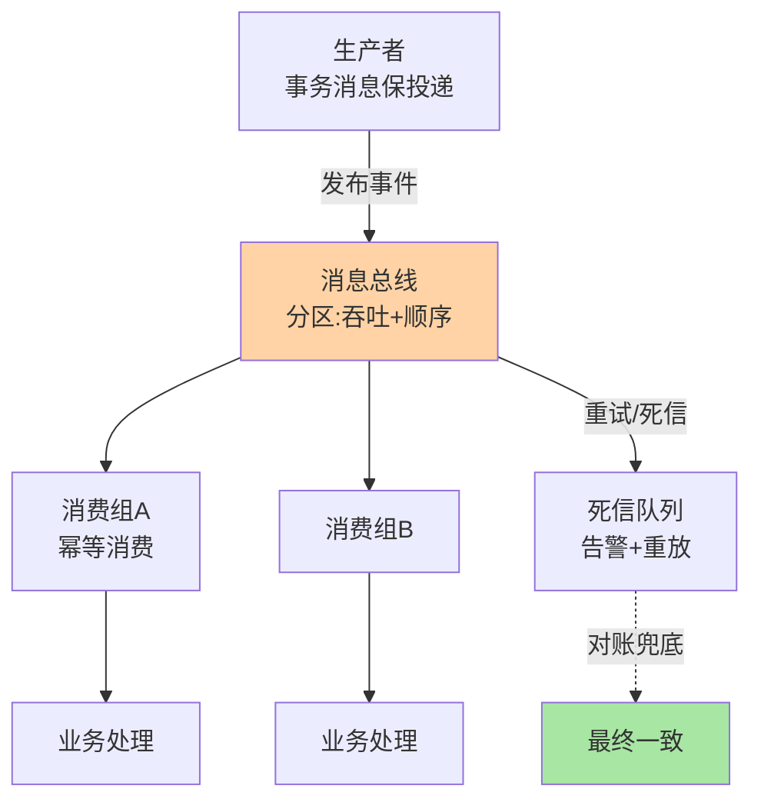
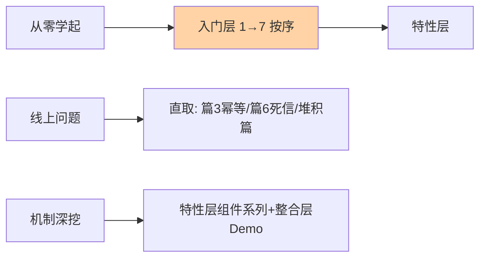

# 从零开始认识事件驱动架构系列

> 事件驱动的核心：发布-订阅 + 异步处理 + 最终一致性。本系列从「命令变通知」的语义出发，经分区模型、消费防线，到事务消息与堆积治理，把事件驱动从概念带到实战。

## 这个目录讲什么

事件驱动架构（EDA）的系统化入门：语义层（什么是事件、与消息的区别）、通道层（分区与顺序）、消费层（幂等/重试/死信）、一致性层（事务消息与对账），最后用两篇实战专题（亿级堆积治理）与一个从零实现的 Demo 收束。

## 全局心智模型

## 系列导航表

| 篇目 | 层 | 一句话重点 |
|---|---|---|
| 1_事件驱动概念入门 | 入门 | 命令变通知；一致性需求是业务属性 |
| 2_消息模型与分区 | 入门 | 分区 = 吞吐单位 + 顺序声明粒度 |
| 3_消费模式与幂等 | 入门 | 至少一次 + 幂等是工程主路 |
| 4_事件溯源与CQRS入门 | 入门 | 事件从通知变数据，历史即资产 |
| 5_事务消息与最终一致性 | 入门 | 半消息焊住写库与发消息 |
| 6_死信与重试 | 入门 | 分诊、退避、死信三纪律 |
| 7_事件驱动架构总结 | 入门 | 四层拼图 + 决策口诀 |
| 特性层 Kafka×3 / RocketMQ×3 | 特性 | Producer/Broker/消费组与事务消息机制 |
| 专题层 亿级消息堆积实战选型决策 | 专题 | 三指标分诊 + 先止血再扩容 |
| 整合层 从零实现事件驱动框架 | 整合 | 五取舍造内核，机制倒逼理解 |

三类读者的阅读路径：

## 我能得到什么

- 建立事件驱动的完整心智：语义 → 通道 → 消费 → 一致性四层拼图
- 掌握消费端防线三件套（幂等/重试/死信）的工程纪律
- 会做堆积分诊与处置，能读懂 Kafka/RocketMQ 的机制差异
- 判断自己的业务该不该上事件驱动、上到哪一档

## 我想看哪一篇

- **按方向**：从零学起 → 入门层 1-7 按序；只用 Kafka/RocketMQ → 特性层对应系列
- **按问题**：「堆积了怎么办」→ 专题层堆积篇；「消息重复」→ 篇 3；「本地事务和发消息」→ 篇 5
- **按阶段**：入门读入门层；实战前读专题层；想懂机制读整合层 Demo

## 📌 维护说明

新增文章必须同步更新本导航表，并在「我想看哪一篇」中补充对应阅读路径。

## 📌 数据与事实声明

- 写于 2026-09-15（系列导读）；机制描述以 Kafka/RocketMQ 官方文档公开口径为准
- 免责：组件能力随版本演进，以官方文档为准

## 📚 参考资料

| 类型 | 标题 | 来源 |
|---|---|---|
| 官方文档 | Apache Kafka / RocketMQ | kafka.apache.org · rocketmq.apache.org |
| 系列导航 | 事件驱动系列目录 | `docs/architecture/event-driven/index.md` |
