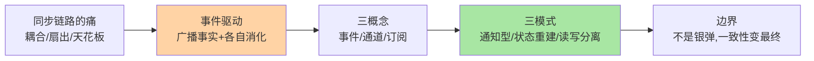
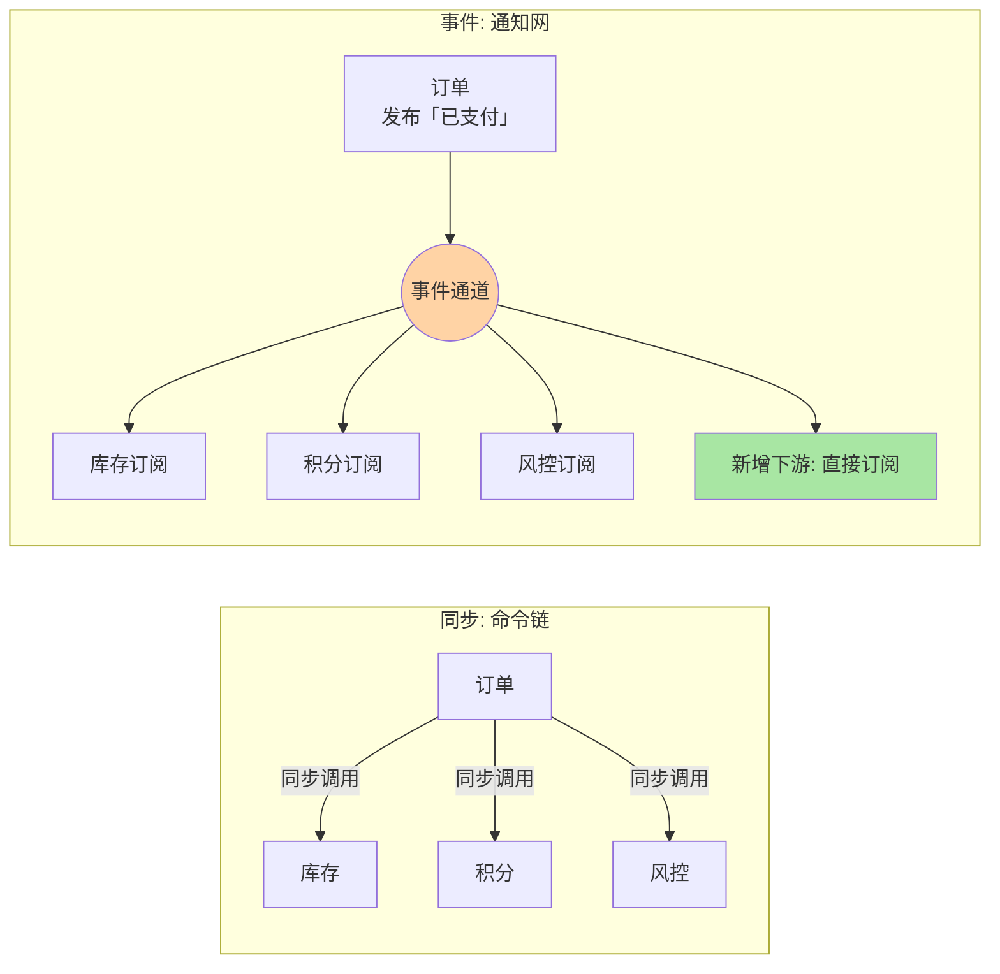

# 事件驱动概念入门：从「调用你」到「通知你」

> 一句话：事件驱动架构（EDA）把系统间的协作从「调用方主动问你」改成「发生事情的一方广播事实、感兴趣的一方各自消化」——同步链路的天花板问题、多下游的扇出问题、新旧系统的粘合问题，都从这一次「语气的转变」开始解。

## 🎯 本文核心

**核心一句话：事件驱动的本质是「控制权的转移」——生产者只负责声明「发生了什么」（事实），不关心谁在听、听到之后干什么；消费时机、失败重试、消费节奏全部由消费侧自持。同步调用是命令（你必须处理），事件是通知（事情已经发生）。**

组织主线（本篇五段全挂这条线）：

## 一句话摘要

事件驱动架构（Event-Driven Architecture, EDA）是一种以「事件」为中心的系统协作方式：服务在状态变更时发布事件（订单已支付、库存已扣减），下游感兴趣的消费者异步订阅并各自处理（发货、积分、风控）。与同步调用（RPC/HTTP）相比，它用「生产者与消费者在时间上解耦」换取扩展弹性——加一个下游不用改上游一行代码，代价是一致性从实时强一致变成最终一致。事件通常经由消息中间件（Kafka/RocketMQ 等）传递，但「事件驱动」是架构思想，「消息队列」只是承载它的工具之一。

## 一、为什么需要事件驱动：同步链路的三笔账

先算同步调用链的账。典型电商下单：订单服务创建订单后，同步调用库存服务扣库存、积分服务加积分、风控服务做风控。这笔账有三项：

- **耦合账**：订单服务要 import 三个下游的客户端与异常语义，任何一个下游接口变更，上游跟着改版发布
- **扇出账**：业务迭代到第十个下游（短信、推荐、发票……），同步链串行耗时叠加，或者并行编排代码越来越复杂
- **天花板账**：同步链的总延迟 = 最慢一环；下游抖动直接把上游拖进线程池排队，故障沿调用链向上传播

事件驱动把「订单服务要认识所有下游」反转成「下游各自订阅订单事实」：新增短信通知只是多一个订阅者，订单服务零改动。这笔账的核心不是性能，是**演进成本**——业务高速迭代期，改动的传导范围比单次耗时更值钱。

## 5W 速记卡

| 维度 | 一句话 |
|---|---|
| What | 状态变更即发布事件，消费方异步订阅、各自消化 |
| Why | 解耦生产者与消费者：加下游不改上游，故障不沿链传播 |
| When | 一个动作引发多个后续、上下游节奏不一致、新旧系统粘合 |
| Where | 事件生产者 → 事件通道（MQ/日志流）→ 一到多个消费者 |
| How | 发布订阅为主；一致性用事务消息/对账兜底（本系列后续篇展开） |

## 二、三个核心概念：事件、通道、订阅

**事件（Event）**是「已发生事实」的记录，命名用过去式：OrderPaid、StockDeducted。这个时态不是语言洁癖，是语义契约——命令说「请你扣库存」（可能被拒绝），事件说「订单已支付」（不可反驳）。事件通常带三段结构：事件头（ID、时间、类型）、事件体（业务事实快照或最小字段集）、元数据（来源服务、版本）。

**通道（Channel）**是事件的传输路径，工程上常由消息中间件承载：Kafka 的 Topic、RocketMQ 的 Topic/Queue。通道负责存储与转发，但不理解事件内容——它只是事实的河道。

**订阅（Subscription）**是消费关系声明：谁关心哪类事件、从哪个位点开始消费。订阅关系的变化不需要生产者感知，这是解耦的机制落点。

三者的边界感：**事件定义「说什么」，通道解决「怎么送」，订阅决定「谁在意」**。把业务语义塞进通道（一个业务一个 Topic 还是一个大 Topic 加类型字段）是新人第一个设计分歧点，本系列篇 2 讲分区模型时会拆。

## 三、三种模式一眼看全

| 模式 | 一句话 | 典型形态 | 复杂度 |
|---|---|---|---|
| 通知型事件 | 事实广播 + 各自消费 | 订单已支付 → 发货/积分/风控 | 低（本系列主线） |
| 事件溯源 | 事件即数据：只存事件，状态由重放推导 | 账本、审计、可回溯领域 | 高 |
| CQRS | 写模型与读模型分离，事件做同步管道 | 写库 → 事件 → 读侧视图 | 中高 |

入门阶段把 90% 的注意力放在通知型事件上——它是日常业务的主体形态。事件溯源与 CQRS 是在「通知型」跑顺之后应对特定问题（强审计、读写不对称）的升级形态，本系列篇 4 只建立概念锚点，专题层再展开。

## 与同步调用、消息队列的区别辨析

三样东西经常被混为一谈，用一张表钉住边界：

| 维度 | 同步调用 | 消息队列（指令） | 事件驱动（事实） |
|---|---|---|---|
| 语义 | 命令：请处理，我等结果 | 命令的异步投递：请处理，不用等我 | 事实：这已发生，与我何干我判断 |
| 耦合点 | 接口 + 时序 + 可用性 | 接口 + 消息格式 | 事件契约（schema） |
| 失败语义 | 调用方感知并处理 | 消费方重试/死信 | 消费方自持 + 对账兜底 |
| 典型误用 | 长链路串行 | 发完同步等结果 | 事件里夹命令语义 |

判别口诀：**看「谁有应答义务」**——同步调用双方都有；消息队列把应答义务转移给消费方；事件驱动里根本不存在应答，只有订阅方对事实的自主反应。

## 四、典型使用场景

- **一做多下游**：支付成功后要驱动发货、积分、风控、通知——典型扇出场景，事件一次发布多方消化
- **削峰填谷**：大促瞬时下单洪峰先落成事件排队，消费侧按自己的节奏处理，数据库不被瞬时打穿
- **新旧系统粘合**：老系统改不动，新系统订阅老系统发出的业务事件做增量同步，不动老系统一行代码
- **跨团队协作边界**：上游只承诺事件契约（schema），下游各自演进消费逻辑，团队协作从「排期耦合」变「契约耦合」

## 五、误区与不适用

- ❌ **「事件驱动 = 用了消息队列」**：MQ 只是通道。如果生产者发完消息还同步等下游处理结果，那只是换了交通工具的远程调用——解耦发生在语义里，不在组件里
- ❌ **「事件 vs 消息」当文字游戏**：工程边界清晰——消息是「指令」（请处理这个），事件是「事实」（这已经发生了）；用事件通道传指令，消费方会陷入「我要不要响应这个事实」的语义混乱
- ❌ **「解耦 = 不用管下游」**：生产者不关心谁消费，但要为事件契约的稳定性负责——schema 随意变更（改字段类型、删字段）会炸掉所有订阅方，契约治理是生产者的责任
- ❌ **什么场景都上事件**：强一致场景（扣款 + 记账必须同生共死）硬套事件驱动会得到一套「最终不一致 + 复杂补偿」的组合拳——该同步事务就同步事务，边界判断见本篇「什么时候用/不用」

## 六、追问链：把「异步解耦」问穿一层

质疑者不会停在「解耦」这个词上——往下追问，每一层的答案都是下一层问题的入口：

- **追问一：解耦了调用，那耦合消失了吗？**——恰恰相反，它只是换了形态：从「代码级耦合」（import 下游接口）换成「契约级耦合」（事件 schema）。契约耦合更松但更隐蔽：上游改了字段，编译期毫无反应，炸在下游运行期。所以事件驱动架构的纪律重心从接口评审移到了 schema 治理（版本化、只加不改、废弃先广播）。
- **再追问：强一致没了，业务能接受吗？**——把一致性按业务拆开问：扣款和记账要同生共死（强一致，留在同步事务里）；发货和积分晚几秒没关系（最终一致，走事件）。**一致性需求是业务属性不是技术选型**，先拆业务再选通信方式，顺序反了就会「为了架构先进而牺牲正确性」。
- **打破砂锅：那到底什么时候必须用事件？**——三个判据同时满足：①一个动作有多个独立下游；②下游允许延迟（秒级）；③下游故障不应阻断主流程。缺任何一条，同步调用更简单——简单本身就是架构收益，本篇「什么时候用/不用」节会收敛成决策表。

## 七、实践叙事：一次被下游拖垮的大促

某交易系统订单创建后同步调用六个下游完成「订单后处理」，平时相安无事。大促当晚营销服务做活动校验突然变慢（耗时从 20ms 涨到 3 秒），订单链路线程池被拖满，**下单成功率随之下跌——但下单本身并不依赖营销结果**。值班把营销从同步链摘除后恢复。

复盘时团队重新盘了六个下游：发货、库存预占是「下单必须完成」的强依赖；积分、风控异步复核、短信、营销是「晚点没关系」的弱依赖。改造后强依赖留在同步链，弱依赖全部改为订阅「订单已创建」事件——**下单链路从 6 个同步依赖缩到 2 个**，次年大促营销服务再次抖动时，下单成功率纹丝不动。

这次改造的沉淀是一条设计纪律：**依赖分类先于架构选型——先画「必须同步完成」和「可以事后补偿」的分界线，再决定什么走调用、什么走事件**。顺带暴露了新问题：事件重复投递时积分加了两次——消费端的幂等问题，正是篇 3 的主题。

## 八、设计思想：为什么事件必须用过去式

「OrderPaid 而不是 PayOrder」这条命名纪律背后是责任划分的设计思想：**命令的语法责任在发送方（我要你做），事件的理解责任在接收方（这已发生，与我何干由我判断）**。过去式事件天然携带三个工程性质：不可取消（生产者不提供撤回语义）、可重复（同一条事实可被多次投递）、可追溯（事件日志即历史）。消费端围绕这三个性质设计——幂等消费、补偿逻辑、审计回放——整套架构的语汇就统一了。反之，如果在事件里夹带命令语义（「请发货」事件），同一个事件不同消费者会有不同的「应答义务」理解，责任边界立刻模糊。

## 九、你们可能会问

**Q1：事件驱动和消息队列是什么关系？**
思想与工具的关系。事件驱动是协作方式（广播事实、订阅消费），消息队列是承载通道的常用组件——它提供存储转发、投递语义、堆积能力。反向不成立：用了 MQ 不等于事件驱动（发完等结果的是远程调用），不用 MQ 也可以做事件驱动（进程内事件总线、数据库事件表轮询都是低配形态）。

**Q2：事件驱动是不是就慢了？异步延迟能接受吗？**
多一段通道转发，端到端延迟从毫秒级变成十毫秒到百毫秒级（业内量级认知，依中间件与配置而异）。关键是分场景：用户正在等结果的（下单页反馈）必须同步；用户不等结果的（发货、积分）延迟无感。用「用户是否在等」划分，而不是笼统说快慢。

**Q3：事件丢了怎么办？这算不算不可靠？**
可靠性是通道配置与业务兜底的叠加：生产端确认机制、通道持久化与副本、消费端手动 ack——三层配齐后丢失概率压到工程可忽略；再补一张对账网（定时比对业务主表与下游状态）兜住小概率缺口。「绝对不丢」不存在，「丢了能发现、能补偿」才是工程目标。

## 十、什么时候用 / 不用

- ✅ 用：一个动作多个独立下游；下游可容忍秒级延迟；下游故障不应阻断主流程；业务高速迭代需要降低改动传导
- ✅ 削峰场景：瞬时洪峰 > 稳态处理能力，允许排队消化
- ❌ 不用：调用方必须立刻拿到结果才能继续（同步事务语义）
- ❌ 不用：强一致写路径（扣款与记账同生共死）——先拆业务一致性需求，再谈架构
- ❌ 不用：调用链就一两个下游、变更频率极低——事件化的治理成本收不回收益，直接调用更简单

### 量级视角一句话

十万级 QPS 以下、两三个下游的同步链完全够用，不必为解耦而上事件；百万级量级扇出与削峰让事件驱动从「可选」变「必选」；千万级、亿级量级上，事件化叠加分区并行更是跨机房扩展的前提——**量级决定你为解耦付的治理成本是否划算**。

## Trade-off：解耦的另一面

事件驱动的收益全部指向演进弹性（改动传导小、故障隔离、削峰），代价集中在三条：①一致性从实时变最终，需要补偿与对账机制托底；②排查从「一个调用栈」变「一条事件链」，全链路追踪与事件溯源能力成为基建必需；③契约治理成为长期责任，schema 演进纪律（只加不改、版本并存）要进团队规范。**收益在业务增长期兑现，代价在系统复杂度上即刻支付**——业务快速迭代期这笔交易划算，系统趋稳后要警惕为「解耦」而维持的多余中间层。

## 开放问题

- 事件契约的行业标准化（CloudEvents 等）在推进，跨组织事件的互操作会改善，但企业内 schema 治理仍以自建规范为主
- Serverless 与事件驱动的结合（函数即消费者）正在降低消费侧的运维门槛，「事件粒度的弹性计费」可能改变消费侧的容量规划方式

## 💡 实战提示

- 💡 先做依赖分类（同步必须 / 异步可补），再决定什么上事件——顺序反了会为先进而牺牲正确性
- 💡 事件命名全部过去式，schema 只加不改、废弃先广播——契约纪律是事件架构的生命线
- 💡 事件体存「事实快照」还是「最小 ID + 拉取」要按消费者需求定：通知型用快照省一次回查，强一致校验场景用 ID 回查事实源
- 💡 从第一天就建对账网：定时比对事实源与下游状态，丢事件从「事故」降级为「被对账抓住的抖动」

## 自测三问

1. 事件与消息（命令）的语义边界是什么？为什么命名必须过去式？
2. 同步链的三笔账（耦合/扇出/天花板）分别指什么？
3. 必须用事件的三个判据是什么？缺一条时该怎么选？

## 🎯 核心带走

- **核心一句话**：事件驱动 = 控制权转移——生产者声明事实，消费者自持时机；命令变通知，耦合变契约
- **三概念**：事件（说什么）/ 通道（怎么送）/ 订阅（谁在意）
- **三模式**：通知型（日常主体）、事件溯源（状态由事件重放）、CQRS（读写分离）
- **哪里会坏**：schema 变更炸下游、重复消费加两次积分、事件链排查无追踪
- **边界**：强一致留在同步事务；事件驱动解决演进问题，不解决一致性问题

## 📌 数据与事实声明

- 写于 2026-09-15；事件驱动概念以 CloudEvents 规范、Kafka/RocketMQ 官方文档公开口径为准
- 「端到端延迟十毫秒到百毫秒级」为业内量级认知，依中间件与配置实测
- 实践叙事为业内高频架构演进模式的匿名化叙事，非特定公司事件
- 免责：组件能力随版本演进，以官方文档为准

## 📚 参考资料

| 类型 | 标题 | 来源 |
|---|---|---|
| 行业规范 | CloudEvents 事件格式规范 | cloudevents.io |
| 官方文档 | Apache Kafka 文档（Producer/Consumer 语义） | kafka.apache.org |
| 官方文档 | RocketMQ 架构与消息模型 | rocketmq.apache.org |
| 系列导航 | 事件驱动系列目录 | `docs/architecture/event-driven/index.md` |
