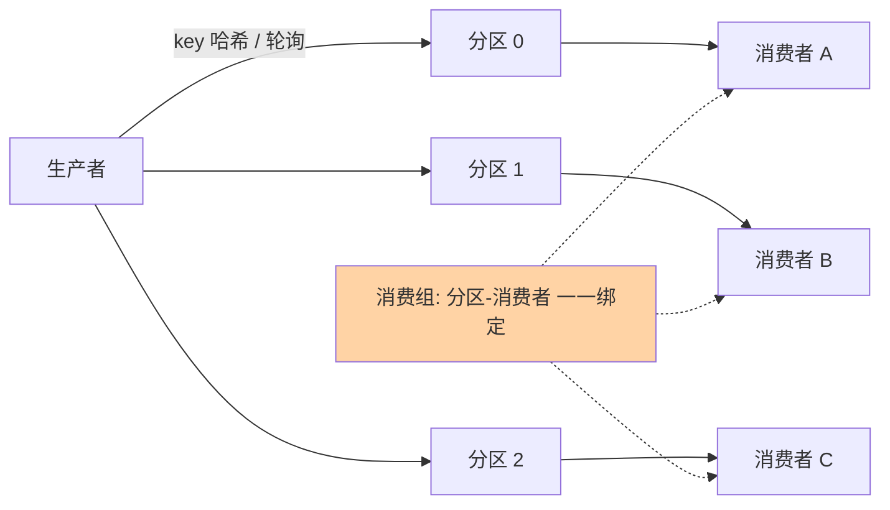

# 消息模型与分区：顺序与吞吐的底层契约

> 一句话：分区（Partition/Queue）是事件通道的并行单位——它同时决定两件看似矛盾的事：吞吐靠它横向扩展，顺序靠它局部保住。理解「分区内有序、分区间无序」这一条，事件驱动的大半设计分歧就有了裁判。

## 🎯 本文核心

**核心一句话：通道的存储模型是「分区日志」——追加写带来吞吐，分区数带来并行度，而顺序保证被压缩到分区粒度：同 key 落同分区才有序，跨分区一律无序。所有「顺序丢失」事故的根源，几乎都是业务假设了全局有序、而存储只承诺分区有序。**

## 一句话摘要

Kafka 把每个 Topic 切成多个 Partition，每条消息按分区键（默认轮询/按 key 哈希）落到某一个分区；分区内部是严格追加的日志，消费位点（offset）由消费组管理，同一分区同一时刻只被组内一个消费者消费。RocketMQ 模型类似但队列语义更细：Topic 下分多个 MessageQueue，消费模式分集群消费（组内分摊）与广播消费（每个消费者全量）。两者共同的根本约定：**分区内严格有序、分区间不保证顺序**——这是吞吐与顺序做 Trade-off 后的工程均衡点。

## 5W 速记卡

| 维度 | 一句话 |
|---|---|
| What | Topic 切分区（Queue），分区内追加日志、分区间相互独立 |
| Why | 追加写换吞吐、分区换并行；顺序压缩到分区粒度保住关键路径 |
| When | 同 key 顺序业务用 key 分区；吞吐管道用轮询打散 |
| Where | 生产者选分区 → 分区日志存储 → 消费组分摊消费 |
| How | 分区数按吞吐推导；key 设计是顺序契约；位点提交定投递语义 |

## 一、为什么存储模型长这样：追加写 + 分区

磁盘最慢的是随机寻道，最快的是顺序追加。事件通道把存储做成「只追加的日志」：写就是文件末尾追加（顺序 IO），读就是按位点顺序扫（页缓存友好）——单盘即可扛住十万级 QPS 的写入（业内量级认知）。「删除」和「更新」在这个模型里不存在：事件不可变，过期靠日志段整体清理。

追加写解决了单分区吞吐，但单分区的读写终归在一个节点上——**分区**把日志横向切开：写入压力分散到多分区（通常多节点），消费压力由消费组并行分摊。吞吐随分区数近线性扩展，直到网络与协调成本接管。

生产者的路由与消费组的分配关系：

## 二、Kafka 分区模型三个关键点

### 2.1 分区键决定数据落点

生产者按策略选分区：指定分区号、按 key 哈希（同 key 恒同分区）、或轮询（无 key 时打散）。**按 key 哈希是顺序保证的唯一入口**：同一订单 ID 的支付、发货、完成事件落同一分区，消费端才能按业务顺序处理。key 设计的坑也在这：热点 key（大卖家、头部用户）会把某个分区打成热点，分区数再多也白搭——**key 的基数与均匀性决定并行度上限**。

### 2.2 消费者组：并行度的分配器

同一消费组内，每个分区同一时刻只分配给一个消费者——组内并行度上限 = 分区数。10 个分区 20 个消费者，一半在空转；反过来分区数少于预期并发，消费堆积时加机器没用（组内 max 并行 = 分区数），只能加分区。**「消费者数 ≤ 分区数」是容量规划的第一公式。**

### 2.3 位点（offset）：消费进度的账本

消费位移由消费组定期提交：正常时是性能参数，故障时是正确性参数——重复消费还是丢消息，取决于位点提交与业务处理的先后（先处理后提交 = 至少一次，先提交后处理 = 至多一次）。这条语义链在篇 3 幂等设计里展开，这里先钉住：**位点提交策略就是投递语义的实现。**

## 三、RocketMQ 队列模型：与 Kafka 分区模型的区别

RocketMQ 的 Topic 下挂多个 MessageQueue，结构与 Kafka 分区同构，差异在消费语义的分层：

- **集群消费**：消费组内分摊队列（对应 Kafka 消费组），生产默认
- **广播消费**：组内每个消费者都消费全量（Kafka 没有原生对应物，靠各自独立 group 模拟）
- **顺序消息**：RocketMQ 把「同 key 同队列」做成显式 API（produce 时选队列 + 消费端加锁），把 Kafka 的「隐式约定」变成「显式契约」

| 维度 | Kafka | RocketMQ |
|---|---|---|
| 并行单位 | Partition | MessageQueue |
| 顺序保证 | 分区内有序（靠 key 哈希） | 同队列有序 + 显式顺序消息 API |
| 消费模式 | 消费组 | 集群 / 广播双模 |
| 重试与死信 | 原生较弱（自行建重试 Topic） | 内置重试队列 + 死信队列 |
| 事务 | 幂等生产 + 事务 API | 半消息 + 回查（事务消息） |

## 四、典型使用场景

- **订单状态机**：同订单 ID 作 key，状态流转事件按序消费，防止「已发货」先于「已支付」被处理
- **用户行为流**：按用户 ID 分区，单用户行为在单分区内有序，分析侧按窗口消费
- **日志/埋点管道**：无需顺序，轮询打散吃满并行度，吞吐优先
- **Binlog 分发**：按表主键分区，下游缓存失效与搜索索引按行序消费

## 五、误区与不适用

- ❌ **「分区越多吞吐越高」**：分区是元数据与文件句柄的成本单位，数千分区后协调开销（控制器、副本同步、 rebalance）反而压垮集群——按「目标吞吐 ÷ 单分区能力」留 2 倍余量估算，别无脑拉满
- ❌ **「设置了 key 就全局有序」**：只有同 key 才有序；改 key 生成逻辑（比如从用户 ID 改成订单 ID）会让同一业务的先后事件散进不同分区——key 设计是契约，变更要走兼容评估
- ❌ **「分区数随便加」**：扩分区后，新消息按新的分区总数路由，老 key 会落到新分区——**分区数变更会破坏「同 key 同分区」**，对顺序敏感的 Topic 要预足分区或接受一次乱序窗口
- ❌ **「广播消费当默认」**：广播模式下每个消费者全量消费且位点各自管理，堆积与丢失都难统一治理——除非「每台机器都要全量」（本地缓存刷新），一律集群消费

## 六、追问链：把「分区有序」问穿一层

- **追问一：为什么不做全局有序？**——全局有序意味着全通道退化成单写入口 + 单一日志，吞吐回到单机上限；而且消费端要全局串行，并行度归一。分区有序是「用 1/n 的顺序保证换 n 倍吞吐」的均衡点——**顺序与吞吐在物理上就不可兼得，只能声明粒度**。
- **再追问：业务真的需要事件间有序吗？**——多数「以为要顺序」的场景，本质是「要终态一致」：把事件设计成携带完整终态（状态快照而非增量），乱序到达也能按版本号丢弃旧值，顺序约束直接消掉。**先试「无序化设计」，救不回来再上 key 分区**——顺序是最贵的约束。
- **打破砂锅：同 key 数据倾斜怎么办？**——key 加盐（key + 随机后缀）打散并行度，代价是同一业务事件进多分区、顺序没了；折中是二级缓冲：乱序消费后按业务键在本地小顶堆重排（依赖事件时间戳），用内存与延迟换回顺序。三个方案（保序/打散/重排）没有免费档，按业务对乱序的真实容忍度选。

## 七、实践叙事：一次「并发改单」引发的乱序排查

某交易中台把订单事件从单分区迁到按订单 ID 哈希的 16 分区，上线后客服陆续收到「订单显示已发货但详情页还在待支付」的反馈。排查链路：事件时间线显示「已支付」与「已发货」两条事件落进了不同分区（运营侧曾按用户 ID 重发过一条补偿事件，key 不同）——**同业务多 key 的隐性路径破坏了同分区假设**。修复分两步：短期把补偿事件统一改用订单 ID 作 key；长期把订单消费端改成「按状态机版本号丢弃过期事件」（终态快照设计），从此对乱序免疫。复盘沉淀：**任何顺序保证都要配一条「谁来破坏它」的威胁模型**——key 生成逻辑的所有路径都要进代码评审清单。

## 八、设计思想：顺序为什么只保证到分区粒度

分区有序不是实现妥协，是语义上的刻意收窄：**顺序保证的责任应该由「最关心顺序的业务」用 key 显式声明，而不是由存储层猜测**。存储层若承诺全局有序，就把业务无关的消息也串进了同一条队；分区模型把选择权交给 key 设计——要顺序的业务用业务键，要吞吐的用轮询。这套「机制提供能力、业务声明需求」的分层思想，和数据库索引（引擎提供 B+ 树、业务选索引键）一脉同源。

## 九、你们可能会问

**Q1：分区数到底怎么定？**
按吞吐倒推：目标峰值 QPS ÷ 单分区实测处理能力（压测出真实值），留 2 倍余量，再对齐消费者数。下游是数据库的要反查「下游写入并行度」——分区数超过下游可承受的并发，只会把堵点搬到下游。起点宁小勿大：扩分区会破坏 key 路由，缩分区几乎不做。

**Q2：Kafka 和 RocketMQ 在事件驱动里怎么选？**
日志流属性强（长保留、回放、流式消费）选 Kafka；业务消息属性强（事务消息、重试死信、延迟消息开箱即用）选 RocketMQ。团队已有组件优先——事件驱动架构的价值在解耦语义，不在通道品牌。

**Q3：消息在分区里是「删除」的吗？**
不是删除，是日志段过期清理（按时间或大小）。这带来一个别处没有的能力：**新起的消费者可以从很久以前的位点重放历史事件**——下游要重建缓存/重建视图时，这是事件日志模型独有的恢复通道。

## 十、什么时候用 / 不用

- ✅ 用：需要顺序的业务键分区（订单、账户流水）；吞吐型管道（日志、埋点）
- ✅ 用：需要回放重建下游的日志流场景（长保留分区）
- ❌ 不用：请求-响应式交互（分区模型没有应答语义，用 RPC）
- ❌ 不用：小规模低频通知（一个分区足矣，别为「架构完整」切几十个分区）
- ❌ 不用：单条消息超大（MB 级大对象会拖垮追加写与页缓存，对象外置存储、事件里放引用）

## Trade-off：并行度、顺序与成本的三角

分区模型把设计约束变成一道三角题：**要顺序就接受 key 倾斜风险，要打散就放弃顺序（或加重排），要大分区数就付集群协调成本**。入门阶段最容易犯的错是把三个变量同时拉满；工程答案永远是「按业务最痛的一角定基线」——先问顺序的真实粒度，再问吞吐的真实峰值，分区数是推导结果不是输入参数。

## 开放问题

- KRaft 与分层存储普及后，分区元数据成本下降，「海量分区」的可行边界在移动
- 服务端侧流表一体（KTable/物化视图）让「消费即建视图」更顺滑，分区键设计进一步前移到「查询模式」的设计

## 💡 实战提示

- 💡 key 是契约：进代码评审清单，变更走兼容评估——它是顺序保证的唯一入口
- 💡 容量第一公式：消费者并行度 ≤ 分区数；堆积先查分区数再扩机器
- 💡 优先「终态快照 + 版本号」的无序化设计，顺序约束能不用就不用
- 💡 分区数 = 目标吞吐 ÷ 单分区实测能力 × 2 余量，宁小勿大
- 💡 顺序敏感 Topic 的所有 key 生成路径进威胁模型，补偿/重发路径最容易漏

## 自测三问

1. 为什么分区内部有序、分区间无序是工程均衡点而不是妥协？
2. 「先试无序化设计」指什么？终态快照怎么消掉顺序约束？
3. 扩分区为什么可能破坏顺序？该怎么规避？

## 🎯 核心带走

- **核心一句话**：分区 = 吞吐的并行单位 + 顺序的声明粒度——同 key 同分区才有序，其余全靠无序化设计兜
- **三件套**：追加写（吞吐）、消费组（并行分配）、位点（投递语义）
- **Kafka vs RocketMQ**：日志流 vs 业务消息；后者把重试/死信/事务做成开箱即用
- **哪里会坏**：热点 key 打爆单分区、扩分区破坏路由、广播消费当默认
- **边界**：全局有序物理不可得；顺序是最贵的约束，先无序化再保序

## 📌 数据与事实声明

- 写于 2026-09-15；分区/消费组/位点语义以 Kafka、RocketMQ 官方文档公开口径为准
- 「单分区十万级 QPS」为业内量级认知，依硬件与配置实测
- 实践叙事为业内高频架构问题的匿名化叙事，非特定公司事件
- 免责：参数默认值随版本演进，以官方文档为准

## 📚 参考资料

| 类型 | 标题 | 来源 |
|---|---|---|
| 官方文档 | Apache Kafka 文档（Partition/Consumer Group） | kafka.apache.org |
| 官方文档 | RocketMQ 消费模式与顺序消息 | rocketmq.apache.org |
| 系列导航 | 事件驱动系列目录 | `docs/architecture/event-driven/index.md` |
