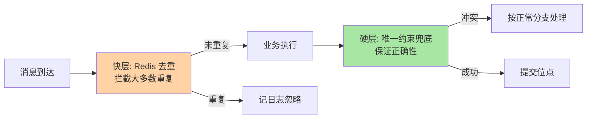

# 消费模式与幂等：重复投递世界的生存法则

> 一句话：事件通道的投递语义里没有「恰好一次」的免费午餐——工程上只有「至少一次 + 幂等消费」这一条主路。把「消息会重复、消费会失败、顺序不可控」当成默认前提，消费端设计就不会踩坑。

## 🎯 本文核心

**核心一句话：投递语义是通道与消费端的分工——通道用位点提交保证「至少一次」，业务用幂等把「重复到达」消化成「只生效一次」。幂等不是可选优化，是事件驱动消费端的第一设计义务；幂等键的选择（业务唯一键，而非消息 ID）决定这套防御的真实强度。**

## 一句话摘要

消费语义有三档：至多一次（先提交位点再处理，快但会丢）、至少一次（先处理后提交，不丢但会重）、精确一次（严格不重不丢）。工程主流是至少一次——因为它把「不丢」这个不可妥协的性质交给通道，把「去重」这个业务相关的问题交给消费端，即幂等设计。幂等的三种实现：唯一约束兜底（数据库唯一键拒绝重复插入）、状态机幂等（只允许合法状态流转）、去重表/幂等键存储（处理前查重）。选型的核心是幂等键：必须用业务唯一键（订单号、流水号），消息 ID 只能防通道层重发、防不了生产端重发。

## 5W 速记卡

| 维度 | 一句话 |
|---|---|
| What | 消费语义三档（至多/至少/精确一次）+ 消费端幂等去重 |
| Why | 通道只能保证不丢，重复不可避免；幂等让重复无害化 |
| When | 所有事件消费端默认必配；重试、rebalance、重发都会触发重复 |
| Where | 幂等键生成在生产端，去重执行在消费端 |
| How | 唯一约束 / 状态机 / 去重表三种实现按业务形态选 |

## 一、三种消费语义：各自的真实含义

**至多一次（At-most-once）**：先提交位点再处理。通道压力最小，但处理中途崩溃就丢消息——只适用于「丢几条无所谓」的监控埋点类场景。

**至少一次（At-least-once）**：先处理再提交位点。处理成功但提交前崩溃，重启后重处理——消息可能重复，但绝不丢。工程主路：**「不丢」由通道语义保证，「不重」由业务幂等保证**。

**精确一次（Exactly-once）**：严格意义上的精确一次只在「消费-处理-提交」能在同一事务边界内完成时成立（如 Kafka Streams 的读写同事务、Flink 的两阶段提交）。跨系统（消费 MQ + 写 MySQL + 调外部服务）没有免费的事务边界，讨论精确一次没有工程意义——落回「至少一次 + 幂等」。

## 二、幂等设计三种实现

### 2.1 唯一约束兜底

最硬的一种：业务唯一键作为数据库唯一索引，重复插入直接失败、事务回滚。适合「插入型」业务（流水、事件表）。特点是零额外组件、强保证，代价是重复到达会以异常形式冒出来，消费代码要把它当「正常分支」处理而不是错误。

### 2.2 状态机幂等

状态型业务天然幂等：订单状态只允许合法流转（待支付→已支付→已发货），重复的「已支付」事件到达时状态已在「已支付」，流转条件不满足直接忽略。适合单据类核心域，特点是把幂等和业务规则合一，代价是状态流转逻辑要写得严谨（非法流转要显式忽略而非报错）。

### 2.3 去重表 / 幂等键存储

处理前先查重（Redis SETNX 或去重表插入），没处理过才执行。最通用，适合「外部调用型」消费（发短信、调第三方）——这类操作没有数据库唯一键可依托。关键坑：**查重与执行不是原子的**——执行成功但去重记录写入失败，下一条重复就穿透了。工程做法是「先记去重键（状态=处理中）→ 执行 → 更新终态」，配合超时兜底。

## 三、幂等键：这套防御的真实强度

幂等键选错，三种实现全部白搭：

- **业务唯一键**（订单号、支付流水号）：正确选择——生产端重发、通道重投、消费重试全覆盖
- **消息 ID**：只覆盖通道层重投。生产端超时重发会生成新消息 ID，同一笔业务两条不同 ID 的消息双双穿透
- **时间戳/随机数**：等于没有幂等

一条纪律：**幂等键在业务动作开始时生成、全生命周期不变，并随事件一起发布**——它是业务世界的身份证，不是技术世界的会话标识。

## 四、消费端另外两件事：重试与 Rebalance

**重试**：处理失败按退避策略重试（如 10s/30s/1min/5min 递增），若干次仍失败进死信（篇 6 展开）。幂等保证下重试是安全的——这正是先建幂等再谈重试的原因。

**Rebalance（再均衡）**：消费者上下线时分区重新分配。分配切换的瞬间可能出现「旧消费者没提交完、新消费者从旧位点重消费」——又一处重复来源。Rebalance 风暴（频繁上下线导致消费停滞）靠合理设置会话超时与最大暂停时长治理，但重复无法根除，依旧回归幂等。

消费端处理流程与防御纵深：

## 五、误区与不适用

- ❌ **「配置了精确一次就不用幂等」**：通道内精确一次覆盖不到你的数据库和外部服务，跨系统边界只有幂等能救
- ❌ **「去重表加了就万事大吉」**：查重与执行的原子性缺口、去重键的过期时间（太短会重复、太长堆积）都是要回答的问题
- ❌ **「幂等键用消息 ID」**：防不住生产端重发，是最常见的伪防御
- ❌ **「把重试关掉就没有重复」**：不重试确实少了重复源，但消息处理失败就只有死信一条路——用「丢处理」换「无重复」得不偿失

## 六、追问链：把「幂等」问穿一层

- **追问一：唯一约束和去重表都在数据库，Redis 做去重行不行？**——行但要回答两个问题：Redis 与数据库的一致性（去重成功但业务事务回滚，重试会被误拦）和 Redis 故障时的降级（去重不可用时放行还是拒绝）。工程折中：Redis 做第一道快速过滤，数据库唯一约束做最终兜底——**快层拦大多数，硬层保正确性**。
- **再追问：幂等键冲突但业务其实该执行（两笔不同单同流水号）怎么办？**——说明键的生成规则有缺陷，这是键设计问题不是幂等问题。幂等键必须是业务语义上的全局唯一（单号带业务前缀 + 雪花序列），冲突本身是告警信号而不是需要「绕过」的障碍。
- **打破砂锅：能不能在生产端保证不重发，消费端就不用幂等了？**——不能。生产端超时重发可以收敛（幂等生产者），但「生产成功、确认丢失」这条路径物理上消不掉；网络分区下「不知道对方收没收到」是无解命题。**重复是分布式的事实，幂等是工程的态度。**

## 七、实践叙事：积分加了两次

某营销系统消费「订单已支付」事件加积分，上线三周后财务对账发现约千分之一的用户积分虚高。排查：无发版、无故障——重复来自消费者滚动发布时的 Rebalance：旧实例处理完加积分但位点提交在重启时失败，新实例从旧位点重新消费。而消费端「先查 Redis 去重再执行」的防御，恰在发布窗口因 Redis 抖动降级放行了。修复三步：积分流水表加订单号唯一索引（数据库硬兜底）；Redis 降级时改为拒绝消费（fail-safe 而非 fail-open）；Rebalance 期间位点提交策略改为处理即同步提交。**复盘沉淀：幂等要按「防御纵深」设计——快层（缓存）降性能成本，硬层（唯一约束）保正确性，任何一层降级都不能放行。**

## 八、设计思想：为什么「至少一次 + 幂等」能成为工业标准

这个组合的聪明处在于**按能力边界分工**：通道天然擅长「不丢」（持久化 + 副本 + 位点），不擅长「不重」（分布式下「确认丢失」无解）；业务天然知道「什么算重复」（有唯一业务键），而通道对此一无所知。让擅长不丢的保不丢、知道重复的管重复，各取所长。追求通道层精确一次，本质是让通道去管它理解不了的业务语义——方向错了。这个「语义归属」的设计思想，在分布式架构里反复出现：锁归协调服务、幂等归业务、路由归网关。

## 你们可能会问

**Q1：Redis 挂了，去重失效，该放行还是拒绝？**
按业务分级：资损类（资金、权益）必须拒绝（fail-safe），宁可堆积不可重复；体验类（通知、缓存刷新）可放行，靠下游天然幂等或对账兜底。方向选错（该拒绝的放行）是这个故障场景里最常见的资损根因。

**Q2：消费逻辑改了要重新消费历史事件，幂等怎么办？**
为重放任务单独设计幂等键版本（如幂等键加处理版本号），或走「新消费组 + 新幂等空间」隔离——绝不能复用线上幂等空间，否则历史去重记录会把重放全部拦掉。

**Q3：幂等和去重是一回事吗？**
不完全是。去重是「重复的消息只处理一次」（防御重复投递），幂等是「同一操作执行多次效果与一次相同」（更强的性质）。状态机幂等不需要去重表也天然幂等；反过来去重表挡不住「不同消息、相同业务效果」的重复。

## 九、与投递语义、事务消息的区别辨析

| 维度 | 投递语义 | 事务消息 | 幂等消费 |
|---|---|---|---|
| 解决什么 | 通道到消费端的送达保证 | 「本地事务 + 发消息」的原子性 | 重复消息只生效一次 |
| 责任方 | 通道 + 位点策略 | 生产端 + 通道（半消息/回查） | 消费端业务 |
| 典型误用 | 当成跨系统精确一次 | 当成分布式事务全家桶 | 幂等键用消息 ID |

三者是链条上的三环：事务消息保证「发得出去且和本地事务一致」，投递语义保证「送得到」，幂等保证「重复无害」。缺哪环都通不了，混为一谈就配不对。

## 十、典型使用场景

- **支付回调消费**：第三方支付重复通知是常态，按支付流水号做唯一约束幂等
- **积分/权益发放**：按业务单号幂等 + 流水表唯一索引，财务口径绝不能重
- **缓存刷新消费**：天然幂等（覆盖写），重点在乱序防护（版本号）而非去重
- **外部通知类消费**（短信/推送）：去重表 + 时间窗，重复打扰比漏发更伤口碑

## 十一、什么时候用 / 不用

- ✅ 必配：所有「至少一次」通道的消费端——这是默认前提不是可选项
- ✅ 重点加固：资金、权益、库存类消费（重复 = 资损）
- ❌ 无需去重：天然幂等操作（覆盖写缓存、SET 类状态上报）——加了反而多一套要维护的状态
- ❌ 不要用「精确一次」配置替代业务幂等：跨系统边界它覆盖不到

### 量级视角一句话

十万级 QPS 以下的消费端，数据库唯一约束一层就够；百万级开始去重必须前移到缓存层（数据库扛不住全量查重流量）；千万级、亿级入口上，去重层的自身容量与降级策略成为独立的设计对象——**量级决定防御纵深放几层、放哪里**。

## Trade-off：幂等的成本分布

幂等不是免费的：唯一约束多一次索引维护、去重表多一次读写、状态机要求状态设计严谨。收益是消费端的「可重试性」——整条链路的容错弹性都建立在「重复无害」之上。**幂等的投入要按「重复的代价」分级**：资损类（资金权益）上全量纵深防御；体验类（通知）上轻量去重；纯缓存类不加。一刀切全配，成本会悄悄吃掉事件驱动换来的简洁。

## 开放问题

- 消费框架正在把幂等下沉为声明式能力（注解 + 自动去重），「业务只写幂等键生成规则」的形态在成熟
- Exactly-once 语义在流处理引擎内持续强化，但跨系统边界仍是幂等的领地——这条边界短期内不会移动

## 💡 实战提示

- 💡 幂等键 = 业务唯一键，随事件发布、全生命周期不变——消息 ID 不是幂等键
- 💡 防御纵深：缓存快层 + 数据库唯一约束硬层，任何一层降级必须 fail-safe（拒绝）而非放行
- 💡 重复率异常升高时先查 Rebalance 频率与发布窗口，再查业务逻辑
- 💡 重复到达在消费代码里是正常分支（记日志/忽略），不是异常分支

## 自测三问

1. 为什么工程主流是「至少一次 + 幂等」而不是追求精确一次？
2. 幂等键为什么不能用消息 ID？什么场景会穿透？
3. 去重表方案的原子性缺口在哪？怎么补？

## 🎯 核心带走

- **核心一句话**：通道保不丢（位点 + 至少一次），业务保不重（幂等）——重复是分布式的事实，幂等是工程的态度
- **三实现**：唯一约束（最硬）、状态机（业务合一）、去重表（最通用但有原子性缺口）
- **幂等键纪律**：业务唯一键、生产时生成、随事件发布、终身不变
- **哪里会坏**：消息 ID 当幂等键、Redis 降级放行、Rebalance 窗口的位点回退
- **边界**：跨系统没有精确一次；防御纵深按「重复的代价」分级投入

## 📌 数据与事实声明

- 写于 2026-09-15；投递语义与 Rebalance 行为以 Kafka/RocketMQ 官方文档公开口径为准
- 实践叙事为业内高频幂等缺陷模式的匿名化叙事，非特定公司事件
- 免责：组件语义随版本演进，以官方文档为准

## 📚 参考资料

| 类型 | 标题 | 来源 |
|---|---|---|
| 官方文档 | Kafka Consumer 位点与语义 | kafka.apache.org |
| 官方文档 | RocketMQ 重试与死信 | rocketmq.apache.org |
| 系列导航 | 事件驱动系列目录 | `docs/architecture/event-driven/index.md` |
