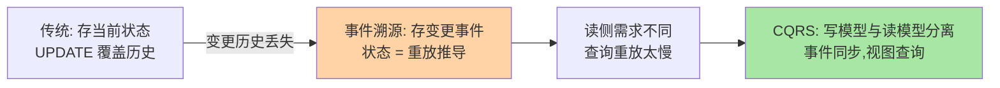
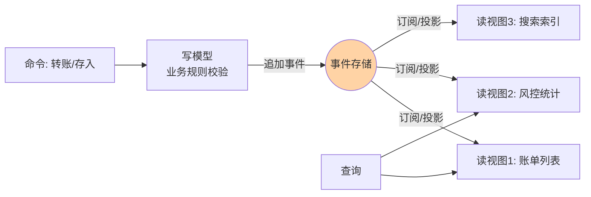

# 事件溯源与 CQRS 入门：当事件从「通知」变成「数据」

> 一句话：事件溯源（Event Sourcing）把「事件只是通知」升级成「事件就是数据的唯一事实源」——状态不再被存储，而是由事件流重放推导；CQRS 则顺着这条线把写模型和读模型拆开，让「怎么写」和「怎么查」各自进化。

## 🎯 本文核心

**核心一句话：事件溯源把存储单元从「当前状态的快照」换成「导致状态的全部变更事件」——当前状态成了可以随时重算的推导结果，换来完整的历史可回溯与时间旅行能力；CQRS 配合它把读侧从写侧解放，代价是架构复杂度陡增。两者都是重架构决策，先确认业务真需要「历史即数据」，再考虑采用。**

## 一句话摘要

事件溯源（Event Sourcing）：不存储对象的当前状态，只追加存储改变状态的事件（账户开户、存入 100、取出 30）；当前余额由重放全部事件推导而来。它给了系统三样传统 CRUD 没有的东西：完整历史（天然审计）、时间旅行（重放到任意时点）、天然适配协作写（并发冲突用乐观并发处理）。CQRS（Command Query Responsibility Segregation，命令查询职责分离）：写模型负责业务规则与事件产出，读模型按查询形态建物化视图，事件作为两侧的同步管道。两者常搭配出现但相互独立——CQRS 可以不用事件溯源，事件溯源也可以不拆读侧。

## 5W 速记卡

| 维度 | 一句话 |
|---|---|
| What | 只存变更事件，状态由重放推导；读写模型分离，事件做同步 |
| Why | 历史即数据：审计、回溯、调试、时点重建；读写各自扩展 |
| When | 强审计领域（账务/风控/交易）、协作编辑、需要时点查询 |
| Where | 事件存储（Event Store）为核心组件；读侧物化视图按需建 |
| How | 写命令 → 校验 → 追加事件 → 投递 → 读侧投影更新 |

## 一、为什么要把事件当数据：传统存储丢了什么

传统 CRUD 只留「当前值」：账户余额被 UPDATE 覆盖后，「这 5000 块是怎么来的」永远查不到了。业务问三个问题，传统存储都答不了：这笔余额怎么算出来的（过程）？上周三账户是什么状态（时点）？谁在什么时候改了什么（变更史）？——答案只能去日志和应用层考古，拼不完整。

事件溯源把这三个问题变成存储的原生能力：余额 = 事件流归约的结果，「上周三的余额」= 重放到上周三为止。**存储的事实从「结论」前移到「论据」**——这是范式转变，不只是存储格式变化。

## 二、事件溯源的核心机制三件事

### 2.1 聚合根与事件流

事件按聚合根（Aggregate，如「账户 A」）组织成流：同一聚合的事件构成一条有序日志，事务边界 = 单聚合内的事件追加。跨聚合的业务规则（转账）用「先校验源聚合、再追加双方事件」的最终一致模式处理——这是事件溯源里第一个要接受的心智转换：**强一致被限制在聚合内，聚合之间天然最终一致**。

### 2.2 乐观并发与期望版本

并发修改同一聚合靠「期望版本」防冲突：追加事件时声明「我是基于版本 7 改的」，若存储里已是版本 9 则拒绝——冲突由调用方重试或走业务仲裁。相比行锁，乐观并发让协作写（同一文档多人编辑、同一账户高频操作）不被长事务锁死。

### 2.3 快照（Snapshot）

重放全部事件在事件量小的时候没问题，事件到了千万条量级重放就是分钟级——快照定期把「到版本 N 为止的状态」存下来，重放从最近快照开始。快照是纯性能优化，不影响正确性；**先有事件流，再谈快照，顺序不能反**。

## 三、CQRS：把「怎么写」和「怎么查」拆开

写模型关心业务不变量（余额不能为负），读模型关心查询形态（账单列表、统计报表）。两者对数据结构的诉求天生不同：写侧要规范化、少冗余；读侧要反规范化、查询零拼接。CQRS 用事件把两侧连起来：

读视图是事件的「投影」（Projection）：按查询需要物化成表、文档、缓存。视图可以随时删掉重建（从事件流重新投影）——**读侧不再是需要小心翼翼维护的资产，而是可再生的派生物**。

## 四、典型使用场景

- **账务与交易系统**：每笔资金变动都是事件，审计、对账、争议回溯全部原生支持
- **协作编辑**：多人同时改同一文档，事件 + 乐观并发代替悲观锁
- **风控与合规**：监管要「完整还原当时决策依据」，事件流即完整证据链
- **复杂查询报表**：写侧单据规范化存储，读侧按报表形态建投影，互不拖累

## 五、误区与不适用

- ❌ **「事件溯源 = 存消息到 MQ」**：事件存储是按聚合组织的有序日志 + 并发控制 + 投影订阅，MQ 只解决了传输；用 Topic 当 Event Store，聚合事务和期望版本都无处安放
- ❌ **「所有系统都该事件溯源」**：查询为主、规则简单的系统（内容展示、配置管理）套上事件溯源是纯负重——它服务的是「历史有价值」的领域
- ❌ **「事件结构可以随便改」**：事件是不可变历史，schema 演进要用「升级函数」（旧事件读到新代码时转换）或版本并存——改历史等于造假
- ❌ **「CQRS 就是读写分离数据库」**：主从读写分离是同一份数据的访问扩展；CQRS 是两套模型各自设计、事件同步——维度完全不同

## 六、追问链：把「状态由重放推导」问穿一层

- **追问一：业务规则变了，重放结果不就变了吗？**——对，这是事件溯源最深的坑：事件流重放必须「以当时规则解释当时事件」。工程做法是版本化事件 + 惰性升级（读取时转换），或者接受「重放结果随规则演进」并把它定义为特性（重算报表用新规则）而非缺陷——**但要团队显式做出这个决定，不能含糊**。
- **再追问：外部系统的副作用怎么重放？重放会把钱再扣一次吗？**——重放只重建内存/存储状态，绝不重触发副作用：扣款指令的「已发送」本身也是一条事件，重放时读到「已发送」就直接跳过执行。副作用事件化是配套纪律，漏了就是资损事故。
- **打破砂锅：查询也要实时，投影延迟扛不住怎么办？**——读模型 lag 是 CQRS 的固有代价。分层兜：实时性要求高的查询直接读写模型（允许），报表类接受秒级 lag；UI 上明确「处理后稍等刷新」。追求「读写强一致 + 复杂查询」等于既要又要，那不如不拆 CQRS。

## 七、实践叙事：一次争议交易的十分钟还原

某支付平台处理一笔「用户称未到账」的争议，传统排查要在应用日志、数据库 binlog、网关日志间人工拼时间线，平均半天。该平台账务域改造事件溯源后：按账户聚合拉出完整事件流，十分钟内还原「请求到达 → 风控校验 → 扣款事件 → 银行通道指令 → 通道回执」每一环的时点与内容，定位到通道回执丢失、重查后补单。**复盘沉淀了两条：①历史即数据的直接收益是争议处理时长量级下降；②事件流同时也是最好的故障现场——事后追责变回事前留证。** 同场发现的短板：投影服务 lag 未暴露成指标，账单页偶尔显示旧值被当成了「未到账」的一部分——CQRS 的读侧可观测性和写侧同样重要。

## 八、设计思想：为什么「不可变事实」是可靠的底座

事件溯源的可靠性来自把可变性从系统里挤出去：可变状态是 bug 的温床（并发覆盖、非法流转、历史不可考），而追加式不可变日志只有一种操作（append），并发语义简单、出错模式有限。加上「状态可重算」，整个系统获得了自证能力——任何时刻的任何状态都能从事实重新推导验证。这与账本复式记账、区块链账本同源：**不可变事实 + 推导状态，是「可审计」的最低成本实现**。代价则是读写两侧的心智负担与基础设施投入——范式收益是否覆盖成本，取决于业务历史的价值密度。

## 九、与 CRUD、读写分离的区别辨析

| 维度 | 传统 CRUD | 主从读写分离 | 事件溯源 + CQRS |
|---|---|---|---|
| 存储内容 | 当前状态 | 当前状态（副本） | 变更事件（状态推导） |
| 历史 | 丢失 | 丢失 | 原生完整 |
| 读侧 | 与写同库同模型 | 同模型副本 | 独立投影模型 |
| 一致性 | 强一致 | 主从延迟 | 聚合内强、跨聚合最终 |
| 适用 | 一般业务 | 读多写少的访问扩展 | 强审计/协作写/复杂查询域 |

判别问题只有一个：**「状态是怎么来的」这个问题对业务值多少钱**——值钱到值得为它建事件存储，才用事件溯源；否则 CRUD 足够好。

## 你们可能会问

**Q1：事件存储用什么实现？MySQL 行不行？**
行。业务事件表（按聚合 ID + 版本号唯一）+ 事务追加，是大多数团队事件溯源的起步形态；规模到了（单聚合流超千万事件、并发冲突高）再考虑专用 Event Store。先有范式落地，再谈存储升级。

**Q2：投影和缓存有什么区别？**
缓存是同一份数据的加速副本（失效回源），投影是按查询形态重新组织的数据（没有「源查询」可回——账单统计视图的源就是事件流本身）。缓存失效是事故，投影重建是日常操作——心智完全不同。

**Q3：事件溯源后还要不要建当前状态表？**
读侧投影本质上就是「当前状态表」，只是它被定义为可再生的派生物。可以保留物化的当前状态投影供高频点查——只要承认它是推导结果而非事实源，用完可重建。

## 十、什么时候用 / 不用

- ✅ 用：账务、交易、风控等强审计域——历史即合规资产
- ✅ 用：协作编辑、高频并发写同一对象——乐观并发优于行锁
- ✅ 用：查询形态多样的复杂域——投影让读侧自由生长
- ❌ 不用：简单 CRUD（配置、内容展示）——复杂度收不回
- ❌ 不用：团队对最终一致没有共识、没有对账与补偿经验——先在通知型事件上练手

## Trade-off：能力与复杂度的交换

事件溯源 + CQRS 拿到的三张牌（完整历史、时点重建、读写自由）都以复杂度支付：事件 schema 治理升级为版本化演进、投影滞后需要显式管理、团队全员要建立「事件即事实」的心智。**这套范式的合理入场时机是「业务历史的价值密度」高到值得养基础设施**——账务、交易域天然达标；普通业务域用「通知型事件 + 业务事件表」的低配形态就够，不必一步到位。

## 开放问题

- 专用事件存储产品（EventStoreDB 等）与「数据库事件表 + MQ」的自建形态在竞争，托管化在降低入场成本
- 投影的实时化（CDC 直连 binlog 与事件流融合）让读侧 lag 持续压缩，「读写一体」的体验差距在收窄

## 💡 实战提示

- 💡 聚合设计先于技术选型：聚合切大了并发冲突频繁，切小了跨聚合最终一致链变长——按业务不变量划聚合
- 💡 副作用必须事件化（「指令已发送」也是事件），重放时跳过已执行副作用——这是资损防线
- 💡 快照是性能件不是正确性件，先跑通事件流再加快照
- 💡 投影 lag 必须做成指标并告警——读侧旧值是 CQRS 最常见的「事故现场」

## 自测三问

1. 事件溯源里「状态」和「事件」的关系是什么？快照改变这个关系吗？
2. 重放为什么不会重触发外部副作用？
3. CQRS 与主从读写分离的本质区别是什么？

## 🎯 核心带走

- **核心一句话**：事件溯源 = 只存事实、状态重放；CQRS = 读写各建模型、事件同步——历史即数据，投影可再生
- **三机制**：聚合流 + 期望版本 + 快照（纯性能）
- **哪里会坏**：规则变更污染重放、副作用重触发、投影 lag 无感知
- **边界**：聚合内强一致、跨聚合最终一致；历史价值密度决定入场时机
- **一步走法**：通知型事件练手 → 业务事件表过渡 → 专用事件存储，不跳级

## 📌 数据与事实声明

- 写于 2026-09-15；事件溯源与 CQRS 概念以 Martin Fowler 定义、EventStoreDB 官方文档公开口径为准
- 实践叙事为业内高频架构改造模式的匿名化叙事，非特定公司事件
- 免责：具体组件能力随版本演进，以官方文档为准

## 📚 参考资料

| 类型 | 标题 | 来源 |
|---|---|---|
| 经典文章 | Martin Fowler: Event Sourcing / CQRS | martinfowler.com |
| 官方文档 | EventStoreDB 文档 | eventstore.com |
| 系列导航 | 事件驱动系列目录 | `docs/architecture/event-driven/index.md` |
