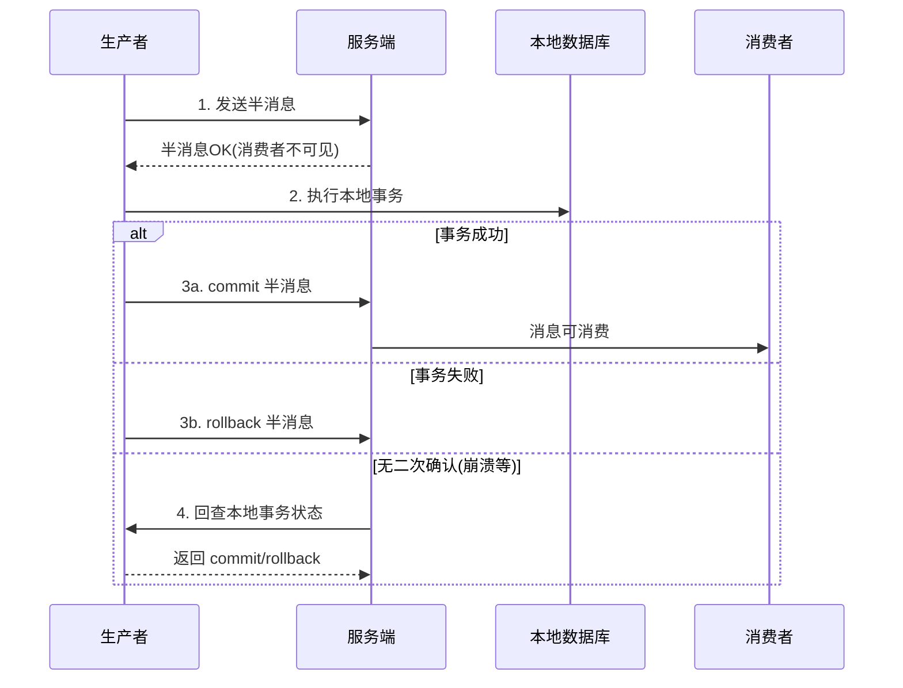

# 事务消息与最终一致性：本地事务和发消息的原子性

> 一句话：事务消息解决一个精确的问题——「本地事务成功了，消息却没发出去」的分裂状态。它用半消息 + 回查两步，把「写库」和「发事件」焊在同一事务语义里，是事件驱动落地强一致起点（本地事务）之后的第一道桥。

## 🎯 本文核心

**核心一句话：跨系统的原子性不存在，但「本地事务 + 消息投递」可以伪装成原子——先发半消息（对消费者不可见）、执行本地事务、提交半消息；提交动作丢了就靠服务端回查兜底。最终一致性的全部工程，就是把「不一致的中间态」控制到可检测、可修复。**

## 一句话摘要

事务消息（以 RocketMQ 为代表）解决「本地操作与消息发送」的一致性：生产者先向服务端发送半消息（Half Message，消费者不可见），再执行本地事务；成功则提交半消息（消息转为可消费），失败则回滚删除；若服务端长时间未收到二次确认，主动回查生产者的本地事务状态，按查询结果决定提交或回滚。它不提供跨系统的分布式事务，只保证「本地事务的成败」与「消息是否投出」不分裂；下游消费失败的重试、幂等，由消费端语义承担。最终一致性指：系统在中间态允许短暂不一致，但通过重试、对账、补偿，保证在没有新变更的情况下最终收敛到一致。

## 5W 速记卡

| 维度 | 一句话 |
|---|---|
| What | 半消息 → 本地事务 → 提交/回滚 → 超时回查，四步保「写库与发消息」不分裂 |
| Why | 先写后发会丢消息，先发后写会有「幽灵消息」，两步分开必然有中间态 |
| When | 事件驱动的写入口：本地事务完成即广播事实，如订单落库后发「已创建」 |
| Where | 生产端 + 服务端协作；消费端照常幂等消费 |
| How | 事务监听器实现 executeLocalTransaction + checkLocalTransaction |

## 一、为什么需要它：两条路都有坑

**先写库、后发消息**：写库成功后进程崩溃，消息没发出去——下游永远不知道这单存在，数据分裂。**先发消息、后写库**：消息发出去、写库失败——下游消费了一条「不存在的事实」，幽灵数据。**写库与发送包在一个分布式事务（XA/TCC）里**：能解，但复杂度与性能代价大，事件驱动场景杀鸡用牛刀。

事务消息的洞察：把「消息可不可见」延迟到「本地事务有了结论」之后——半消息就是「待生效」状态；结论丢失时（生产者提交前崩溃），服务端回查补结论。**一致性不需要三方协调，只需要「结论可查询」**。

## 二、四步机制逐个看

三个工程要点：①回查接口的本质是「本地事务结论的可查询化」——业务要能按业务键查到「这笔到底成没成」，通常用事务记录表实现；②回查有次数与间隔上限，超限后半消息被丢弃（丢弃即回滚语义），业务要靠对账兜住；③消费者侧与普通消息无异——重试、幂等一个不少，事务消息只管上半场。

## 三、最终一致性的工程拼图

事务消息只是起点，完整拼图五块：①可靠投递（事务消息/本地消息表）保证事实发得出去；②消费重试保证偶尔失败能自愈；③幂等消费保证重复无害；④死信与人工干预兜住反复失败；⑤**对账系统作为最后防线**，定时比对事实源与下游状态、自动或人工修复差异。前四块靠组件，第五块靠自己建——**没有对账的最终一致性是信仰，有对账的才是工程**。

## 四、典型使用场景

- **订单创建广播**：订单落库（本地事务）后发布「订单已创建」，下游发货/积分/风控各自消费
- **账户余额变更**：余额扣减与「余额已变更」事件同生共死，下游缓存/账单各自同步
- **跨库单据同步**：单据在主库落定后事件化分发到 ES、缓存等异构存储
- **不适用**：需要「多系统全部成功或全部失败」的强一致场景（如跨行转账两侧同时入账）——那是分布式事务（TCC/Saga）的领地，事件驱动给的是最终一致

## 五、误区与不适用

- ❌ **「事务消息 = 分布式事务」**：它只保证「本地事务 + 消息投出」不分裂；下游消费失败它不回滚上游——半场原子性，不是 ACID
- ❌ **「有了事务消息就不用对账」**：回查有上限、丢弃有语义、消费有死信——对账是唯一能发现「所有机制都漏掉的那一小撮」的手段
- ❌ **「本地消息表过时了」**：事务消息依赖特定 MQ 的支持；用不支持事务消息的组件时，「业务表 + 消息表同库同事务 + 定时投递」的本地消息表模式依然是通用解——两者是同一思想的两种载体
- ❌ **「回查接口随便实现」**：回查必须查「事实」（事务记录表），不能查「内存状态」——回查发生在生产者重启之后，内存早已不在

## 六、追问链：把「半消息」问穿一层

- **追问一：本地事务成功、commit 请求网络丢失，消费者等多久？**——等到回查周期触发（秒级到分钟级，业内常见配置），期间消息不可见但已持久化。业务感知是「下游处理延迟一个回查周期」——对延迟敏感的场景要调回查间隔，并接受「提交丢一次 = 延迟一次」的抖动。
- **再追问：回查也一直失败（生产者实例没了）怎么办？**——回查按实例路由失败会重试其他实例，最终超限丢弃；若本地事务实际成功而消息被丢，就是数据分裂——这正是对账存在的理由。**事务消息把分裂概率从「常见」压到「罕见」，但压不到零。**
- **打破砂锅：为什么不干脆把「要发的事件」和「业务数据」存一个库，彻底不依赖回查？**——可以，这就是本地消息表/事件表模式：事件与业务同库同事务，必然一致；代价是数据库承担事件存储职责、投递靠定时任务拉取（延迟从毫秒级变秒级）。事务消息换来低延迟，本地消息表换来零依赖——按架构现状选，思想是同一个。

## 七、实践叙事：一次「订单已支付但下游全不知道」的故障

某系统用「先落库、后发消息」的朴素写法，某日 MQ 集群发布变更网络抖动，发送失败重试三次后放弃——订单状态是「已支付」，下游发货服务毫无感知，积累了几百个「静默订单」。发现靠的是隔天对账（订单库与发货库比对）。修复三步：接入事务消息（半消息保投递）；存量静默订单用对账任务补发；建「两库差异」监控从隔天对账升级为小时级。**复盘沉淀：①发送失败重试三次就放弃是伪可靠——重试解决抖动，解决不了「发送与落库的时序」，要用机制不能用次数；②对账不是兜底装饰，是最终一致性的组成部件。**

## 八、设计思想：为什么「可查询的结论」胜过「三方协调」

分布式事务（2PC）用协调者强制所有参与方同步等待结论——一致性强，但阻塞与单点让它在高并发事件场景水土不服。事务消息的思路是把「结论」变成可重试获取的资源：不追求「当场全体一致」，追求「结论最终可查、消息最终可达」。这背后的设计哲学是**把一致性从「时刻属性」改成「收敛属性」**——放宽到最终一致后，系统获得了异步化与可用性，代价是消费端必须建幂等与补偿能力。这套「用可检测的中间态换可用性」的思想，是事件驱动架构能与强一致系统共存的基础。

## 九、你们可能会问

**Q1：Kafka 没有事务消息，怎么实现同样效果？**
两条路：本地消息表（事件表与业务表同库事务，定时任务扫描投递到 Kafka，投递成功标记）——通用且零依赖；或 Kafka 事务 API——但它保证的是「Kafka 内部多分区写的原子性」，与本地数据库仍是两个系统，跨界还是要靠消息表思想。

**Q2：消费失败把事务消息回滚行不行？**
不行。半消息的 commit/rollback 表达的是「生产端本地事务的结论」，与消费端成败无关；消费失败走重试与死信。把消费语义混进事务消息，等于让上游回滚已经成立的业务事实。

**Q3：回查接口必须幂等吗？**
必须。回查会被多次触发（网络抖动、超时重查），实现要纯查询无副作用——只读事务记录表返回结论，不做任何写操作。

## 十、与分布式事务（TCC/Saga）的区别辨析

| 维度 | 事务消息 | TCC/Saga |
|---|---|---|
| 一致性目标 | 本地事务 + 消息投递不分裂 | 多个参与方业务上的成套成功/成套补偿 |
| 一致性强度 | 最终一致（单向事实） | 最终一致（双向协调） |
| 侵入性 | 低（一个监听器） | 高（每个参与方写 Try/Confirm/Cancel 或补偿逻辑） |
| 典型场景 | 事件广播、异构同步 | 跨服务资金操作、成套资源变更 |

判别：只需要「事实出去」，事务消息；需要「多方一起成功或一起撤销」，分布式事务。事件驱动架构里前者是日常，后者是特例。

## 十一、什么时候用 / 不用

- ✅ 用：所有「本地事务完成即广播」的事件写入口——标准姿势
- ✅ 用：不支持事务消息的组件上，用本地消息表实现同一思想
- ❌ 不用：纯下游通知（上游没有本地事务诉求）——普通消息足够
- ❌ 不用：多参与方强一致诉求——转分布式事务选型，别硬拧
- ❌ 不用：消费者处理逻辑本身强依赖「上游实时回滚能力」——语义错位，重新设计

### 量级视角一句话

十万级 QPS 以下、单一 MQ 组件，事务消息开箱即用最省心；百万级入口上回查流量与事务记录表的写入成为新的热区，事务记录表要独立容量规划；千万级、亿级量级上，对账本身成为大数据任务（T+1 全量 + 小时级增量），一致性体系从「组件配置」升级为「独立数据链路」。

## Trade-off：延迟、依赖与可靠性的三角

事务消息用「一个回查机制 + 一张事务记录表」的成本，换「投递与落库不分裂」的确定性；相比本地消息表，投递延迟从秒级降到毫秒级，代价是绑定支持该能力的 MQ 组件。**选型的天平在「延迟敏感度」与「组件依赖度」之间**——两者都不极致时，本地消息表的零依赖往往更稳；大流量入口则事务消息的延迟优势实打实。

## 开放问题

- 事务消息能力正在被多家 MQ 吸收为标准特性，跨组件迁移成本在下降
- CDC（变更数据捕获）路线（binlog 即事件）绕开应用层双写，与事务消息在「事实源头」上竞争，两者最终一致语义相同、时效与侵入度不同

## 💡 实战提示

- 💡 回查接口 = 查事务记录表，纯查询、无副作用、可重复触发
- 💡 没有对账体系的最终一致性不上生产——对账是部件不是装饰
- 💡 消费端幂等照常配齐：事务消息只管上半场，重复投递下半场照样发生
- 💡 回查超限的丢弃要监控告警——那是「可能的数据分裂」信号

## 自测三问

1. 半消息解决「先写后发」「先发后写」各自的什么坑？
2. 回查接口的实现纪律是什么？为什么不能查内存？
3. 事务消息与本地消息表是同一思想的什么两种形态？怎么选？

## 🎯 核心带走

- **核心一句话**：事务消息 = 半消息延迟可见 + 结论可查询——把「写库与发消息」焊进一个事务语义，最终一致的第一块拼图
- **四步**：半消息 → 本地事务 → commit/rollback → 超时回查
- **拼图**：可靠投递 + 重试 + 幂等 + 死信 + 对账，缺对账不成体系
- **哪里会坏**：回查查内存、把消费失败混进事务语义、回查超限无监控
- **边界**：它是半场原子性，不是分布式事务；多方成套成败找 TCC/Saga

## 📌 数据与事实声明

- 写于 2026-09-15；事务消息机制以 RocketMQ 官方文档公开口径为准；回查间隔/上限为可配置项，业内常见秒级到分钟级
- 实践叙事为业内高频一致性缺陷模式的匿名化叙事，非特定公司事件
- 免责：组件能力随版本演进，以官方文档为准

## 📚 参考资料

| 类型 | 标题 | 来源 |
|---|---|---|
| 官方文档 | RocketMQ 事务消息 | rocketmq.apache.org |
| 经典模式 | 本地消息表 / Transactional Outbox | microservices.io 公开模式库 |
| 系列导航 | 事件驱动系列目录 | `docs/architecture/event-driven/index.md` |
