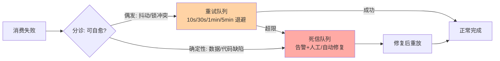
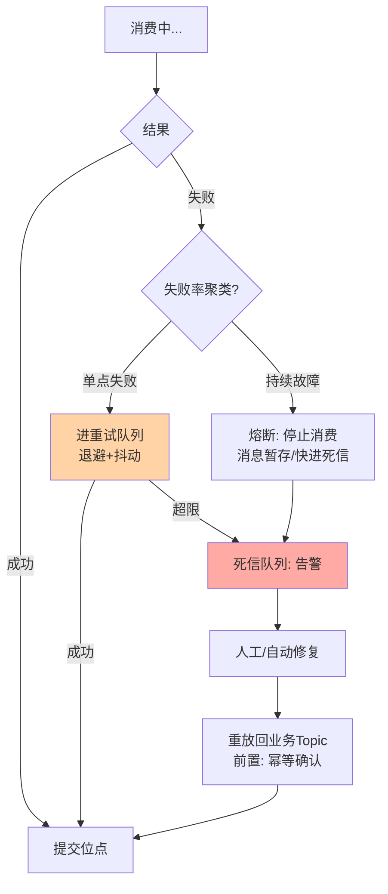

# 死信与重试：消费失败的最后防线

> 一句话：重试是给「偶发失败」的自愈通道，死信是给「反复失败」的人工入口——两者组合成消费失败的完整处置链。没有死信的重试是无限循环，没有重试的死信是秒级放弃，配齐了才叫防线。

## 🎯 本文核心

**核心一句话：消费失败分两种病、两种药——偶发失败（网络抖动、锁冲突）用带退避的自动重试自愈；确定性失败（数据问题、代码 bug）重试无意义，要快速进死信队列等待人工或自动化修复后重放。防线设计的全部要领在「分诊」：把这两类失败分对，重试次数与退避节奏才有意义。**

## 一句话摘要

消费失败后不立即放弃：按退避策略重试（间隔递增，如 10 秒、30 秒、1 分钟、5 分钟），给瞬时故障自愈窗口；超过最大次数仍失败的进入死信队列（Dead Letter Queue, DLQ），与正常消息隔离存储，触发告警，等待修复后重放。重试解决「时间维度的问题」（过一会儿就好了），死信解决「需要干预的问题」（光等好不了）。RocketMQ 内置重试队列与死信队列，Kafka 原生较弱需自建重试 Topic（重试分级 Topic + 延迟调度）或借助框架（Spring Kafka 的 DeadLetterPublishingRecoverer 等）。

## 5W 速记卡

| 维度 | 一句话 |
|---|---|
| What | 退避重试 + 超限进死信 + 告警 + 修复重放 |
| Why | 偶发失败要自愈、确定性失败要干预，两量两药 |
| When | 一切「至少一次」消费端标配；失败分类先行 |
| Where | 重试队列/DLQ 与业务 Topic 并行存在于通道内 |
| How | 区分可重试与不可重试异常，退避节奏按依赖恢复时间定 |

## 一、失败分诊：防线设计的起点

第一道分诊在代码里：**可重试异常与不可重试异常分开声明**。网络超时、数据库锁冲突、下游限流 429 → 可重试；参数校验失败、数据格式错、空指针 → 不可重试，直接进死信（省去无意义的重试延迟）。这条纪律的反面教材是「所有异常统一重试五次」——数据缺陷的消息被无谓重试五轮才进死信，修复周期平白拉长十几分钟；而限流类失败重试五次又太少。

第二道分诊在重试次数上：最大重试次数按「上游依赖的恢复时间分布」定，不是拍脑袋。下游限流的恢复在秒到分钟级，重试五次 × 退避到五分钟已覆盖大多数；而依赖「人工修数据」的失败，重试一万次也没用——那是死信的领地。

## 二、退避节奏：为什么是递增而不是均匀

均匀间隔重试在故障恢复前会持续空击（每 10 秒打一次还没好的下游），恢复后又会同时放行堆积的重试形成二次冲击。递增退避（10s → 30s → 1min → 5min → 10min）两头都缓解：前期给下游喘息，后期拉长节奏等恢复。再加抖动因子（间隔 ±20% 随机）防止「同一批失败对齐节奏集体重试」的重试风暴。**退避设计的目标不是「尽快重试」，是「在下游最可能恢复的时刻附近重试」。**

## 三、死信队列的正确用法

死信不是垃圾场，是**待办队列**。三条纪律：

1. **告警必达**：死信有新消息 = 有业务动作没能完成，必须通知到人（量级超阈值升级告警），死信静默是防线失效的第一信号
2. **可检视**：死信消息要能查看失败原因（异常栈、业务上下文）——重试次数耗尽时把最后异常写入消息头，别让人工修复时盲猜
3. **可重放**：修复后（改数据/发版本）把死信重放回业务 Topic 重跑；重放天然依赖消费端幂等（部分消息可能已部分生效）——**死信重放是幂等设计的最大客户**

消费失败的完整处置链路（含与熔断的联动）：

## 四、典型使用场景

- **下游瞬时不可用**：重试自愈，业务无感——最常见的重试收益场景
- **数据库死锁/锁超时**：毫秒级重试即可成功，退避从短间隔起步
- **脏数据进通道**：直接死信 + 告警，人工清洗后重放
- **消费代码 bug**：bug 版本消费失败进死信堆积；发版修复后批量重放——死信成为「发布窗口的损失隔离区」

## 五、误区与不适用

- ❌ **「重试次数越多越可靠」**：对确定性失败，重试只是推迟进死信的时间；对容量型故障（下游真扛不住），重试放大流量雪上加霜——限流型失败应快速失败转降级，而不是重试冲锋
- ❌ **「死信有消息 = 消费者代码 bug」**：死信来源多元（脏数据、上游 bug、依赖变更），它是「需要分诊的待办」，不预设责任方
- ❌ **「死信随便消费消费就行」**：无修复动作的重放是循环死信；重放必须与修复动作绑定（数据修了/代码发了）
- ❌ **「重试队列与业务 Topic 隔离不重要」**：重试流量与正常流量混 Topic，故障时互相拖累——隔离存储是 RocketMQ 内置重试队列的设计本意

## 六、追问链：把「重试」问穿一层

- **追问一：处理了一半失败，重试从头来还是接着来？**——取决于消费逻辑的原子性：单库事务内自然回滚从头来；跨系统步骤（已调外部服务）没有回滚点，重试必须基于幂等做「接着来」——步骤化状态记录 + 幂等跳过已完成步骤。这是 Saga 思想在消费端的微缩版。
- **再追问：重试风暴怎么防？**——三层：退避加抖动打散节奏；重试队列限流（重试消费并发上限独立配置）；熔断（失败率超阈值暂停重试转告警）。核心认知是**重试流量是故障的放大器**，它自己必须被限流与熔断管住。
- **打破砂锅：能不能不重试，全部直接死信人工处理？**——偶发失败占消费失败的大多数（业内量级认知，通常九成上下），全部人工 = 把可自愈的噪声变成人力成本；反过来全部自动重试 = 确定性失败反复空转。分诊成本省不得，这正是防线设计的价值所在。

## 七、实践叙事：一次被重试风暴放大的故障

某系统下游存储抖动，消费开始失败并触发重试。设计缺陷在「均匀间隔 + 不限并发」：十万条堆积消息全部按 10 秒节奏同时重试，恢复中的存储被重试流量再次打垮，抖动变成振荡，故障时长翻了三倍。修复后重新推演同场景：递增退避 + 抖动因子让重试在时间轴上自然散开；重试消费并发独立限流；失败率超阈值熔断转告警。**复盘沉淀：重试系统的容量必须按「故障态」设计，而不是按「正常态」——正常态它无感，故障态它决定你是自愈还是雪崩。**

## 八、设计思想：为什么失败要「分级延迟处理」

重试与死信的组合，本质是把时间维度引入错误处理：不同失败有不同的「自愈概率分布」——秒级恢复的（抖动）值得立刻重试，分钟级恢复的（限流、故障切换）值得延迟重试，不自愈的（数据缺陷）不值得重试。**退避曲线就是自愈概率分布的工程近似**。这套思想与 TCP 重传、数据库锁等待一脉同源，是容错架构对时间资源的标准用法：对「会自己好的」耐心，对「不会自己好的」果断——工程系统对时间的使用方式，决定了它在故障下的形态。

## 九、你们可能会问

**Q1：重试期间消息顺序怎么办？**
重试必然破坏顺序（这条在重试，后续的已在处理）。顺序敏感场景的重试策略：单条阻塞模式（停住整队列等它，吞吐换顺序）或进重试队列乱序化 + 终态版本号防旧值覆盖。两种都要，按业务对顺序的刚性选。

**Q2：死信消息有保留期限吗？**
按队列容量与排查周期定：保留期要覆盖「故障发现 → 修复 → 重放」的完整周期，业内常见按天到周级配置；过期清理前必须有对账确认无未处理死信。

**Q3：重放会不会引发新的重复消费？**
会，且这是预期行为——重放的 prerequisites 就是消费端幂等。重放前检查幂等防御在位，是死信操作手册的第一步。

## 十、与熔断、降级的区别辨析

| 维度 | 重试 | 熔断 | 死信 |
|---|---|---|---|
| 应对失败 | 单条消息的偶发失败 | 依赖的持续性故障 | 重试耗尽的存档待办 |
| 动作 | 延迟再试 | 停止调用快速失败 | 告警 + 修复 + 重放 |
| 时间观 | 秒到分钟 | 分钟级窗口 | 小时到天级 |

三者串联：单条失败先重试；失败率聚类成持续故障则熔断；熔断期间的消息快速进死信而非无限堆积。**重试管点、熔断管面、死信管尾。**

## 十一、什么时候用 / 不用

- ✅ 必配：一切「至少一次」消费端——重试 + 死信是防线底线
- ✅ 重点设计：对外部依赖强的消费（支付通道、第三方 API）——失败率与分诊规则要按依赖特性定制
- ❌ 不用重试：确定性失败（参数错、数据脏）——直接死信，别空转
- ❌ 不用重试扛容量故障：下游真扛不住时重试是攻击自己——转限流降级
- ❌ 不建死信的裸重试不上生产：耗尽即丢弃 = 丢了也没人知道

## Trade-off：自愈率与恢复速度的交换

重试换自愈率（多等一会儿可能就好了），代价是确定恢复速度被拉长、失败暴露延迟；死信换干预速度（快速止损进入人工通道），代价是人力成本。退避节奏是两者之间的旋钮：**前期密集重试换自愈率，快速超限进死信换干预速度**——按「失败的自愈概率分布」校准，而不是拍一个统一的「重试三次」。

## 开放问题

- 重试与死信正在被消费框架标准化（声明式注解 + 可视化死信控制台），人工修复的效率在提升
- 死信的自动分诊（按异常类型自动路由修复脚本）在头部团队成型，「人工兜底」的边界在收缩，但「修复动作」的责任仍在人

## 💡 实战提示

- 💡 异常分类声明是第一步：可重试/不可重试在代码里显式区分，不靠统一配置一刀切
- 💡 退避必带抖动因子，重试消费并发独立限流——重试流量是故障放大器
- 💡 死信消息头记录最后一次异常栈与业务上下文——检视效率决定修复速度
- 💡 死信重放的操作手册第一步永远是：确认消费端幂等在位

## 自测三问

1. 可重试异常与不可重试异常怎么分诊？分错的代价各是什么？
2. 递增退避为什么优于均匀间隔？抖动因子防什么？
3. 死信队列三条纪律是什么？为什么说它是待办队列不是垃圾场？

## 🎯 核心带走

- **核心一句话**：重试给偶发自愈、死信给人工干预——分诊对、退避对、重放规程对，失败防线才闭环
- **退避设计**：递增 + 抖动 + 独立限流 + 熔断，按自愈概率分布校准
- **死信三纪律**：告警必达、可检视（异常随行）、可重放（幂等前置）
- **哪里会坏**：均匀重试引发风暴、死信静默无人知、无修复动作的循环重放
- **边界**：重试管点、熔断管面、死信管尾；容量型故障不归重试管

## 📌 数据与事实声明

- 写于 2026-09-15；重试/死信机制以 RocketMQ、Spring Kafka 官方文档公开口径为准
- 「偶发失败占大多数（九成上下）」为业内量级认知，依系统依赖构成实测
- 实践叙事为业内高频故障模式的匿名化叙事，非特定公司事件
- 免责：组件默认值随版本演进，以官方文档为准

## 📚 参考资料

| 类型 | 标题 | 来源 |
|---|---|---|
| 官方文档 | RocketMQ 重试与死信队列 | rocketmq.apache.org |
| 官方文档 | Spring Kafka 错误处理与 DLPR | docs.spring.io |
| 系列导航 | 事件驱动系列目录 | `docs/architecture/event-driven/index.md` |
