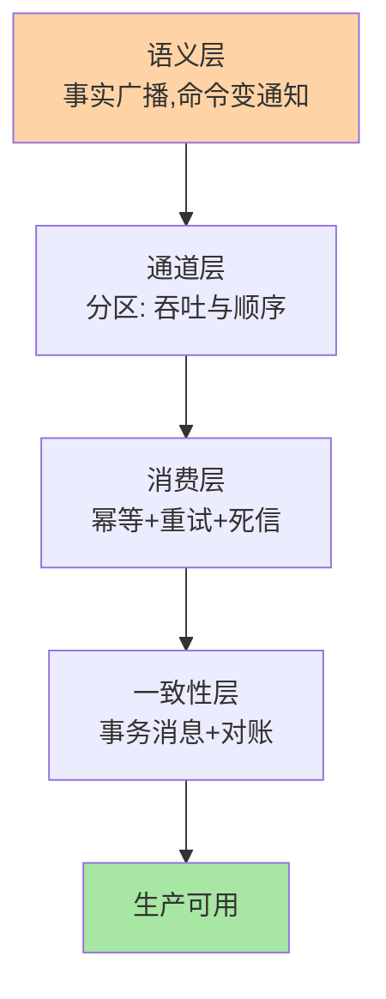
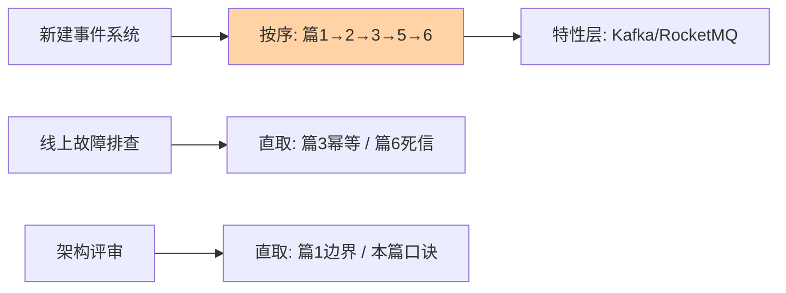

# 事件驱动架构总结：入门到实战的全景与下一步

> 一句话：本篇把前六篇钉成一张全景图——从「命令变通知」的语义转变，到分区、幂等、事务消息、死信重试的防线体系，再给三条读者路径与特性层的入口。入门层到这里收官，实战从这里开始。

## 🎯 本文核心

**核心一句话：事件驱动的完整拼图 = 语义（事实广播）+ 通道（分区模型）+ 消费（幂等 + 重试 + 死信）+ 一致性（事务消息 + 对账）——四层各自有核心机制，逐层加固后才是生产可用的事件驱动；任何一层缺失都有对应的典型事故等着。**

## 一句话摘要

本系列前六篇构成一条主线：篇 1 建立语义（事件是已发生的事实，命令变通知，解耦的代价是最终一致）；篇 2 拆通道（分区日志：追加写换吞吐、同 key 同分区保顺序、位点定投递语义）；篇 3、6 建消费防线（至少一次 + 幂等是主路，重试退避与死信处置是失败防线）；篇 4 升维（事件溯源与 CQRS：事件从通知变数据，历史即资产）；篇 5 补一致性（事务消息焊住「写库与发消息」，对账兜住最终一致）。本篇回顾主线、收敛决策口诀、给三条阅读路径与特性层入口。

## 5W 速记卡（系列级）

| 维度 | 一句话 |
|---|---|
| What | 事实广播式架构：事件 + 通道 + 订阅 + 幂等消费 + 最终一致 |
| Why | 解耦演进成本、故障隔离、削峰；代价是一致性与链路复杂度 |
| When | 多下游扇出、节奏不一致、历史有价值、跨团队契约协作 |
| Where | 写入口（事务消息）→ 分区通道 → 消费防线 → 对账兜底 |
| How | 语义先行 → 通道按吞吐与顺序推导 → 消费防线标配 → 对账必建 |

## 一、系列主线回顾：四层各拿走一句

| 层 | 篇目 | 核心一句话 |
|---|---|---|
| 语义 | 篇 1 概念入门 | 命令变通知，控制权转移；一致性需求是业务属性 |
| 通道 | 篇 2 消息模型与分区 | 分区 = 吞吐单位 + 顺序声明粒度；key 是契约 |
| 消费 | 篇 3 幂等 + 篇 6 死信重试 | 重复是事实、幂等是态度；重试管点、死信管尾 |
| 升维与一致 | 篇 4 溯源 CQRS + 篇 5 事务消息 | 历史即数据；半消息焊住写库与发消息 |

四层串成一句话：**用事实语义定义协作，用分区模型承载吞吐，用幂等与死信消化失败，用事务消息与对账收敛一致性。**

## 二、决策口诀（写代码前默念）

1. **先分依赖再选通信**：必须同步完成的走调用，可以事后补偿的走事件
2. **顺序是最贵的约束**：先试终态快照 + 版本号的无序化设计，救不回来再上 key 分区
3. **幂等键 = 业务唯一键**：消息 ID 不是幂等键；防御纵深按「重复的代价」分级
4. **失败先分诊**：可重试的给退避，确定性失败的快速死信；重试流量自己要被限流
5. **没有对账不上生产**：最终一致性的所有机制都有漏网率，对账是唯一兜底
6. **量级决定复杂度预算**：十万级同步链够用就别上事件；百万级扇出与削峰让事件变必选；千万级、亿级量级一致性体系本身是一条独立数据链路

三类读者的阅读路径：

## 三、典型使用场景全景

- **交易后处理**：订单事实广播 → 发货/积分/风控/通知各自消费（篇 1 主线场景）
- **状态机流转**：同 key 分区 + 终态快照，按序消化状态事件（篇 2）
- **资金与权益**：幂等纵深 + 事务消息 + 死信人工通道，重复与丢失双防（篇 3/5/6）
- **审计与回溯**：事件溯源存事实，争议十分钟还原（篇 4）
- **异构同步**：主库事实经事件投影到 ES/缓存/数仓（CQRS 应用形态）

## 四、误区总清单（入门层最常踩的十个）

1. 用了 MQ 就以为解耦了（发完等结果 = 远程调用换皮）
2. 事件里夹命令语义（「请发货」事件）
3. 以为设置了 key 就全局有序（只有同 key 才有序）
4. 分区数无脑拉满（协调成本反噬）
5. 幂等键用消息 ID（防不住生产端重发）
6. Redis 去重降级时放行（该拒绝的场景放行 = 资损）
7. 所有异常统一重试五次（确定性失败空转，限流失败不足）
8. 均匀间隔重试（重试风暴放大故障）
9. 死信没人看（防线静默失效）
10. 上了事务消息就不建对账（回查超限丢弃无监控，分裂无人知）

## 五、追问链：把「入门到实战的距离」问穿一层

- **追问一：入门篇都看懂了，第一生产问题会出在哪？**——统计上的答案是「幂等缺口」与「乱序假设」：读得懂幂等，但生产端重发路径（超时重试、手工补偿、上游重推）在代码里有五条，漏堵一条就是重复资损；分区有序读得懂，但「谁会换 key、谁会重发旧事件」的威胁模型没人画。**实战第一步：给自己的消费端画「重复与乱序的来源清单」，逐条堵。**
- **再追问：监控要配哪几个指标才算有观测？**——最小集四个：消费 lag（堆积趋势）、重试量与死信量（失败分诊的实际分布）、Rebalance 频率（重复消费的来源指标）、端到端时延（事件产生到消费完成的分位数）。比指标更重要的是基线：没有基线，四个数都只是数字。
- **打破砂锅：特性层和入门层的边界在哪？**——入门层建立「语义 + 防线」的通用心智；特性层进入「组件实现」——Kafka Producer 的缓冲与幂等实现、RocketMQ 事务消息源码、Broker 存储细节。判断标志：当你需要回答「为什么我的生产者和文档行为不一致」时，进特性层。

## 六、与中间件系列、架构系列的区别辨析

| 系列 | 视角 | 回答的问题 |
|---|---|---|
| 本系列（事件驱动） | 架构语义 | 协作方式怎么选、防线怎么配 |
| Kafka/RocketMQ 系列（中间件域） | 组件实现 | 参数怎么配、源码怎么跑、故障怎么修 |
| 分布式系统设计系列 | 理论与一致性 | CAP、共识、分布式事务选型 |

三者是同心圆：本系列在中间——用中间件实现架构语义，用理论约束设计边界。读到「为什么」追到理论系列，读到「怎么配」跳到中间件系列，互为引用。

## 七、实践叙事：一次事件驱动体系的验收

某团队把「订单后处理」从同步链迁到事件驱动，验收清单值得抄：①压测通道分区数与消费并行度（吞吐达标）；②混沌注入——kill 消费者、断 MQ 网络、灌重复消息（幂等与重试防线的实测）；③对账演练——人为制造静默订单，验证对账任务能抓到并修复；④监控基线——四个核心指标跑一周取基线。验收暴露了两个设计盲区（补偿事件的 key 路径、死信告警未接值班），上线前修完。**复盘沉淀：事件驱动体系的验收必须是「故障注入式」的——文档上的防线和运行中的防线是两套东西，只有注入过故障才知道哪套在跑。**

## 八、设计思想：从入门层带走的不只是知识

本系列反复出现同一个思维模式：**先声明语义，再推导机制**——「事实 vs 命令」推导出幂等与补偿；「顺序的声明粒度」推导出 key 设计；「结论可查询」推导出半消息回查。技术选型表会过时，组件会换代，但「从语义推导机制」的路径可复用于任何新组件。入门层真正的沉淀是这个思考路径，而非六篇结论本身。

## 九、你们可能会问

**Q1：入门层六篇都过了 gate，可以直接生产上线吗？**
心智够了，防线要配齐才能上：幂等、重试死信、对账、监控基线四件套缺一不上。事件驱动的「上线」不是代码写完，是防线运行起来。

**Q2：特性层两套（Kafka/RocketMQ）都要读吗？**
按团队组件定主次，读一套吃透 Producer/Broker/Consumer 的实现层次，另一套用架构视角对照差异即可——实现知识不可复用，实现层次的心智可以。

**Q3：事件溯源和 CQRS 入门篇够用吗？**
建立概念锚点够了；真要落地强审计域，需要专题层的聚合设计、事件版本化、投影治理三篇——那是「历史价值密度」确认后的再投入。

## 十、什么时候用 / 不用（系列级决策收敛）

- ✅ 上事件驱动：多下游扇出 + 秒级延迟可容忍 + 故障不阻断主流程 + 团队建得起幂等/对账/监控四件套
- ❌ 不上：强一致写路径、单下游低频变更、团队没有防线运维预算——同步链 + 事务不是落后，是匹配
- 🔄 部分上：交易主链保持同步，后处理域事件化——多数业务的最优解是混合形态

## Trade-off：架构先进性的成本核算

事件驱动的账要全算：收益（演进弹性、故障隔离、削峰）是长期的、复利的；成本（防线四件套、契约治理、链路追踪）是一次性的但持续的。**判断信号在量级与变化频率**：业务变更频繁、下游持续增多时收益陡增；系统趋稳后，多余的中间层开始反向收费。架构决策不是「选先进的」，是「选当前量级下总成本最低的」。

## 开放问题

- 事件网格（EventMesh/EventBridge 类）在把「事件路由」做成独立基础设施，跨集群、跨云的事件拓扑治理是新战场
- 批流一体（Flink 类）让「消费即计算」一体化，事件驱动的消费端形态在从「服务」向「流作业」扩展

## 💡 实战提示

- 💡 给消费端画「重复与乱序来源清单」（生产端重发路径逐条列出），上线前逐条堵
- 💡 监控最小四指标：lag、重试量、死信量、端到端时延分位——先跑基线再看数
- 💡 验收用故障注入：kill 消费者、断网络、灌重复消息，防线实测过才算存在
- 💡 混合形态是常态：交易主链同步 + 后处理域事件，不必全有或全无

## 自测三问

1. 四层拼图（语义/通道/消费/一致性）各拿走一句核心是什么？
2. 六条决策口诀里，哪条最常被违反？
3. 入门层与特性层的边界判据是什么？

## 🎯 核心带走

- **核心一句话**：语义定协作、分区定吞吐、幂等定防线、对账定收敛——四层齐了才是生产可用的事件驱动
- **十误区**：本篇第四节清单，评审时对照扫一遍
- **下一步**：特性层按组件选 Kafka 或 RocketMQ 一套吃透；理论疑问进分布式系统设计系列
- **哪里会坏**：幂等缺口、乱序假设、死信静默——三个高频事故源已给威胁模型
- **边界**：架构选型看量级与变更频率的总成本，不追先进标签

## 📌 数据与事实声明

- 写于 2026-09-15（系列入门层收官篇）；各篇机制以 Kafka/RocketMQ 官方文档公开口径为准
- 实践叙事为业内高频架构验收模式的匿名化叙事，非特定公司事件
- 免责：组件能力随版本演进，以官方文档为准

## 📚 参考资料

| 类型 | 标题 | 来源 |
|---|---|---|
| 系列内 | 篇 1-6（概念/分区/幂等/溯源CQRS/事务消息/死信重试） | 本目录 |
| 官方文档 | Apache Kafka / RocketMQ | kafka.apache.org · rocketmq.apache.org |
| 系列导航 | 事件驱动系列目录 | `docs/architecture/event-driven/index.md` |
