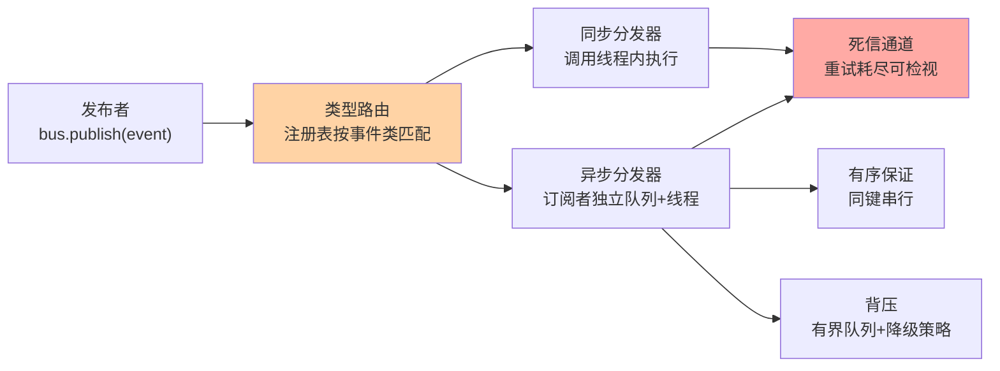
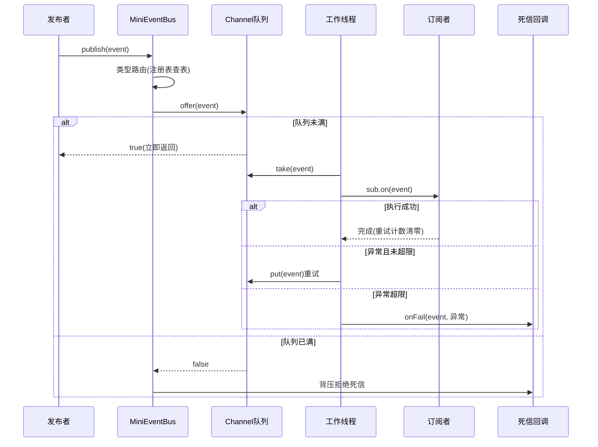
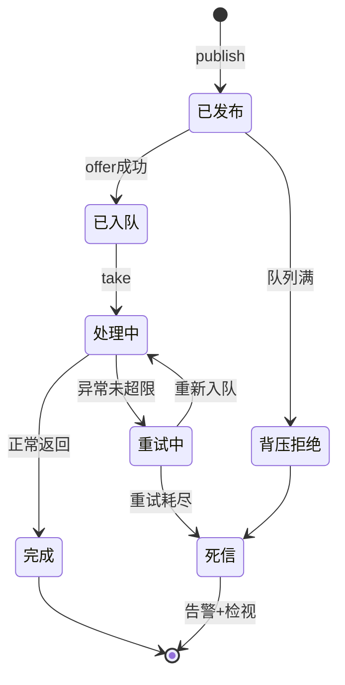
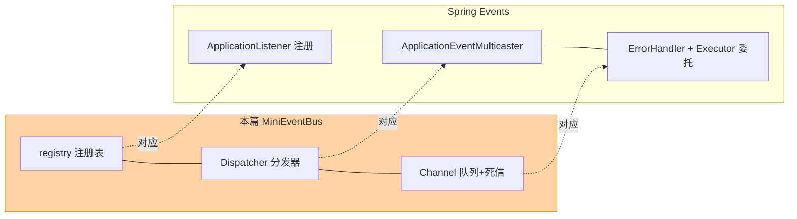
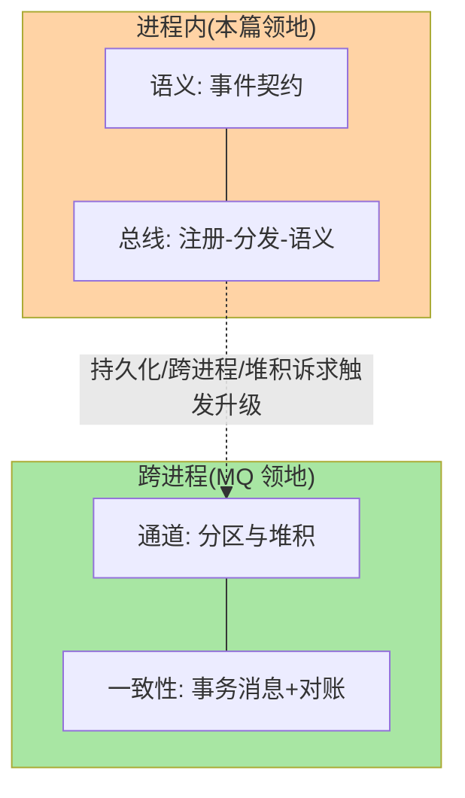

# 从零实现事件驱动框架：用最小内核理解 Event Bus 的全部机制

> 生产级事件驱动依赖 Kafka/RocketMQ/Spring Events——组件太完善，反而看不清机制。本篇用几百行 Java 从零实现一个最小事件总线（同步/异步分发、类型路由、有序投递、背压、死信），把框架层机制亲手造一遍。**不是教造轮子，是用造轮子倒逼理解：实现过一遍，组件文档里每一句话都有了坐标。**

> **本文核心**：事件总线的全部机制 = 「注册表 + 分发器 + 投递语义」三件事——注册表管「谁听什么」（类型路由），分发器管「在哪个线程、什么顺序」（同步/异步/有序），投递语义管「失败与重复怎么办」（重试、死信、幂等约定）。从零实现的最大价值：亲手撞上每一个设计取舍（同步抛异常还是异步吞？有序锁加在哪？背压用什么策略？），才知道生产组件的每个配置项在防什么。

## 一句话摘要

最小事件总线（MiniEventBus）的核心组件：事件类型注册表（`Map<Class<? extends Event>, List<Subscriber>>`，支持按父类型匹配的分发）、同步分发器（调用线程内遍历订阅者，异常策略可配）与异步分发器（每订阅者独立队列 + 工作线程，隔离慢订阅者）、有序投递保证（同一事件键串行，无锁按序或单队列）、背压控制（有界队列 + CallerRuns 降级）与死信通道（重试耗尽入 DLQ 供检视）。实现它需要回答五个设计问题：异常传播策略、订阅者隔离粒度、有序性范围、背压策略、死信归属——**这五问正是 Kafka/Spring Events/Guava EventBus 等组件差异的坐标系**。

## 🎯 本文核心（机制坐标）



## 一、内核实现：两百行看懂全部

### 1.1 事件与订阅者契约

```java
/** 事件标记接口: 全部业务事件实现它 */
public interface Event { }

/** 订阅者: 泛型声明关心的事件类型,注册时解析出实际类型参数 */
@FunctionalInterface
public interface Subscriber<E extends Event> {
    void on(E event) throws Exception;
}
```

类型路由的关键在注册时**解析泛型的实际类型参数**（`Subscriber<PayEvent>` 里的 `PayEvent`），把「订阅者 → 事件类型」关系存进注册表；发布时按「事件类的全部父类型」匹配——细粒度匹配具体类型，粗粒度订阅 `Event.class` 收全量。这是 Guava EventBus 同款机制：**路由规则是一次注册期决定、发布期只查表**，发布路径零反射。

### 1.2 注册表与发布入口

```java
public class MiniEventBus {
    // eventType -> 订阅该类型的全部订阅者(CopyOnWrite: 注册少、遍历多)
    private final Map<Class<?>, List<Subscriber<?>>> registry = new ConcurrentHashMap<>();
    private final Dispatcher dispatcher;

    public <E extends Event> void subscribe(Class<E> type, Subscriber<E> s) {
        registry.computeIfAbsent(type, k -> new CopyOnWriteArrayList<>()).add(s);
    }

    public <E extends Event> void publish(E event) {
        Objects.requireNonNull(event, "event 不能为空");
        int delivered = 0;
        for (Class<?> c = event.getClass(); c != null; c = c.getSuperclass()) {
            List<Subscriber<?>> list = registry.get(c);
            if (list != null) {
                for (Subscriber<?> s : list) dispatch(s, event);   // 分发策略在这里决定
                delivered += list.size();
            }
        }
        if (delivered == 0) deadLetter(event, "NO_SUBSCRIBER");     // 无人订阅也是死信语义
    }

    @SuppressWarnings({"unchecked", "rawtypes"})
    private void dispatch(Subscriber s, Event e) {
        dispatcher.dispatch(s, e, err -> deadLetter(e, err.getMessage()));
    }
}
```

### 1.3 分发器：同步、异步与有序

```java
/** 同步分发: 调用线程内执行——简单直接,慢订阅者拖累发布者 */
class SyncDispatcher implements Dispatcher {
    public void dispatch(Subscriber s, Event e, Consumer<Throwable> onFail) {
        try { s.on(e); } catch (Throwable t) { onFail.accept(t); }
    }
}

/** 异步分发: 每订阅者独立有界队列+工作线程——隔离慢订阅者 */
class AsyncDispatcher implements Dispatcher {
    private final Map<Subscriber, Channel> channels = new ConcurrentHashMap<>();

    public void dispatch(Subscriber s, Event e, Consumer<Throwable> onFail) {
        Channel ch = channels.computeIfAbsent(s,
                k -> new Channel(k, 1024, onFail));              // 有界队列=背压地基
        boolean offered = ch.offer(e);
        if (!offered) onFail.accept(new IllegalStateException("队列满:背压拒绝")); // CallerRuns 或拒绝
    }
}

/** 有序分发: 同一业务键串行——按键哈希到固定 worker */
class OrderedDispatcher implements Dispatcher {
    private final Worker[] workers;                              // N 个单线程 worker

    public void dispatch(Subscriber s, Event e, Consumer<Throwable> onFail) {
        String key = ((KeyedEvent) e).key();
        workers[Math.floorMod(key.hashCode(), workers.length)].submit(s, e, onFail);
    }
}
```

有序分发的取舍当场显形：**同键串行的代价是键哈希倾斜时 worker 热点**（与大 V 键打爆分区的机制同源，互指入门层篇 2）——键的均匀性契约从 MQ 分区设计原样复制到了自研总线。

### 1.4 背压与死信

```java
/** 订阅者通道: 有界队列 + 死信 */
class Channel implements Runnable {
    private final BlockingQueue<Event> queue;    // 有界:背压的物理载体
    private final Subscriber sub;
    private final Consumer<Throwable> onFail;
    private final AtomicInteger retries = new AtomicInteger();

    public boolean offer(Event e) { return queue.offer(e); }  // 队列满即 false→上层降级

    public void run() {
        while (true) {
            Event e = queue.take();
            try {
                sub.on(e);
                retries.set(0);
            } catch (Throwable t) {
                if (retries.incrementAndGet() <= 3) queue.put(e);  // 有限重试
                else onFail.accept(t);                             // 耗尽入死信
            }
        }
    }
}
```

背压策略三选一的现场：队列满时「阻塞发布者」（同步语义，慢订阅拖慢上游）、「调用者执行 CallerRuns」（降级但不丢）、「丢弃 + 死信」（保吞吐换完整性）——**没有对的策略，只有匹配业务完整性诉求的策略**。这段实现做完再读 Kafka 的 buffer 满策略、RocketMQ 的拒绝策略，配置项的语义全部对上。

一次异步分发从发布到死信的完整时序：



事件在通道内的生命周期状态机：



## 二、demo 验证点

按以下顺序验证内核（每步给出预期输出，全部通过说明机制闭环）：

1. **类型路由**：注册 `Subscriber<PayEvent>` 与 `Subscriber<Event>`，发布 `PayEvent` → 两个订阅者都收到；发布 `RefundEvent` → 只有 Event 订阅者收到（父类型匹配生效）
2. **异常隔离**：同步分发器下订阅者 A 抛异常 → 发布方收到死信回调、订阅者 B 仍收到事件（异常不中断分发链）
3. **慢订阅隔离**：异步分发器下订阅者 A sleep 100ms、B 立即返回，连发 100 事件 → B 的完成时间分布不受 A 影响（队列隔离生效）
4. **有序验证**：同键 `order:1` 发 100 个事件，订阅侧断言处理序 == 发布序（OrderedDispatcher + 单 worker 断言）；不同键交错处理（并行度生效）
5. **背压验证**：订阅者阻塞、发 2048 事件（队列 1024）→ offer 返回 false 计数触发降级路径（背压生效）
6. **死信验证**：订阅者对特定事件永远抛异常 → 3 次重试后死信回调收到该事件与异常（重试耗尽语义生效）

```bash
# 验证环境: JDK 17+,单模块即可
javac -d out $(find src -name "*.java")
java -cp out demo.MiniEventBusDemo   # 跑五步验证,输出逐步预期结果
```

## 三、五种设计取舍：自研撞上的每一堵墙

| 取舍点 | 选项 A | 选项 B | 生产组件的选择与启示 |
|---|---|---|---|
| 异常传播 | 同步:抛给发布者 | 异步:死信通道 | Spring 事件同步抛、Kafka 异步重试——按发布方是否需要确认分界 |
| 隔离粒度 | 全局单队列 | 每订阅者独立队列 | 每订阅者隔离是主流（慢者不拖快者），代价是线程资源 |
| 有序范围 | 全局串行 | 同键串行 | 同键串行是唯一可行解（全局串行=单线程），键设计即契约 |
| 背压策略 | 阻塞/CallerRuns/丢弃 | 无界队列 | 无界=OOM 延迟炸弹；三策略按完整性诉求选 |
| 死信归属 | 事件总线的 DLQ | 每订阅者 DLQ | 按订阅者隔离死信才能精确定位——总线级 DLQ 混杂难排查 |

这五问的答案组合，就是「为什么市面 Event Bus 长得不一样」的完整解释——**组件选型表上每一行的差异，都能回溯到某一个取舍点**。

## 四、事故叙事两则（自研过程的真实踩坑形态）

**叙事一：无界队列的延迟爆炸。**自研总线第一版用无界 LinkedBlockingQueue（「不会拒绝最安全」），压测通过；上线后订阅者因下游抖动慢了三分钟——队列堆积百万事件，内存告警，且恢复后**事件按三分钟前的旧状态处理**（时序敏感的业务全部错乱）。修复换有界队列 + CallerRuns 降级。复盘沉淀：**无界队列不是没有背压，是把背压转移成了内存与时序风险**——比显式拒绝更难排查。

**叙事二：注册表遍历时的 ConcurrentModificationException。**分发过程中另一线程取消订阅（List 遍历中 remove），偶发 CME。初版用 synchronized 注册表（分发全程持锁——发布吞吐被锁死）；终版 CopyOnWriteArrayList（写时复制，遍历无锁，注册低频场景最合适）。复盘沉淀：**注册/分发的读写比例决定并发容器选型**——事件总线的典型读写比（注册极少、分发极多）让 COW 成为教科书答案，这个判断模式可复用到一切「读多写少的注册表」。

## 五、追问链：把「事件总线」问穿一层

- **追问一：自研总线什么时候该换成 MQ？**——三个判据任一成立即换：①持久化诉求（进程重启事件不能丢——内存队列全丢）；②跨进程诉求（总线天然进程内）；③堆积容忍（总线的队列是内存级，MQ 是磁盘级，量级差三个数量级）。**总线的领地是进程内的方法解耦**，把它当分布式 MQ 用是架构错位。
- **再追问：进程内总线和直接方法调用，解耦的收益到底在哪？**——收益清单：发布方与订阅方编译期解耦（新增订阅不改发布方）、同步异步可切换、横切关注点（审计/指标）统一挂载。代价清单：调用链隐式化（「谁在听」要工具导出）、时序不可控（异步后）。**订阅者 ≤2 且永远同步的，方法调用更诚实**——解耦收益要靠订阅者数量与演进频率兑现。
- **打破砂锅：既然自研总线能力弱于 MQ，为什么还要造？**——造的目的是「机制倒逼理解」而非替代：注册表/分发/背压/死信四机制亲手实现后，Spring 事件的 multicaster 配置、Kafka 的 buffer 与 acks、RocketMQ 的线程池参数，全部从「黑盒配置」变成「已知取舍的参数化」。**轮子的价值在理解力，不在生产力**——这句是这个 Demo 的存在理由。补一句工程师的诚实：本内核约两百行，生产级 EventBus（Guava）约数千行、MQ 是百万行级工程——从两百到数千是「边界场景与防御完备」，从数千到百万是「分布式持久化」两个数量级的跃迁，各自的知识都不能靠一句「造轮子」跨越，但本篇让你拿到了第一个跃迁的地图。

## 六、反方案分析：为什么不直接用现成组件入门

- **为什么不用 Spring Events 直接讲**：Spring 事件是「模板填好的总线」——注册用注解、分发由 multicaster 托管，好用但机制被封装；直接学它，背压与异常策略的「为什么」是文档结论而非亲手撞墙。先自研再读 Spring 源码（ApplicationEventMulticaster 正是本篇分发器的工程化版），对照感最强
- **为什么不用 Netty/Akka 讲事件**：它们的事件模型绑定自身编程范式（Actor/EventLoop），入门成本淹没问题本质；最小内核剥离框架范式，只留「注册-分发-语义」的裸机制
- **为什么不做持久化**：进程内总线的持久化毫无意义（进程没了总线也没了）——持久化诉求即 MQ 领地（见追问链一），边界清晰比功能堆砌重要

## 七、设计思想：轮子是机制的反光镜

从零实现的教学价值在于**把设计文档变成设计现场**：文档说「异步分发器隔离慢订阅者」，实现时才发现「隔离」意味着每订阅者一个队列一个线程——资源账立刻具体；文档说「有序投递」，实现时才发现有序必须绑定键、键必须均匀——契约立刻具体。**机制的每一个形容词背后都有一个实现决策**，亲手实现是把形容词还原成决策的过程。这套「造轮子理解法」的适用边界同样清晰：适用于机制可压缩到数百行的领域（总线、线程池、简易 KV），不适用于机制本身是工程的领域（数据库、分布式协调）——那些领域的「轮子」是产品级工程，造不动也学不透。

## 八、不同量级的思考：事件总线的规模边界

- **十万级事件/秒以下（进程内）**：约束来源是正确性与可读性——同步分发 + 死信回调即可，背压无感。这一档的核心问题是「异常策略与注册表清晰度」，而不是「吞吐」
- **百万级事件/秒**：约束来源是分发开销与内存——分发路径的每次对象分配、队列拷贝都进入热路径；批量 offer、对象复用、无锁队列（MPSC）进入视野。这一档的核心问题是「分发路径的分配账」，做法是剖析驱动优化
- **千万级/跨进程**：约束来源是持久化与网络——进程内总线出局，MQ 接管，自研总线退守「进程内前置过滤/聚合」角色。这一档的核心问题是「边界归属」，解法是承认边界而非硬撑

**自下而上与触发升级**：先量事件速率与订阅者耗时分布，低速同步即可；触发升级的信号是「分发线程成为剖析热点」「队列告警常态化」「出现跨进程诉求」——从同步迁到异步隔离再迁到 MQ，每一跳都是约束变化的响应，不预先建全套。

本内核与 Spring Events 的机制对照（读完内核再读框架的桥）：



对照结论：Spring 的 multicaster 就是「分发器接口 + 可插拔 Executor」，ErrorHandler 对应死信回调，事件广播的父类型匹配与本内核同构——框架是内核的托管化，不是另一种机制。

## 九、参数级配置清单（ADR-0012）

| 配置项 | 默认参考 | 分档建议 | 为什么 |
|---|---|---|---|
| 订阅者队列容量 | 1024 | 低延迟业务 256 | 队列即延迟上限（容量 ÷ 处理速率），越小背压越早 |
| 背压策略 | CallerRuns | 可丢业务用丢弃+死信 | CallerRuns 保完整，吞吐型场景选丢弃 |
| 重试次数 | 3 次 | 幂等消费可 5 次 | 重试按订阅者幂等性定价 |
| 有序 worker 数 | CPU 核数 | 键倾斜时热点迁移 | worker 数 = 有序通道数，倾斜热点靠重键设计解决 |
| 死信保留 | 内存列表 + 告警 | 量大落盘 | 死信是排查现场，丢了没法复盘 |
| 分发超时 | 无（同步阻塞） | 异步必需队列超时 | 无超时的队列是延迟黑洞 |

## 十、步骤级操作（ADR-0012）

1. **前置**：JDK 17+ 环境；先读本篇 §一 内核源码（四个类：Bus/Dispatcher×3/Channel）
2. **实现**：按 §1.1-1.4 顺序落地（契约 → 注册表 → 分发器 → 通道），每步跑对应单测
3. **验证**：按 §二 demo 验证点六步逐项跑通，任何一步不符即回查对应机制实现
4. **对照**：读 Spring `SimpleApplicationEventMulticaster` 源码，对照本实现标注三处差异（错误处理 multicaster/任务执行器委托/父类型匹配细节）
5. **回退**：本 Demo 独立模块，不影响生产代码——「回退」即不合并；如用于内部工具，替换点收敛在 Dispatcher 接口

## 十一、业内惯例

- 进程内事件总线的惯例选型：Spring Events（容器生态内）、Guava EventBus（轻量独立）、Disruptor（极低延迟_ring buffer 换编程模型）——三者正对本篇三个取舍点（托管/轻量/极致吞吐）
- 惯例纪律：总线只做「路由与分发」，业务语义（重试策略、幂等）在订阅者侧——总线带业务是自研框架腐化的起点
- 监控惯例：总线暴露三指标——队列水位（背压前兆）、死信速率（健康度）、分发耗时 P99（热点定位）

## 你们可能会问

**Q1：这个内核和 Guava EventBus 的差距有多大？**
Guava 多出的核心能力：死信的Subscriber 级隔离（DeadEvent 机制）、注册期拦截器、线程池委托的异步实现、更完备的父类型匹配缓存。差距是「工程完备度」不是「机制差异」——本内核的四机制与它同构，读懂本内核即读懂它的架构说明。

**Q2：为什么不用 Disruptor 的 ring buffer？**
Disruptor 用预分配环形数组与序列号机制把分发做到极限低延迟（业内量级认知：单环百万级事件/秒），代价是编程模型特殊（事件对象复用、槽位管理）。本篇目标是机制可读性，Disruptor 是吞吐极值路线——两者是不同优化目标，读 Disruptor 前先懂本篇的队列模型会更顺。

**Q3：异步分发器的线程数怎么定？**
每订阅者一线程是隔离最彻底的方案，订阅者多时线程膨胀——收敛方案是「订阅者分组共享线程池」（同组隔离、跨组共享）。线程数的判断依据是订阅者的耗时分布与 CPU/IO 属性：IO 密集订阅者线程可多于核数，CPU 密集对齐核数。

## 十二、什么时候用 / 不用

- ✅ 用（学习）：理解 Spring Events / MQ 分发机制前的机制打底——本篇的定位
- ✅ 用（生产）：进程内确有发布订阅诉求且轻量场景（订阅者少、无持久化诉求）——同步形态几百行足够
- ❌ 不用（生产）：有持久化/跨进程/堆积诉求——直接上 MQ，别给总线加持久化
- ❌ 不用：订阅者单一且同步——方法调用更诚实
- ❌ 不自研高吞吐总线：Disruptor 级别的优化是专项工程，用现成件

### 订阅者分组的线程模型细化

「每订阅者一线程」到「分组共享池」之间还有一档值得单说：按**耗时特征分组**（快组/慢组各一个池），同组订阅者共享池但独立队列——比完全共享多了组内隔离，比完全独立省线程。分组依据来自监控数据（分发耗时 P99 聚类），而不是订阅者注册顺序。这档模型对应到 Spring：给 multicaster 配两个 Executor（fastExecutor / slowExecutor），@EventListener 按 qualifier 路由——**线程模型的本质是把「隔离的粒度」变成可配置项**，粒度选择随订阅者数量与耗时分布演进，没有恒定答案。

### 指标埋点的最小集与位置

内核的三指标（队列水位/死信速率/分发耗时）埋在三处：Channel 的 offer/take 处（水位与背压拒绝计数）、onFail 回调处（死信计数，按订阅者维度打标）、分发器 dispatch 前后（耗时直方图）。埋点纪律：**指标必须带订阅者维度标签**——总线级聚合指标会把慢订阅者藏进平均数，排查时毫无用处。这段实现做完，对照 Micrometer 的 Gauge/Timer/Counter 三类指标，监控制度与实现点一一对应。

总线在事件驱动四层拼图中的位置（互指入门层篇 7 全景）：



## Trade-off：控制力与维护责任的交换

自研内核换来对机制的完全控制（每个取舍自己拍板），也换来了全部维护责任（并发 bug、性能回归、边界场景自己兜）。学习场景控制力完胜、维护责任为零——完美交易；生产场景只有「机制简单到永远不会再改」时自研才划算。**自研轮子的账：控制力是即期的，维护责任是长期的**——本篇的轮子建议永远停留在教学区。

## 开放问题

- 总线级的「事件版本化」是否必要：进程内事件无序列化（对象引用直传），版本演进比跨进程事件宽松——但事件对象加字段时，全订阅者的重编译连带如何治理，进程内契约的边界值得立规
- 事件溯源与总线的融合：进程内总线能否以极低成本追加事件日志（内存态 event store），让轻量应用也享受「状态可重放」——机制上是 Channel 换持久化队列，代价与收益的平衡点待验证
- 虚拟线程下「同步分发」的成本模型重构：每订阅者一个虚拟线程的同步分发，阻塞成本趋近于零，同步/异步的选型依据可能从「线程成本」变成「纯语义选择」

## 跨周期视角：事件机制五年后的形态

进程内事件机制的三条演进线值得关注：①虚拟线程让「每订阅者一线程」的成本模型改变，异步分发的线程池策略大幅简化；②响应式流的背压语义（Reactor 的 request(n)）可能成为总线 API 标配，显式背压从「队列策略」升级为「协议」；③Serverless 与事件网格把「事件路由」推到进程外基础设施，进程内总线收缩为「方法解耦」的纯本地角色。**机制（注册-分发-语义）五年内不变，载体与边界在变**——理解机制的人迁移成本最低，这正是本篇押注的长期价值。

## 💡 实战提示

- 💡 亲手实现五取舍（异常/隔离/有序/背压/死信）再读组件文档——每个配置项都有了坐标
- 💡 进程内总线不碰持久化与跨进程——边界清晰是自研件存活的前提
- 💡 队列必有界、无界即把背压换成内存炸弹——这是本 Demo 第一事故教训
- 💡 注册表读写比决定并发容器：读多写少 CopyOnWrite，别无脑 synchronized
- 💡 有序分发的键契约与 MQ 分区键同构——键均匀性是跨层复用的设计纪律

### 与线程池任务的语义对照（帮助定位认知）

把事件总线与裸线程池对照着理解，能快速定位自己的认知坐标：线程池任务 = 「一次性工作单元」（做完即走，无订阅语义）；事件总线 = 「可多播的发布订阅」（一事件多订阅者，注册期决定路由）；MQ = 「可持久化的总线」（跨进程、可堆积、有投递语义）。三者的方法签名几乎相同（提交/发布 + 回调/订阅），差异全部在语义层——**这条对照在代码评审里还有一个实用变体：看到 `bus.publish()` 却全库只有一个订阅者且必须同步等待结果——发布订阅的形态、直接调用的语义，两层皮。评审时用「订阅者数量」与「是否等待结果」两问过滤，绝大多数误用当场现形。认不清差异时最容易犯的错，就是把事件总线当异步任务池用**（发布一个事件只为了在别的线程跑一段逻辑）：这种场景用线程池更诚实，事件总线的价值在「多播与解耦」，不在「换个线程」。

## 自测三问

1. 事件总线的五取舍是什么？生产组件的差异如何映射到取舍组合？
2. 无界队列为什么是「延迟炸弹」？背压三策略各自匹配什么业务？
3. 自研总线与 MQ 的三个边界判据是什么？

## 🎯 核心带走

- **核心一句话**：事件总线 = 注册表（谁听什么）+ 分发器（线程与顺序）+ 投递语义（失败与重复）——五取舍亲手撞一遍，组件配置全部有了坐标
- **内核四类**：Bus（路由入口）、Dispatcher×3（同步/异步/有序）、Channel（队列+重试+死信）、契约（Event/Subscriber）
- **哪里会坏**：无界队列延迟爆炸、分发遍历 CME、总线被当 MQ 用
- **边界**：进程内方法解耦的领地；持久化/跨进程即 MQ 领地；高吞吐用 Disruptor
- **验证闭环**：六步 demo 验证点（路由/隔离/有序/背压/死信/父匹配）全绿即机制闭环
- **认知对照**：线程池（任务）→ 总线（多播）→ MQ（持久化）三级语义阶梯，签名相似、语义分界

## 📌 数据与事实声明

- 写于 2026-09-15；内核实现为本篇教学代码（非生产库）；Guava EventBus / Spring Events 机制以官方文档与源码公开口径为准
- 「Disruptor 单环百万级事件/秒」为业内量级认知，以自有压测实测为准
- 事故叙事为自研过程典型踩坑的匿名化叙事，非特定公司事件
- 免责：教学代码未经生产验证，生产诉求用成熟组件

## 📚 参考资料

| 类型 | 标题 | 来源 |
|---|---|---|
| 官方文档 | Guava EventBus 说明 | github.com/google/guava/wiki/EventBusExplained |
| 官方源码 | spring-framework（ApplicationEventMulticaster） | github.com/spring-projects/spring-framework |
| 官方文档 | LMAX Disruptor 技术论文 | lmax-exchange.github.io/disruptor |
| 系列内 | 篇 1-7 入门层 + 篇 2 分区模型 | 本系列 |
| 关联篇 | 《亿级消息堆积实战选型决策》 | 本目录专题层 |
