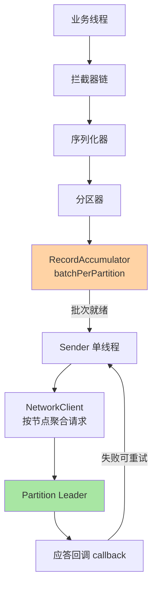
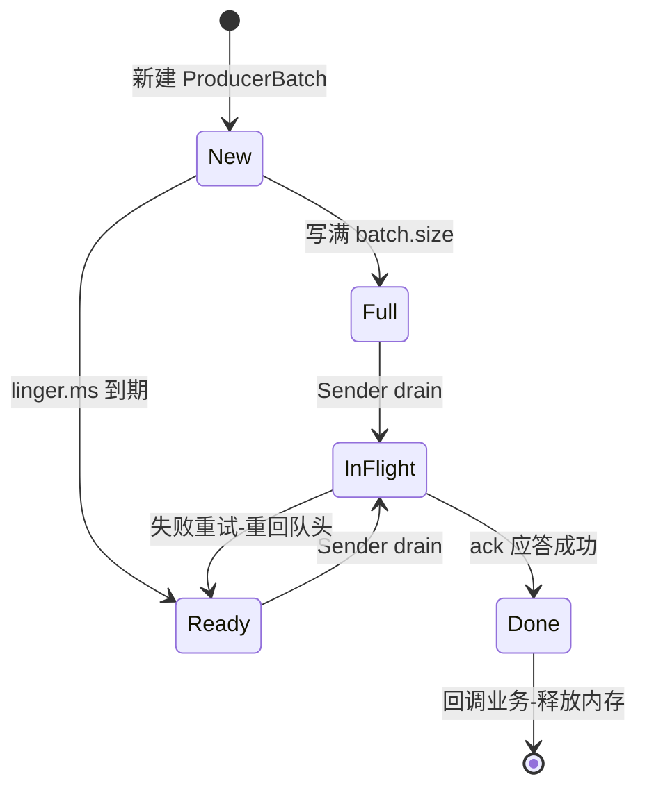
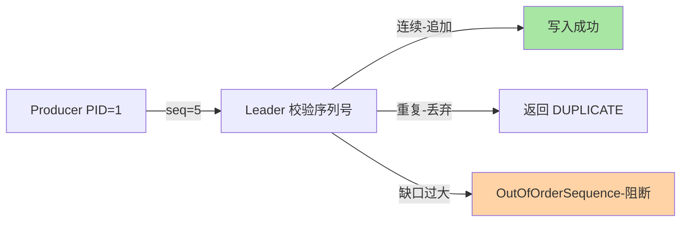
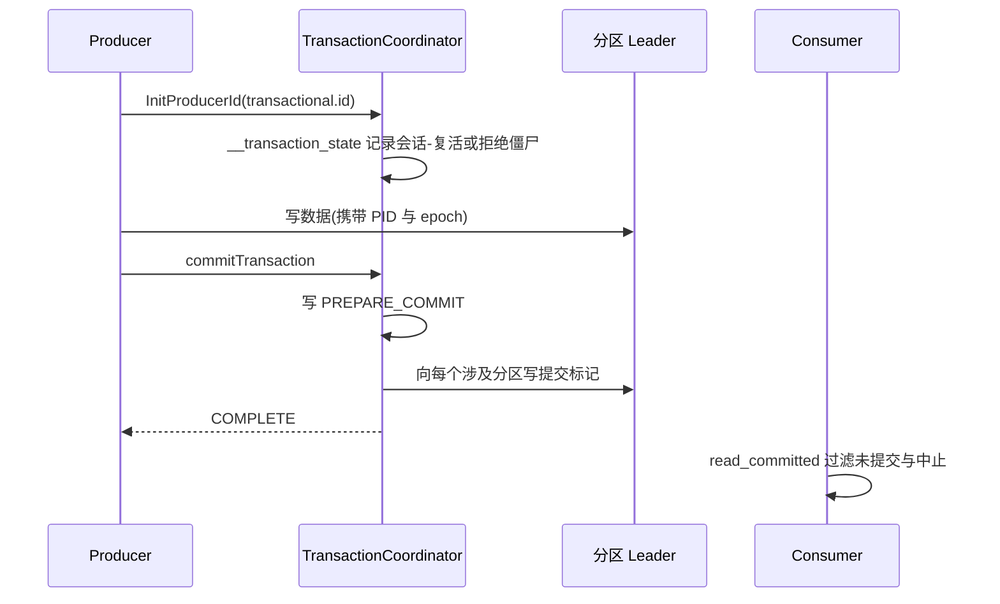

# Kafka Producer 机制深读：批量、分区与幂等事务的发送链路

> **本文核心**：Producer 把「一条业务事件」翻译成「一批可靠到达分区 Leader 的字节」，整条链路是一条**三级流水线**——业务线程做轻活（拦截器 → 序列化 → 分区器），把结果追加进 **RecordAccumulator** 的分区批次缓冲就立刻返回；**Sender 单线程**批量取出就绪批次、按目标节点聚合成请求发出；应答回来后按 **acks 等级 + 幂等序列号 + 事务两阶段**决定这批消息算不算「送达」。**机制链**：send() 调用 → 序列化与分区计算 → 追加进对应分区的 ProducerBatch（满 batch.size 或到 linger.ms 即就绪）→ Sender 按节点 drain → 网络发送 → Leader 追加并等 ISR 同步 → 应答回调 → 失败按重试策略重新入队（幂等序列号保证重试不重复）。

## 一句话摘要

Producer 的实现原理核心是**异步流水线 + 批量经济学**：单条同步发送的延迟是「一次网络往返」，批量后摊薄成「一次往返背 N 条」，这就是业内认知里 Kafka 单机写吞吐能到几十万 TPS 量级的第一根支柱；但批量的每一分收益都在买延迟（linger.ms）与内存（buffer.memory），可靠性则由 acks 与幂等/事务在「重试必然发生」的前提下兜底——**发送端的全部机制，本质上是在吞吐、延迟、可靠性三条边界上做权衡**。

## 前置阅读

- [消息模型与分区（入门）](../../入门层/从零开始认识事件驱动架构系列/2_消息模型与分区-入门.md)
- [事务消息与最终一致性（入门）](../../入门层/从零开始认识事件驱动架构系列/5_事务消息与最终一致性-入门.md)
- [Producer 发送原理（入门）](../../../../middleware/kafka/入门层/从零开始认识Kafka系列/7_Producer发送原理-入门.md)

## 目标导向

本文是什么：事件驱动视角下 Producer 发送链路的机制级深读。功能：算清批量与内存的账、理解分区器对顺序的承诺边界、掌握幂等与事务的适用分界。收益：发送参数调优与可靠性方案评审的实现级判断力。必看场景：发送耗时毛刺排查、buffer 打满告警治理、Exactly-Once 链路设计评审、事件乱序事故复盘。

## 5W 速记卡

| 维度 | 一句话 |
|---|---|
| What | 主线程聚合批次 + Sender 线程批量发送 + acks/幂等/事务兜底可靠性 |
| Why | 批量摊薄网络与磁盘成本，异步解耦业务线程与网络 IO |
| When | 发送延迟毛刺、buffer 满、乱序与重复、Exactly-Once 选型 |
| Where | 事件从业务进程进入 Kafka 的第一段旅程 |
| How | 序列化分区化 → 入缓冲成批 → 按节点发送 → 应答重试去重 |

## 一、事件驱动视角：Producer 是事件出口的「第一责任人」

事件驱动架构里，业务状态变更以事件为载体向外传播，Producer 是所有事件的**唯一出口**——出口处丢一条，下游所有消费者、所有派生视图就永久缺一块。这决定了 Producer 的机制设计围绕三个承诺展开：**吞吐承诺**（批量与压缩把单位事件的传输成本压到最低）、**顺序承诺**（同 key 事件进同一分区，分区内有序）、**可靠承诺**（重试必然发生，幂等与事务保证重试不引入重复）。三个承诺各自引出一组机制，也各自埋着一个代价——本篇按发送链路的物理顺序逐一拆解，先看整条链路怎么跑，再算每一级的账。

## 二、发送主链路：三级流水线的交接协议

### 2.1 关键路径：从 send() 到网络字节

KafkaProducer.send() 的关键路径在源码层非常清晰（以 Kafka 2.x/3.x 客户端为例，口径以所用版本官方源码为准）：

```text
KafkaProducer.send(record, callback):
  1. 拦截器 onSend          -- producer.interceptor.classes
  2. waitOnMetadata         -- 拉取 topic 分区数与 Leader 位置
  3. serializer.serialize   -- key/value 序列化
  4. partitioner.partition  -- 计算目标分区
  5. accumulator.append     -- 追加进分区的 ProducerBatch(可能触发新建批次)
  6. sender.wakeup          -- 若新批次刚创建, 唤醒 Sender 线程
```



这条流水线最重要的协议是**线程交接点**：业务线程干完轻活（序列化 + 分区计算，都是纯内存 CPU 操作）就把字节交给 RecordAccumulator 返回，网络 IO 全部归 Sender 单线程。**为什么不让业务线程自己发网络请求？**反方案分析：如果每条消息由业务线程同步发送，一次网络往返（毫秒级）就挂在业务线程上，上游线程池会被下游网络抖动整体拖住——这是「调用方线程池被远端故障传染」的经典故障模式；如果改成线程池异步发，每条消息一个任务的成本（线程切换、请求对象、TCP 连接竞争）会把单条消息的发送成本抬高一个量级。批量化把这两笔账一起解决：业务线程只付内存追加的成本（微秒级），Sender 把同一分区的 N 条消息合并成一次网络往返。

### 2.2 RecordAccumulator：批量的内存账

RecordAccumulator 按「分区 → 双端队列 → ProducerBatch」组织内存，追加在队尾、Sender 从队头取，配合批次状态机协调并发。三个参数决定这本账的形状：

| 参数 | 默认值（官方口径） | 作用 | 调大的收益 | 调大的代价 |
|---|---|---|---|---|
| `buffer.memory` | 32MB | 缓冲区总内存 | 抗瞬时突发 | 挤占进程堆内存 |
| `batch.size` | 16KB | 单批目标大小 | 单批背更多消息 | 小流量时内存碎片 |
| `linger.ms` | 0 | 批次等待时长 | 提高批量率 | 每条多付等批延迟 |
| `max.block.ms` | 60000 | buffer 满时 send 阻塞上限 | 给下游喘息时间 | 阻塞业务线程更久 |



**追问：为什么默认 batch.size 是 16KB 而不是 1MB？**再深一层看，批次大小是「合并收益」与「内存利用率」的乘法题：批次越大，未填满就被发送的「半空批次」浪费的内存越多——小流量分区根本填不满大批次，1MB 的批次框会退化成纯内存浪费；16KB 在常见消息体（百字节到 KB 级）下能聚到几十到上百条，一次往返的摊薄已经足够。真正的大流量场景调大批次的正确姿势是**连着 buffer.memory 一起规划**：批次框 × 活跃分区数要远小于缓冲区总量，否则 buffer 提前打满、send 阻塞——这也是生产环境最常见的发送端故障源，后文事故叙事里展开。

### 2.3 粘性分区器：空 key 消息的均匀与批量兼得

分区器（partitioner）回答「这条消息去哪个分区」：指定了 partition 字段直接用；有 key 用 `murmur2(key) % 分区数`（源码里先取正再取模，这是「同 key 同分区」顺序承诺的实现基础）；**key 为 null 时**，2.4 之前的默认实现是轮询（round-robin），KIP-480 之后改成**粘性分区（sticky partitioning）**——随机选一个分区「粘住」，直到该分区批次发满或换批才切换。

**追问：粘住一个分区，负载不就不均了吗？**打破砂锅问到底：轮询的问题不在不均，而在**每个分区都只有半空批次**——N 个分区轮着写，任何时刻每个批次的尾部都是不满的，Sender 却要按批次为单位发送，等于用 N 倍的往返数背同样的消息量。粘性分区把「并行的 N 个半空批」变成「串行的一个满批」，批量率立刻拉满；切换以批次为粒度，宏观统计上仍然均匀。这是一个「微观不均、宏观均匀」的取舍——用秒级窗口内的倾斜，换批量收益的整体兑现。业内认知里，这一改动对小消息高并发场景的吞吐提升显著（公开口径：KIP-480 的设计报告给出一倍以上量级），是「设计服务于批量化」的教科书案例。

## 三、压缩：批次级的成本再摊薄

压缩在**批次级**生效（`compression.type`），一批一起压、一次解压——压缩率随批次内消息重复度上升而提高，这又反过来奖励大批次。选型对比：

| 算法 | 压缩率 | CPU 开销 | 适用场景 |
|---|---|---|---|
| none | 无 | 零 | 低延迟、CPU 紧张 |
| lz4 | 中 | 低 | 通用默认档（推荐起点） |
| snappy | 中 | 低 | 与 lz4 类似，生态偏好不同 |
| gzip | 高 | 高 | 带宽昂贵、CPU 富余 |
| zstd | 高 | 中 | 大消息体、兼顾率与速（推荐重点评估） |

**为什么不选「每条消息独立压缩」？**反方案：单条消息体小、重复度低，压缩率差还把 CPU 开销按条数重复支付；批次级压缩等于把压缩成本也摊薄了。代价面要算清：Broker 端如果配置了与 Producer 不同的压缩算法，消息会被解压重压，成本在服务端翻倍——所以业内惯例是**全链路统一压缩算法**（producer、broker `compression.type`、消费端解压能力三者对齐），Broker 只做「透传不解压」。

## 四、可靠性三件套：acks、幂等、事务

### 4.1 acks 与 min.insync.replicas：持久性的分工

| acks | 语义 | 风险 | 吞吐 |
|---|---|---|---|
| 0 | 发出即成功 | 网络抖动即丢 | 最高 |
| 1 | Leader 落页缓存即应答 | Leader 应答后宕机、未同步到 follower 即丢 | 中 |
| all | ISR 全部确认 | 仅当 ISR 收缩到 1 且 Leader 宕机才可能丢 | 最低 |

acks=all 的正确用法必须配对 `min.insync.replicas>=2`：ISR 收缩到只剩 Leader 时，all 退化成 1，此时直接**拒绝写入**（NotEnoughReplicas 异常）比「假装可靠地收下」更安全——持久性由副本数保证，而不是由单机刷盘保证，这是 Kafka 与传统数据库最大的口径差异，也解释了 Broker 侧为什么默认把刷盘交给操作系统页缓存（机制详见本系列第 2 篇）。

### 4.2 幂等发送：重试不重复的会话语义

**追问：重试必然发生，重复从哪来？**第一轮请求超时（未必是失败——可能 Leader 已写入、应答丢失），客户端重试，同一批消息被写两次。经典解法是业务侧查重表，但那是把「传输层的问题」转嫁给「业务层」——每条消息的幂等判断都要业务代码自己扛。Kafka 的机制解法是**会话语义**：InitProducerId 时 Broker 给 Producer 发一个 Producer ID（PID），此后每个 `<PID, 分区>` 维护单调递增的序列号，Broker 端逐批校验——序列号连续则追加，重复则丢弃，缺口过大（超过 in-flight 窗口）则报 OutOfOrderSequence。

**追问：为什么幂等只保证单分区、单会话？**再深一层：序列号是 `<PID, 分区>` 粒度的，跨分区没有统一的序；PID 随 Producer 进程重启而换新（除非配 transactional.id），跨会话去重无从谈起。这是机制的能力边界，不是缺陷——**把去重做在传输层的单分区粒度，成本最低；跨分区跨会话的原子性交给上层的事务机制**。



开启幂等（Kafka 3.0 起默认开启）自动带上三个约束：acks=all、retries 取最大、max.in.flight.requests.per.connection 不超过 5——**为什么是 5？**因为 Broker 的去重窗口就是按「最多 5 个 in-flight 批次乱序」设计的，窗口内缺口可以等前面的批次重试补齐，窗口外只能判定失序拒绝。这个数字是「允许有限乱序换吞吐」与「去重状态内存」之间的平衡点（官方文档口径）。

### 4.3 事务：跨分区的原子写入

幂等管单分区，事务管**跨分区、跨会话**的原子性——一批事件要么全部对消费者可见，要么全部不可见。机制链是一次跨角色协作：



设计思想在这里很值得展开：**事务没有让 Broker 做分布式两阶段提交的协调树，而是把协调状态集中到一个 Coordinator、把「提交」拆成「控制消息（marker）」写进数据分区本身**——提交状态与数据同存储、同复制、同清理，不需要额外的协调存储，也不需要参与者回滚（未提交的数据留在日志里，只是被 read_committed 消费者过滤）。这是「日志即真相」哲学在事务上的落地：不删除、不回滚，只控制可见性。僵尸实例（旧 epoch 的 Producer）靠 epoch 校验直接 fencing，成本是一次元数据比对。

## 五、不同量级的思考：约束驱动解法

- **十万级（日事件十万、峰值百级 TPS）**：这一档的核心问题是「正确接入与可运维」，而不是「吞吐压榨」——默认参数（batch.size 16KB、linger.ms 0 或个位数、acks=all + 幂等）就是最优解；约束来自团队认知成本（参数越多调错面越大），思考方式是**简化驱动**：用默认值、开幂等、不碰事务，把可靠性交给 acks=all 一档解决。
- **百万级（日事件百万、峰值万级 TPS）**：这一档的核心问题是「批量率与延迟的显式权衡」——linger.ms 调到 5-20ms、batch.size 视消息体调大、压缩开 lz4/zstd；约束来自物理网络（每字节都有带宽成本），思考方式是**批量驱动**：监控 batch-size-avg 与 compression-rate-avg，让「一次往返背多少条」成为被度量的指标而不是运气。
- **千万级（日事件千万、峰值十万级 TPS 以上）**：这一档的核心问题是「发送端成为进程内资源竞争点」——buffer.memory、Sender 线程数、连接数都要进容量预算，事务协调与 __transaction_state 的压力也要评估；约束来自单进程内存与连接上限，思考方式是**预算驱动**：按「峰值 TPS × 平均消息体 × 在途时长」反推 buffer 下限，按分区数规划连接与批次框，必要时多实例分片分摊。
- **亿级（日事件亿级、峰值百万级 TPS）**：这一档的核心问题是「单生产者实例的物理上限」，而不是「参数还能不能再调」——单实例的网卡带宽、序列化 CPU、连接数都见顶，必须走向「多实例分片 + 按 key 域拆分 Topic」的水平扩展；约束来自物理网卡与 CPU，思考方式是**分片驱动**：把「一个巨大 Producer」拆成「一群小 Producer」，让每个实例的账回到千万级去算。

## 六、业内惯例与生产实践

**参数基线（业内惯例，供评审起点）**：通用业务事件流用 `acks=all + enable.idempotence=true + retries=MAX + linger.ms=5~10 + compression.type=lz4`；日志采集类可降级 acks=1 换吞吐；金融级原子性场景（多分区联动、消费侧 read_committed）才上事务。**监控四指标**：buffer-available-bytes（缓冲余量，跌破 10% 即告警）、record-send-rate 与 batch-size-avg（批量率是否成立）、request-latency-avg（往返延迟基线）、record-error-rate（失败率）。**发布纪律**：Producer 参数变更与客户端升级要按「先灰度实例、后全量」走，客户端版本混布期间的幂等/事务行为差异要以官方兼容矩阵为准。

## 七、事故与实践叙事

**事故一：buffer 打满，send 阻塞拖垮上游线程池**。某事件采集服务上线后 Kafka 集群网络抖动，Produce 请求整体变慢，RecordAccumulator 内存只进不出，buffer-available-bytes 归零后 send() 按 max.block.ms（60 秒）阻塞——上游业务线程池被逐个占满，服务对外的健康检查也超时，故障从「消息发不出去」放大成「业务不可用」。复盘落了两道防线：send 改异步回调 + 限流（buffer 余量低于阈值先降级采样而不是硬等）；max.block.ms 从 60 秒压到 2 秒，让「发不出」快速失败并触发上游熔断，而不是慢慢积累成线程池雪崩。**教训**：发送端的阻塞是传染源，快速失败比耐心等待更安全。

**事故二：acks=1 的侥幸，Leader 切换丢了一批事件**。某日志管道为吞吐设了 acks=1，某次 Broker 滚动重启，Leader 应答后、follower 同步前宕机，新 Leader 上任后这批消息不存在——下游实时视图缺了十几秒的数据，且因为日志类场景无源可重放，永久丢失。复盘把「acks 等级与数据可恢复性」的判断标准写进接入规范：**有源可重放的数据可以降级 acks，无源不可重放的必须 all + min.insync.replicas=2**。**教训**：acks 不是一个性能旋钮，是一份「这批数据丢了怎么办」的合同条款。

**实践叙事：批量率看板**。某平台团队把 batch-size-avg、linger 实际等待、请求往返延迟做成发送端看板，参数调整前先看「当前一次往返背几条」。上线看板后发现一个反直觉现象：某 Topic 分区数扩了一倍后批量率反而腰斩——分区多了、单分区流量摊薄、批次更难填满。这验证了机制账：**批量率不只取决于参数，更取决于「单分区流量 × 等待时长」的乘积**；后来把该 Topic 分区数回缩才恢复。这是「机制穿透到参数」的典型实践：看板不是装饰，是把流水线账本显性化。

## 八、设计思想：把可靠性从「同步心智」翻译成「流水线协议」

Producer 最值得学的设计思想，是**在没有同步等待的前提下交付可靠性承诺**：传统 RPC 的可靠性靠「请求-应答-确认」的同步心智，而 Producer 把它翻译成异步流水线上的三个协议件——批次状态机（每批消息的可观测状态迁移）、幂等序列号（重试的精确一次语义）、事务 marker（可见性控制）。三者都不需要业务线程在线等待，可靠性变成流水线上的**旁路校验**而不是主路阻塞。从 2011 年开源至今 Producer 内核模型几乎没有变过，演进的都是流水线上的协议件（幂等 KIP-129、事务 KIP-98、粘性分区 KIP-480）——骨架稳定、插件演进，这是它经得起生产考验的底层原因。这个范式同样出现在现代网关的异步过滤链、gRPC 的流式应答里——「异步流水线上做可靠性」，学会一次，迁移处处。

## 九、Trade-off：三条边界的取舍总账

把整篇的权衡收进一张总账：**吞吐与延迟**——批次越大吞吐越高，但 linger.ms 的等待直接进每条消息的延迟预算，实时链路把 linger 压到个位数毫秒、离线管道可以放到几十毫秒；**吞吐与内存**——批次框 × 分区数的乘积决定缓冲占用，buffer 打满的代价是阻塞业务线程（事故一）；**可靠与成本**——acks=all + 副本 2 起步的写入延迟比 acks=0 高出一个量级（业内认知，具体以实测为准），换来的是「Broker 单机宕机不丢数据」的承诺；**幂等与事务**——幂等零额外协调成本但只管单分区单会话，事务给了跨分区原子性却引入 Coordinator 与超时参数的新故障面。**没有全能配置，只有与业务数据合同匹配的配置**——这是发送端一切调优的出发点。

## 十、什么时候用与不用：决策口径

**什么时候用幂等**：单分区语义可满足、要防传输层重试重复的场景——**默认开启，几乎无代价**（3.0+ 客户端已是默认）。**什么时候上事务**：① 一批事件跨多个 Topic/分区且消费侧要求「全见或全不见」（如状态机事件对）；② 流处理 consume-transform-produce 链路要求 Exactly-Once；③ 需要 read_committed 隔离读。**什么时候不用**：① 单纯「发出去就行」的通知类事件——事务的 Coordinator 交互与超时管理是纯增负担；② 消费侧本来就要做业务幂等（如按事件 ID 去重入库）——传输层事务的边际收益趋近于零，此时 at-least-once + 业务幂等是更简单且同样正确的组合。**推荐**：常规链路「幂等 + acks=all」打底，确有跨分区原子需求再局部升级事务，不要为了「看着更可靠」全局上事务。

## 追问链

**质疑者第一层：为什么不干脆同步发送、每条都确认，一劳永逸？**同步发送把网络往返钉进业务线程的关键路径，吞吐上限就是「线程数 ÷ 单次往返延迟」——百万级 TPS 需要的线程规模在工程上不可接受。异步 + 批量把「一次往返」摊给 N 条消息，这才是 Kafka 吞吐的第一性来源。当业务真的需要「确认落库才继续」的强同步语义时，正确做法是回调 + 业务状态机，而不是把 send 改回同步。

**质疑者第二层：再深一层，Sender 为什么是单线程？多线程不是更快吗？**Sender 单线程维护按节点组织的 in-flight 队列与序列号状态，串行化避免了「同一连接的并发请求乱序」问题——幂等的序列号语义依赖「同一分区批次的发送顺序可预测」。多线程方案要为每连接引入队列与锁，把复杂度从「一个线程的事件循环」转移到「N 个线程的协调」——网络吞吐的瓶颈本来就在连接与 Broker 端，不在 Sender 的 CPU。这是「单线程事件循环」哲学在客户端的又一实例（与 Redis、Netty 同源）。

**质疑者第三层：事务的提交标记为什么不做成元数据、而要写进数据分区？**如果提交状态存在外部元数据存储，消费者每次判断可见性都要跨存储查询，且元数据与数据可能出现不一致窗口（元数据说已提交、数据分区还没同步完）。写成 marker 进数据分区后，可见性判断与数据读取在同一个日志流里顺序一致，复制与恢复天然同步。追问到这一层就看到了 Kafka 的一贯立场：**能进日志的状态就进日志，日志是唯一真相**。

## 你们可能会问

**Q1：发送耗时毛刺怎么排查？**
按流水线分段埋点：send() 返回耗时（buffer 满 → 看 buffer-available-bytes 与 max.block.ms）、batch 在缓冲的排队时长（linger 与 Sender 是否跟上）、request-latency-avg（网络与 Broker 端）。三段哪段突增，瓶颈就在哪段——毛刺治理先分段归因，不要上来就调参。

**Q2：分区数与 Producer 有什么关系？**
两笔账：分区越多单分区流量越薄、批次越难填满（批量率下降）；分区越多缓冲内并发批次框越多、内存占用越高。**分区数不是越多越好**，要按「单分区流量能撑起一个像样的批次」来反推下限与上限。

**Q3：retries 设很大会有副作用吗？**
重试受 delivery.timeout.ms 总预算约束（默认 120 秒，官方口径），超预算才最终失败——大 retries 配合幂等不会引入重复，但会把「最终失败」的暴露时间拉长，告警与补偿要按 delivery.timeout 口径设计，不要按 retries 次数。

**Q4：压缩选型拿不准怎么定？**
先 lz4 起步（低 CPU、收益稳），消息体大且带宽敏感的 Topic 单独试 zstd 做 A/B（同流量对比 request-latency 与 Broker 入盘速率），避免拍脑袋全局换算法——压缩的收益高度依赖消息体的重复度，别人的结论不一定适配你的数据分布。

## 💡 实战提示

- 💡 可靠性打底配置：acks=all + min.insync.replicas=2 + enable.idempotence=true + retries=MAX——这是一份「Broker 单机故障不丢事件」的标准合同
- 💡 buffer 告警前置：buffer-available-bytes 跌破 10% 先降级限流，max.block.ms 压到秒级快速失败，不要让发送阻塞传染上游线程池
- 💡 批量率要看「单分区账」：linger.ms 与 batch.size 的效果取决于单分区流量，分区扩容后回头看 batch-size-avg，批量率腰斩就回缩分区
- 💡 压缩全链路统一：producer 与 broker 的 compression.type 对齐，避免 Broker 端解压重压把 CPU 成本翻倍
- 💡 事务按需升级：默认幂等打底，只有跨分区原子性或 read_committed 隔离需求才上事务，全局事务是故障面不是荣誉

## 自测三问

1. acks=all 为什么必须配 min.insync.replicas？（答：ISR 收缩到 1 时 all 退化成单副本确认，min.insync.replicas=2 让收缩后直接拒绝写入——拒绝比假装可靠更安全）
2. 幂等的序列号去重窗口为什么是 5？（答：与 max.in.flight 上限对齐，窗口内缺口等前批重试补齐、窗口外判失序拒绝——有限乱序换吞吐与去重状态的平衡点）
3. 粘性分区如何兼顾均匀与批量？（答：以批次为粒度粘住单分区让批次填满、切换后宏观统计均匀——微观倾斜换批量收益）

## 开放问题

- 跨集群镜像（MirrorMaker 类）链路上，事务标记的语义传递与目标端 read_committed 的可见性一致性仍在演进，选型前要以所用版本官方说明为准。
- 事务 Coordinator 的单点协调压力在超大规模事务流下的容量上界，业界尚无公开的系统化基准数据，超大事务吞吐场景建议实测后再定架构。

## 📎 核心带走

- **核心一句话**：Producer = 异步三级流水线（业务线程聚合 → Sender 批量发送 → 应答旁路校验）——吞吐靠批量经济学，可靠性靠 acks 合同 + 幂等序列号 + 事务 marker
- **机制链**：send → 序列化/分区 → RecordAccumulator 批次（batch.size/linger.ms）→ 按节点 drain → acks=all 等 ISR → 回调或幂等重试；事务再套一层 Coordinator 两阶段 + 可见性标记
- **失效点/边界**：buffer 满阻塞传染上游；acks=1 在 Leader 切换时丢数据；幂等只保单分区单会话；事务引入 Coordinator 故障面；批量率随分区数摊薄而下降

## 📌 数据与事实声明

- 写于 2026-09-15，参数默认值与机制口径以 Kafka 官方文档（kafka.apache.org/documentation）为准，具体行为随客户端版本演进（如幂等在 3.0 起默认开启、粘性分区自 2.4 引入），落地前以所用版本官方说明核对
- 吞吐与延迟相关数字为业内认知或公开口径的量级参考，非实测基准；生产取值请以自有链路压测为准

## 📚 参考资料

| 类型 | 标题 | 来源 |
|---|---|---|
| 官方文档 | Kafka Producer Configs（acks/batch.size/linger.ms/幂等与事务参数） | kafka.apache.org/documentation/#producerconfigs |
| 官方文档 | Kafka 事务（Exactly-Once Semantics 与 transactional.id） | kafka.apache.org/documentation |
| 设计提案 | KIP-480 Sticky Partitioning、KIP-98 Transactions、KIP-129 Idempotent Producer | cwiki.apache.org/confluence/display/KAFKA |
| 关联文章 | 本系列第 2 篇 Broker 存储、第 3 篇消费组；中间件仓库 Producer 发送原理（入门） | 本仓库 |
