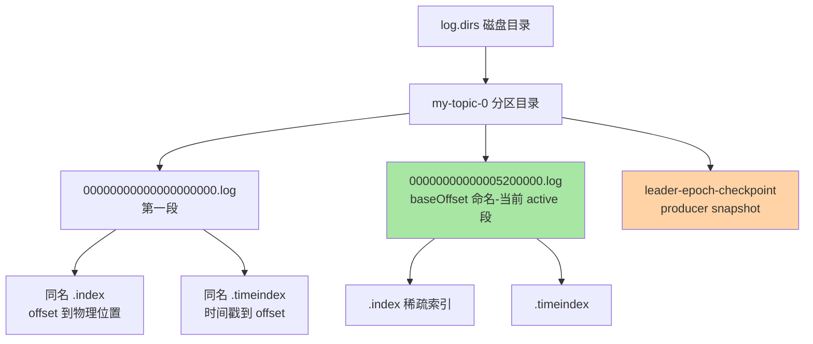
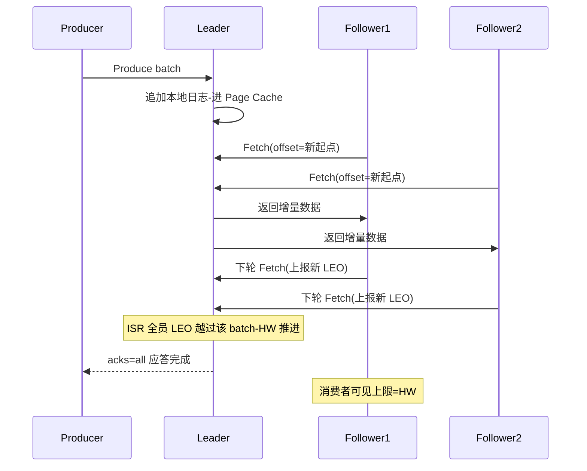
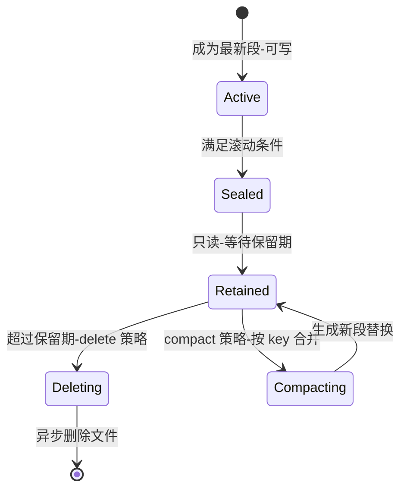

# Kafka Broker 存储机制深读：日志段、页缓存与副本同步的写读账本

> **本文核心**：Broker 存储是「把数据库问题翻译成日志问题」的典范——**追加写**（只 append 不改写，随机 IO 变顺序 IO）、**段化**（日志切成 1GB 段 + 稀疏索引，读写定位与过期清理都以段为单位）、**借力页缓存**（写进 OS Page Cache 就落账，读时缓存命中不碰磁盘）、**零拷贝**（消费拉取走 sendfile，字节流不进 JVM 堆）、**副本拉取式同步**（follower 主动 pull，ISR 动态收缩，acks=all 的持久性由「多副本都收到」保证而不是单机 fsync）。**机制链**：Produce 请求 → Leader 分区校验 → 追加 active segment（.log）+ 稀疏更新 .index/.timeindex → Page Cache → 后台异步刷盘；follower 拉取 → 各自本地追加 → Leader 推进高水位 → 消费者最多读到高水位。

## 一句话摘要

Broker 吞吐高的实现原理可以记成三笔账：**写账**——顺序追加让磁盘写入逼近介质带宽上限（业内认知：普通 SSD 上单 broker 写吞吐可达数百 MB/s 量级），页缓存让「写盘」多数时候只是「写内存」；**读账**——稀疏索引二分定位 + 段内顺序扫描 + sendfile 零拷贝，消费追尾读几乎全部命中 Page Cache、全程无用户态拷贝；**可靠账**——单机默认不主动刷盘（交给 OS 回写），持久性由 ISR 多副本冗余保证。这三笔账共同的前提是「日志不可变」：不可变才有顺序写、才有零拷贝、才有简单的崩溃恢复——**读懂「不可变日志 + 段化索引」，就读懂了 Kafka 存储的全部架构**。

## 前置阅读

- [日志存储与文件结构（入门）](../../../../middleware/kafka/入门层/从零开始认识Kafka系列/5_日志存储与文件结构-入门.md)
- [副本机制与 ISR（入门）](../../../../middleware/kafka/入门层/从零开始认识Kafka系列/13_副本机制与ISR-入门.md)
- 本系列第 1 篇 [Kafka Producer 机制](./1_KafkaProducer机制-特性.md)（发送端 acks 的对端就是本篇的写路径）

## 目标导向

本文是什么：事件驱动视角下 Broker 存储引擎的机制级深读。功能：拆解段化日志的物理结构、算清页缓存与刷盘的持久性账、理解 ISR 同步与高水位对读写两侧的约束。收益：存储容量规划、冷读抖动排查、副本落后告警治理的实现级判断力。必看场景：磁盘 IO 打满排查、Broker 重启恢复时长评估、under-replicated 告警处置、日志清理策略评审。

## 5W 速记卡

| 维度 | 一句话 |
|---|---|
| What | 段化不可变日志 + 稀疏索引 + 页缓存 + 零拷贝 + ISR 拉取式同步 |
| Why | 追加写换吞吐、不可变换简单恢复与零拷贝、多副本换单机故障不丢数据 |
| When | 磁盘瓶颈、冷读抖动、恢复时长、副本落后与高水位停滞 |
| Where | 消息在 Broker 磁盘与内存里的完整生命周期 |
| How | 追加 active 段 → 稀疏索引 → Page Cache → follower 拉取 → 高水位推进 → 段滚动与清理 |

## 一、事件驱动视角：存储是事件流的「真相簿」

事件驱动架构里，消息中间件扮演「分布式追加日志」的角色——事件一旦写入就不可变，所有下游（消费者、流处理、物化视图）都从同一个真相簿按各自节奏回放。Broker 存储设计的每个决定都从这个角色推出：**不可变**（事件是历史记录，历史不改写）→ 追加写 + 顺序 IO；**可回放**（新消费者随时从任意 offset 加入）→ 日志按 offset 有序、索引支持随机定位；**多订阅者共享一份磁盘**（十组消费者读同一份数据不放大写放大）→ 读路径必须足够便宜，零拷贝与页缓存由此成为必需。理解这个角色定位，比背参数重要——后面每个机制都值得回头问一句「它服务于角色的哪个属性」。

## 二、物理结构：分区目录与段文件

### 2.1 一棵目录树看懂存储布局



关键概念三个：**分区 = 一个目录**，分区是 Kafka 并行与复制的最小单位，存储上互不干扰；**段 = 一组同 baseOffset 命名的文件**（.log 数据 + .index 位移索引 + .timeindex 时间索引），只有最新一段是 active 段可写，历史段只读；**baseOffset 命名**——文件名就是该段第一条消息的全局位移，「offset 在哪个段」的二分定位就是在这串文件名上做的。生产者快照（.snapshot）保存着幂等发送的 PID 序列号状态，Broker 重启后靠它继续做幂等校验——这是第 1 篇幂等机制在存储侧的落点。

### 2.2 写路径源码级关键路径

以现代版本（UnifiedLog/LogSegment 实现）为口径，一次 acks=all 写入的调用链：

```text
KafkaApis.handleProduceRequest
  -> ReplicaManager.appendRecords
    -> Partition.appendRecordsToLeader      -- 确认自己是 Leader 且 ISR 满足 min.insync
      -> UnifiedLog.append
        -> LogSegment.append                -- 追加 active 段
          -> FileRecords.append             -- FileChannel 写 .log(进 Page Cache)
          -> OffsetIndex.append             -- 距上个索引点超 4KB 才记一个稀疏索引项
          -> TimeIndex.append               -- 同理-时间索引稀疏记录
      -> (后台) DelayedProduce 等 follower 拉取推进 HW 后完成应答
```

**为什么不每条消息都记一条索引？**反方案分析：密集索引把查找做到 O(1)，但每条消息都要付一次索引写入——写放大翻倍，索引文件膨胀到与数据同量级，页缓存里一半空间装的是索引。Kafka 的取舍是**稀疏索引**：默认每写入约 4KB 数据（`log.index.interval.bytes=4096`）记一个索引点，查找时先二分索引跳到附近，再段内顺序扫描补齐最后一小段——用「最多 4KB 的顺序扫描」换「索引写入成本降一个量级」，这是吞吐优先的经典取舍。

### 2.3 读路径：二分 + 扫描 + 零拷贝


零拷贝是读路径的账眼：普通「读文件再发网络」要经过「磁盘 → 页缓存 → 用户态 JVM 堆 → socket 缓冲 → 网卡」多次拷贝与上下文切换；`sendfile()` 把它压成「页缓存 → 网卡」的内核态直通，**字节流全程不进 JVM 堆**——这意味着消费 100MB 数据不会给 GC 带来 100MB 压力，Broker 的堆内存与消息流量基本解耦（这也是 Kafka 能用较小堆稳定跑大流量的底层原因）。代价与边界同样明确：开启 TLS 加密或需要服务端消息改写时，sendfile 失效回退到用户态拷贝——加密是以读吞吐为代价的，业内惯例是在大流量链路上慎重评估 TLS 的存储侧影响（公开口径：加密回退路径的吞吐损耗显著，量级以实测为准）。

## 三、持久性的分工：页缓存、刷盘与副本

### 3.1 为什么默认不 fsync

Broker 的刷盘参数（`log.flush.interval.messages` / `log.flush.interval.ms`）默认值实际上是「不主动刷、交给 OS 页缓存回写」。**为什么不学数据库每事务 fsync？**反方案：每条 fsync 把写吞吐钉死在磁盘 IOPS 上（HDD 百级、SSD 数万级量级，业内认知），消息系统的写入密度下成本不可接受；而 Kafka 的答案是**把持久性职责从单机转移到副本**——acks=all 时，Leader 应答的前提是 ISR 内所有副本都已把数据拿到（各自进了自己的页缓存），单机掉电最多丢「OS 还没回写且所有副本同时掉电」的极端交集，工程上用「副本跨机架/跨机房分布」把这个交集压到可忽略。这份数据库和消息系统的口径差异必须显式记进认知：**Kafka 的可靠性合同写的是「副本数」，不是「单机持久点」**。

| 策略 | 配置方式 | 吞吐影响 | 何时考虑 |
|---|---|---|---|
| 默认（OS 回写） | 不配置刷盘 | 最高 | 副本数 ≥3 + acks=all 的标准拓扑 |
| 定期刷盘 | log.flush.interval.ms 调小 | 中 | 副本数受限、对单机丢失窗口敏感 |
| 每条刷盘 | interval=1 | 最低（IOPS 封顶） | 极端审计要求，通常应选别的存储 |

### 3.2 副本同步与高水位：读写的共同闸门



三个关键机制的账要算清：**拉取式同步**——follower 是「特殊消费者」，主动 pull 而不是 Leader 推，推模式要为每个 follower 的速率差异做流控，拉模式天然自适应（拉不动的是它自己落后，拖累不了别人）；**ISR 动态收缩**——落后超过 `replica.lag.time.max.ms`（官方口径默认 30 秒）的副本被踢出 ISR，恢复追上再加回，ISR 是「当前够格的数据保全圈」；**高水位（HW）**——Leader 把 ISR 全员都复制到的最小位移定为 HW，消费者最多读到 HW（保证读到的数据不会因 Leader 切换而「缩回」），生产者 acks=all 的应答也等 HW 覆盖。**追问：为什么消费要被 HW 拦住，读到 Leader 的 LEO 不行吗？**再深一层：如果允许读到「只有 Leader 有」的位置，Leader 宕机后新 Leader 没有这段数据，消费者手里就有了一段「在全集群视角从未存在过」的事件——下游基于它做的派生计算全部要撤销。HW 是「宁可读慢一点，不给下游发会反悔的数据」的架构承诺，其精确性由 Leader Epoch 机制兜底（epoch 变更时的截断与校正，避免旧 Leader 复活造成数据分叉）。

## 四、段滚动与清理：不可变日志的「变」都发生在段边界



**滚动条件**（满足其一）：段大小到 `log.segment.bytes`（默认 1GB）；距段首时间到 `log.roll.hours`（默认 7 天，可用 log.roll.ms 覆盖）；索引文件写满 `log.index.size.max.bytes`（默认 10MB）。**清理两策**：delete 按保留期/保留大小整段删除（`log.retention.hours` 默认 168 小时即 7 天，`log.retention.check.interval.ms` 默认 5 分钟检查一次）；compact 按 key 保留每个 key 的最新值（配 `cleanup.policy=compact`），是 __consumer_offsets、__transaction_state 与变更日志类 Topic 的标配。**追问：为什么清理以段为单位、不做行级删除？**打破砂锅：行级删除意味着日志可变——变就要改写文件、更新索引、处理空洞，前文所有的顺序写、零拷贝、简单恢复全部作废。段边界清理（整段过期就删文件、整段压缩就重写替换）保住了「历史段只读」的不变量，代价只是「删除有滞后」（最后一段永远等滚动后才能删，事件流的保留窗口实际是「保留期 + 滚动周期」）。

## 五、不同量级的思考：约束驱动解法

- **十万级（日事件十万、单盘几十 GB 量级）**：这一档的核心问题是「别过度设计」——默认参数（1GB 段、7 天保留、3 副本、OS 刷盘）就是答案；约束来自运维人手（没有专人盯存储细节），思考方式是**默认驱动**：不调段大小、不做多盘规划，把精力放在副本数与监控告警两个真正影响数据安全的事项上。
- **百万级（日事件百万、单盘 TB 量级）**：这一档的核心问题是「容量与恢复时长的规划」——按「日增量 × 保留天数」反推盘容量并留 30% 余量，段大小与保留期要联动（大段省文件句柄、小段加快过期清理与恢复扫描）；约束来自磁盘容量与文件系统元数据规模，思考方式是**容量驱动**：under-replicated 分区数、磁盘使用率、段数量进监控面板，重分配预案先行。
- **千万级（日事件千万、峰值写入数十万 TPS）**：这一档的核心问题是「写路径与读路径对磁盘的争夺」——追尾读命中页缓存没问题，冷读（落后消费者回扫历史段）会把磁盘 IO 从「纯顺序写」搅成「读写混合」，机械盘上写延迟立刻抖动；约束来自物理介质特性，思考方式是**隔离驱动**：冷热数据分离（历史 Topic 降副本/转归档）、SSD 承载热分区、消费端限速防冷读风暴、log.dirs 多盘分摊。
- **亿级（日事件亿级、单集群百 TB 以上）**：这一档的核心问题是「集群规模本身的元数据与均衡成本」，而不是「再加几块盘」——分区总数过大时元数据传播、恢复扫描、再均衡都变慢，必须按业务域拆集群、控制单集群分区规模上限；约束来自控制面复杂度，思考方式是**分域驱动**：把「一个巨型集群」拆成「一群领域集群」，每个集群的账回到千万级去算。

## 六、业内惯例与生产实践

**容量与拓扑基线**：副本数 3 + min.insync.replicas 2 + 机架感知分布是持久性的行业标配起点（业内惯例）；磁盘首选本地 SSD 或高吞吐 NVMe，机械盘只建议纯顺序写、无冷读诉求的归档流。**参数评审三问**：保留期与下游最大回放窗口匹配吗？段大小与恢复时长预期匹配吗（Broker 重启恢复从恢复点扫描校验，段越多扫得越久）？compact Topic 的 key 设计稳定吗（key 抖动会让压缩失效膨胀）？**监控四件事**：under-replicated-partitions（副本落后，>0 即告警）、磁盘使用率与 IO util（85% 预警）、log-end-offset 与消费 lag 的差值（堆积趋势）、页缓存命中率（冷读占比的间接指标）。

## 七、事故与实践叙事

**事故一：冷读风暴，一个落后消费者拖垮整块盘**。某平台的事件总线按保留 7 天跑得一直平稳，某天一个下游服务的消费者组位点损坏，从 7 天前重新回放——海量请求命中历史段，页缓存全 miss，磁盘读写混合、util 飙到 100%，同盘所有分区的写延迟毛刺、上游 Producer 批量超时重试，告警风暴持续四十分钟。复盘落了三条：消费端拉取加限速（`fetch.max.bytes` 与回放场景专用配置）；关键 Topic 换 SSD 承载；平台层加「位点跳变保护」（回放超过阈值先告警审批）。**教训**：存储是共享介质，一个消费者的行为是全盘的事故源——隔离与限速必须做在机制层，不能指望下游自觉。

**事故二：单盘热点，分区分布不均的慢性病**。某集群多块盘做 log.dirs，随着 Topic 频繁增删，某块盘上富集了高频大分区的目录，使用率 92% 而其余盘 60%——那块盘先慢、先满、先触发副本迁移，迁移流量又压垮它自己。复盘把「磁盘级均衡」纳入常规巡检：按盘观测分区数与 IO util 而不是只看集群均值，定期用分区重分配把热点盘的数据摊平。**教训**：均值健康不等于无故障——热点是慢性病，要按最小资源单位（盘）做体检。

**实践叙事：恢复演练定段参数**。某团队在 Broker 上线前做「拔电演练」：分别用 512MB、1GB、4GB 段大小灌等量数据后非优雅重启，实测恢复时长与峰值句柄数，最终选定 1GB 段——恢复时长可控、文件句柄与索引开销均衡。这个实践的价值在方法：**段大小的「默认 1GB」未必适合所有负载，用演练实测替代拍脑袋**，恢复时长的验收标准（如「非优雅重启 5 分钟内恢复」）由此变成可度量的工程承诺。

## 八、设计思想：不可变性是一切收益的源头

把本篇机制收拢到一句话：**不可变日志是「复利型设计决定」**。选了不可变，才有了纯追加（顺序 IO 逼近介质带宽）、才有零拷贝（字节流不需要解释与改写，可直接内核态直通）、才有段边界清理（「变」被隔离到文件粒度）、才有简单崩溃恢复（校验 + 截断，不需要 WAL 回放 redo/undo 逻辑）、才有多订阅者共享一份磁盘（读不产生写放大）。同期消息系统的另一条路线（内置 B+ 树存储、支持行级删除与随机写）换来了查询灵活性，付出的是写吞吐与运维复杂度——两条路线没有绝对优劣，但「事件流回放」这个角色下，不可变日志的架构契合度压倒性占优。Kafka 从 2011 年开源至今存储内核保持着这套骨架，演进集中在元数据管理（ZooKeeper 到 KRaft）与运维能力上——「选对不变量」的设计思想，值得迁移到任何存储类系统的评审里。

## 九、Trade-off：三组核心取舍的总账

**吞吐与最坏读延迟**：页缓存 + 零拷贝给了追尾读极致性能，但冷读的代价被「藏」到了发生时才暴露——容量规划必须为最坏读型（全量回放）留余量，而不是按平均读型。**单机简化与极端持久性**：默认不刷盘换来了写吞吐与实现简单，但「副本同时掉电 + OS 未回写」的窗口客观存在——审计级不丢数据诉求要么提高副本与机架分布等级，要么该场景本身就不该用 Kafka。**段大小的双向代价**：大段省句柄、利于顺序写，但过期清理与恢复扫描粒度粗（最后一段永远删不掉，恢复要扫的文件更大）；小段反之——1GB 默认是折中，特殊负载要演练实测。**存储的每一笔收益都有对应的隐藏账单，评审时把账单找出来比记结论更重要**。

## 十、什么时候用与不用：决策口径

**什么时候用 Kafka 存事件流**：多下游共享回放、顺序性诉求、吞吐量级在消息系统射程内的场景——这是它的主场。**什么时候不用它当唯一存储**：① 需要按非 offset 维度随机查询（按 key 点查大量历史）——compact 只保最新值且查询语义贫瘠，该配专门的 KV/数据库；② 行级删除与合规改写强诉求——日志不可变与「彻底删除」天然冲突，要配合加密与密钥销毁方案设计；③ 单条消息巨大（百 MB 级）——消息系统按「海量小消息」优化，大对象走对象存储 + 事件引用（claim check 模式）。**推荐**：事件流以「Kafka 保留回放窗口 + 归档到对象存储/数仓」的组合承接长周期诉求，让 Kafka 只做它擅长的「高速流转层」。

## 追问链

**质疑者第一层：为什么用「日志」而不是 B+ 树/LSM 树做存储内核？**B+ 树为「原地更新 + 点查」优化，代价是随机 IO 与复杂的页分裂恢复；LSM 树（RocksDB 类）用追加换随机写，但保留了「可变」带来的 compaction 与读放大。事件流的工作负载是「纯追加写 + 按 offset 顺序读 + 极少随机回扫」——对这个负载，最朴素的追加日志就是最优结构，树结构的全部复杂度都花在了用不上的能力上。**机制选型跟着工作负载走，不要跟着数据库惯性走**。

**质疑者第二层：再深一层，页缓存命中率高就永远不碰磁盘吗？极端情况是什么？**追尾读（消费 lag 小于页缓存容量覆盖范围）确实全内存；但 lag 一旦超过「页缓存能装下的数据量」（大堆积、长回放），每条读都 miss 落盘——此时读放大与写竞争同时出现。这也解释了一个工程直觉：**堆积不是无限的免费缓冲，堆积超过内存覆盖就进入「磁盘读经济」，消费能力要按这个档位重新评估**。

**质疑者第三层：ISR 收缩后 acks=all 不就在「少副本」下继续写了吗，可靠性不是名存实亡？**配合 min.insync.replicas=2 之后不会：ISR 收缩到 1 时写入直接抛 NotEnoughReplicas 拒绝——「收缩期可用性下降」正是这份配置买来的正确行为：宁可停写，不让 acks=all 在单副本上假装可靠。追问到这层就能理解 Kafka 可靠性配置的精髓：**acks 定义「谁确认才算数」，min.insync.replicas 定义「低于多少人就不做这笔生意」**，两者必须成对设计。

## 你们可能会问

**Q1：Broker 重启为什么有时很快有时极慢？**
看两个变量：优雅关闭（有无 clean shutdown 标记）与非优雅恢复的扫描起点（恢复点检查点）；段数量与总数据量。非优雅重启要逐段校验 CRC——段越小、数据越多恢复越久，这也是恢复演练定段参数的原因（见实践叙事）。

**Q2：保留期设 7 天，为什么第 7 天的数据有时还在？**
删除以段为粒度且按 5 分钟周期检查：最后一段没滚动就不会删，保留窗口实际是「保留期 + 滚动周期」，且删除是异步改名后执行——容量规划按「保留期 + 一个段周期」的冗余口径算。

**Q3：怎么判断读路径瓶颈在页缓存 miss 还是网络？**
分段观测：磁盘 IO util 与读吞吐同步飙升 → 页缓存 miss（冷读）；磁盘闲而网卡打满、请求延迟均匀上升 → 网络或消费端拉取过大。两类瓶颈的对策完全不同（限速回放 vs 扩带宽/调 fetch 参数），归因错了调参必白调。

**Q4：compact Topic 的 key 设计要注意什么？**
key 要稳定且低基数——key 一旦带时间戳或随机后缀，压缩永远等不到「同 key 二次写入」，Topic 退化成无限膨胀的全量日志；key 撤销（tombstone）语义要跟下游约定存活窗口（delete.retention.ms），避免状态重建时漏删。

## 💡 实战提示

- 💡 可靠性成对配置：acks=all 必须 + min.insync.replicas=2 成对出现，ISR 收缩时「拒绝写入」才是这份配置的正确行为
- 💡 冷读要有预案：位点回拨与全量回放是磁盘事故的头号来源，消费端限速 + 冷热分层 + 回放审批三道闸提前装好
- 💡 磁盘体检按盘不看均值：log.dirs 多盘拓扑下按盘监控 util 与使用率，热点盘用分区重分配摊平
- 💡 恢复时长用演练度量：非优雅重启恢复从恢复点起逐段校验，段大小参数用拔电演练实测定档
- 💡 长周期回放别压给 Kafka：保留窗口外的回放走归档层（对象存储/数仓），Kafka 只承诺窗口内的低成本回放

## 自测三问

1. 为什么稀疏索引不显著拖慢查找？（答：索引点间隔约 4KB，二分索引定位后最多顺序扫 4KB 补齐——用微小扫描换索引写入成本降一个量级）
2. 默认不刷盘为什么敢承诺不丢？（答：持久性由 ISR 多副本保证，acks=all 等「全员收到」才应答；单机掉电的丢失窗口被副本跨机分布压到可忽略）
3. 消费者为什么最多读到高水位？（答：HW 之外的数据只有 Leader 有，Leader 切换后会消失——读到它会向下游发「会反悔的数据」，HW 是不反悔承诺）

## 开放问题

- 分层存储（Tiered Storage，热段本地 + 冷段远端）在各发行版的实现口径与回放语义仍在演进，长保留场景引入前要以所用版本的行为验证为准。
- 页缓存命中率的精细化观测（按分区/按消费组维度）尚无开箱即用的标准方案，冷读归因目前仍依赖磁盘指标与业务事件的关联推断。

## 📎 核心带走

- **核心一句话**：Broker 存储 = 不可变日志 + 段化稀疏索引 + 页缓存/零拷贝 + ISR 拉取式同步——不可变性是顺序写、零拷贝、段清理、简单恢复全部收益的共同源头
- **机制链**：写：追加 active 段 → 稀疏索引 → Page Cache → follower 拉取 → HW 推进 → acks=all 应答；读：二分定位段 → mmap 索引二分 → 段内扫描 → sendfile 直通网卡；清理：段边界 delete/compact
- **失效点/边界**：冷读击穿页缓存拖垮共享磁盘；TLS 使零拷贝失效；单副本收缩期 acks=all 需 min.insync.replicas 兜底；行级删除与合规改写不可行；大消息与随机点查不是它的射程

## 📌 数据与事实声明

- 写于 2026-09-15，文件结构与参数默认值（1GB 段、4KB 索引间隔、7 天保留、replica.lag.time.max.ms 30 秒等）以 Kafka 官方文档为准，随版本演进以所用版本说明核对；吞吐与恢复时长数字为业内认知或公开口径的量级参考，非实测基准
- 隐私口径：事故叙事均来自多来源工程实践的匿名化抽象，不含任何真实公司、系统与数据

## 📚 参考资料

| 类型 | 标题 | 来源 |
|---|---|---|
| 官方文档 | Kafka Broker Configs（log.* 与 replica.* 参数） | kafka.apache.org/documentation/#brokerconfigs |
| 论文 | Kafka: a Distributed Messaging System for Log Processing (SIGMOD 2011，日志结构与零拷贝设计来源) | 公开论文 |
| 设计提案 | KIP-101 副本落后剔除时机、KIP-320 Leader Epoch、KIP-405 Tiered Storage | cwiki.apache.org/confluence/display/KAFKA |
| 关联文章 | 本系列第 1 篇 Producer 机制、第 3 篇消费组；中间件仓库 LogSegment 与 ISR 深读 | 本仓库 |
